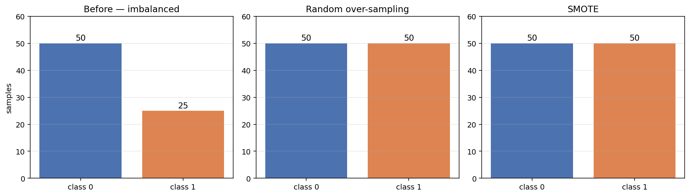
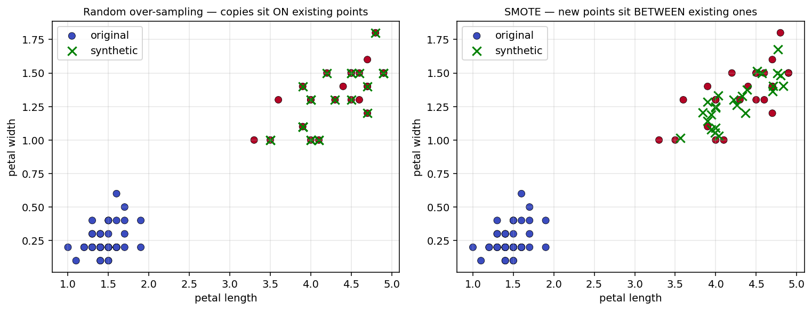
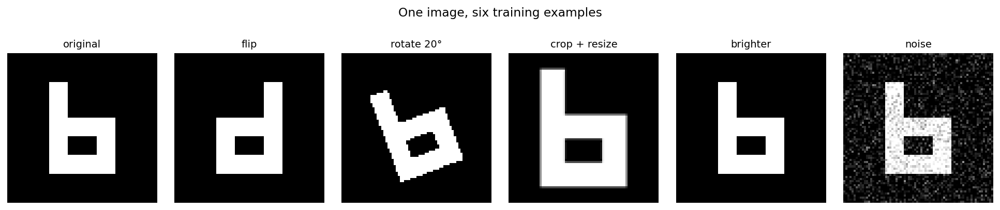
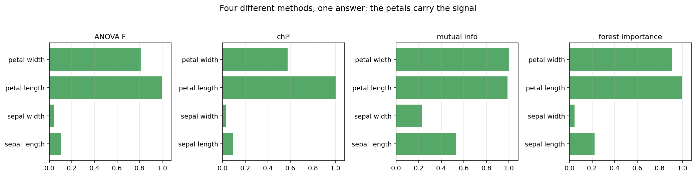
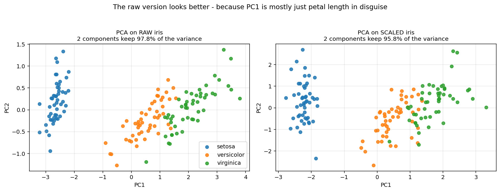
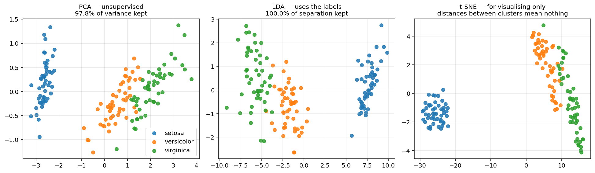
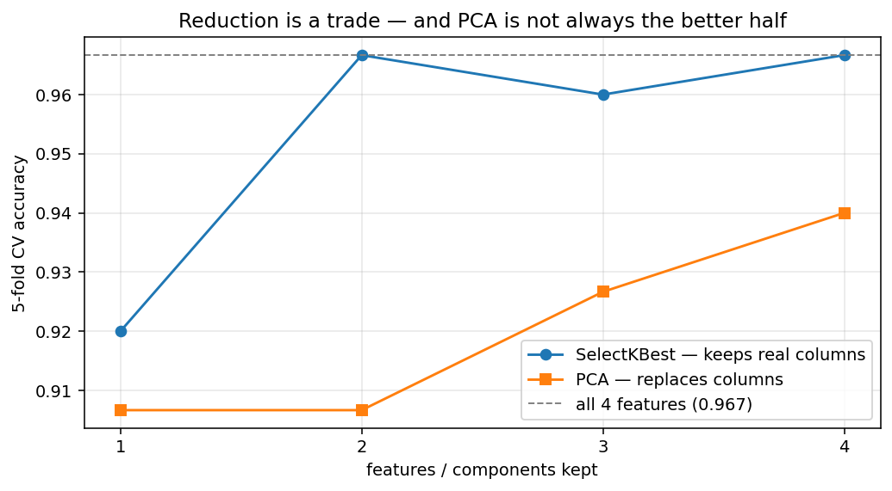

# Session 6 — Data Augmentation, Feature Engineering & Feature Reduction

**What to do when you do not have enough data, when your columns are not informative enough, and when you have too many of them**

| | |
|---|---|
| **Notebook** | [session-06-augmentation-feature-engg-red.ipynb](../notebooks/session-06-augmentation-feature-engg-red.ipynb) |
| **Previous** | [Session 5C — Model Deployment](session-05c-deployment.md) |
| **Next** | [Session 7 — Unsupervised Learning](session-07-unsupervised.md) |
| **Stuck?** | [Troubleshooting](../troubleshooting.md) |

> **Sessions 5 and 5B were about choosing and training models. This session is about the data you feed them** — and on real projects, this is where most of the gains actually come from.
>
> **Every technique here is a trade, not a free win.** You will measure the cost of each one.

---

## 🎯 Learning outcomes

By the end of this session you can:

1. Say what data augmentation is, when it is used, and why
2. Balance an imbalanced dataset with over-sampling and SMOTE — **and explain how they differ**
3. Name augmentation techniques for tabular, image and text data
4. Create new features from existing ones, and **measure whether they helped**
5. Explain why feature reduction is needed
6. Use filter, wrapper and embedded selection methods
7. Apply PCA, LDA and t-SNE, and **say which is right for which job**

---

## The three parts

| Part | Question it answers |
|---|---|
| **A — [Data Augmentation](#part-a--data-augmentation)** | *I do not have enough data. What now?* |
| **B — [Feature Engineering](#part-b--feature-engineering)** | *My columns are not informative enough. Can I build better ones?* |
| **C — [Feature Reduction](#part-c--feature-reduction)** | *I have too many columns. Which can I drop?* |

| # | Topic | | # | Topic |
|---|---|---|---|---|
| 1 | [What is augmentation](#1-what-is-data-augmentation) | | 8 | [What is feature engineering](#8-what-is-feature-engineering) |
| 2 | [When it is used](#2-when-augmentation-is-used) | | 9 | [The benefits](#9-the-benefits-of-feature-engineering) |
| 3 | [Why use it](#3-why-use-augmentation) | | 10 | [Example — car prices](#10-example-1--car-prices) |
| 4 | [Types of augmentation](#4-types-of-augmentation) | | 11 | [Example — heart failure](#11-example-2--heart-failure) |
| 5 | [Tabular techniques](#5-common-tabular-augmentation-techniques) | | 12 | [Why reduction is needed](#12-why-feature-reduction-is-needed) |
| 6 | [Image techniques](#6-image-augmentation-techniques) | | 13 | [Filter, wrapper, embedded](#13-types-of-feature-reduction) |
| 7 | [Text techniques](#7-text-augmentation-techniques) | | 14 | [Projection methods](#14-projection-methods) |
| | | | 15 | [What reduction costs](#15-what-reduction-actually-costs) |

**Practices sit between the topics.** The [21 MCQs](#-session-6--21-mcqs) and [tasks](#-session-6--tasks) are at the end.

---

# Part A — Data Augmentation

# 1. What is data augmentation

> **Data augmentation means creating additional training examples from the data you already have.**

**You do not go and collect more.** You take what you have and produce more from it — by copying, by transforming, or by generating new examples that resemble the real ones.

🧠 **Analogy: revising from one photograph of a friend.** If you have only ever seen one photo, you might not recognise them in a hat, in dim light, or from the side. **Show yourself that same photo flipped, darkened and rotated, and you learn the friend rather than the photograph.**

**Augmentation teaches the model the thing, not the example.**

## The one-line version

```text
BEFORE   100 training examples
AFTER    500 training examples, made from those 100

The MODEL sees more variety.
The WORLD has not given you any more information.
```

> **That second line matters.** **Augmentation does not create new information** — it re-presents what you have in more forms. **It helps a model generalise; it cannot tell the model something the original data never contained.**

---

# 2. When augmentation is used

**Three situations, and you will meet all three.**

| Situation | What it looks like | Example |
|---|---|---|
| **1. Too little data overall** | A few hundred examples, or fewer | 60 photographs for a helmet detector |
| **2. Imbalanced classes** | One class far rarer than another | 8.5% of patients have diabetes |
| **3. The model overfits** | High training score, poor test score | Session 8's central problem |

## Situation 1 — too little data

**Deep learning in particular is hungry.** A network trained on 60 images will memorise all 60 and fail on the 61st. **Augmenting to 600 gives it enough variety to learn a pattern rather than a list.**

## Situation 2 — imbalanced classes

**This is the commonest reason on tabular data.**

**A model trained on 91.5% negatives learns that predicting "negative" is usually right** — and Session 5B showed exactly that: 91.5% accuracy, zero patients found. **Balancing the classes removes that easy escape.**

## Situation 3 — the model overfits

**More variety in the training data makes memorisation harder.** If the model sees the same image flipped, rotated and brightened, it cannot simply memorise pixel positions.

> ⚠️ **Augmentation is not always the answer.** **If you have 100,000 balanced rows and your model is underfitting, augmentation will not help.** The problem is elsewhere.

---

# 3. Why use augmentation

**Four reasons, in the order they usually matter.**

| Reason | What it buys you |
|---|---|
| **Better generalisation** | The model learns the pattern, not the specific examples |
| **Less overfitting** | Harder to memorise a varied training set |
| **Fairer treatment of rare classes** | The model stops ignoring the minority |
| **Cheaper than collecting data** | Labelling 500 new images costs real money and time |

## And the honest cost

> ⚠️ **Augmentation is a trade, and Session 6's central lesson is that the trade is measurable.**

**Balancing a dataset typically raises recall and lowers precision.** The model now shouts the rare class more often — and most of those extra shouts are wrong. **Whether that is a good trade depends entirely on which error costs you more**, which is exactly the question Session 5B asked.

## ⚠️ The rule you must not break

```text
SPLIT FIRST.  Then augment the TRAINING half only.
```

> **Augmenting before splitting puts near-copies of the same row on both sides of the split.** Your model then gets tested on data it has effectively already seen, and **your score becomes fiction.**
>
> **This is Session 3's leakage lesson wearing a different hat.**

---

# 4. Types of augmentation

**The techniques differ completely by data type, because what counts as a "valid variation" differs.**

| Data type | Techniques | The question each asks |
|---|---|---|
| **Tabular** | Over-sampling, under-sampling, SMOTE, noise injection | *What is another plausible row?* |
| **Image** | Flip, rotate, crop, brightness, noise, zoom | *What is another plausible photograph of this?* |
| **Text** | Synonym swap, back-translation, random deletion | *What is another way of saying this?* |
| **Audio** | Pitch shift, time stretch, background noise | *What is another way this could sound?* |

## The rule that governs all of them

> **The augmentation must preserve the label.**

**A cat photographed upside down is still a cat.** **A handwritten `6` rotated 180° is a `9`** — so rotation is valid augmentation for cats and destroys the label for digits.

**This is a judgement about your data, not a setting in a library.** **You have to make it every time.**

---

# 5. Common tabular augmentation techniques

**Tabular augmentation is almost always about class imbalance.**

## Setting up the problem

**We will make the iris dataset deliberately imbalanced** — 50 of class 0 and only 25 of class 1.

```python
import numpy as np
import pandas as pd
from sklearn.datasets import load_iris

iris = load_iris()
X, y = iris.data, iris.target

# Take 50 samples from class 0 and only 25 from class 1
X_imbalanced = np.vstack([X[y == 0][:50], X[y == 1][:25]])
y_imbalanced = np.hstack([y[y == 0][:50], y[y == 1][:25]])

print("Class Distribution Before Sampling:")
print(pd.Series(y_imbalanced).value_counts())
```

**Output:**

```text
Class Distribution Before Sampling:
0    50
1    25
```

**Two classes, one twice the size of the other.**

---

## Technique 1 — Random over-sampling

> **Duplicate rows from the minority class until the classes are balanced.**

**That is the whole idea.** No new information is created — existing rows are simply repeated.

```python
from imblearn.over_sampling import RandomOverSampler

ros = RandomOverSampler(random_state=42)
X_resampled, y_resampled = ros.fit_resample(X_imbalanced, y_imbalanced)

print("Class Distribution After Over-sampling:")
print(pd.Series(y_resampled).value_counts())
```

**Output:**

```text
Class Distribution After Over-sampling:
0    50
1    50
```

**Twenty-five rows from class 1 were duplicated to make up the difference.**

> **`imblearn` is a separate package: `pip install imbalanced-learn`.** It is the standard tool for this, and it is now in the course requirements.

| | |
|---|---|
| ✅ **Simple, and fast** | |
| ✅ **Never invents impossible values** | Every row is a real observation |
| ⚠️ **Encourages overfitting** | The model sees the same rows repeatedly and can memorise them |

---

## Technique 2 — SMOTE

> **SMOTE — Synthetic Minority Over-sampling Technique — creates *new* rows between existing minority rows.**

**Rather than copying a row, it picks a real minority row, picks one of its near neighbours, and places a new point somewhere on the line between them.**

```python
from imblearn.over_sampling import SMOTE

smote = SMOTE(random_state=42)
X_resampled, y_resampled = smote.fit_resample(X_imbalanced, y_imbalanced)

print("Class Distribution After SMOTE:")
print(pd.Series(y_resampled).value_counts())
```

**Output:**

```text
Class Distribution After SMOTE:
0    50
1    50
```

**The same counts — and completely different rows.**

## Seeing the difference



**The bar charts look identical after either method.** **The counts tell you nothing about which one you used** — so look at where the new points actually land:



> **On the left, every green cross sits exactly on top of a blue or red circle.** They are duplicates — the same point, counted twice.
>
> **On the right, the green crosses sit in the gaps between real points.** They are new locations that no observation actually occupied.

**That picture is the whole difference between the two techniques.**

| | Random over-sampling | SMOTE |
|---|---|---|
| Creates | **Copies** of real rows | **New** rows between real ones |
| Risk | Overfitting to repeated rows | **Can invent impossible combinations** |
| Works on | Anything | **Numeric features only** |

> ⚠️ **SMOTE's danger is real.** Interpolating between a row with `pregnancies=0` and one with `pregnancies=8` gives `pregnancies=3.7`. **On a categorical or count column, SMOTE can produce rows that could not exist.**

---

## Technique 3 — Under-sampling

> **Instead of adding to the minority, remove from the majority.**

```python
# illustrative: a syntax reference, not runnable as written.
from imblearn.under_sampling import RandomUnderSampler

rus = RandomUnderSampler(random_state=42)
X_resampled, y_resampled = rus.fit_resample(X_imbalanced, y_imbalanced)
# 25 and 25 - the majority class is cut down
```

| | |
|---|---|
| ✅ **Fast, and no synthetic data** | |
| ⚠️ **You throw away real data** | On a small dataset this is expensive |

**Use it when the majority class is enormous** — discarding 90% of a million rows still leaves plenty.

---

## Technique 4 — Class weights, which are not augmentation at all

> **Often the best answer is to not augment.**

```python
# illustrative: a syntax reference, not runnable as written.
from sklearn.linear_model import LogisticRegression

model = LogisticRegression(class_weight='balanced')
```

**This tells the model that mistakes on the rare class cost more**, without touching the data at all.

**Session 5B measured this on the diabetes data:** recall went from 0.6371 to 0.8882, and missed patients from 617 to 190. **One keyword, no synthetic rows, no leakage risk.**

> **Try `class_weight='balanced'` before you reach for SMOTE.** It is simpler, it cannot invent impossible rows, and it very often works just as well.

## ✏️ Practice — tabular augmentation

1. Build the imbalanced iris subset and print the class distribution.
2. Apply `RandomOverSampler` and print the distribution after.
3. Apply `SMOTE` and print the distribution after. **How do the counts compare with over-sampling?**
4. Plot the petal length against petal width for both methods, marking which points are synthetic. **Describe the difference.**
5. Name one risk of over-sampling and one risk of SMOTE.

<details><summary>Solutions</summary>

```python
# needs-install: pip install imbalanced-learn
import numpy as np, pandas as pd
from sklearn.datasets import load_iris
from imblearn.over_sampling import RandomOverSampler, SMOTE

iris = load_iris(); X, y = iris.data, iris.target
X_imb = np.vstack([X[y == 0][:50], X[y == 1][:25]])                    # 1
y_imb = np.hstack([y[y == 0][:50], y[y == 1][:25]])
print(pd.Series(y_imb).value_counts())          # 50 and 25

Xo, yo = RandomOverSampler(random_state=42).fit_resample(X_imb, y_imb)  # 2
print(pd.Series(yo).value_counts())             # 50 and 50

Xs, ys = SMOTE(random_state=42).fit_resample(X_imb, y_imb)             # 3
print(pd.Series(ys).value_counts())             # 50 and 50
# IDENTICAL counts. The counts cannot tell you which method was used -
# only looking at WHERE the new points sit can.

# 4 - Over-sampling puts every new point exactly on top of an existing
#     one, because they are duplicates. SMOTE puts them in the GAPS
#     between real points, because they are interpolations.

# 5 - Over-sampling: the model sees the same rows repeatedly and can
#       memorise them, which encourages overfitting.
#     SMOTE: interpolating between rows can invent impossible values -
#       3.7 pregnancies, or a category halfway between two categories.
```
</details>

---

# 6. Image augmentation techniques

**Images are the classic case for augmentation**, because a photograph has so many valid variations.

| Technique | What it does | Valid when |
|---|---|---|
| **Horizontal flip** | Mirror left-right | The object is symmetric in meaning |
| **Rotation** | Turn by a few degrees | Orientation does not carry meaning |
| **Crop and resize** | Take a portion, scale back up | The object may not be centred |
| **Brightness / contrast** | Lighten or darken | Lighting varies in the real world |
| **Zoom** | Scale in or out | Distance to the subject varies |
| **Noise** | Add random pixel variation | Cameras are imperfect |
| **Shift / translate** | Move the image within the frame | Position varies |

## One image becomes six



```python
from PIL import Image, ImageEnhance
import numpy as np

# A simple shape standing in for a photograph
img = np.zeros((72, 72), dtype=np.uint8)
img[14:58, 20:29] = 255
img[49:58, 20:52] = 255
img[31:40, 20:52] = 255
img[31:58, 43:52] = 255
base = Image.fromarray(img)

rng = np.random.default_rng(0)
views = {
    "original":      base,
    "flip":          base.transpose(Image.FLIP_LEFT_RIGHT),
    "rotate 20":     base.rotate(20),
    "crop + resize": base.crop((8, 8, 64, 64)).resize((72, 72)),
    "brighter":      ImageEnhance.Brightness(base).enhance(1.7),
    "noise":         Image.fromarray(
        np.clip(img + rng.normal(0, 45, img.shape), 0, 255).astype(np.uint8)),
}
for name, im in views.items():
    print(f"{name:<16}{im.size}")
```

**Sixty photographs become 360 training examples** — which is the difference between a model that memorises and one that learns.

## ⚠️ The label-preservation question

**Look at that figure again and ask, for each variation: is it still the same thing?**

| For **cat vs dog** | For **handwritten digits** |
|---|---|
| Flip ✅ — a mirrored cat is a cat | **Flip ❌ — a mirrored 2 is not a 2** |
| Rotate ✅ | **Rotate 180° ❌ — a 6 becomes a 9** |
| Brightness ✅ | Brightness ✅ |
| Crop ✅ | Crop ⚠️ — may cut off part of the digit |

> **The same technique is correct for one dataset and destroys another.** **Augmentation is a judgement about your data, and no library can make it for you.**

**In practice you would use a library** — `torchvision.transforms`, `albumentations`, or Keras's `ImageDataGenerator` — but **the decision about which transforms are valid is always yours.**

---

# 7. Text augmentation techniques

**Text is the hardest of the three, because meaning is fragile.**

| Technique | What it does | Example |
|---|---|---|
| **Synonym replacement** | Swap a word for a similar one | *"The film was **great**"* → *"The film was **excellent**"* |
| **Random deletion** | Remove a word at random | *"The film was really great"* → *"The film was great"* |
| **Random swap** | Exchange two words' positions | *"really great film"* → *"great really film"* |
| **Random insertion** | Add a related word | *"The film was great"* → *"The film was truly great"* |
| **Back-translation** | Translate out and back | English → French → English |
| **LLM paraphrasing** | Ask a model to rewrite it | Session 10's territory |

## Back-translation, the most reliable of them

```text
ORIGINAL   "The delivery was late but the product is excellent."
              ↓  translate to French
FRENCH     "La livraison était en retard mais le produit est excellent."
              ↓  translate back to English
RESULT     "Delivery was delayed but the product is excellent."
```

**Different words, same meaning, same label.** **That is exactly what good augmentation produces.**

## ⚠️ Why text augmentation is risky

```text
ORIGINAL   "The service was not good."          -> NEGATIVE

Random deletion removes "not":
RESULT     "The service was good."              -> POSITIVE

The label was flipped by deleting one word.
```

> **A single word can invert the meaning of a sentence.** **Negations, sarcasm and qualifiers are all fragile** — which is why random deletion and swapping are used cautiously, and why back-translation and paraphrasing are safer.

## A simple synonym-swap example

```python
import random

SYNONYMS = {
    "great": ["excellent", "superb", "fantastic"],
    "bad":   ["poor", "terrible", "awful"],
    "quick": ["fast", "rapid", "speedy"],
}

def synonym_swap(sentence, seed=0):
    random.seed(seed)
    words = sentence.split()
    out = [random.choice(SYNONYMS[w]) if w in SYNONYMS else w for w in words]
    return " ".join(out)

original = "the delivery was quick and the product was great"
for s in range(3):
    print(synonym_swap(original, seed=s))
```

**Three variations from one sentence, all carrying the same sentiment.**

## ✏️ Practice — image and text augmentation

1. Generate six augmented versions of an image and display them.
2. For each of your six, say whether it would preserve the label for (a) cat-vs-dog and (b) handwritten digits.
3. Write a synonym-swap function and produce three variants of a sentence.
4. Write a sentence where deleting one word **reverses** the label.
5. Explain back-translation in one sentence, and say why it is safer than random deletion.

<details><summary>Solutions</summary>

```python
import numpy as np, random
from PIL import Image, ImageEnhance

img = np.zeros((72, 72), dtype=np.uint8)                               # 1
img[14:58, 20:29] = 255; img[49:58, 20:52] = 255
img[31:40, 20:52] = 255; img[31:58, 43:52] = 255
base = Image.fromarray(img)
rng = np.random.default_rng(0)
views = {"original": base,
         "flip": base.transpose(Image.FLIP_LEFT_RIGHT),
         "rotate": base.rotate(20),
         "crop": base.crop((8, 8, 64, 64)).resize((72, 72)),
         "bright": ImageEnhance.Brightness(base).enhance(1.7),
         "noise": Image.fromarray(np.clip(img + rng.normal(0, 45, img.shape),
                                          0, 255).astype(np.uint8))}
print(list(views))

# 2 - CAT vs DOG: all six preserve the label. A mirrored, rotated,
#       cropped, brightened or noisy cat is still a cat.
#     DIGITS: flip DESTROYS it (a mirrored 2 is not a 2) and a 180
#       rotation turns 6 into 9. Brightness and noise are fine; cropping
#       risks cutting off part of the digit.

SYNONYMS = {"great": ["excellent", "superb"], "quick": ["fast", "rapid"]}   # 3
def swap(s, seed=0):
    random.seed(seed)
    return " ".join(random.choice(SYNONYMS[w]) if w in SYNONYMS else w
                    for w in s.split())
for s in range(3):
    print(swap("the delivery was quick and the product was great", s))

# 4 - "The service was not good."  -> NEGATIVE
#     Delete "not" and it becomes "The service was good." -> POSITIVE.
#     One word inverted the label.

# 5 - Back-translation means translating a sentence into another language
#     and then back again, producing different wording with the same
#     meaning. It is safer than random deletion because a translator
#     preserves meaning by design, whereas deletion can remove the one
#     word - a negation - that the label depended on.
```
</details>

---

# Part B — Feature Engineering

# 8. What is feature engineering

> **Feature engineering means creating new columns from the ones you already have, so the pattern is easier for a model to see.**

🧠 **Analogy: judging whether a loan is affordable.** You are told the loan is ₹800,000 and the income is ₹400,000. **You could look at both — but the number you actually care about is the ratio: 2.0.** Nobody handed you that column. You built it.

## Why a model cannot do this for you

**A model can only find patterns among the columns it is given.**

```text
Given  loan_amount  and  income
A linear model can compute:   a × loan_amount + b × income
It CANNOT compute:            loan_amount ÷ income
```

> **A linear model has no way to represent division.** **A tree can approximate a ratio by splitting on both columns repeatedly**, but only clumsily. **If the useful quantity is a relationship between columns, somebody has to construct it — and that somebody is you.**

## The main techniques

| Technique | What it does | Example |
|---|---|---|
| **Ratios** | Divide one column by another | `loan ÷ income`, `power ÷ engine` |
| **Differences** | Subtract one from another | `end_date − start_date` |
| **Rates** | Amount per unit of something | `km ÷ years` |
| **Binning** | Group a number into bands | age → young / middle / senior |
| **Flags** | A yes/no derived from a threshold | `ejection_fraction < 40` |
| **Interactions** | Combine two columns | `age × ejection_fraction` |
| **Aggregations** | Summarise related rows | a customer's average past order |
| **Transformations** | Reshape a skewed column | `log(price)` |
| **Concatenation** | Join two categories | `brand + model` |

---

# 9. The benefits of feature engineering

| Benefit | Why it happens |
|---|---|
| **Better accuracy** | The pattern becomes visible to the model |
| **Simpler models work** | A linear model given a ratio can match a tree without one |
| **More explainable** | *"loan-to-income above 2"* is a sentence anyone understands |
| **Encodes domain knowledge** | Decades of expertise, put into a column |
| **Reduces data needed** | The model has less to discover for itself |

## ⚠️ And the honest caveat, measured

**Feature engineering is often described as the highest-value activity in machine learning. It is also often oversold.**

**Here is what the car features below actually did** — the same model, with and without five engineered columns:

| Model | Base features | With 5 engineered features | Change |
|---|---|---|---|
| Linear Regression | 0.6604 | 0.6605 | **+0.0001** |
| Random Forest | 0.9236 | 0.9201 | **−0.0035** |

> **Essentially nothing for the linear model, and very slightly *worse* for the forest.**
>
> **Why so little?** A Random Forest can already approximate a ratio by splitting on both columns. **The features you built are things it had largely found on its own.**

**So does that make feature engineering pointless? No — but it does mean you should measure rather than assume.** Features earn their place most when:

- The model is **linear** and cannot represent the relationship at all
- The feature encodes **domain knowledge the data does not contain** — a clinical threshold, a regulatory limit
- You need the model to be **explainable**, and a named ratio is easier to defend than a split

---

# 10. Example 1 — Car prices

**The cardekho dataset has raw measurements. We will build features a car dealer would think in.**

## The features, and why each one

| New feature | Meaning | Why it should help |
|---|---|---|
| `km_per_year` | Average kilometres driven per year | **Usage intensity** — 100,000 km over 10 years is different from over 2 |
| `age_category` | new / moderate / old / very old | Price falls in bands, not smoothly |
| `high_usage` | Driven more than the median rate | Heavy use lowers value |
| `power_to_engine_ratio` | Power relative to engine size | **Performance efficiency** |
| `mileage_to_engine_ratio` | Mileage relative to engine size | **Fuel efficiency** |
| `power_per_seat` | Power distributed per seat | Compares compact and family cars fairly |
| `brand_model` | Brand and model joined | Captures the specific car's identity |
| `fuel_transmission` | Fuel type and transmission joined | Captures combined market preference |

## The code

```python
import pandas as pd
import numpy as np

dataset_url = "https://raw.githubusercontent.com/tech4alltraining/aiml/refs/heads/main/datasets/regression/cardekho_dataset.csv"
cars_data = pd.read_csv(dataset_url)

# 1. Usage-based feature
cars_data["km_per_year"] = cars_data["km_driven"] / (cars_data["vehicle_age"] + 1)

# 2. Age category
cars_data["age_category"] = pd.cut(
    cars_data["vehicle_age"],
    bins=[0, 3, 7, 12, 30],
    labels=["new", "moderate", "old", "very_old"]
)

# 3. High usage indicator
cars_data["high_usage"] = (
    cars_data["km_per_year"] > cars_data["km_per_year"].median()
).astype(int)

# 4. Performance-related features
cars_data["power_to_engine_ratio"] = cars_data["max_power"] / cars_data["engine"]
cars_data["mileage_to_engine_ratio"] = cars_data["mileage"] / cars_data["engine"]
cars_data["power_per_seat"] = cars_data["max_power"] / cars_data["seats"]

# 5. Interaction categorical features
cars_data["brand_model"] = (
    cars_data["brand"].astype(str) + "_" + cars_data["model"].astype(str)
)
cars_data["fuel_transmission"] = (
    cars_data["fuel_type"].astype(str) + "_" + cars_data["transmission_type"].astype(str)
)

cars_data.head()
```

## ⚠️ Two bugs hiding in that code — and both are common

**Run it and then check your work. Always check your work.**

```python
print("infinities in power_per_seat :", np.isinf(cars_data["power_per_seat"]).sum())
print("missing in age_category      :", cars_data["age_category"].isna().sum())
```

**Output:**

```text
infinities in power_per_seat : 2
missing in age_category      : 5
```

### Bug 1 — division by zero

```python
print(cars_data["seats"].value_counts().sort_index().to_dict())
```

**Output:**

```text
{0: 2, 2: 7, 4: 77, 5: 12910, 6: 127, 7: 1922, 8: 311, 9: 55}
```

> **Two cars have `seats = 0`.** Dividing by zero gives infinity, and **scikit-learn refuses to train on infinite values** — you get `ValueError: Input X contains infinity`.
>
> **This is exactly why `km_per_year` uses `vehicle_age + 1`.** The `+ 1` protects against a brand-new car with age 0. **The same protection was needed for `seats` and was not applied.**

**The fix:**

```python
cars_data["power_per_seat"] = (
    cars_data["max_power"] / cars_data["seats"].replace(0, np.nan)
)
cars_data["power_per_seat"] = cars_data["power_per_seat"].fillna(
    cars_data["power_per_seat"].median()
)
print("infinities now:", np.isinf(cars_data["power_per_seat"]).sum())
```

**Output:** `infinities now: 0`

> **Every ratio you build needs this check.** **Ask: can the denominator be zero?**

### Bug 2 — `pd.cut` excludes the left edge

```python
print("cars with vehicle_age == 0:", (cars_data["vehicle_age"] == 0).sum())
```

**Output:**

```text
cars with vehicle_age == 0: 5
```

> **`pd.cut(bins=[0, 3, 7, 12, 30])` creates intervals that are *open on the left*: `(0, 3]`, `(3, 7]`, and so on.** **A vehicle age of exactly 0 falls into none of them** and becomes `NaN`.

**Two fixes, both valid:**

```python
# Option A - start the bins below the minimum
cars_data["age_category"] = pd.cut(
    cars_data["vehicle_age"], bins=[-1, 3, 7, 12, 30],
    labels=["new", "moderate", "old", "very_old"])

# Option B - include the left edge explicitly
cars_data["age_category"] = pd.cut(
    cars_data["vehicle_age"], bins=[0, 3, 7, 12, 30],
    labels=["new", "moderate", "old", "very_old"], include_lowest=True)

print("missing now:", cars_data["age_category"].isna().sum())
```

**Output:** `missing now: 0`

> **Five rows out of 15,411 is 0.03% — easy to miss, and it would silently become five missing values in your feature.** **Check every engineered column for `NaN` and `inf` the moment you create it.**

## Did the features help?

```python
from sklearn.model_selection import train_test_split
from sklearn.linear_model import LinearRegression
from sklearn.ensemble import RandomForestRegressor
from sklearn.metrics import r2_score

BASE = ["vehicle_age", "km_driven", "mileage", "engine", "max_power", "seats"]
NEW = ["km_per_year", "high_usage", "power_to_engine_ratio",
       "mileage_to_engine_ratio", "power_per_seat"]

def evaluate(cols):
    X, y = cars_data[cols], cars_data["selling_price"]
    a, b, c, d = train_test_split(X, y, test_size=0.2, random_state=42)
    lin = r2_score(d, LinearRegression().fit(a, c).predict(b))
    rf = r2_score(d, RandomForestRegressor(n_estimators=100, random_state=42,
                                           n_jobs=-1).fit(a, c).predict(b))
    return lin, rf

base_lin, base_rf = evaluate(BASE)
eng_lin, eng_rf = evaluate(BASE + NEW)

print(f"linear  R2  {base_lin:.4f} -> {eng_lin:.4f}  ({eng_lin - base_lin:+.4f})")
print(f"forest  R2  {base_rf:.4f} -> {eng_rf:.4f}  ({eng_rf - base_rf:+.4f})")
```

**Output:**

```text
linear  R2  0.6604 -> 0.6605  (+0.0001)
forest  R2  0.9236 -> 0.9201  (-0.0035)
```

> **Almost nothing, and slightly negative for the forest.**
>
> **Report this honestly.** It is a real result, and pretending otherwise would be worse than useless. **The forest had already found these relationships by splitting on the raw columns twice.**

**What this does *not* mean:** that the features are worthless. **They are far more explainable** — *"this car is driven 15,000 km a year"* is a sentence a dealer understands, and `km_driven=150000, vehicle_age=10` is not. **Explainability is a real benefit even when accuracy does not move.**

## ✏️ Practice — car features

1. Build all eight features and print `head()`.
2. Check every new numeric column for `NaN` and `inf`. **Which two have problems?**
3. Fix both bugs and confirm they are gone.
4. Measure R² with and without the engineered features, for a linear model and a forest.
5. **Which single feature would you keep if you could keep only one, and why?**

<details><summary>Solutions</summary>

```python
import pandas as pd, numpy as np
dataset_url = "https://raw.githubusercontent.com/tech4alltraining/aiml/refs/heads/main/datasets/regression/cardekho_dataset.csv"
cars = pd.read_csv(dataset_url)

cars["km_per_year"] = cars["km_driven"] / (cars["vehicle_age"] + 1)     # 1
cars["age_category"] = pd.cut(cars["vehicle_age"], bins=[0, 3, 7, 12, 30],
                              labels=["new", "moderate", "old", "very_old"])
cars["high_usage"] = (cars["km_per_year"] > cars["km_per_year"].median()).astype(int)
cars["power_to_engine_ratio"] = cars["max_power"] / cars["engine"]
cars["mileage_to_engine_ratio"] = cars["mileage"] / cars["engine"]
cars["power_per_seat"] = cars["max_power"] / cars["seats"]
cars["brand_model"] = cars["brand"].astype(str) + "_" + cars["model"].astype(str)
cars["fuel_transmission"] = (cars["fuel_type"].astype(str) + "_"
                             + cars["transmission_type"].astype(str))
print(cars.head())

for c in ["km_per_year", "power_to_engine_ratio", "mileage_to_engine_ratio",  # 2
          "power_per_seat"]:
    print(f"{c:<26} nan {cars[c].isna().sum():>3}  inf {np.isinf(cars[c]).sum():>3}")
print("age_category nan:", cars["age_category"].isna().sum())
# power_per_seat has 2 infinities (seats == 0 for two cars)
# age_category has 5 NaN (pd.cut excludes the left edge, and 5 cars are age 0)

cars["power_per_seat"] = cars["max_power"] / cars["seats"].replace(0, np.nan)  # 3
cars["power_per_seat"] = cars["power_per_seat"].fillna(cars["power_per_seat"].median())
cars["age_category"] = pd.cut(cars["vehicle_age"], bins=[-1, 3, 7, 12, 30],
                              labels=["new", "moderate", "old", "very_old"])
print("inf:", np.isinf(cars["power_per_seat"]).sum(),
      " nan:", cars["age_category"].isna().sum())      # 0 and 0

from sklearn.model_selection import train_test_split                    # 4
from sklearn.linear_model import LinearRegression
from sklearn.ensemble import RandomForestRegressor
from sklearn.metrics import r2_score
BASE = ["vehicle_age", "km_driven", "mileage", "engine", "max_power", "seats"]
NEW = ["km_per_year", "high_usage", "power_to_engine_ratio",
       "mileage_to_engine_ratio", "power_per_seat"]
def ev(cols):
    X, y = cars[cols], cars["selling_price"]
    a, b, c, d = train_test_split(X, y, test_size=.2, random_state=42)
    return (r2_score(d, LinearRegression().fit(a, c).predict(b)),
            r2_score(d, RandomForestRegressor(n_estimators=100, random_state=42,
                                              n_jobs=-1).fit(a, c).predict(b)))
print("base      ", [round(v, 4) for v in ev(BASE)])
print("engineered", [round(v, 4) for v in ev(BASE + NEW)])
# Barely any change, and slightly WORSE for the forest. Report it honestly.

# 5 - km_per_year. It is the one a dealer would actually name, it turns
#     two raw columns into a single interpretable rate, and it is the
#     feature a LINEAR model most needs, since it cannot divide.
```
</details>

---

# 11. Example 2 — Heart failure

**Medical data is where feature engineering pays best**, because clinical thresholds are real knowledge that the raw numbers do not contain.

## ⚠️ First: this dataset needs preprocessing

**The trainer's notebook has a comment saying "Do preprocessing first". That is not a throwaway remark — the feature code below will not run without it.**

> **This is [Session 3](session-03-eda-preprocessing.md#the-sequence)'s sequence, applied to a real dataset:**
>
> ```text
> 1. LOAD                2. EXPLORE (EDA)      3. DUPLICATES
> 4. IMPOSSIBLE VALUES   5. MISSING VALUES     6. OUTLIERS
> 7. ENCODING
> ```
>
> **Every step except scaling** — "Why no scaling" at the end of this section says why that one is deliberately left out.

---

### Step 1 — Load

```python
import pandas as pd
import numpy as np

dataset_url = "https://raw.githubusercontent.com/tech4alltraining/aiml/refs/heads/main/datasets/classification/heart_failure_raw.csv"
heart = pd.read_csv(dataset_url)

print(heart.shape)
heart.head()
```

**Output:** `(299, 14)`

---

### Step 2 — Explore, before touching anything

```python
heart.info()
```

**Output:**

```text
<class 'pandas.core.frame.DataFrame'>
RangeIndex: 299 entries, 0 to 298
Data columns (total 14 columns):
 #   Column                    Non-Null Count  Dtype
---  ------                    --------------  -----
 0   age                       284 non-null    float64
 1   anaemia                   299 non-null    object
 2   creatinine_phosphokinase  299 non-null    int64
 3   diabetes                  299 non-null    object
 4   ejection_fraction         284 non-null    float64
 5   high_blood_pressure       299 non-null    object
 6   platelets                 299 non-null    float64
 7   serum_creatinine          284 non-null    float64
 8   serum_sodium              299 non-null    int64
 9   sex                       299 non-null    object
 10  smoking                   299 non-null    object
 11  time                      299 non-null    int64
 12  treatment_type            299 non-null    object
 13  DEATH_EVENT               299 non-null    object
```

**`info()` alone shows two of the three problems.**

| What you see | What it means |
|---|---|
| **`284 non-null`** in three columns | **15 gaps each — 45 missing values** |
| **`object`** in seven columns | **They are text, not numbers** |

**The third problem only shows up in `describe()`.**

```python
print(heart[["age", "ejection_fraction", "serum_creatinine", "serum_sodium"]]
      .describe().round(2))
```

**Output:**

```text
          age  ejection_fraction  serum_creatinine  serum_sodium
count  284.00             284.00            284.00        299.00
mean    61.50              38.28              1.55        136.63
std     14.18              12.02              1.98          4.41
min     40.00              14.00              0.50        113.00
50%     60.00              38.00              1.10        137.00
max    160.00              80.00             27.00        148.00
```

> ⚠️ **`max` age is 160.** **Nobody is 160 years old.** **`describe()` is where impossible values reveal themselves, which is why Session 3 insists you run it before touching anything.**

**And the text columns are not all the same kind of text:**

```python
print(heart["anaemia"].unique(), heart["DEATH_EVENT"].unique())
print(heart["treatment_type"].unique())
```

**Output:**

```text
['No' 'Yes'] ['Yes' 'No']
['Other' 'Lifestyle' 'Medication' 'Surgery']
```

> **Six columns hold `"Yes"`/`"No"`. One — `treatment_type` — has four unordered categories.** **Those two kinds need different encoding, and step 7 treats them differently.**

---

### Step 3 — Duplicates

```python
print("duplicate rows:", heart.duplicated().sum())
```

**Output:** `duplicate rows: 0`

> **Zero — and you only know that because you checked.**
>
> **Run this on every dataset.** It costs one line, and a duplicated patient would be counted twice by everything downstream.

---

### Step 4 — Impossible values

**An impossible value is not an outlier. It is an error.** **A 160-year-old patient is not a rare case — it is a typing mistake, and no amount of statistics will make it real.**

```python
impossible = heart["age"] > 120
print("impossible ages:", heart.loc[impossible, "age"].tolist())

heart.loc[impossible, "age"] = np.nan          # turn errors into gaps
print("missing now:", heart.isnull().sum()[heart.isnull().sum() > 0].to_dict())
```

**Output:**

```text
impossible ages: [150.0, 160.0]
missing now: {'age': 17, 'ejection_fraction': 15, 'serum_creatinine': 15}
```

> **Convert them to `NaN` rather than deleting the rows.** **The other thirteen columns for those two patients are perfectly good data** — throwing away twelve valid measurements to remove one bad one would be a poor trade on a 299-row dataset. **Step 5 will fill the gap.**
>
> **This is why impossible values come *before* missing values in the sequence.** Do it the other way round and the errors survive.

**One value worth a second look:** `serum_creatinine` reaches **27**, where clinical values above about 10 are extraordinarily rare. **That is not obviously impossible — it is a question for a clinician.** **Flag it, ask, and do not silently delete it.**

---

### Step 5 — Missing values

**Drop or impute?** **Session 3's question.** Dropping 47 rows from 299 loses **16% of a small medical dataset** — far too expensive. **Impute.**

**And impute with the *median*, not the mean.** All three columns are skewed, and a few extreme patients would drag a mean upwards.

```python
for col in ["age", "ejection_fraction", "serum_creatinine"]:
    heart[col] = heart[col].fillna(heart[col].median())

print("missing now:", heart.isnull().sum().sum())
print("age max now :", heart["age"].max())
```

**Output:**

```text
missing now: 0
age max now : 95.0
```

> **The two impossible ages became 60 — the median.** **`age` now runs to 95, which is a life.**

---

### Step 6 — Outliers

**Session 3's IQR rule: anything below `Q1 − 1.5×IQR` or above `Q3 + 1.5×IQR` is flagged.**

```python
NUMERIC = ["age", "creatinine_phosphokinase", "ejection_fraction",
           "platelets", "serum_creatinine", "serum_sodium", "time"]

flagged_rows = set()
for col in NUMERIC:
    q1, q3 = heart[col].quantile(0.25), heart[col].quantile(0.75)
    iqr = q3 - q1
    lower, upper = q1 - 1.5 * iqr, q3 + 1.5 * iqr
    mask = (heart[col] < lower) | (heart[col] > upper)
    flagged_rows |= set(heart.index[mask])
    print(f"{col:<26} bounds [{lower:>9.1f}, {upper:>9.1f}]   flagged {mask.sum():>3}")

print(f"\nrows flagged by at least one column: {len(flagged_rows)} "
      f"({len(flagged_rows) / len(heart):.1%})")
```

**Output:**

```text
age                        bounds [     27.2,      93.2]   flagged   3
creatinine_phosphokinase   bounds [   -581.8,    1280.2]   flagged  29
ejection_fraction          bounds [      7.5,      67.5]   flagged   2
platelets                  bounds [  76000.0,  440000.0]   flagged  21
serum_creatinine           bounds [      0.2,       2.1]   flagged  30
serum_sodium               bounds [    125.0,     149.0]   flagged   4
time                       bounds [   -122.0,     398.0]   flagged   0

rows flagged by at least one column: 77 (25.8%)
```

## ⚠️ Do NOT remove these

**Session 3 removed its outliers. Here you must not — and the data says why.**

```python
death_rate_flagged = (heart.loc[sorted(flagged_rows), "DEATH_EVENT"] == "Yes").mean()
death_rate_overall = (heart["DEATH_EVENT"] == "Yes").mean()

print(f"death rate among flagged rows: {death_rate_flagged:.1%}")
print(f"death rate overall           : {death_rate_overall:.1%}")
```

**Output:**

```text
death rate among flagged rows: 46.8%
death rate overall           : 32.1%
```

> **The "outliers" are disproportionately the patients who died — 46.8% against 32.1%.**
>
> **Removing them would delete a quarter of the dataset, and with it the very patients the model exists to identify.** You would be left with something that predicts survival beautifully among people who were never at risk.

**Look at what the IQR actually flagged:** `serum_creatinine` above 2.1. **The next section builds a clinical risk flag at `serum_creatinine > 1.5`.** **The same values are "noise to delete" under one rule and "the signal" under the other.**

| When an outlier is | Do |
|---|---|
| **A data-entry error** (age 160) | **Fix it — that was step 4** |
| **A genuine extreme case** (a very ill patient) | **Keep it — and often flag it as a feature** |

> **Session 3's box plot and IQR rule find candidates. They do not make the decision.** **You do — and you need to know what the column means to decide.**

---

### Step 7 — Encoding with `LabelEncoder`

**Six columns hold `"Yes"`/`"No"`. Each has exactly two categories, so Label Encoding is the right tool:** with only two values there is a single gap, so no false ordering is possible.

```python
from sklearn.preprocessing import LabelEncoder

BINARY = ["anaemia", "diabetes", "high_blood_pressure", "smoking"]

le = LabelEncoder()
for col in BINARY:
    heart[col + "_bin"] = le.fit_transform(heart[col])
    print(f"{col:<22} {le.classes_.tolist()} -> {list(range(len(le.classes_)))}")

heart["sex_bin"] = le.fit_transform(heart["sex"])
heart["DEATH_EVENT"] = le.fit_transform(heart["DEATH_EVENT"])

print("\ncreated:", [c + "_bin" for c in BINARY] + ["sex_bin"])
print("shape after preprocessing:", heart.shape)
```

**Output:**

```text
anaemia                ['No', 'Yes'] -> [0, 1]
diabetes               ['No', 'Yes'] -> [0, 1]
high_blood_pressure    ['No', 'Yes'] -> [0, 1]
smoking                ['No', 'Yes'] -> [0, 1]

created: ['anaemia_bin', 'diabetes_bin', 'high_blood_pressure_bin', 'smoking_bin', 'sex_bin']
shape after preprocessing: (299, 19)
```

> **Always print `le.classes_`.** **It is the only thing that tells you which way round the codes went.** Here alphabetical order happens to put `'No'` first, so `No = 0` and `Yes = 1` — which is what you want. **Do not assume it; check it.**
>
> **These are exactly the `*_bin` columns the feature code below needs.** **They do not exist in the raw file, which is what "do preprocessing first" means.**

### `treatment_type` gets different treatment

**Four unordered categories.** **Label-encoding it would claim `Surgery = 3` is three times `Lifestyle = 1`, which is meaningless.** **Session 3's answer for unordered categories is dummy variables:**

```python
# illustrative: a syntax reference, not runnable as written.
pd.get_dummies(heart, columns=["treatment_type"], drop_first=True)
```

> **But not yet.** **The feature engineering below combines `treatment_type` with `age_group` into a single text label**, so it needs the original words. **Encode it after the features are built, not before.**
>
> **The order of preprocessing steps is a decision, not a ritual.**

### ⚠️ Why no scaling

**Session 3's next step is scaling. It is deliberately skipped here, for two reasons.**

1. **Feature engineering must happen on the raw values.** A ratio, a threshold flag and a count are all computed from real units. **Scaling first would make `ejection_fraction < 40` meaningless** — 40 is a clinical number, not a scaled one.
2. **Scaling belongs after the train-test split.** **A scaler learns each column's range, so fitting it on all the data lets the test rows influence the training rows.** You met this rule in [Session 3](session-03-eda-preprocessing.md#one-correction-to-the-order-above); [Session 8](session-08-evaluation-tuning.md#7-the-two-leaks-that-make-every-number-a-lie) measures what it costs.

> **We are not training a model here — we are building columns.** **Scale later, inside a pipeline, once there is a model to scale for.**

---

## Now the feature engineering

**Notice that almost every feature below encodes a *clinical threshold* — a number that means something to a cardiologist and nothing to a model.**

```python
# 1. Age group
heart["age_group"] = pd.cut(
    heart["age"], bins=[0, 40, 60, 80, 120],
    labels=["young", "middle_age", "senior", "elderly"])

# 2. Ejection fraction risk features
heart["low_ejection_fraction"] = (heart["ejection_fraction"] < 40).astype(int)
heart["very_low_ejection_fraction"] = (heart["ejection_fraction"] < 30).astype(int)

# 3. Serum creatinine risk feature
heart["high_serum_creatinine"] = (heart["serum_creatinine"] > 1.5).astype(int)

# 4. Serum sodium risk feature
heart["low_serum_sodium"] = (heart["serum_sodium"] < 135).astype(int)

# 5. Creatinine phosphokinase risk feature
heart["high_cpk"] = (heart["creatinine_phosphokinase"] > 500).astype(int)

# 6. Platelet-related features
heart["low_platelets"] = (heart["platelets"] < 150000).astype(int)
heart["high_platelets"] = (heart["platelets"] > 450000).astype(int)
heart["platelets_lakh"] = heart["platelets"] / 100000

# 7. Ratio feature
heart["creatinine_sodium_ratio"] = heart["serum_creatinine"] / heart["serum_sodium"]

# 8. Log transformation of a skewed column
heart["cpk_log"] = np.log1p(heart["creatinine_phosphokinase"])

# 9. Comorbidity count
heart["comorbidity_count"] = heart[
    ["anaemia_bin", "diabetes_bin", "high_blood_pressure_bin", "smoking_bin"]
].sum(axis=1)

# 10. Risk score features
heart["renal_risk_score"] = heart["high_serum_creatinine"] + heart["low_serum_sodium"]
heart["cardiac_risk_score"] = heart["low_ejection_fraction"] + heart["high_cpk"]

# 11. Interaction features
heart["age_ef_interaction"] = heart["age"] * heart["ejection_fraction"]
heart["creatinine_ef_interaction"] = heart["serum_creatinine"] * heart["ejection_fraction"]

# 12. Treatment-age interaction feature
heart["treatment_risk_group"] = (
    heart["treatment_type"].astype(str) + "_" + heart["age_group"].astype(str))

print(heart.shape)
heart.head()
```

**Output:**

```text
(299, 36)
```

**Fourteen columns became thirty-six** — five from preprocessing, seventeen from feature engineering.

## The techniques on display

| # | Technique | Feature | The knowledge it encodes |
|---|---|---|---|
| 1 | **Binning** | `age_group` | Risk changes by life stage, not smoothly |
| 2 | **Threshold flag** | `low_ejection_fraction` | **Below 40% is clinically abnormal** |
| 3–5 | **Threshold flags** | creatinine, sodium, CPK | Published clinical reference ranges |
| 6 | **Unit change** | `platelets_lakh` | Readable numbers for a human |
| 7 | **Ratio** | `creatinine_sodium_ratio` | Kidney function relative to electrolytes |
| 8 | **Log transform** | `cpk_log` | CPK is heavily skewed |
| 9 | **Count** | `comorbidity_count` | **How many conditions, in one number** |
| 10 | **Composite score** | `renal_risk_score` | Combines related flags |
| 11 | **Interaction** | `age_ef_interaction` | Poor heart function matters more when older |

> **Look at feature 2.** `ejection_fraction < 40` is not a number a model would discover — **it is a threshold agreed by cardiologists.** **The model cannot know that 39 and 41 are meaningfully different; a doctor can tell it.**
>
> **That is what "encoding domain knowledge" means, and it is the strongest argument for feature engineering.**

## The comorbidity count, which is worth pausing on

```python
print(heart["comorbidity_count"].value_counts().sort_index())
```

**Output:**

```text
0     35
1    118
2    103
3     41
4      2
```

> **Four separate yes/no columns became one number from 0 to 4.** **A model now has a single "how ill is this person overall" signal**, rather than having to discover that those four columns should be added together.
>
> **And note how rare the extreme is: only 2 of 299 patients have all four conditions.** That is worth knowing before you build a feature around it.

## ✏️ Practice — heart failure features

1. Load the dataset. Run `info()` and `describe()`. **Name the three problems you can see, and say which output revealed each one.**
2. Check for duplicates, fix the impossible ages, then impute the gaps with the median. **Print proof that all three problems are gone.**
3. Apply the IQR rule to every numeric column. **How many rows are flagged, and should you remove them? Justify with the death rate.**
4. Encode the binary columns with `LabelEncoder` and print `le.classes_` each time. **Which value became 0?**
5. Build the engineered features and print the new shape and the distribution of `comorbidity_count`. **What does a value of 4 mean, and how many patients have it?**
6. **Pick three features and say what clinical knowledge each one encodes.**

<details><summary>Solutions</summary>

```python
import pandas as pd, numpy as np
from sklearn.preprocessing import LabelEncoder

dataset_url = ("https://raw.githubusercontent.com/tech4alltraining/aiml/"
               "refs/heads/main/datasets/classification/heart_failure_raw.csv")
heart = pd.read_csv(dataset_url)

heart.info()                                                           # 1
print(heart[["age", "ejection_fraction", "serum_creatinine"]].describe().round(2))
# PROBLEM 1 (info): seven columns are `object` - Yes/No text, not numbers.
#   The feature code expects *_bin columns of 1/0, which do not exist.
# PROBLEM 2 (info): "284 non-null" in three columns = 45 missing values.
# PROBLEM 3 (describe): max age is 160. Impossible. info() cannot show
#   this - only describe() can, which is why Session 3 runs both.

print("duplicates:", heart.duplicated().sum())                         # 2
impossible = heart["age"] > 120
print("impossible ages:", heart.loc[impossible, "age"].tolist())
heart.loc[impossible, "age"] = np.nan          # error -> gap, THEN impute
for c in ["age", "ejection_fraction", "serum_creatinine"]:
    heart[c] = heart[c].fillna(heart[c].median())
print("duplicates:", heart.duplicated().sum(),
      "| missing:", heart.isnull().sum().sum(),
      "| age max:", heart["age"].max())
# 0 duplicates, 0 missing, age max 95.0 - all three problems gone.

NUMERIC = ["age", "creatinine_phosphokinase", "ejection_fraction",     # 3
           "platelets", "serum_creatinine", "serum_sodium", "time"]
flagged = set()
for c in NUMERIC:
    q1, q3 = heart[c].quantile(.25), heart[c].quantile(.75)
    iqr = q3 - q1
    flagged |= set(heart.index[(heart[c] < q1 - 1.5 * iqr)
                               | (heart[c] > q3 + 1.5 * iqr)])
print(f"flagged {len(flagged)} rows ({len(flagged)/len(heart):.1%})")
print("death rate flagged:",
      round((heart.loc[sorted(flagged), "DEATH_EVENT"] == "Yes").mean(), 3),
      " overall:", round((heart["DEATH_EVENT"] == "Yes").mean(), 3))
# 77 rows, 25.8%. DO NOT REMOVE THEM. Their death rate is 46.8% against
# an overall 32.1% - the "outliers" ARE the patients who died. Deleting
# them would remove a quarter of the data and most of the signal. The
# impossible values were the errors, and step 2 already handled those.

BINARY = ["anaemia", "diabetes", "high_blood_pressure", "smoking"]     # 4
le = LabelEncoder()
for c in BINARY:
    heart[c + "_bin"] = le.fit_transform(heart[c])
    print(f"{c:<22} {le.classes_.tolist()} -> {list(range(len(le.classes_)))}")
heart["sex_bin"] = le.fit_transform(heart["sex"])
heart["DEATH_EVENT"] = le.fit_transform(heart["DEATH_EVENT"])
# 'No' became 0 and 'Yes' became 1 - LabelEncoder codes alphabetically,
# and here alphabetical order happens to be the order you wanted. Print
# le.classes_ every time rather than assuming it.

heart["age_group"] = pd.cut(heart["age"], bins=[0, 40, 60, 80, 120],   # 5
                            labels=["young", "middle_age", "senior", "elderly"])
heart["low_ejection_fraction"] = (heart["ejection_fraction"] < 40).astype(int)
heart["high_serum_creatinine"] = (heart["serum_creatinine"] > 1.5).astype(int)
heart["low_serum_sodium"] = (heart["serum_sodium"] < 135).astype(int)
heart["cpk_log"] = np.log1p(heart["creatinine_phosphokinase"])
heart["comorbidity_count"] = heart[[c + "_bin" for c in BINARY]].sum(axis=1)
heart["renal_risk_score"] = (heart["high_serum_creatinine"]
                             + heart["low_serum_sodium"])
print(heart.shape)
print(heart["comorbidity_count"].value_counts().sort_index())
print("age_group missing:", heart["age_group"].isna().sum())
# A value of 4 means the patient has ALL FOUR conditions - anaemia,
# diabetes, high blood pressure and smoking. Only 2 of 299 patients do.
# NOTE age_group has 0 missing: fixing the impossible ages in step 2 also
# fixed what would otherwise have been 2 NaNs here, because pd.cut's top
# bin stops at 120 (and see Example 1 for the left-edge version of this).

# 6 - low_ejection_fraction: below 40% is a clinically recognised
#       threshold for impaired heart function. A model cannot know that
#       39 and 41 differ meaningfully; a cardiologist can tell it.
#     high_serum_creatinine: above 1.5 indicates impaired kidney
#       function, a published reference range.
#     comorbidity_count: clinicians reason about how MANY conditions a
#       patient has, not just which. One number carries that.
```
</details>

---

# Part C — Feature Reduction

**Part B added columns. Part C takes them away.**

**That is not a contradiction — it is the two halves of the same job.** **You create every feature that might carry signal, then you keep only the ones that do.**

---

# 12. Why feature reduction is needed

> **More columns is not the same as more information.**

## Reason 1 — the curse of dimensionality

**As you add columns, the space the data lives in grows exponentially, and your rows spread thinner and thinner across it.**

```text
1 feature,  10 bins            ->     10 cells,  100 rows = 10 rows per cell
2 features, 10 bins each       ->    100 cells,  100 rows =  1 row  per cell
3 features, 10 bins each       ->  1,000 cells,  100 rows =  0.1 rows per cell
```

> **With three features, 90% of the space is empty.** **A model asked "what happens near this point?" has no neighbours to answer with.**

## Reason 2 — overfitting

**Every extra column is another chance for the model to memorise noise.** A column that is pure random numbers will, by chance, correlate slightly with the target in your training set — and the model will use it.

## Reason 3 — speed and cost

**Training time and memory grow with the number of columns.** For a small dataset this is invisible; for a million rows and a thousand columns it is the difference between minutes and hours.

## Reason 4 — multicollinearity

**Two columns that say the same thing confuse a linear model.** If `height_cm` and `height_inches` are both present, the model cannot decide which one gets the credit, and the coefficients become unstable and unreadable.

## Reason 5 — explainability

**A model using 6 columns can be explained to a customer. A model using 600 cannot.**

## Reason 6 — visualisation

**You cannot plot 30 dimensions.** Reducing to 2 lets you *look* at the data — often the fastest way to notice something is wrong.

| Reason | Symptom you would see |
|---|---|
| Curse of dimensionality | Test accuracy far below train accuracy |
| Overfitting | The same |
| Speed | Training takes too long to iterate |
| Multicollinearity | Coefficients flip sign when you retrain |
| Explainability | You cannot answer "why was I rejected?" |
| Visualisation | You cannot see the data at all |

---

# 13. Types of feature reduction

**There are two fundamentally different things people call "feature reduction", and confusing them causes real problems.**

| | **Selection** | **Projection** |
|---|---|---|
| What it does | **Keeps some original columns, drops the rest** | **Builds new columns from combinations of all of them** |
| Output columns | `petal_length`, `petal_width` | `PC1`, `PC2` |
| Explainable? | **Yes — they are your real columns** | **No — what is `PC1` in centimetres?** |
| Methods | Filter, Wrapper, Embedded | PCA, LDA, t-SNE |

> **Selection is subtraction. Projection is rotation.** **This topic covers selection as a set of ideas; [§14](#14-projection-methods) works through projection in code.**

**Selection itself comes in three families.**

| Family | How it decides | Trains a model? | Cost |
|---|---|---|---|
| **Filter** | Statistics on each column against the target | **No** | **Very cheap** |
| **Wrapper** | Trains the model on subsets and compares | **Yes, many times** | **Expensive** |
| **Embedded** | The model selects while it trains | **Yes, once** | **Cheap** |

---

## 13.1 Filter methods

> **Score every column on its own, keep the best ones. No model is trained.**

🧠 **Analogy: shortlisting job applications by reading each CV alone.** **Fast, and you can do hundreds — but you will never notice that two candidates would be brilliant *as a pair*.**

**Because no model is involved, filter methods are fast and work for any model you later choose. The price is that they judge each column in isolation.**

### The four filters you will meet

| Filter | Asks | Use when |
|---|---|---|
| **Variance threshold** | **Does this column vary at all?** | **Always, as a first pass** |
| **ANOVA F (`f_classif`)** | **Do the classes have different averages for this column?** | Numeric columns, categorical target |
| **Chi-squared (`chi2`)** | Are the column and the class related? | **Non-negative** columns, categorical target |
| **Mutual information** | **How much does knowing this column reduce my uncertainty about the class?** | Anything — **it does not assume the relationship is a straight line** |

### What each one is really measuring

**Variance threshold.** **A column whose values barely move cannot explain a target that does.** A column that is 99% the same value carries almost no information. **The catch: variance depends on units.** The same measurement in metres has 10,000× less variance than in centimetres, so a threshold above zero needs scaled data or a deliberate per-column decision. **A threshold of exactly zero — which drops only constant columns — is always safe.**

**ANOVA F.** **A high F means the classes have very different averages for that column, and very little spread within each class.** That is precisely what makes a column useful for telling classes apart. **On iris, petal length scores about 24 times higher than sepal width.**

**Chi-squared.** Measures whether a column and the class are independent. **It requires non-negative values** — so if you have standard-scaled your data, half the values are negative and `chi2` will raise an error. **Use min-max scaling, or use ANOVA F instead.**

**Mutual information.** **The most general of the four.** It asks how much uncertainty about the class disappears once you know the column. **0 means nothing at all.** **It makes no assumption about the shape of the relationship**, which is why it can find patterns the other three miss — and why it is the safest default when you do not know what your data looks like.

### They usually agree — and that is the point



> **Four different statistics, computed four different ways, all rank the two petal columns far above the two sepal columns on iris.**
>
> **When independent methods agree, act with confidence.** **When they disagree, the disagreement is itself information** — usually that a column has a non-linear relationship (mutual information sees it, ANOVA does not), or that the scales are misleading you.

### ⚠️ The blind spot every filter shares

**Filters score each column alone, so they cannot see that two columns are useful only together.** **Two columns that are individually useless but whose *difference* is decisive will both be discarded.** **If you suspect that, you need a wrapper or an embedded method — or you need to build the difference yourself, which is Part B's job.**

---

## 13.2 Wrapper methods

> **Actually train the model on different subsets of columns, and keep the subset that scores best.**

🧠 **Analogy: interviewing shortlists rather than individuals.** **Slow and expensive — but it is the only way to find out how people actually work together.**

**Filter methods guess. Wrapper methods measure.** The price is that you train the model many times over.

### The three you should know

| Method | Starts with | Each step |
|---|---|---|
| **Forward selection** | **No features** | **Adds** the one that improves the score most |
| **Backward elimination** | **All features** | **Removes** the one whose loss hurts least |
| **Recursive Feature Elimination (RFE)** | All features | **Trains, asks the model which feature it relied on least, deletes it, and repeats** |

**RFE is the one you will see most often**, because it uses the model's own internal weights to decide what to drop, rather than retraining once per candidate. **On iris it reaches the same answer as every filter method — the two petal columns — but it has to train the model three times to get there.**

### ⚠️ The cost is not a detail

> **With 100 columns, forward selection down to 10 features trains roughly 955 models.** **At five seconds each that is over an hour, and that is for one choice of model.**
>
> **This is why wrapper methods are used on tens of columns, not thousands.** **The standard professional recipe is a filter first to cut a thousand columns down to fifty, then a wrapper on what survives.**

---

## 13.3 Embedded methods

> **The model selects features as a side effect of training. One training run, no extra cost.**

🧠 **Analogy: a manager who works out who is essential simply by running the team for a year.** **No separate assessment — the answer falls out of doing the job.**

### Lasso — coefficients that go to exactly zero

**Lasso is linear regression with a penalty on the size of the coefficients, and that penalty pushes small ones all the way to zero.** **A coefficient of exactly zero means the column is not used at all.**

**On iris, Lasso zeroes two of the four columns by itself, without being told how many to keep.** **The strength dial is `alpha`: turn it up and more columns are dropped; turn it far enough and everything goes to zero, which is a useless model.**

> ⚠️ **Always scale before Lasso.** **The penalty is applied to the raw coefficient size, so a column measured in large units gets unfairly punished.**

### Tree importance

**Every tree-based model records how much each feature reduced impurity across all its splits.** **On iris the two petal columns account for about 88% of the total importance.**

> ⚠️ **Two traps.**
>
> **First, importance is biased towards high-cardinality columns** — an ID column can look important simply because it can split anything.
>
> **Second, when two columns are correlated the forest splits the credit between them arbitrarily**, so a genuinely important feature can look weak just because a near-twin is standing beside it.

---

## Choosing a family

| Situation | Use |
|---|---|
| Thousands of columns, need a fast first cut | **Filter** |
| Tens of columns, accuracy matters most | **Wrapper (RFE)** |
| You are already training a linear or tree model | **Embedded** |
| **In practice** | **Filter to cut it down, then embedded or wrapper on what survives** |

## ✏️ Practice — feature selection concepts

**These are written answers, not code.**

1. **In your own words, what is the difference between selection and projection?** Give one situation where only selection is acceptable.
2. A column of postcodes is stored as an integer. **A variance threshold keeps it and mutual information scores it highly. Should you keep it? What is going wrong?**
3. You have **5,000 columns** and each model fit takes 30 seconds. **Design a selection strategy and estimate its cost.**
4. **Two columns are individually useless but their difference perfectly separates the classes.** Which of the three families will find this, and which will miss it? Why?
5. Your forest reports `height_cm` at importance 0.22 and `height_inches` at 0.21, while every other column is below 0.05. **What has happened, and what should you do?**

<details><summary>Answers</summary>

**1.** **Selection keeps a subset of your original columns; projection replaces them all with new combinations.** **Only selection is acceptable when you must explain a decision** — a loan refusal has to be justified in terms of income and credit history, not "your PC1 was too low". Regulated domains (credit, insurance, medicine, hiring) usually rule projection out for the final model, though it is still fine for exploring.

**2.** **Keep it out.** Postcodes stored as integers vary a lot (so variance keeps them) and are genuinely informative about the target (so mutual information scores them). **But the numbers are labels, not quantities** — postcode 500001 is not "less than" 600001 in any meaningful sense, and a model will learn the specific postcodes in your training data rather than anything that generalises. **The filter is not wrong; it simply cannot know what the column means. You can.**

**3.** **Filter first, wrapper second.** Run a variance threshold and mutual information over all 5,000 columns — no model fits at all, so seconds. **Cut to perhaps 50.** Then run RFE on those 50 down to 10: roughly 40 fits at 30 seconds ≈ 20 minutes. **Total, well under an hour.** **Going straight to forward selection on 5,000 columns would need tens of thousands of fits — days of compute.**

**4.** **Wrapper methods find it; filters miss it entirely.** **A filter scores each column alone**, and alone each of these two is worthless, so both are discarded before anything is trained. **A wrapper evaluates subsets, so it can discover that the pair works.** **Embedded methods sit in between — a tree can approximate the difference by splitting on both columns repeatedly, so it may partly recover it.** **The best answer, though, is Part B: build the difference as a feature yourself.**

**5.** **They are the same measurement in two units, so they are perfectly correlated.** **The forest split the credit between them arbitrarily** — either one alone would have scored about 0.43 and been the clear top feature. **Drop one of them.** **And take the general warning: whenever you see two features with suspiciously similar mid-range importances, check whether they are duplicates in disguise.**
</details>

---

# 14. Projection methods

> **Instead of choosing among your columns, build new ones — fewer, each a combination of all of them.**

🧠 **Analogy: photographing a chair.** A chair is a 3-D object. **A photograph is 2-D — you have lost a dimension — but from the right angle you can still tell it is a chair.** **Projection is choosing that angle.**

**The three methods differ in what "the right angle" means.**

| Method | Optimises for | Uses the labels? | Use it for |
|---|---|---|---|
| **PCA** | **Maximum spread** | **No** | Compression, de-correlation, preprocessing |
| **LDA** | **Maximum class separation** | **Yes** | Classification preprocessing |
| **t-SNE** | **Keeping neighbours together** | No | **Visualisation only** |

---

## The dataset

**Iris: 150 flowers, 4 measurements each, 3 species.** **Four dimensions — one too many to plot.**

```python
from sklearn.datasets import load_iris
import matplotlib.pyplot as plt

iris = load_iris()
X = iris.data        # 150 samples, 4 features
y = iris.target      # 3 species

print(X.shape, y.shape)
```

**Output:** `(150, 4) (150,)`

---

## 14.1 PCA — Principal Component Analysis

**PCA finds the direction in which the data spreads out most and calls it PC1, then the direction of most remaining spread at right angles to it and calls it PC2, and so on.**

```python
from sklearn.decomposition import PCA

pca = PCA(n_components=2)
X_pca = pca.fit_transform(X)

print(X_pca.shape)
print(X_pca[:3].round(4))
```

**Output:**

```text
(150, 2)
[[-2.6841  0.3194]
 [-2.7141 -0.177 ]
 [-2.889  -0.1449]]
```

> **Four columns became two.** **Each new number is a mixture of all four original measurements** — which is exactly why `-2.6841` cannot be read as centimetres of anything.

### How much did you keep?

```python
print("each component:", (pca.explained_variance_ratio_ * 100).round(2))
print("total kept    :", round(pca.explained_variance_ratio_.sum() * 100, 2), "%")
```

**Output:**

```text
each component: [92.46  5.31]
total kept    : 97.77 %
```

> **Two components carry 97.77% of all the variation in four columns.** **Report this number every time you show a PCA plot** — a picture holding 97% of the variance is a fair summary; one holding 40% is misleading, and you must say so.

### Plotting it

```python
plt.scatter(X_pca[:, 0], X_pca[:, 1], c=y, cmap="viridis")
plt.xlabel("Principal Component 1")
plt.ylabel("Principal Component 2")
plt.title("PCA: Iris Dataset")
plt.show()
```

> **`c=y` colours each point by species.** **PCA never saw `y`** — it was only used for the colours, after the fact. **The separation you can see is structure PCA found on its own.**

### ⚠️ PCA depends on your units

**The code above ran on the raw measurements. Watch what changes when you scale first.**

```python
from sklearn.preprocessing import StandardScaler

X_scaled = StandardScaler().fit_transform(X)
pca_scaled = PCA(n_components=2).fit(X_scaled)

print("raw   :", (PCA(n_components=2).fit(X).explained_variance_ratio_ * 100).round(2))
print("scaled:", (pca_scaled.explained_variance_ratio_ * 100).round(2))
print("column variances:", X.var(axis=0).round(3))
```

**Output:**

```text
raw   : [92.46  5.31]
scaled: [72.96 22.85]
column variances: [0.681 0.189 3.096 0.577]
```



> **The raw version looks better — 97.8% in two components against 95.8%. It is not better.**
>
> **PCA maximises variance, and `petal length` has 4.5× the variance of `sepal length` purely because of the range it happens to occupy.** **So PC1 on raw data is largely "petal length in disguise", and the 92.46% is really a statement about one column rather than about the dataset.**
>
> **On iris all four columns are centimetres, so the damage is mild.** **Put income in rupees next to age in years and the first component will be income, every time.**

### Two more rules

1. **Fit on train only.** `pca.fit(X_train)` then `pca.transform(X_test)`. **Fitting on everything leaks test information into training.**
2. **You lose interpretability.** **`PC1 = 0.36×sepal_length − 0.08×sepal_width + 0.86×petal_length + 0.36×petal_width` is not a sentence you can say to a customer.**

### How many components to keep

```python
# illustrative: a syntax reference, not runnable as written.
PCA(n_components=2)      # a fixed number
PCA(n_components=0.95)   # enough components to keep 95% of the variance
```

> **`n_components=0.95` is usually the better choice** — you state how much information you are willing to lose, and let PCA work out the number.

---

## 14.2 LDA — Linear Discriminant Analysis

**PCA does not know the labels. LDA does — and that changes everything.**

**LDA looks for the direction that pushes the class averages as far apart as possible while keeping each class tightly packed.**

```python
from sklearn.discriminant_analysis import LinearDiscriminantAnalysis

lda = LinearDiscriminantAnalysis(n_components=2)
X_lda = lda.fit_transform(X, y)          # note: y is REQUIRED here

print(X_lda.shape)
print("separation kept:", (lda.explained_variance_ratio_ * 100).round(2))
```

**Output:**

```text
(150, 2)
separation kept: [99.12  0.88]
```

> **The first LDA component alone captures 99.12% of the separation between the three species.** **One number per flower is very nearly enough to classify it.**
>
> **Notice `fit_transform(X, y)` — the labels are not optional.** That is the whole difference from PCA.

⚠️ **LDA has a hard limit: at most `n_classes − 1` components.** With 3 species you can have at most 2. **With a binary target you get exactly one, no matter how many columns you started with.**

| | PCA | LDA |
|---|---|---|
| Uses `y` | No | **Yes** |
| Maximum components | Number of features | **`n_classes − 1`** |
| Best for | General compression | **Classification** |
| Works with no target at all | **Yes** | No |

---

## 14.3 t-SNE — for looking, not for modelling

**t-SNE tries to keep points that were close together in the original space close together in 2-D. It does not care about the global layout at all.**

```python
from sklearn.manifold import TSNE

tsne = TSNE(n_components=2, random_state=42)
X_tsne = tsne.fit_transform(X)

print(X_tsne.shape)

plt.scatter(X_tsne[:, 0], X_tsne[:, 1], c=y, cmap="viridis")
plt.xlabel("t-SNE Dimension 1")
plt.ylabel("t-SNE Dimension 2")
plt.title("t-SNE: Iris Dataset")
plt.show()
```

**Output:** `(150, 2)`

> **Set `random_state`.** **Without it t-SNE gives a visibly different picture on every run**, which is unsettling when you are presenting.

### ⚠️ Four things about t-SNE you must know

1. **There is no `transform()`.** **t-SNE cannot map new data into the same space.** You cannot fit it on train and apply it to test — **so it can never be a preprocessing step in a model pipeline.**
2. **The distances between clusters are meaningless.** Two clusters drawn far apart are not more different than two drawn close together.
3. **Cluster sizes are meaningless.** A big blob is not a more spread-out group.
4. **Change `perplexity` and the picture changes.** **Always look at two or three settings before believing a shape.**

> **Use t-SNE to answer "are there groups in here at all?" — then model them with something else.** **UMAP is a modern alternative that is faster and does support `transform()`.**

---

## The three, side by side



> **Look at what each one optimised for.**
>
> **PCA** spreads the data out but lets two species overlap — **it was never told there were species.**
> **LDA**, which was told, pushes the three groups into clean separated bands.
> **t-SNE** produces three tight islands that look wonderfully convincing — **and the distance between those islands means nothing.**

## ✏️ Practice — projection methods

1. Load iris, apply `PCA(n_components=2)` and print the shape and the first three rows. **What are those numbers, in units?**
2. Print `explained_variance_ratio_`. **How much did two components keep? Would you trust the 2-D plot?**
3. Plot the PCA result with `c=y`. **Did PCA use `y`? What was it used for?**
4. Fit PCA on raw and on scaled iris and compare the explained variance. **Why does the raw version look better but tell you less?**
5. Fit LDA with `n_components=2`, then try `n_components=3`. **What error do you get, and why?**
6. Run t-SNE with `perplexity` 5, 30 and 50 and plot all three. **What stays the same and what does not?**

<details><summary>Solutions</summary>

```python
import numpy as np
import matplotlib; matplotlib.use("Agg")
import matplotlib.pyplot as plt
from sklearn.datasets import load_iris
from sklearn.decomposition import PCA
from sklearn.discriminant_analysis import LinearDiscriminantAnalysis as LDA
from sklearn.manifold import TSNE
from sklearn.preprocessing import StandardScaler

iris = load_iris()
X, y = iris.data, iris.target

pca = PCA(n_components=2)                                              # 1
X_pca = pca.fit_transform(X)
print(X_pca.shape)
print(X_pca[:3].round(4))
# The numbers have NO units. Each one is a weighted mixture of all four
# original measurements, so "-2.6841" is not centimetres of anything.
# That loss of meaning is the price projection charges.

print((pca.explained_variance_ratio_ * 100).round(2),                  # 2
      "total", round(pca.explained_variance_ratio_.sum() * 100, 2))
# 92.46 + 5.31 = 97.77%. Yes - a picture holding 98% of the variation is
# a fair summary. At 40% you would have to say so out loud.

fig, ax = plt.subplots()                                               # 3
ax.scatter(X_pca[:, 0], X_pca[:, 1], c=y, cmap="viridis")
plt.close(fig)
# PCA did NOT use y - fit_transform(X) takes X only. y was used purely
# to colour the points afterwards. The separation you can see is
# structure PCA found unsupervised.

Xs = StandardScaler().fit_transform(X)                                 # 4
print("raw   :", (PCA(n_components=2).fit(X).explained_variance_ratio_ * 100).round(2))
print("scaled:", (PCA(n_components=2).fit(Xs).explained_variance_ratio_ * 100).round(2))
print("variances:", X.var(axis=0).round(3))
# Raw keeps 97.8% vs scaled 95.8% - but petal length has 4.5x the
# variance of sepal width purely because of its range, so raw PC1 is
# mostly "petal length in disguise". The higher number describes ONE
# column, not the dataset. Scale first.

l2 = LDA(n_components=2).fit(X, y)                                     # 5
print("LDA 2 ok:", (l2.explained_variance_ratio_ * 100).round(2))
try:
    LDA(n_components=3).fit(X, y)
except ValueError as e:
    print("LDA 3 fails:", e)
# n_components cannot exceed n_classes - 1. With 3 species the maximum
# is 2. This is a mathematical limit, not a tuning choice - and with a
# binary target you would get exactly one component.

fig, axes = plt.subplots(1, 3, figsize=(14, 4))                        # 6
for ax, per in zip(axes, [5, 30, 50]):
    Z = TSNE(n_components=2, random_state=42, perplexity=per).fit_transform(X)
    for c in range(3):
        ax.scatter(Z[y == c, 0], Z[y == c, 1], s=25)
    ax.set_title(f"perplexity = {per}")
plt.close(fig)
# The three species stay separated at every setting. The POSITIONS,
# ORIENTATION and spacing of the clusters change completely. Never read
# meaning into where a t-SNE cluster sits or how far apart two are.
```
</details>

---

# 15. What reduction actually costs

**Reduction is a trade. Here is the trade, measured on iris with a Random Forest and 5-fold cross-validation.**

| Features kept | **Selection** (keep the best real columns) | **Projection** (PCA components) |
|---|---|---|
| 1 | 0.9200 | 0.9067 |
| **2** | **0.9667** | 0.9067 |
| 3 | 0.9600 | 0.9267 |
| **4 (everything)** | **0.9667** | 0.9400 |



**Three findings, and none of them is the one people expect.**

> **1. Halving the features cost nothing.** **Two selected columns score 0.9667 — identical to all four.** **Half the data, same accuracy.**
>
> **2. PCA was worse at every single k — including k=4, where nothing was dropped at all.** **At k=4 PCA is a pure rotation with no information lost, and accuracy still fell from 0.9667 to 0.9400.** **Rotating the axes destroyed the axis-aligned splits a tree relies on.**
>
> **3. Three features scored *lower* than two.** 0.9600 against 0.9667. **Adding `sepal length` back in actively hurt.**

## The lesson

| If you need… | Use |
|---|---|
| **Explainability** | **Selection** — you keep real, nameable columns |
| A tree-based model | **Selection** — PCA fights against how trees split |
| To compress hundreds of correlated columns | **PCA** |
| To feed a distance-based model (kNN, SVM) | **PCA** is often genuinely better |
| To *look* at your data | **t-SNE** or **UMAP**, and nothing else |

> **Do not reach for PCA by reflex.** **On this dataset the simplest possible method — score each column, keep the top two — beat it every time.**

---

# ❓ Session 6 — 21 MCQs

**Answer from memory first, then check.**

### Data augmentation

**Q1.** Data augmentation should be applied to…
- (a) The whole dataset before splitting  (b) **The training set only, after splitting**  (c) The test set only  (d) Both sets equally

**Q2.** Random over-sampling creates new minority rows by…
- (a) Interpolating between existing rows  (b) **Copying existing rows**  (c) Generating random numbers  (d) Deleting majority rows

**Q3.** SMOTE creates new minority rows by…
- (a) Copying existing rows  (b) **Interpolating between a row and its nearest neighbours**  (c) Adding Gaussian noise  (d) Rotating the data

**Q4.** After both over-sampling and SMOTE the class counts are identical. So how do you tell them apart?
- (a) You cannot  (b) **By looking at *where* the new points sit — copies land on top of originals, SMOTE points land in the gaps**  (c) By the accuracy  (d) By the row order

**Q5.** Horizontally flipping an image of a handwritten `2` is a bad augmentation because…
- (a) It is too slow  (b) **It destroys the label — a mirrored 2 is not a 2**  (c) It changes the file size  (d) Flipping is never allowed

**Q6.** The safest text augmentation technique is generally…
- (a) Random word deletion  (b) **Back-translation**  (c) Random character swaps  (d) Reversing the sentence

**Q7.** Using class weights instead of SMOTE means…
- (a) You create more rows  (b) **You create no new rows — you tell the model to penalise minority mistakes more**  (c) You delete majority rows  (d) You change the metric

### Feature engineering

**Q8.** A linear model cannot represent `loan ÷ income` because…
- (a) Division is too slow  (b) **A linear model can only add weighted columns, never divide one by another**  (c) The values are too large  (d) It can, actually

**Q9.** `cars["power_per_seat"] = cars["max_power"] / cars["seats"]` produced two infinities because…
- (a) `max_power` was missing  (b) **Two cars have `seats == 0`**  (c) The column was text  (d) The data was unscaled

**Q10.** `pd.cut(vehicle_age, bins=[0, 3, 7, 12, 30])` left five NaNs because…
- (a) Five ages were missing  (b) **The intervals are open on the left, so `vehicle_age == 0` fits into none of them**  (c) The bins overlap  (d) 30 is too small

**Q11.** Adding five engineered features changed the forest's R² from 0.9236 to 0.9201. The right conclusion is…
- (a) The code is broken  (b) **The forest had already found those relationships by splitting twice — but the named features are still more explainable**  (c) Feature engineering never works  (d) Use more features

**Q12.** `ejection_fraction < 40` is a valuable feature mainly because…
- (a) 40 is a round number  (b) **It encodes a clinical threshold the model has no way to discover**  (c) It reduces the column count  (d) It scales the data

**Q13.** `comorbidity_count` turns four yes/no columns into one number from 0 to 4. Its benefit is…
- (a) It saves memory  (b) **It gives the model a single "how ill overall" signal instead of making it discover that those four should be added**  (c) It removes missing values  (d) It is required by scikit-learn

**Q14.** The heart-failure feature code fails on the raw file because…
- (a) The file is corrupt  (b) **The `*_bin` columns do not exist — the binary columns are `"Yes"`/`"No"` text and must be Label Encoded first**  (c) There are too many rows  (d) The target is missing

**Q15.** `describe()` showed a maximum age of 160, and the IQR rule flagged 77 rows (25.8%). The right response is…
- (a) Remove all 77 flagged rows  (b) **Fix the age of 160 as a data-entry error, and keep the other flagged rows — their death rate is 46.8% against an overall 32.1%**  (c) Keep everything, including the 160  (d) Scale the columns

### Feature reduction

**Q16.** `VarianceThreshold` should be used with care because…
- (a) It is slow  (b) **Variance depends on units, so a column measured in metres looks less variable than the same column in centimetres**  (c) It needs the target  (d) It only works on text

**Q17.** `chi2` raises an error on standard-scaled data because…
- (a) The data is too large  (b) **`chi2` requires non-negative values, and standard scaling produces negatives**  (c) It needs integers  (d) Scaling removes the target

**Q18.** The key difference between filter and wrapper methods is…
- (a) Filters are more accurate  (b) **Filters score columns statistically without training a model; wrappers train the model repeatedly on different subsets**  (c) Wrappers only work on text  (d) There is none

**Q19.** Lasso performs feature selection because…
- (a) It ranks columns  (b) **Its penalty drives small coefficients to exactly zero, and a zero coefficient means the column is unused**  (c) It deletes rows  (d) It uses the labels

**Q20.** LDA on a **binary** target can produce at most…
- (a) 2 components  (b) **1 component**  (c) As many as there are features  (d) 3 components

**Q21.** t-SNE can never be used as a preprocessing step in a model pipeline because…
- (a) It is too slow  (b) **It has no `transform()` — it cannot map new data into the same space**  (c) It needs the labels  (d) It only handles 2 columns

<details><summary>Answers</summary>

**A1 — (b) The training set only, after splitting.** **Augmenting before the split copies rows into both sides**, so the model is tested on rows it has already seen. Your score will look wonderful and mean nothing.

**A2 — (b) Copying existing rows.** No new information is created — the same rows just count more.

**A3 — (b) Interpolating between a row and its nearest neighbours.** A new point is placed somewhere along the line between two real minority points.

**A4 — (b) By looking at *where* the new points sit.** **The counts are identical, so counts cannot tell you.** The scatter plot can: copies stack exactly on originals, SMOTE points fill the gaps.

**A5 — (b) It destroys the label.** **This is the one rule augmentation must never break: the transformation has to preserve the answer.** A flipped cat is a cat; a flipped 2 is not a 2.

**A6 — (b) Back-translation.** Translating to another language and back rephrases the sentence while keeping the meaning — and therefore the label. **Random deletion can delete the word "not", which reverses the sentiment.**

**A7 — (b) You create no new rows.** `class_weight="balanced"` changes the *loss function*, not the data. **It is often the better first choice: nothing is invented, and nothing is duplicated.**

**A8 — (b) A linear model can only add weighted columns.** `a×loan + b×income` cannot become `loan/income` for any `a` and `b`. **If you need the ratio, you must build it.**

**A9 — (b) Two cars have `seats == 0`.** And scikit-learn refuses to train on infinity. **Note the same code protects `km_per_year` with `+ 1` — the same protection was simply forgotten for seats.**

**A10 — (b) The intervals are open on the left.** `(0, 3]` excludes 0. **Use `bins=[-1, 3, ...]` or `include_lowest=True`.** Five rows out of 15,411 — easy to miss, which is why you check every new column for NaN.

**A11 — (b).** **Report results like this honestly.** The features did not raise accuracy, but *"driven 15,000 km a year"* is something a dealer understands and `km_driven=150000, vehicle_age=10` is not.

**A12 — (b) It encodes a clinical threshold.** **The model cannot know that 39 and 41 differ meaningfully. A cardiologist can tell it.** This is the strongest case for feature engineering.

**A13 — (b) A single "how ill overall" signal.** Clinicians reason about *how many* conditions a patient has. One column now carries that.

**A14 — (b) The `*_bin` columns do not exist.** This is what the notebook's "do preprocessing first" comment means — **run Session 3's whole sequence** (duplicates, impossible values, missing values, outliers, encoding) before any feature code.

**A15 — (b) Set it to `NaN` and impute.** **An impossible value is an error, not an outlier.** Convert it rather than deleting the row: the patient's other thirteen measurements are perfectly good. **And do it *before* the missing-value step, or the error survives.**

**A16 — (b) Variance depends on units.** **A zero threshold, which drops only constant columns, is always safe. Anything above zero needs scaled data or a deliberate per-column decision.**

**A17 — (b) `chi2` requires non-negative values.** Use `MinMaxScaler`, or switch to `f_classif`.

**A18 — (b).** Filters are cheap and model-agnostic but judge each column alone. **Wrappers measure what actually helps *your* model — at the cost of training it many times.**

**A19 — (b) Its penalty drives coefficients to exactly zero.** On iris it dropped two of four columns without being told how many to keep. **Always scale first**, or the penalty punishes large-valued columns unfairly.

**A20 — (b) 1 component.** The limit is `n_classes − 1`, regardless of how many features you started with.

**A21 — (b) It has no `transform()`.** **You cannot fit it on train and apply it to test.** t-SNE is an exploration tool: use it to see whether groups exist, then model them with something else.
</details>

---

# 🎯 Session 6 — Tasks

## Augmentation

**Task 1 — Build the imbalance yourself.** Take any classification dataset and deliberately cut one class down to 20% of its original size. **Print the class balance before and after.** Then train a model and record the recall on the minority class.

**Task 2 — Three fixes, one problem.** On that same imbalanced data, apply (a) random over-sampling, (b) SMOTE, and (c) `class_weight="balanced"`. **Report accuracy, precision, recall and F1 for all three plus the untouched baseline in a single table. Which would you ship, and why?**

**Task 3 — Prove the leak.** Augment *before* splitting and record the test accuracy. Then augment *after* splitting and record it again. **Explain the gap in two sentences.**

**Task 4 — Where do the points go?** Scatter-plot the minority class after over-sampling and after SMOTE, on two panels. **Write one sentence describing what is visibly different.**

**Task 5 — Label preservation.** List six image augmentations and six text augmentations. **For each, name one dataset where it preserves the label and one where it destroys it.**

## Feature engineering

**Task 6 — Build and check.** Create all eight cardekho features. **Then write a loop that checks every new numeric column for NaN and infinity, and prints a clean report.** Fix anything it finds.

**Task 7 — Measure, do not assume.** Compare R² with and without the engineered features, for a linear model and a forest. **Report the actual numbers, even if they are disappointing.**

**Task 8 — One good feature.** Invent **one** new cardekho feature that is not in the list, justify it in a sentence a car dealer would accept, and measure whether it helps.

**Task 9 — Preprocess first.** Load `heart_failure_raw.csv` and run Session 3's full sequence, minus scaling: explore, check duplicates, fix the impossible ages, impute the gaps with the median, apply the IQR rule, and encode the binary columns with `LabelEncoder`. **Print proof at each step, and justify your outlier decision with the death rate.**

**Task 10 — Clinical thresholds.** Build five threshold flags for the heart data. **For each, find and cite the clinical reference range you used.** *(A model cannot look these up. You can.)*

**Task 11 — Count features.** Build `comorbidity_count` and plot the death rate for each value 0–4. **Does risk rise with the count?**

## Feature reduction

**Task 12 — Four filters, one table.** On iris, run `VarianceThreshold`, `f_classif`, `chi2` and `mutual_info_classif`. **Put all four rankings in one table. Where do they disagree, and why?**

**Task 13 — The price of a wrapper.** Time `SelectKBest` and `RFE` on the same data. **Report both times and the ratio.** Then estimate how long RFE would take on 100 columns.

**Task 14 — Lasso's dial.** Fit Lasso at `alpha` = 0.01, 0.1, 0.5 and 1.0. **Plot the number of surviving features against alpha.** What happens at the top end?

**Task 15 — The correlated-twin trap.** Duplicate one iris column under a new name, then refit the forest. **What happens to the importance of the original, and what does that teach you about trusting tree importance?**

**Task 16 — Scaled and unscaled PCA.** Fit PCA on raw and on scaled iris. **Report the explained variance for two components in both cases, and explain why the unscaled version looks better but is worse.**

**Task 17 — How many components?** Plot the cumulative explained variance curve and mark 90%, 95% and 99%. **State how many components each threshold needs.**

**Task 18 — PCA against LDA.** Project iris to 2-D with both, plot them side by side, and compare 5-fold CV accuracy. **Explain the difference by what each method optimises for.**

**Task 19 — t-SNE is not stable.** Run t-SNE at three perplexities and plot all three. **Write two sentences on what stayed the same and what did not** — and say which of the two you are allowed to draw conclusions from.

**Task 20 — The full pipeline.** On any dataset of your choice: engineer at least three features, select the best `k` with a filter, train a model, and compare against the raw baseline. **Report the honest result — including if reduction cost you accuracy.**

---

## ✅ Session 6 checklist

- [ ] I can explain the difference between over-sampling and SMOTE **by where the points land**
- [ ] I always augment **after** the split, never before
- [ ] I check every engineered column for `NaN` and `inf` the moment I create it
- [ ] I **measure** whether a feature helped rather than assuming it did
- [ ] I can name a filter, a wrapper and an embedded method, and say when each is right
- [ ] I know PCA needs scaling, LDA caps at `n_classes − 1`, and t-SNE has no `transform()`

---

| | |
|---|---|
| **Previous** | [Session 5C — Model Deployment](session-05c-deployment.md) |
| **Next** | [Session 7 — Unsupervised Learning](session-07-unsupervised.md) |
| **Notebook** | [session-06-augmentation-feature-engg-red.ipynb](../notebooks/session-06-augmentation-feature-engg-red.ipynb) |
