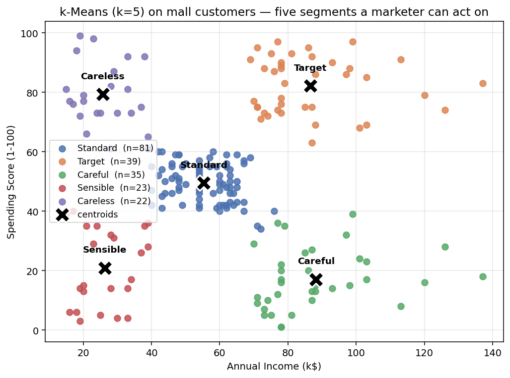
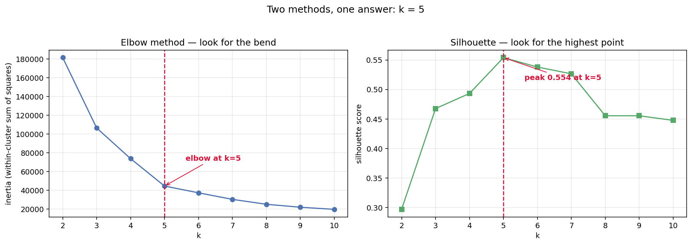
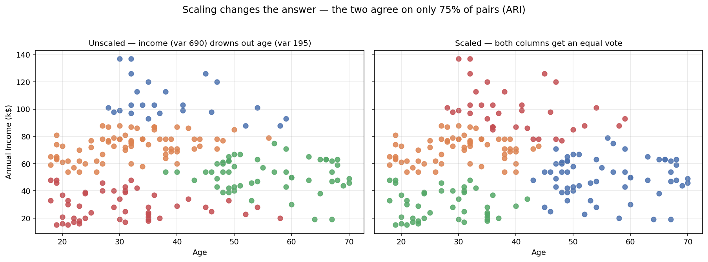
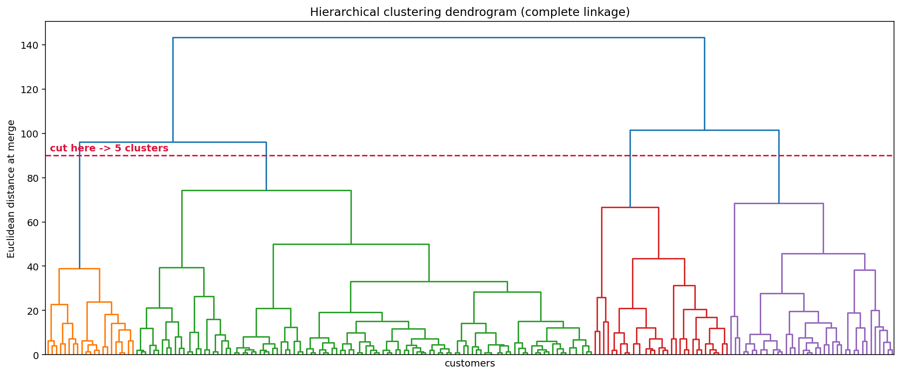
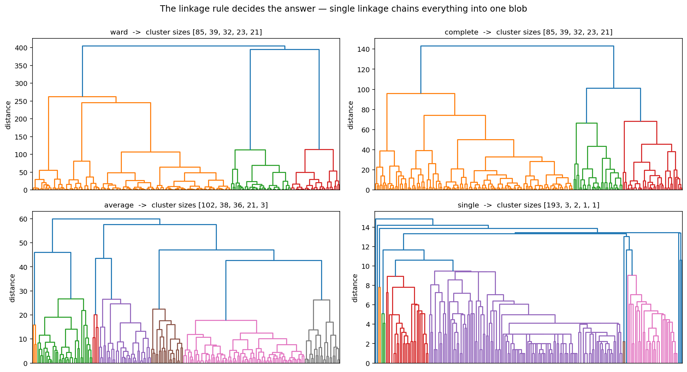
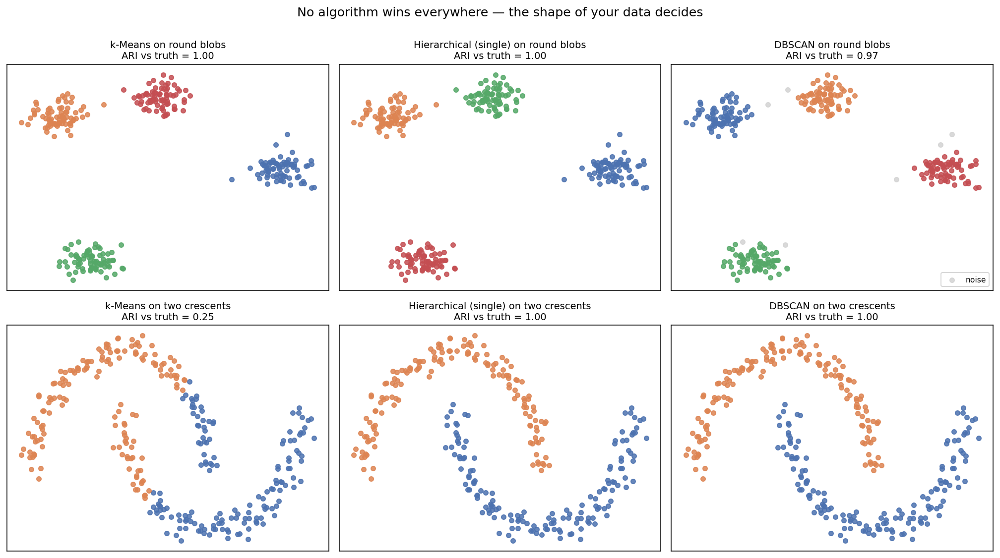
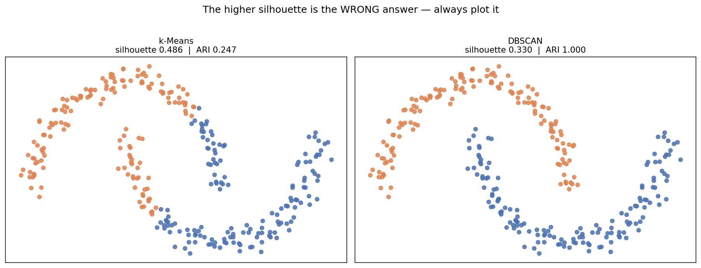

# Session 7 — Unsupervised Learning: Clustering

**Clustering in real life · Types of clustering algorithms · k-Means · Hierarchical Clustering · DBSCAN · Association Rule Mining · Dimensionality Reduction**

| | |
|---|---|
| **Notebook** | [session-07-unsupervised.ipynb](../notebooks/session-07-unsupervised.ipynb) |
| **Previous** | [Session 6 — Augmentation, Feature Engineering & Reduction](session-06-augmentation-feature-engg-red.md) |
| **Next** | [Session 8 — Model Evaluation & Improvement](session-08-evaluation-tuning.md) |
| **Stuck?** | [Troubleshooting](../troubleshooting.md) |

> **Everything so far had an answer key.** Sessions 5 and 5B compared predictions against known answers. **From here there is none.**
>
> **Nobody can tell you your clustering is "correct".** That makes judgement — not code — the hard part of this session.

---

## 🎯 Learning outcomes

By the end of this session you can:

1. Say what unsupervised learning is and name its three families
2. **Give ten real-life examples of clustering** and say what each one is used for
3. Name the **five types of clustering algorithm** and pick the right family for a dataset
4. Segment mall customers with k-Means, end to end
5. **Choose k with evidence** — an elbow plot and a silhouette curve
6. Explain why scaling changes the answer
7. **Name and profile your clusters** — the actual deliverable
8. Read a dendrogram and explain what each linkage rule does
9. Use DBSCAN, and say what it does that k-Means cannot
10. Explain a case where **the metric prefers the wrong answer**
11. Compute support, confidence and lift, and read a market-basket rule

---

## How this session is organised

| Part | Question it answers |
|---|---|
| **A — [Clustering, the idea](#part-a--clustering-the-idea)** | *What is clustering, where is it used, and what kinds are there?* |
| **B — [k-Means, end to end](#part-b--k-means-end-to-end)** | *How do I actually segment a real dataset?* |
| **C — [Beyond k-Means](#part-c--beyond-k-means)** | *What do I do when k-Means is the wrong tool?* |
| **D — [The rest of unsupervised learning](#part-d--the-rest-of-unsupervised-learning)** | *What else is there besides clustering?* |

| # | Topic | | # | Topic |
|---|---|---|---|---|
| 1 | [Unsupervised learning](#1-what-unsupervised-learning-is) | | 7 | [Naming the segments](#7-naming-the-segments) |
| 2 | [Clustering in real life](#2-clustering-in-real-life) | | 8 | [Hierarchical clustering](#8-hierarchical-clustering) |
| 3 | [Types of clustering algorithms](#3-types-of-clustering-algorithms) | | 9 | [DBSCAN](#9-dbscan) |
| 4 | [Use case — mall customers](#4-use-case--segmenting-mall-customers) | | 10 | [Choosing between them](#10-choosing-between-them) |
| 5 | [Choosing k with evidence](#5-choosing-k-with-evidence) | | 11 | [Association rule mining](#11-association-rule-mining) |
| 6 | [Why scaling matters](#6-why-scaling-matters) | | 12 | [Dimensionality reduction](#12-dimensionality-reduction) |

**Practices sit between the topics.** The [20 MCQs](#-session-7--20-mcqs) and [tasks](#-session-7--tasks) are at the end.

---

# Part A — Clustering, the idea

# 1. What unsupervised learning is

**No labels. No answer key. No accuracy score.** You hand the algorithm data and it finds structure on its own.

| | Supervised (Sessions 5, 5B) | Unsupervised (here) |
|---|---|---|
| Data | `X` **and** `y` | **`X` only** |
| Goal | Predict `y` for new rows | **Find structure in `X`** |
| Evaluation | Compare against the truth | **There is no truth to compare against** |
| Typical question | *Will this loan default?* | ***What kinds of customer do we have?*** |

> **This is the mental shift.** In Session 5B you could say "the model got 87% right". **Here, "right" is not defined.** A clustering is judged by whether it is *useful* — whether the business can act on it.

## The three families

| Family | What it finds | Example |
|---|---|---|
| **Clustering** | **Groups of similar rows** | Five customer segments |
| **Association rule mining** | Things that occur together | Bread → butter |
| **Dimensionality reduction** | Fewer columns that keep the structure | 30 columns → a 2-D map |

**This session is mostly about the first one, because it is by far the most used.**

---

# 2. Clustering in real life

> **Clustering answers one question: *what natural groups exist in this data?*** — when nobody has told you what the groups are.

🧠 **Analogy: a new librarian in an unsorted library.** Nobody gives you a catalogue. **You start putting books that feel similar on the same shelf** — and after a while, shelves emerge that you can name: cookery, travel, poetry. **You invented the categories; they were not handed to you.** That is clustering.

## Ten real examples

| # | Where | What is clustered | What the groups are used for |
|---|---|---|---|
| 1 | **Retail** | Customers by income and spending | **Send each segment a different offer** |
| 2 | **Banking** | Account holders by transaction behaviour | Product recommendations; **fraud rings** |
| 3 | **Insurance** | Policyholders by claim history | Risk-based pricing tiers |
| 4 | **Healthcare** | Patients by symptoms and test results | **Discovering disease sub-types** nobody had named |
| 5 | **Telecom** | Subscribers by call and data usage | Designing tariff plans people actually want |
| 6 | **E-commerce** | Products by co-purchase patterns | Store layout; "related products" |
| 7 | **Streaming** | Viewers by what they watch | **Recommendation neighbourhoods** |
| 8 | **Cities** | Neighbourhoods by census data | Where to open the next store or clinic |
| 9 | **Manufacturing** | Machine sensor readings | **Anomaly detection** — a reading in no cluster is a warning |
| 10 | **Documents** | News articles by wording | Grouping coverage of the same story |

## Three more you will meet in this course

| Where | What is clustered | Why |
|---|---|---|
| **Image compression** | Pixel colours into k colours | A 16-million-colour photo becomes a 16-colour one |
| **Genetics** | Genes by expression level | Genes that switch on together often work together |
| **Sports** | Players by performance stats | **Finding "this player is really a different position"** |

## What all of these have in common

**Every single one is a case where:**

1. **Nobody knows the groups in advance** — if the marketing team already had five segments, you would not need clustering
2. **The groups have to be *acted on*** — a clustering nobody uses is a clustering that failed
3. **There is no score that proves you are right** — you have to look at the result and judge it

> ⚠️ **Clustering is not classification with the labels hidden.** **It is a different job.** Classification learns a boundary somebody already drew. **Clustering proposes the boundary.**

---

# 3. Types of clustering algorithms

**There are five broad families. You do not need to know them all — but you do need to know which family fits the shape of your data.**

| Family | The idea | Main algorithm | Best when |
|---|---|---|---|
| **Centroid-based** | Each cluster is represented by its centre | **k-Means** | Clusters are roughly **round and similar-sized** |
| **Hierarchical** | Repeatedly merge the closest pair | **Agglomerative clustering** | You want **a tree**, not one fixed answer |
| **Density-based** | A cluster is a dense region; sparse points are noise | **DBSCAN** | Clusters are **odd shapes**, and there are outliers |
| **Distribution-based** | Each cluster is a probability distribution | **Gaussian Mixture Models** | Clusters **overlap** and you want soft membership |
| **Graph-based** | Rows are nodes; cut the weakest links | **Spectral clustering** | Structure is about **connectivity**, not distance |

## The three you will use

**This session covers the first three in depth**, because between them they handle the large majority of real problems.

| | **k-Means** | **Hierarchical** | **DBSCAN** |
|---|---|---|---|
| You must choose | **k** (number of clusters) | Where to cut the tree | **eps** and **min_samples** |
| Cluster shapes | **Round only** | Depends on linkage | **Any shape** |
| Handles outliers | **No** — forces every point into a cluster | No | **Yes — labels them noise** |
| Speed on 100k rows | **Fast** | **Slow** (needs all pairwise distances) | Medium |
| Gives you a tree | No | **Yes — the dendrogram** | No |
| Repeatable | Only with a fixed `random_state` | **Yes, always** | **Yes, always** |

> **Start with k-Means.** It is fast, it is simple, and on most business data the segments genuinely are round-ish blobs. **Reach for the others when k-Means visibly fails** — and you will only know it failed because you plotted it.

## A decision guide

```text
Do you know roughly how many groups you want?
├── Yes  -> k-Means (and confirm k with an elbow + silhouette)
└── No
    ├── Want to SEE the structure at every level?  -> Hierarchical + dendrogram
    ├── Expect odd shapes or real outliers?        -> DBSCAN
    └── Expect the groups to overlap?              -> Gaussian Mixture Model
```

---

# Part B — k-Means, end to end

# 4. Use case — segmenting mall customers

**The business question:** *a shopping mall has 200 customers on file. What kinds of customer are they, and what offer should each kind get?*

**Nobody has labelled them. There is no `y`.** That is exactly what clustering is for.

---

## Step 1 — Load and inspect

```python
import numpy as np
import pandas as pd
import matplotlib.pyplot as plt
import seaborn as sns

dataset_url = "https://raw.githubusercontent.com/tech4alltraining/aiml/refs/heads/main/datasets/clustering/Mall_Customers.csv"
df = pd.read_csv(dataset_url)

print(df.shape)
df.head()
```

**Output:**

```text
(200, 5)

   CustomerID  Gender  Age  Annual Income (k$)  Spending Score (1-100)
0           1    Male   19                  15                      39
1           2    Male   21                  15                      81
2           3  Female   20                  16                       6
3           4  Female   23                  16                      77
4           5  Female   31                  17                      40
```

**Five columns. Look at what each one is:**

| Column | What it is | Useful for clustering? |
|---|---|---|
| `CustomerID` | A row number | **No — it carries no information** |
| `Gender` | Male / Female | Text; would need encoding |
| `Age` | Years | Yes, but not what the mall asked about |
| `Annual Income (k$)` | Income in thousands | **Yes** |
| `Spending Score (1-100)` | How much they spend at this mall | **Yes** |

```python
df.info()
```

**Output:**

```text
<class 'pandas.core.frame.DataFrame'>
RangeIndex: 200 entries, 0 to 199
Data columns (total 5 columns):
 #   Column                  Non-Null Count  Dtype
---  ------                  --------------  -----
 0   CustomerID              200 non-null    int64
 1   Gender                  200 non-null    object
 2   Age                     200 non-null    int64
 3   Annual Income (k$)      200 non-null    int64
 4   Spending Score (1-100)  200 non-null    int64
```

> **200 non-null in every column — no missing values to handle.** That is unusual and pleasant. **Check anyway, every time.**

---

## Step 2 — Choose the features

```python
X = df[["Annual Income (k$)", "Spending Score (1-100)"]]
print(X.shape)
X.head()
```

**Output:** `(200, 2)`

**Why only these two?**

| Reason | Explanation |
|---|---|
| **They answer the question** | The mall asked *"who should get which offer?"* — income and spending are exactly the two axes an offer is designed around |
| **`CustomerID` is meaningless** | It is a row number. **Including it would let the algorithm cluster by *when the customer signed up*** |
| **Two columns can be plotted** | **You can see the result.** With 4 columns you would be trusting a number instead of your eyes |
| **`Gender` is text** | It would need encoding, and a 0/1 column and a 0–137 column together would need scaling too |

> ⚠️ **Dropping columns changes the answer.** **This is a decision, not a default** — and you must be able to justify it. Here the justification is that the business question is about income and spending.

---

## Step 3 — Run k-Means

**k-Means in one paragraph:** you tell it how many clusters you want. It drops that many centre points at random, assigns every row to its nearest centre, then moves each centre to the average of the rows assigned to it — and repeats until nothing moves.

```python
from sklearn.cluster import KMeans

kmeans = KMeans(n_clusters=5, random_state=0, n_init=10)
df["Cluster"] = kmeans.fit_predict(X)

print(df["Cluster"].value_counts().sort_index())
```

**Output:**

```text
Cluster
0    81
1    39
2    35
3    23
4    22
Name: count, dtype: int64
```

**Every argument matters:**

| Argument | Why |
|---|---|
| `n_clusters=5` | **The number you must choose.** §5 shows how to choose it with evidence rather than by guessing |
| `random_state=0` | k-Means starts from random centres. **Without this, you get a different answer every run** |
| `n_init=10` | **Run the whole thing 10 times from different starts and keep the best.** k-Means can settle into a poor arrangement; this is the cheap insurance against it |

> ⚠️ **`fit_predict` is not `predict`.** There is no train/test split here — **there is nothing to test against.** Every row is used, and every row gets a cluster.

---

## Step 4 — Look at the centres

```python
print(kmeans.cluster_centers_.round(2))
```

**Output:**

```text
[[55.30 49.52]
 [86.54 82.13]
 [88.20 17.11]
 [26.30 20.91]
 [25.73 79.36]]
```

> **This is the most important output in the whole session.** **Each row is one cluster's average customer:** the first number is income, the second is spending score.
>
> **Read them as sentences:**
>
> - `[55.30, 49.52]` — **average income, average spending**
> - `[86.54, 82.13]` — **high income, high spending**
> - `[88.20, 17.11]` — **high income, low spending**
> - `[26.30, 20.91]` — **low income, low spending**
> - `[25.73, 79.36]` — **low income, high spending**

**Five clusters, and every one of them is a sentence a marketing manager understands.**

---

## Step 5 — Plot it

```python
plt.figure(figsize=(8, 6))
sns.scatterplot(x="Annual Income (k$)", y="Spending Score (1-100)",
                hue="Cluster", palette=["green", "orange", "brown", "dodgerblue", "red"],
                legend="full", data=df, s=40)
plt.scatter(kmeans.cluster_centers_[:, 0], kmeans.cluster_centers_[:, 1],
            marker="X", s=250, c="black", label="centroids")
plt.xlabel("Annual Income (k$)")
plt.ylabel("Spending Score (1-100)")
plt.title("K-Means Clustering of Mall Customers")
plt.legend()
plt.show()
```



> **Always plot your clusters.** **The plot is the only thing that can tell you the clustering is nonsense** — no score will.
>
> **Here it is clearly not nonsense.** Five separated groups, each in its own corner of the picture, with the big undecided crowd in the middle.

---

# 5. Choosing k with evidence

**We used `k=5`. Where did 5 come from?**

**In the trainer's notebook it was simply chosen. That is fine for a demonstration — but on your own data you must be able to defend the number.** There are two standard ways, and you should use both.

## Method 1 — the elbow

**Inertia** is the total squared distance from every point to its own cluster's centre. **Lower is tighter.**

**Inertia always falls as k rises** — with k = 200 every customer is its own cluster and inertia is exactly zero. **So you cannot simply minimise it.** You look for the *bend*: the point after which extra clusters stop buying you much.

```python
inertias = []
for k in range(2, 11):
    km = KMeans(n_clusters=k, random_state=0, n_init=10).fit(X)
    inertias.append(km.inertia_)
    print(f"k={k:>2}   inertia {km.inertia_:>10.1f}")
```

**Output:**

```text
k= 2   inertia   181363.6
k= 3   inertia   106348.4
k= 4   inertia    73679.8
k= 5   inertia    44448.5
k= 6   inertia    37265.9
k= 7   inertia    30259.7
k= 8   inertia    25050.8
k= 9   inertia    21862.1
k=10   inertia    19657.8
```

> **Read the *drops*, not the values.** 4→5 saves 29,000. **5→6 saves only 7,000.** That collapse in the size of the improvement is the elbow.

## Method 2 — the silhouette score

**The silhouette asks, for every single point: *am I closer to my own cluster than to the nearest other one?*** It runs from −1 to +1.

| Score | Meaning |
|---|---|
| **Near +1** | The point sits comfortably inside its cluster |
| **Near 0** | It is on the boundary — it could go either way |
| **Negative** | **It is closer to another cluster. It is in the wrong one** |

**Unlike inertia, the silhouette does not automatically improve with more clusters — so you can just take the highest.**

```python
from sklearn.metrics import silhouette_score

for k in range(2, 11):
    km = KMeans(n_clusters=k, random_state=0, n_init=10).fit(X)
    print(f"k={k:>2}   silhouette {silhouette_score(X, km.labels_):.4f}")
```

**Output:**

```text
k= 2   silhouette 0.2969
k= 3   silhouette 0.4676
k= 4   silhouette 0.4932
k= 5   silhouette 0.5539
k= 6   silhouette 0.5380
k= 7   silhouette 0.5264
k= 8   silhouette 0.4554
k= 9   silhouette 0.4554
k=10   silhouette 0.4476
```

> **The peak is at k=5, at 0.5539** — and it falls away on both sides.



## Both methods agree — and that is what you want

| Method | Answer |
|---|---|
| Elbow | **k = 5** |
| Silhouette | **k = 5** (0.5539, the peak) |
| The plot | **5 visually separated groups** |

> **Three independent pieces of evidence pointing the same way.** **Now "k=5" is a defensible decision rather than a guess.**
>
> ⚠️ **When they disagree — and they often will — the plot wins.** The metrics measure geometry. **You are looking for groups the business can act on**, and those are not always the roundest ones.

---

# 6. Why scaling matters

**We got away without scaling.** Income runs 15–137 and spending score runs 1–99 — **similar enough that neither drowns out the other.**

**That was luck. Change one column and it stops being true.**

```python
from sklearn.preprocessing import StandardScaler
from sklearn.metrics import adjusted_rand_score

X2 = df[["Age", "Annual Income (k$)"]]
print("variances:", X2.var().round(1).to_dict())

raw_labels = KMeans(n_clusters=4, random_state=0, n_init=10).fit_predict(X2)

X2_scaled = StandardScaler().fit_transform(X2)
scaled_labels = KMeans(n_clusters=4, random_state=0, n_init=10).fit_predict(X2_scaled)

print("agreement between the two (ARI):",
      round(adjusted_rand_score(raw_labels, scaled_labels), 4))
```

**Output:**

```text
variances: {'Age': 195.1, 'Annual Income (k$)': 689.8}
agreement between the two (ARI): 0.7471
```

> **Income has 3.5× the variance of age, purely because of the units it happens to be measured in.** **k-Means measures distance, so income effectively gets 3.5 votes and age gets 1.**
>
> **Scaling changed roughly a quarter of the answer.** Two different analysts, two different segment reports, one dataset.



## The rule

> **Scale before clustering, unless you have checked that the columns are already comparable.** **It costs one line, and forgetting it is silent** — you get clusters either way, and nothing warns you that one column decided all of them.

```python
# illustrative: a syntax reference, not runnable as written.
from sklearn.pipeline import make_pipeline

pipe = make_pipeline(StandardScaler(), KMeans(n_clusters=5, random_state=0, n_init=10))
labels = pipe.fit_predict(X)
```

**A pipeline makes it structural rather than a thing you have to remember** — the same argument as in Session 5B.

---

# 7. Naming the segments

**The cluster numbers 0, 1, 2, 3, 4 are worthless to a business.** **The deliverable is names, and an action for each.**

## Profile first

```python
profile = df.groupby("Cluster")[["Age", "Annual Income (k$)", "Spending Score (1-100)"]].mean()
profile["size"] = df["Cluster"].value_counts().sort_index()
print(profile.round(1))
```

**Output:**

```text
          Age  Annual Income (k$)  Spending Score (1-100)  size
Cluster
0        42.7                55.3                    49.5    81
1        32.7                86.5                    82.1    39
2        41.1                88.2                    17.1    35
3        45.2                26.3                    20.9    23
4        25.3                25.7                    79.4    22
```

> **Notice `Age` came along for free.** **We did not cluster on it — but we can still describe the clusters with it.** Cluster 4 is the youngest at 25.3; cluster 3 the oldest at 45.2. **Profiling on columns you did not cluster with is one of the most useful things you can do.**

## Now name them

| Cluster | Income | Spending | Age | **Name** | **What the mall should do** |
|---|---|---|---|---|---|
| 0 | ~55 | ~50 | 42.7 | **Standard** | The bulk (81 of 200). General promotions |
| 1 | ~87 | ~82 | 32.7 | **Target** | **Loyalty programme. These are the best customers** |
| 2 | ~88 | ~17 | 41.1 | **Careful** | **Money but no interest. Find out why** |
| 3 | ~26 | ~21 | 45.2 | **Sensible** | Value offers, discounts |
| 4 | ~26 | ~79 | 25.3 | **Careless** | Young, spending beyond income. **Credit offers** |

> **Cluster 2 is the interesting one.** **35 customers with the highest income in the dataset and almost the lowest spending.** No supervised model would have raised this, because nobody had ever labelled it a problem. **The clustering found a question worth asking.**
>
> **That is what a good clustering delivers: not a number, but a question the business did not know to ask.**

## ✏️ Practice — the mall segmentation

1. Load the dataset and confirm its shape and that there are no missing values.
2. Cluster on income and spending with k=5. **Print the counts and the centres, and match each centre to one of the five names.**
3. Plot the clusters with the centroids marked. **Does the picture support the names?**
4. Produce the elbow and silhouette curves for k = 2…10. **Do they agree?**
5. Now cluster on `Age` and `Spending Score` instead. **Do you get a useful segmentation? Would you present it to the mall?**

<details><summary>Solutions</summary>

```python
import pandas as pd
import matplotlib; matplotlib.use("Agg")
import matplotlib.pyplot as plt
from sklearn.cluster import KMeans
from sklearn.metrics import silhouette_score

dataset_url = "https://raw.githubusercontent.com/tech4alltraining/aiml/refs/heads/main/datasets/clustering/Mall_Customers.csv"
df = pd.read_csv(dataset_url)
print(df.shape, "| missing:", df.isnull().sum().sum())                 # 1

X = df[["Annual Income (k$)", "Spending Score (1-100)"]]               # 2
km = KMeans(n_clusters=5, random_state=0, n_init=10).fit(X)
df["Cluster"] = km.labels_
print(df["Cluster"].value_counts().sort_index().to_dict())
print(km.cluster_centers_.round(2))
# [55.3, 49.5] Standard | [86.5, 82.1] Target | [88.2, 17.1] Careful
# [26.3, 20.9] Sensible | [25.7, 79.4] Careless

fig, ax = plt.subplots(figsize=(8, 6))                                 # 3
for c in range(5):
    s = df[df["Cluster"] == c]
    ax.scatter(s["Annual Income (k$)"], s["Spending Score (1-100)"], s=40)
ax.scatter(km.cluster_centers_[:, 0], km.cluster_centers_[:, 1],
           marker="X", s=250, c="black")
plt.close(fig)
# Yes - five separated corners plus the crowd in the middle.

for k in range(2, 11):                                                 # 4
    m = KMeans(n_clusters=k, random_state=0, n_init=10).fit(X)
    print(f"k={k:>2}  inertia {m.inertia_:>9.1f}  silhouette "
          f"{silhouette_score(X, m.labels_):.4f}")
# Elbow at 5, silhouette peaks at 5 (0.5539). They agree.

X3 = df[["Age", "Spending Score (1-100)"]]                             # 5
m3 = KMeans(n_clusters=5, random_state=0, n_init=10).fit(X3)
print("silhouette on age+spending:", round(silhouette_score(X3, m3.labels_), 4))
print(m3.cluster_centers_.round(1))
# The silhouette is LOWER and the centres do not form five tidy corners -
# age and spending do not separate as cleanly. You could present it, but
# the income-and-spending version answers the mall's actual question
# ("who gets which offer?") far better. The features you choose ARE the
# analysis.
```
</details>

---

# Part C — Beyond k-Means

# 8. Hierarchical clustering

> **Instead of choosing k up front, build a tree of every possible grouping and cut it wherever you like.**

🧠 **Analogy: a family tree, read upwards.** Start with every person alone. **Join the two closest into a pair, then join the closest pair-or-person, and keep going until everyone is in one family.** The record of what merged with what, and at what distance, is the tree.

## The algorithm

```text
1. Every point starts as its own cluster        (200 clusters)
2. Find the two CLOSEST clusters and merge them (199 clusters)
3. Repeat                                       (198, 197, ... )
4. Stop when everything is one cluster          (1 cluster)
```

**Nothing in there mentions k.** **You get all 200 answers, and choose afterwards by cutting the tree at a height.**

## Running it on the mall data

```python
from sklearn.cluster import AgglomerativeClustering

hc = AgglomerativeClustering(n_clusters=5, linkage="complete", metric="euclidean")
df["Cluster2"] = hc.fit_predict(X)

print(df["Cluster2"].value_counts().sort_index())
```

**Output:**

```text
Cluster2
0    39
1    85
2    32
3    21
4    23
Name: count, dtype: int64
```

## Does it agree with k-Means?

```python
from sklearn.metrics import adjusted_rand_score, silhouette_score

print("agreement with k-Means (ARI):",
      round(adjusted_rand_score(df["Cluster"], df["Cluster2"]), 4))
print("silhouette, k-Means      :", round(silhouette_score(X, df["Cluster"]), 4))
print("silhouette, hierarchical :", round(silhouette_score(X, df["Cluster2"]), 4))
```

**Output:**

```text
agreement with k-Means (ARI): 0.942
silhouette, k-Means      : 0.5539
silhouette, hierarchical : 0.5530
```

> **Two completely different algorithms, run with no knowledge of each other, produced almost the same five groups.** **ARI 0.942 means they agree on 94% of pairs.**
>
> **That agreement is evidence.** **When two different methods find the same structure, the structure is probably real** — not an artefact of one algorithm's assumptions. **This is the closest thing to validation that unsupervised learning offers.**

## The dendrogram

**The tree drawn out. This is the picture hierarchical clustering exists for.**

```python
from scipy.cluster.hierarchy import dendrogram, linkage

Z = linkage(X, method="complete")

plt.figure(figsize=(15, 8))
dendrogram(Z)
plt.title("Hierarchical Clustering Dendrogram")
plt.xlabel("Customers")
plt.ylabel("Euclidean Distance")
plt.show()
```



### How to read it

| Part of the picture | What it means |
|---|---|
| **Each leaf at the bottom** | One customer |
| **A horizontal join** | Two clusters merged |
| **Its height** | **How far apart they were when they merged** |
| **A tall vertical line before a join** | **Those two groups were very different — a natural place to cut** |
| **A horizontal cut across the whole plot** | Gives you a clustering; **the number of vertical lines it crosses is your k** |

> **Cut low → many small clusters. Cut high → few big ones.** **You are choosing k after seeing the evidence, instead of before.**
>
> **The best place to cut is where a long vertical stretch has no joins at all** — that is a distance range where nothing wanted to merge, which means the groups either side are genuinely separated.

## The linkage rule decides the answer

**"Distance between two clusters" is ambiguous.** Which two points do you measure? **The `linkage` argument is that choice, and it matters enormously.**

| Linkage | Distance between two clusters is… | Tends to give |
|---|---|---|
| **`single`** | The **closest** pair of points | **Long straggly chains** |
| **`complete`** | The **furthest** pair of points | Compact, similar-sized clusters |
| **`average`** | The average over all pairs | A middle ground |
| **`ward`** | The increase in total variance from merging | **Even, round clusters — the usual default** |

**Measured on the mall data, all four asked for 5 clusters:**

```python
for method in ["ward", "complete", "average", "single"]:
    labels = AgglomerativeClustering(n_clusters=5, linkage=method).fit_predict(X)
    sizes = sorted(pd.Series(labels).value_counts().tolist(), reverse=True)
    print(f"{method:<9} silhouette {silhouette_score(X, labels):.4f}   sizes {sizes}")
```

**Output:**

```text
ward      silhouette 0.5530   sizes [85, 39, 32, 23, 21]
complete  silhouette 0.5530   sizes [85, 39, 32, 23, 21]
average   silhouette 0.4792   sizes [102, 38, 36, 21, 3]
single    silhouette 0.2695   sizes [193, 3, 2, 1, 1]
```



> ⚠️ **Look at `single`.** **193 customers in one cluster and four clusters of one to three points each.** That is not a segmentation — it is a failure.
>
> **This is the chaining effect.** Single linkage merges on the *closest* pair, so any two blobs joined by a thin bridge of points get glued together. On dense data like this, everything chains into one mass.
>
> **`ward` and `complete` gave identical results here, and both matched k-Means.** **Use `ward` unless you have a reason not to.**

---

# 9. DBSCAN

> **A cluster is a dense region. Points in sparse regions are not in any cluster — they are noise.**

🧠 **Analogy: spotting towns from a plane at night.** **Clusters of light are towns. A single isolated light in the dark is a farmhouse — and it belongs to no town.** k-Means would insist on assigning that farmhouse to the nearest town. **DBSCAN says: it is on its own.**

## The two settings

| Parameter | Meaning |
|---|---|
| **`eps`** | **How close counts as "nearby"** |
| **`min_samples`** | **How many nearby points make a region "dense"** |

**A point with at least `min_samples` neighbours within `eps` is a *core point*. Core points that are near each other form a cluster. Everything else is labelled `-1`: noise.**

```python
from sklearn.cluster import DBSCAN
from sklearn.preprocessing import StandardScaler

X_scaled = StandardScaler().fit_transform(X)

for eps in [0.3, 0.4, 0.5, 0.6]:
    labels = DBSCAN(eps=eps, min_samples=5).fit_predict(X_scaled)
    n_clusters = len(set(labels)) - (1 if -1 in labels else 0)
    print(f"eps={eps}   clusters {n_clusters}   noise {(labels == -1).sum()}")
```

**Output:**

```text
eps=0.3   clusters 7   noise 35
eps=0.4   clusters 4   noise 15
eps=0.5   clusters 2   noise 8
eps=0.6   clusters 1   noise 5
```

> ⚠️ **DBSCAN must have scaled input.** `eps` is a distance, and a distance is meaningless when one column runs to 137 and another to 99.

## ⚠️ DBSCAN is the wrong tool for this dataset — and that is worth seeing

**Look at what happened.** **There is no `eps` that gives five clusters.** Move it slightly and you go from 7 clusters to 4 to 2 to 1.

**Why?** **DBSCAN separates groups by *gaps in density*. The five mall segments are not separated by empty space** — they are five corners of one continuous cloud. **There is no sparse region between them for DBSCAN to cut along.**

> **Report this honestly rather than tuning `eps` until something looks acceptable.** **"DBSCAN is not the right algorithm for this data" is a legitimate and useful finding**, and it is the sort of conclusion that stops a colleague wasting a week.

## Where DBSCAN wins

**Give it data with genuine shape and it beats k-Means outright.**

```python
from sklearn.datasets import make_moons
from sklearn.metrics import adjusted_rand_score

X_moons, y_true = make_moons(n_samples=300, noise=0.06, random_state=42)

km_labels = KMeans(n_clusters=2, random_state=0, n_init=10).fit_predict(X_moons)
db_labels = DBSCAN(eps=0.25, min_samples=5).fit_predict(X_moons)

print("k-Means  ARI:", round(adjusted_rand_score(y_true, km_labels), 4))
print("DBSCAN   ARI:", round(adjusted_rand_score(y_true, db_labels), 4))
```

**Output:**

```text
k-Means  ARI: 0.2475
DBSCAN   ARI: 1.0000
```

> **DBSCAN recovered the two crescents perfectly. k-Means scored 0.25 — barely better than random.**
>
> **k-Means could not have done better.** It represents a cluster by its centre, and **the centre of a crescent is in the empty space inside the curve.** The shape is simply outside what the algorithm can express.

## What DBSCAN gives you that the others cannot

| | Benefit |
|---|---|
| **Any shape** | Crescents, rings, snakes — not just blobs |
| **No k** | The number of clusters comes out of the data |
| **Noise is explicit** | **`-1` means "this point is genuinely unusual"** — which makes DBSCAN an anomaly detector too |

| | Cost |
|---|---|
| **Two parameters instead of one** | And the result is very sensitive to `eps` |
| **Struggles with varying density** | One `eps` cannot fit a dense region and a sparse one at once |
| **Must scale** | Non-negotiable |

---

# 10. Choosing between them



**Read the grid. It is the whole lesson of Part C in one picture.**

| Data | k-Means | Hierarchical (single) | DBSCAN |
|---|---|---|---|
| **Round blobs** | **1.00** | **1.00** | 0.97 |
| **Two crescents** | **0.25** | **1.00** | **1.00** |

> **On round blobs all three are effectively perfect — so use the fastest and simplest, which is k-Means.**
>
> **On crescents k-Means collapses while the other two are perfect.** **And notice single linkage — useless on the mall data — is perfect here.** **There is no best algorithm. There is only the algorithm that matches your data's shape.**

## ⚠️ And now the trap: the metric prefers the wrong answer

**You do not have the true labels in a real problem — so you would reach for the silhouette score to decide. Watch what happens.**

```python
from sklearn.metrics import silhouette_score, adjusted_rand_score

print("k-Means  silhouette", round(silhouette_score(X_moons, km_labels), 4),
      "  ARI", round(adjusted_rand_score(y_true, km_labels), 4))
print("DBSCAN   silhouette", round(silhouette_score(X_moons, db_labels), 4),
      "  ARI", round(adjusted_rand_score(y_true, db_labels), 4))
```

**Output:**

```text
k-Means  silhouette 0.4863   ARI 0.2475
DBSCAN   silhouette 0.3298   ARI 1.0000
```



> **The silhouette prefers k-Means — the answer that is 75% wrong.**
>
> **Why?** **The silhouette measures whether points are close to their own cluster's other points. That definition quietly assumes clusters are round.** A crescent's two ends are far apart, so a *correct* crescent cluster scores badly by construction.
>
> **The metric is not broken. It is answering a different question from the one you asked.**

## The rule this leads to

> **In supervised learning the metric is the judge. In unsupervised learning the metric is a witness — and the plot is the judge.**
>
> **Never ship a clustering you have not looked at.**

## Choosing, in practice

| Situation | Use |
|---|---|
| Business segmentation, roughly round groups | **k-Means** |
| You want to see structure at every level | **Hierarchical + dendrogram** |
| Odd shapes, or you need outliers flagged | **DBSCAN** |
| Groups that overlap, want probabilities | **Gaussian Mixture Model** |
| **Not sure** | **Run two, and trust the answer they agree on** |

## ✏️ Practice — the other algorithms

1. Run `AgglomerativeClustering(n_clusters=5, linkage="complete")` on the mall data. **Compare it with k-Means using ARI.** What does high agreement tell you?
2. Draw the dendrogram. **Where would you cut it for 3 clusters, and for 5?**
3. Run all four linkage methods at k=5 and print the cluster sizes. **Which one fails, and what is that failure called?**
4. Run DBSCAN on the scaled mall data at four `eps` values. **Can you get five clusters? What does that tell you about this dataset?**
5. On `make_moons`, compare k-Means and DBSCAN by silhouette **and** by ARI. **Which metric picks the wrong winner, and why?**

<details><summary>Solutions</summary>

```python
import pandas as pd
import matplotlib; matplotlib.use("Agg")
import matplotlib.pyplot as plt
from scipy.cluster.hierarchy import dendrogram, linkage
from sklearn.cluster import KMeans, AgglomerativeClustering, DBSCAN
from sklearn.datasets import make_moons
from sklearn.metrics import silhouette_score, adjusted_rand_score
from sklearn.preprocessing import StandardScaler

dataset_url = "https://raw.githubusercontent.com/tech4alltraining/aiml/refs/heads/main/datasets/clustering/Mall_Customers.csv"
df = pd.read_csv(dataset_url)
X = df[["Annual Income (k$)", "Spending Score (1-100)"]]

km = KMeans(n_clusters=5, random_state=0, n_init=10).fit_predict(X)     # 1
hc = AgglomerativeClustering(n_clusters=5, linkage="complete").fit_predict(X)
print("ARI:", round(adjusted_rand_score(km, hc), 4))                    # 0.942
# Two algorithms with different assumptions found the same groups. That
# agreement is evidence the structure is REAL and not an artefact of one
# algorithm - the closest thing to validation unsupervised learning has.

Z = linkage(X, method="complete")                                       # 2
fig, ax = plt.subplots(figsize=(14, 6))
dendrogram(Z, ax=ax, no_labels=True)
plt.close(fig)
# Cut where a long vertical stretch has no joins. Higher cuts give fewer
# clusters: around distance 150 gives 3, around 90 gives 5.

for m in ["ward", "complete", "average", "single"]:                     # 3
    lab = AgglomerativeClustering(n_clusters=5, linkage=m).fit_predict(X)
    print(f"{m:<9} sizes {sorted(pd.Series(lab).value_counts().tolist(), reverse=True)}"
          f"  silhouette {silhouette_score(X, lab):.4f}")
# SINGLE fails: 193 / 3 / 2 / 1 / 1. This is the CHAINING EFFECT - single
# linkage merges on the closest pair, so a thin bridge of points glues
# two blobs together, and on dense data everything chains into one mass.

Xs = StandardScaler().fit_transform(X)                                  # 4
for eps in [0.3, 0.4, 0.5, 0.6]:
    lab = DBSCAN(eps=eps, min_samples=5).fit_predict(Xs)
    n = len(set(lab)) - (1 if -1 in lab else 0)
    print(f"eps={eps}  clusters {n}  noise {(lab == -1).sum()}")
# No eps gives 5. The five segments are five CORNERS of one continuous
# cloud, not five dense islands with empty space between them - so there
# is no density gap for DBSCAN to cut along. DBSCAN is the wrong tool
# here, and saying so is a legitimate finding.

Xm, ym = make_moons(n_samples=300, noise=0.06, random_state=42)         # 5
a = KMeans(n_clusters=2, random_state=0, n_init=10).fit_predict(Xm)
b = DBSCAN(eps=0.25, min_samples=5).fit_predict(Xm)
print(f"kMeans  silhouette {silhouette_score(Xm, a):.4f}  ARI {adjusted_rand_score(ym, a):.4f}")
print(f"DBSCAN  silhouette {silhouette_score(Xm, b):.4f}  ARI {adjusted_rand_score(ym, b):.4f}")
# SILHOUETTE picks the wrong winner. It prefers kMeans (0.486 vs 0.330)
# even though kMeans is 75% wrong (ARI 0.25) and DBSCAN is perfect (1.0).
# The silhouette rewards points being close to their own cluster's other
# points, which quietly assumes ROUND clusters. A correct crescent scores
# badly by construction. Plot it.
```
</details>

---

# Part D — The rest of unsupervised learning

**Clustering groups the *rows*. The other two families do something different: one finds items that occur together, the other reduces the *columns*.**

---

# 11. Association rule mining

**Which things appear together?** This is the "customers who bought X also bought Y" engine.

🧠 **Analogy: watching a supermarket's trolleys all day.** You notice bread and butter keep turning up together. But so do bread and *shopping bags* — because almost every trolley has a bag. **The first is a real pattern; the second is just popularity.** **Telling those two apart is the entire point of this topic.**

## The three numbers

For a rule **A → B**:

| Number | Formula | Question it answers |
|---|---|---|
| **Support** | baskets with A **and** B ÷ all baskets | *How often does this happen at all?* |
| **Confidence** | baskets with A and B ÷ baskets with A | *When A happens, how often does B?* |
| **Lift** | confidence ÷ support(B) | ***Is this more than B's popularity alone?*** |

**Lift is the one that matters:**

| Lift | Meaning |
|---|---|
| **> 1** | **A genuinely makes B more likely. Interesting.** |
| **≈ 1** | No relationship — B is simply common |
| **< 1** | A makes B *less* likely |

> ⚠️ **High confidence with lift ≈ 1 is the classic beginner's trap.** *"90% of people who buy bread also buy shopping bags"* sounds like a finding. **If 90% of all baskets contain a bag, you have discovered nothing.**

## Building the three numbers by hand

```python
import numpy as np
from itertools import combinations

rng = np.random.default_rng(7)
items = ["bread", "milk", "eggs", "butter", "jam", "tea", "coffee", "sugar", "rice", "oil"]

baskets = []
for _ in range(500):
    b = {str(x) for x in rng.choice(items, size=rng.integers(2, 5), replace=False)}
    if "bread" in b and rng.random() < .75: b.add("butter")     # planted rule
    if "tea" in b and rng.random() < .70: b.add("sugar")        # planted rule
    baskets.append(b)

def support(itemset):
    return sum(1 for b in baskets if itemset <= b) / len(baskets)

def rule(A, B):
    conf = support(A | B) / support(A)
    return support(A | B), conf, conf / support(B)

s, c, l = rule({"bread"}, {"butter"})
print(f"bread -> butter   support {s:.3f}   confidence {c:.3f}   lift {l:.2f}")
```

**Output:**

```text
bread -> butter   support 0.232   confidence 0.806   lift 1.68
```

> **We planted this rule deliberately when generating the baskets, and the three numbers found it.** **Lift 1.68 means buying bread makes butter 68% more likely than it would be by chance.**

## Apriori, and the one idea it rests on

**You cannot test every possible itemset — with 10 items there are already 1,023 of them, and with 1,000 items the number is astronomical.**

```python
MIN_SUP = 0.05

freq = {frozenset([i]) for i in items if support({i}) >= MIN_SUP}   # single items
all_freq, k = set(freq), 2
while freq and k <= 3:
    cand = {a | b for a in freq for b in freq if len(a | b) == k}    # grow by one
    freq = {c for c in cand if support(set(c)) >= MIN_SUP}          # keep frequent
    all_freq |= freq
    k += 1

print("frequent itemsets found:", len(all_freq))
```

**Output:** `frequent itemsets found: 62`

> **The Apriori insight, in one sentence:** *if `{bread, butter}` is rare, then `{bread, butter, jam}` cannot possibly be common.* **So you never bother testing it.**
>
> **That single observation is what makes the problem tractable.**

## The rules it finds

| Antecedent | Consequent | Support | Confidence | **Lift** |
|---|---|---|---|---|
| butter, jam | bread | 0.068 | 0.567 | **1.97** |
| bread, jam | butter | 0.068 | 0.850 | 1.77 |
| rice, tea | sugar | 0.056 | 0.824 | 1.75 |
| **bread** | **butter** | **0.232** | **0.806** | **1.68** |
| butter, tea | sugar | 0.086 | 0.782 | 1.66 |

> **Sort by lift, not confidence.** **The highest-confidence rules are usually just pointing at popular items.**
>
> **In production:** `pip install mlxtend`, then `apriori()` and `association_rules()`. **But you now know what those functions do, which is the part that matters.**

---

# 12. Dimensionality reduction

**You cannot plot thirteen dimensions. You can plot two.**

🧠 **Analogy: the shadow of a teapot.** A teapot is three-dimensional; its shadow is flat. **A well-chosen angle casts a shadow you can still recognise as a teapot; a bad angle casts a blob.** **PCA finds the angle that keeps the most information.**

> **You met all of this in [Session 6, Part C](session-06-augmentation-feature-engg-red.md#14-projection-methods).** **Here it appears again for one reason: it is the third family of unsupervised learning, and it pairs naturally with clustering.**

| Tool | Best for | Caution |
|---|---|---|
| **PCA** | Fast, linear; a good default | Only captures straight-line structure |
| **t-SNE** | Beautiful cluster pictures | **Distances *between* clusters are meaningless** |
| **UMAP** | Faster than t-SNE, keeps more global shape | Extra install |

## Reduce, then cluster

**The natural pairing: use PCA to get down to two columns you can plot, then cluster and *see* the result.**

```python
from sklearn.decomposition import PCA
from sklearn.preprocessing import StandardScaler
from sklearn.cluster import KMeans
from sklearn.metrics import adjusted_rand_score

iris = pd.read_csv("https://raw.githubusercontent.com/tech4alltraining/aiml/refs/heads/main/datasets/classification/iris.csv")
X_iris = StandardScaler().fit_transform(iris.drop(columns=["species"]))

pca = PCA(n_components=2, random_state=42)
coords = pca.fit_transform(X_iris)
print("variance kept:", round(pca.explained_variance_ratio_.sum(), 4))

labels = KMeans(n_clusters=3, n_init=10, random_state=42).fit_predict(coords)
print("agreement with the true species (ARI):",
      round(adjusted_rand_score(iris["species"], labels), 4))
```

**Output:**

```text
variance kept: 0.958
agreement with the true species (ARI): 0.6201
```

> **95.8% of the variation survived the drop from four columns to two** — so the 2-D picture is a fair summary. **Always report that number alongside the plot.**
>
> **ARI 0.62 against the true species: good, not perfect.** **Two of the three species genuinely overlap**, and no unsupervised method can separate what is not separated.
>
> ⚠️ **We could only check that because iris happens to have labels.** **In a real unsupervised problem you would not have this luxury** — which is exactly why the plot matters so much.

## ✏️ Practice — association rules and reduction

1. Build the 500 baskets and compute support, confidence and lift for `bread → butter`. **Did the planted rule come back?**
2. Find a rule with high confidence but lift near 1. **Write the misleading version of the finding, then the honest one.**
3. Raise `MIN_SUP` from 0.05 to 0.15. **How many frequent itemsets survive?**
4. Reduce iris to 2 components. **How much variance is kept, and is the 2-D picture trustworthy?**
5. Cluster the reduced iris with k=3 and compare against the true species with ARI. **Why is it not 1.0?**

<details><summary>Solutions</summary>

```python
import numpy as np, pandas as pd
from itertools import combinations
from sklearn.preprocessing import StandardScaler
from sklearn.decomposition import PCA
from sklearn.cluster import KMeans
from sklearn.metrics import adjusted_rand_score

rng = np.random.default_rng(7)
items = ["bread", "milk", "eggs", "butter", "jam", "tea", "coffee", "sugar", "rice", "oil"]
baskets = []
for _ in range(500):
    b = {str(x) for x in rng.choice(items, size=rng.integers(2, 5), replace=False)}
    if "bread" in b and rng.random() < .75: b.add("butter")
    if "tea" in b and rng.random() < .70: b.add("sugar")
    baskets.append(b)

def support(s): return sum(1 for b in baskets if s <= b) / len(baskets)
def rule(A, B):
    conf = support(A | B) / support(A)
    return support(A | B), conf, conf / support(B)

s, c, l = rule({"bread"}, {"butter"})                                   # 1
print(f"bread -> butter  sup {s:.3f}  conf {c:.3f}  lift {l:.2f}")
# Yes - lift 1.68, well above 1. The miner recovered what we planted.

for other in ["milk", "eggs", "oil"]:                                   # 2
    s2, c2, l2 = rule({"bread"}, {other})
    print(f"bread -> {other:<6} conf {c2:.3f}  lift {l2:.2f}")
# bread -> milk has confidence 0.285 but lift 0.96.
# MISLEADING: "Nearly 3 in 10 bread buyers also buy milk!"
# HONEST:     "Milk is in 30% of ALL baskets anyway. Buying bread makes
#              milk very slightly LESS likely (lift 0.96). No finding."

def mine(min_sup):                                                      # 3
    freq = {frozenset([i]) for i in items if support({i}) >= min_sup}
    allf, k = set(freq), 2
    while freq and k <= 3:
        cand = {a | b for a in freq for b in freq if len(a | b) == k}
        freq = {c for c in cand if support(set(c)) >= min_sup}
        allf |= freq; k += 1
    return allf
print("itemsets at 0.05:", len(mine(0.05)), " at 0.15:", len(mine(0.15)))
# 62 drops to 13. Far fewer. A higher threshold means fewer, more common, less
# surprising findings - a trade, like everything else in this course.

iris = pd.read_csv("https://raw.githubusercontent.com/tech4alltraining/"     # 4
                   "aiml/refs/heads/main/datasets/classification/iris.csv")
Xs = StandardScaler().fit_transform(iris.drop(columns=["species"]))
p = PCA(n_components=2, random_state=42)
coords = p.fit_transform(Xs)
print("variance kept:", round(p.explained_variance_ratio_.sum(), 4))
# 0.958 - the picture holds 96% of the variation, so it is trustworthy.
# Had it been 0.40 you would have to say so when presenting the plot.

lab = KMeans(n_clusters=3, n_init=10, random_state=42).fit_predict(coords)  # 5
print("ARI:", round(adjusted_rand_score(iris["species"], lab), 4))
# ~0.62. Not 1.0 because two of the three species genuinely overlap in
# these measurements - versicolor and virginica are not separated in the
# data, so no unsupervised method can separate them.
```
</details>

---

# ❓ Session 7 — 20 MCQs

**Answer from memory first, then check.**

### Unsupervised learning and clustering

**Q1.** The defining feature of unsupervised learning is…
- (a) It is faster  (b) **There is no `y` — no labels and therefore no accuracy score**  (c) It uses more data  (d) It needs no preprocessing

**Q2.** Clustering differs from classification because…
- (a) It is more accurate  (b) **Classification learns a boundary somebody already drew; clustering proposes the boundary**  (c) It only works on numbers  (d) There is no difference

**Q3.** Which of these is *not* a real use of clustering?
- (a) Grouping patients by symptoms to find disease sub-types  (b) **Predicting tomorrow's stock price**  (c) Detecting anomalous machine sensor readings  (d) Segmenting customers for offers

**Q4.** A clustering that nobody in the business acts on is…
- (a) Still a success if the silhouette is high  (b) **A failure — usefulness is the only real test**  (c) Wrong  (d) Fine, as long as k was chosen well

### The algorithm families

**Q5.** k-Means is a **centroid-based** method, which means it works best when…
- (a) Data is text  (b) **Clusters are roughly round and similar in size**  (c) There are outliers  (d) Clusters overlap

**Q6.** The one algorithm here that can label a point as belonging to *no* cluster is…
- (a) k-Means  (b) Agglomerative clustering  (c) **DBSCAN**  (d) All of them

**Q7.** You want to see the structure at every level of granularity, not one fixed answer. Use…
- (a) k-Means  (b) **Hierarchical clustering and its dendrogram**  (c) DBSCAN  (d) PCA

### k-Means in practice

**Q8.** `KMeans(n_clusters=5, random_state=0, n_init=10)` — what does `n_init=10` do?
- (a) Uses 10 columns  (b) **Runs the whole algorithm 10 times from different starts and keeps the best**  (c) Runs 10 iterations  (d) Creates 10 clusters

**Q9.** Why is `CustomerID` excluded from the features?
- (a) It is text  (b) **It is a row number and carries no information — clustering on it would group customers by signup order**  (c) It has missing values  (d) It is too large

**Q10.** Inertia always falls as k rises, so you cannot simply minimise it. Instead you…
- (a) Use the largest k  (b) **Look for the bend — the point after which extra clusters stop buying much**  (c) Use k=2 always  (d) Ignore inertia

**Q11.** A silhouette score of −0.3 for a point means…
- (a) A good fit  (b) **It is closer to a different cluster than to its own — it is in the wrong one**  (c) It is noise  (d) The score is broken

**Q12.** On the mall data the elbow and the silhouette both indicated k=5. That agreement means…
- (a) Nothing  (b) **Two independent pieces of evidence point the same way, so k=5 is defensible rather than a guess**  (c) The data is perfect  (d) k=5 is mathematically proven

**Q13.** Clustering Age and Income with and without scaling agreed on only 75% of pairs. The lesson is…
- (a) Scaling is optional  (b) **k-Means measures distance, so the larger-variance column silently dominates — scale first**  (c) Use fewer clusters  (d) ARI is unreliable

**Q14.** The actual deliverable of a segmentation project is…
- (a) The cluster numbers 0–4  (b) **Named, profiled segments with an action for each**  (c) The silhouette score  (d) The inertia curve

### Hierarchical and DBSCAN

**Q15.** In a dendrogram, the height of a join tells you…
- (a) How many points merged  (b) **How far apart the two clusters were when they merged**  (c) The cluster number  (d) The silhouette

**Q16.** Single linkage put 193 of 200 mall customers into one cluster. This is called…
- (a) Overfitting  (b) **The chaining effect** — it merges on the closest pair, so a thin bridge of points glues two blobs together  (c) Underfitting  (d) Noise

**Q17.** No value of `eps` gave DBSCAN five clusters on the mall data because…
- (a) The data is too small  (b) **The five segments are corners of one continuous cloud, with no sparse gaps for DBSCAN to cut along**  (c) `min_samples` was wrong  (d) DBSCAN needs labels

**Q18.** On the two-crescents data, k-Means scored ARI 0.25 while DBSCAN scored 1.00 because…
- (a) k-Means is a bad algorithm  (b) **k-Means represents a cluster by its centre, and the centre of a crescent sits in empty space**  (c) DBSCAN saw the labels  (d) The data was scaled

**Q19.** On that same data the silhouette preferred k-Means (0.486) over DBSCAN (0.330). The right conclusion is…
- (a) k-Means was better  (b) **The silhouette quietly assumes round clusters, so it penalises a correct crescent — plot it, do not trust the score alone**  (c) The silhouette is broken  (d) ARI is wrong

### Association rules

**Q20.** A rule has confidence 0.90 and lift 1.02. It means…
- (a) A strong finding  (b) **The consequent is simply very common — nothing has been learned**  (c) An error  (d) A negative relationship

<details><summary>Answers</summary>

**A1 — (b) There is no `y`.** **This is the whole mental shift of the session.** In Session 5B you could say "87% right". Here, "right" is not defined.

**A2 — (b).** Classification learns a boundary somebody already drew; **clustering proposes one.** They are different jobs, not the same job with the labels hidden.

**A3 — (b) Predicting tomorrow's stock price.** That is supervised regression — there is a known correct answer to learn from.

**A4 — (b) A failure.** **A clustering is judged by whether the business can act on it**, not by a score.

**A5 — (b) Roughly round and similar in size.** It represents each cluster by a single centre point, which is only a fair summary of a round blob.

**A6 — (c) DBSCAN.** Label `-1` means noise. **That makes DBSCAN an anomaly detector as well as a clustering algorithm.**

**A7 — (b) Hierarchical clustering.** It gives you all 200 answers at once and lets you cut the tree afterwards.

**A8 — (b) Runs the whole algorithm 10 times and keeps the best.** **k-Means can settle into a poor arrangement depending on where the random centres land.** This is cheap insurance.

**A9 — (b) It is a row number.** Including it lets the algorithm find "structure" in the order customers happened to be entered.

**A10 — (b) Look for the bend.** **With k = 200 every point is its own cluster and inertia is exactly zero** — a perfect score and a useless model.

**A11 — (b) It is in the wrong cluster.** Negative silhouettes are worth investigating individually.

**A12 — (b) Two independent pieces of evidence.** **Three, in fact — the plot showed five separated groups too.** That is how you defend a choice nobody can prove.

**A13 — (b) Scale first.** Income had 3.5× the variance of age purely because of its units, so it got 3.5 votes. **The damage is silent — you get clusters either way.**

**A14 — (b) Named, profiled segments with an action.** **"Cluster 2" means nothing to a marketing manager. "35 high-income customers who barely spend — find out why" is a project.**

**A15 — (b) How far apart the two clusters were.** **A long vertical stretch with no joins is the best place to cut** — nothing wanted to merge across that distance.

**A16 — (b) The chaining effect.** **And note that single linkage was *perfect* on the crescents.** The same rule that fails on one dataset is the right one on another.

**A17 — (b) There are no sparse gaps.** **"DBSCAN is the wrong tool for this dataset" is a legitimate finding** — better than tuning `eps` until something looks acceptable.

**A18 — (b) The centre of a crescent sits in empty space.** **The shape is outside what the algorithm can express**, so no amount of tuning would help.

**A19 — (b) The silhouette assumes round clusters.** **In supervised learning the metric is the judge. In unsupervised learning the metric is a witness and the plot is the judge.**

**A20 — (b) The consequent is simply common.** **The classic beginner's trap.** If 88% of all baskets contain the item anyway, 90% is not news. **Sort by lift.**
</details>

---

# 🎯 Session 7 — Tasks

## Clustering fundamentals

**Task 1 — Ten of your own.** Write down ten clustering applications from industries *you* know, not the ones in §2. **For each, say what a row is, what the columns would be, and what the business would do with the groups.**

**Task 2 — Family matching.** For five datasets of your choice, say which clustering family you would try first — centroid, hierarchical, density, distribution or graph — **and justify it from the expected shape of the data.**

**Task 3 — The no-answer-key argument.** Write half a page explaining to a non-technical manager why you cannot give them an accuracy figure for a segmentation, **and what you will give them instead.**

## The mall use case

**Task 4 — Reproduce it.** Segment the mall customers end to end: load, inspect, choose features, cluster at k=5, print counts and centres, and plot with centroids marked.

**Task 5 — Defend your k.** Produce both the elbow and the silhouette curve for k = 2…10. **Write two sentences justifying your choice, citing both.**

**Task 6 — Name and act.** Profile all five clusters on `Age` as well as income and spending. **Give each a name and one concrete marketing action.** This is the deliverable.

**Task 7 — Change the features.** Repeat the segmentation on (a) Age + Spending, (b) Age + Income, (c) all three. **Report the silhouette for each and say which you would present to the mall, and why.**

**Task 8 — The scaling experiment.** Cluster Age + Income with and without scaling. **Report the ARI between the two answers and plot both side by side.** Which would you trust?

**Task 9 — Encode and include gender.** Convert `Gender` to 0/1, scale everything, and cluster on all four columns. **Does gender change the segments? Should it be used at all?** *(Think about what a gender-based offer would look like in practice.)*

## The other algorithms

**Task 10 — Two algorithms, one answer.** Run k-Means and hierarchical clustering at k=5 and compute the ARI between them. **Explain what a high agreement does and does not prove.**

**Task 11 — Read a tree.** Draw the dendrogram and mark, on the image, where you would cut for 2, 3 and 5 clusters. **Justify each cut from the heights.**

**Task 12 — Four linkages.** Run all four linkage rules at k=5 and report the cluster sizes. **Explain the single-linkage result in your own words.**

**Task 13 — Tune DBSCAN.** Sweep `eps` from 0.2 to 0.8 on the scaled mall data and plot clusters-found and noise-count against `eps`. **Then state plainly whether DBSCAN is the right tool here.**

**Task 14 — Where DBSCAN wins.** Generate `make_moons` and `make_circles`. Cluster each with k-Means and DBSCAN, plot all four results, and report ARI. **Write one sentence explaining k-Means's failure.**

**Task 15 — The metric trap, reproduced.** On `make_moons`, report silhouette and ARI for both algorithms. **Show that the silhouette picks the wrong winner and explain why in two sentences.**

**Task 16 — Anomaly detection.** Use DBSCAN's `-1` labels on a dataset of your choice as an outlier detector. **Inspect the flagged rows individually. Are they genuinely unusual, or just sparse?**

## Association rules and reduction

**Task 17 — Your own basket data.** Build 200 baskets from a shop you know. **Plant one rule deliberately** and check your miner recovers it. Report support, confidence and lift.

**Task 18 — The popularity trap.** Find a rule in your data with high confidence and lift ≈ 1. **Write the misleading version of the finding, then the honest one.** This is exactly how bad dashboards get built.

**Task 19 — Threshold sensitivity.** Plot the number of frequent itemsets against minimum support. **Choose a threshold and justify it** — too low and you drown in noise, too high and you rediscover only the obvious.

**Task 20 — The full unsupervised pipeline.** On one dataset with 8+ numeric columns: scale, reduce to 2-D with PCA, cluster, profile and *name* the clusters, and produce one annotated plot. **State the variance kept in the caption.** This is a complete unsupervised analysis and a strong capstone component.

---

## ✅ Session 7 checklist

- [ ] I can explain unsupervised learning and name its three families
- [ ] I can give ten real examples of clustering and what each is used for
- [ ] I know the five algorithm families and which fits which data shape
- [ ] I choose k with an elbow plot **and** a silhouette curve, not by guessing
- [ ] I **scale before clustering**, or I have checked that I do not need to
- [ ] I **profile and name** my clusters — numbers are not a deliverable
- [ ] I can read a dendrogram and explain what each linkage rule does
- [ ] I know what DBSCAN does that k-Means cannot, **and when it is the wrong tool**
- [ ] I have seen the silhouette prefer the wrong answer
- [ ] **I always plot my clusters before believing them**
- [ ] I sort association rules by lift, not confidence

---

| | |
|---|---|
| **Previous** | [Session 6 — Augmentation, Feature Engineering & Reduction](session-06-augmentation-feature-engg-red.md) |
| **Next** | [Session 8 — Model Evaluation & Improvement](session-08-evaluation-tuning.md) |
| **Notebook** | [session-07-unsupervised.ipynb](../notebooks/session-07-unsupervised.ipynb) |
| **More practice** | [Exercises & assignments](../exercises-assignments.md) |
