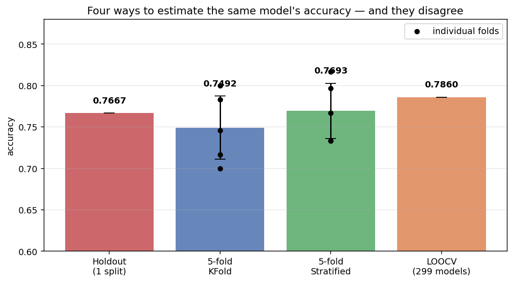
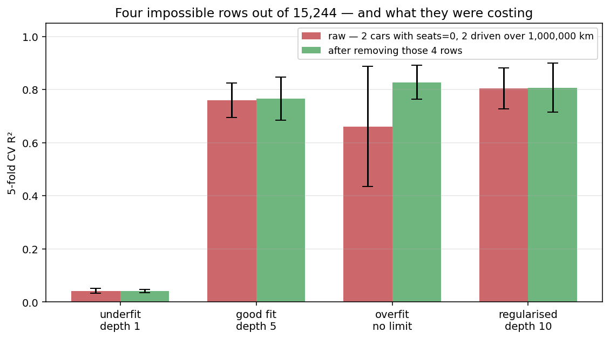
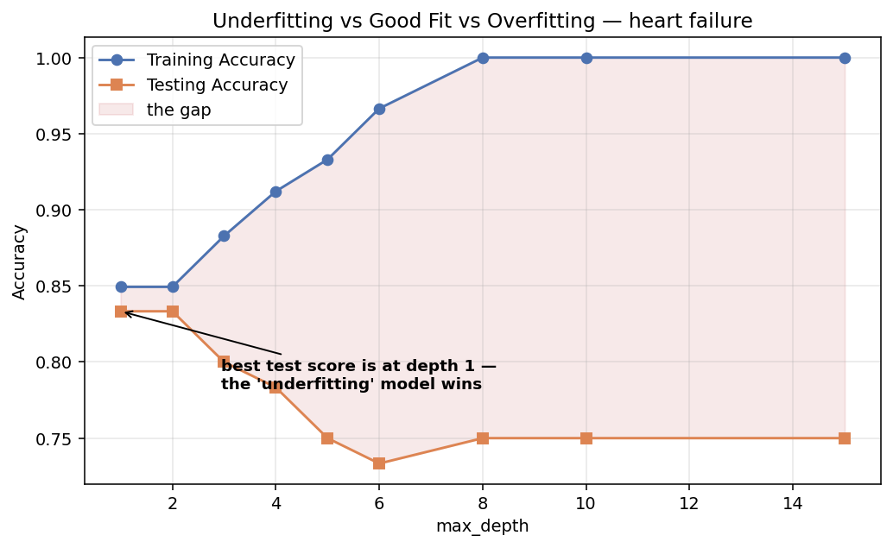

# Session 8 — Model Evaluation & Improvement

**Holdout · Cross-Validation · Bootstrapping · K-Fold · Leave-One-Out · Overfitting & Underfitting · Grid Search · Random Search · Bayesian Optimization**

| | |
|---|---|
| **Notebook** | [session-08-evaluation-tuning.ipynb](../notebooks/session-08-evaluation-tuning.ipynb) |
| **Previous** | [Session 7 — Unsupervised Learning: Clustering](session-07-unsupervised.md) |
| **Next** | [Session 9 — Deep Learning](session-09-deep-learning.md) |
| **Stuck?** | [Troubleshooting](../troubleshooting.md) |

> **In Sessions 5 and 5B you trained models and reported a number. This session asks the uncomfortable question: *was that number real?***
>
> **On the dataset used throughout this session, changing nothing but the random seed moved the accuracy from 0.7333 to 0.8500.** **Both numbers came from correct code. Only one of them would have been reported.**

---

## 🎯 Learning outcomes

By the end of this session you can:

1. Preprocess a dataset with **Session 3's sequence** before evaluating anything on it
2. Explain why a single train/test split is not a reliable estimate
3. Run holdout, k-fold, stratified k-fold, leave-one-out and bootstrap validation
4. **Say which validation strategy fits which situation**
5. Select between models with cross-validation, then evaluate the winner **once**
6. Spot the two leaks — scaling before the split, and resampling before the split — and **fix both with a pipeline**
7. Recognise underfitting and overfitting from the **train–test gap**
8. Read a validation curve and a learning curve
9. **Fix** underfitting and overfitting, deliberately
10. Distinguish parameters from hyperparameters
11. Tune with manual, grid, random and Bayesian search — and **say what each costs**
12. **Never let the test set choose a hyperparameter**

---

## How this session is organised

| Part | Question it answers |
|---|---|
| **A — [Is my number real?](#part-a--is-my-number-real)** | *How do I estimate performance honestly?* |
| **B — [Overfitting & underfitting](#part-b--overfitting--underfitting)** | *Is my model too simple, too complex, or right?* |
| **C — [Hyperparameter tuning](#part-c--hyperparameter-tuning)** | *How do I make it better, without cheating?* |

| # | Topic | | # | Topic |
|---|---|---|---|---|
| 1 | [One split is not an answer](#1-one-split-is-not-an-answer) | | 13 | [The three fits — heart failure](#13-the-three-fits--heart-failure) |
| 2 | [Holdout validation](#2-holdout-validation) | | 14 | [Validation curves](#14-validation-curves) |
| 3 | [K-Fold cross-validation](#3-k-fold-cross-validation) | | 15 | [Learning curves](#15-learning-curves) |
| 4 | [Stratified K-Fold](#4-stratified-k-fold) | | 16 | [Fixing each problem](#16-fixing-each-problem) |
| 5 | [Leave-One-Out](#5-leave-one-out-cross-validation) | | 17 | [The tuning setup](#17-the-tuning-setup) |
| 6 | [All four side by side](#6-all-four-side-by-side) | | 18 | [Parameters vs hyperparameters](#18-parameters-vs-hyperparameters) |
| 7 | [Bootstrapping](#7-bootstrapping) | | 19 | [Manual search](#19-manual-search--and-the-trap-in-it) |
| 8 | [The two leaks](#8-the-two-leaks-that-make-every-number-a-lie) | | 20 | [Grid search](#20-grid-search) |
| 9 | [Model selection with CV](#9-model-selection-with-cross-validation) | | 21 | [Random search](#21-random-search) |
| 10 | [Choosing a strategy](#10-choosing-a-validation-strategy) | | 22 | [Tuning an SVM](#22-tuning-an-svm) |
| 11 | [The three fits — car prices](#11-the-three-fits--car-prices) | | 23 | [Tuning inside a pipeline](#23-tuning-inside-a-pipeline) |
| 12 | [Reading the gap](#12-reading-the-gap) | | 24 | [Bayesian optimization](#24-bayesian-optimization) |

**Practices sit between the topics.** The [20 MCQs](#-session-8--20-mcqs) and [tasks](#-session-8--tasks) are at the end.

---

# The datasets — preprocessed the Session 3 way

**Two datasets carry this session. Neither can be used until [Session 3](session-03-eda-preprocessing.md#the-sequence)'s sequence has been run on it.**

```text
1. LOAD    2. EXPLORE    3. DUPLICATES    4. IMPOSSIBLE VALUES
5. MISSING VALUES    6. OUTLIERS    7. ENCODING    8. SPLIT    9. SCALING
```

**Steps 8 and 9 belong to the modelling code, not here** — and [§8](#8-the-two-leaks-that-make-every-number-a-lie) measures what happens when you get their order wrong.

---

## Dataset 1 — heart failure clinical records

**299 patients, 13 measurements, and whether the patient died.** **Parts A and C use it throughout.**

### Explore first

```python
import numpy as np
import pandas as pd

dataset_url = "https://raw.githubusercontent.com/tech4alltraining/aiml/refs/heads/main/datasets/classification/heart_failure_raw.csv"
heart = pd.read_csv(dataset_url)

print("shape:", heart.shape)
print("duplicate rows:", heart.duplicated().sum())
print("\nmissing:")
print(heart.isnull().sum()[heart.isnull().sum() > 0])
print("\n", heart[["age", "ejection_fraction", "serum_creatinine"]].describe().round(2))
```

**Output:**

```text
shape: (299, 14)
duplicate rows: 0

missing:
age                  15
ejection_fraction    15
serum_creatinine     15

          age  ejection_fraction  serum_creatinine
count  284.00             284.00            284.00
mean    61.50              38.28              1.55
min     40.00              14.00              0.50
max    160.00              80.00             27.00
```

**Three findings, and only the first two show up in `info()`:**

| Finding | Step that handles it |
|---|---|
| **0 duplicates** | Step 3 — nothing to do, but you checked |
| **45 missing values** | Step 5 |
| **Maximum age of 160** | **Step 4 — nobody is 160** |

### Impossible values, then missing values

**An impossible value is an error, not an extreme case.** **Convert it to `NaN` and let the imputation step deal with it** — the other thirteen measurements for those patients are perfectly good.

```python
impossible = heart["age"] > 120
print("impossible ages:", heart.loc[impossible, "age"].tolist())
heart.loc[impossible, "age"] = np.nan

for col in ["age", "ejection_fraction", "serum_creatinine"]:
    heart[col] = heart[col].fillna(heart[col].median())

print("missing now:", heart.isnull().sum().sum(), " age max now:", heart["age"].max())
```

**Output:**

```text
impossible ages: [150.0, 160.0]
missing now: 0  age max now: 95.0
```

> **Impossible values come *before* missing values in the sequence.** Do it the other way round and the errors survive imputation untouched.

### Outliers — checked, and kept

**Session 3's IQR rule flags 77 rows here, a quarter of the dataset.** **Their death rate is 46.8% against an overall 32.1%** — the "outliers" are disproportionately the patients who died. **They stay.** *(Worked through in [Session 6](session-06-augmentation-feature-engg-red.md#11-example-2--heart-failure).)*

### Encoding — `LabelEncoder`, every text column

```python
from sklearn.preprocessing import LabelEncoder

TEXT = ["anaemia", "diabetes", "high_blood_pressure", "sex", "smoking",
        "treatment_type", "DEATH_EVENT"]

le = LabelEncoder()
for col in TEXT:
    heart[col] = le.fit_transform(heart[col])
    print(f"{col:<22} {le.classes_.tolist()} -> {list(range(len(le.classes_)))}")

X = heart.drop(columns=["DEATH_EVENT"])
y = heart["DEATH_EVENT"]

print("\nX:", X.shape, " missing:", X.isnull().sum().sum())
print("class balance:", y.value_counts().to_dict())
```

**Output:**

```text
anaemia                ['No', 'Yes'] -> [0, 1]
diabetes               ['No', 'Yes'] -> [0, 1]
high_blood_pressure    ['No', 'Yes'] -> [0, 1]
sex                    ['No', 'Yes'] -> [0, 1]
smoking                ['No', 'Yes'] -> [0, 1]
treatment_type         ['Lifestyle', 'Medication', 'Other', 'Surgery'] -> [0, 1, 2, 3]
DEATH_EVENT            ['No', 'Yes'] -> [0, 1]

X: (299, 13)  missing: 0
class balance: {0: 203, 1: 96}
```

> **Print `le.classes_` every time.** **It is the only thing that tells you which way round the codes went.** Alphabetical order happens to put `'No'` first here, which is what you want — **but check, do not assume.**

⚠️ **A note on `treatment_type`.** It has four unordered categories, and Label Encoding gives them 0, 1, 2, 3 — **which implies `Surgery` is three times `Lifestyle`.** **That is not true.** Session 3's table says who is hurt by this:

| Model | Does the false order hurt? |
|---|---|
| **Decision Tree, Random Forest** | **Barely** — they can split anywhere |
| kNN, SVM | **Yes** — they measure distance |

> **Most of this session uses trees and forests, so the choice is defensible — but it is a choice, and you should be able to say why you made it.** **Dummy variables are the alternative when a distance-based model is the final answer.**

**299 rows is small, and 203 against 96 is imbalanced. Both facts matter enormously in the next few pages.**

---

## Dataset 2 — car prices

**15,244 cars, predicting `selling_price` with a decision tree.** **Part B uses it: a regression problem shows over- and underfitting far more starkly than a 299-row classification one.**

**The file is already encoded — every column is numeric. That does not mean it is clean.**

```python
cars_url = "https://raw.githubusercontent.com/tech4alltraining/aiml/refs/heads/main/datasets/regression/cardekho_preprocessed.csv"
cars = pd.read_csv(cars_url)

print("shape:", cars.shape)
print("duplicates:", cars.duplicated().sum(), " missing:", cars.isnull().sum().sum())
print(cars[["vehicle_age", "km_driven", "seats", "selling_price"]].describe().round(0))
```

**Output:**

```text
shape: (15244, 13)
duplicates: 0  missing: 0

       vehicle_age   km_driven    seats  selling_price
count      15244.0     15244.0  15244.0        15244.0
min            0.0       100.0      0.0        40000.0
50%            6.0     50000.0      5.0       559000.0
max           29.0   3800000.0      9.0     39500000.0
```

> ⚠️ **`seats` has a minimum of 0, and `km_driven` a maximum of 3,800,000.** **A car with no seats does not exist, and 3.8 million kilometres is about five return trips to the Moon.**

```python
print("cars with seats == 0        :", (cars["seats"] == 0).sum())
print("cars driven over 1,000,000km:", (cars["km_driven"] > 1_000_000).sum())

cars = cars[(cars["seats"] > 0) & (cars["km_driven"] <= 1_000_000)].reset_index(drop=True)
print("rows kept:", len(cars))
```

**Output:**

```text
cars with seats == 0        : 2
cars driven over 1,000,000km: 2
rows kept: 15240
```

**Four rows out of 15,244 — 0.03% of the data. [§12](#12-reading-the-gap) measures what they were costing.**

---

# Part A — Is my number real?

**This part follows `cross_validation.ipynb` and `k_fold_cross_validation.ipynb`: the same SVM on the same heart-failure data, evaluated five different ways, and then used to choose between four models.**

---

# 1. One split is not an answer

**The same model, the same data, the same code. The only thing that changes is `random_state` — which decides *which 60 patients* land in the test set.**

```python
from sklearn.model_selection import train_test_split
from sklearn.preprocessing import MinMaxScaler
from sklearn.pipeline import make_pipeline
from sklearn.svm import SVC

for seed in range(10):
    X_train, X_test, y_train, y_test = train_test_split(
        X, y, test_size=0.2, random_state=seed, stratify=y)
    model = make_pipeline(MinMaxScaler(), SVC()).fit(X_train, y_train)
    print(f"random_state={seed}   accuracy {model.score(X_test, y_test):.4f}")
```

**Output:**

```text
random_state=0   accuracy 0.7667
random_state=1   accuracy 0.7833
random_state=2   accuracy 0.7500
random_state=3   accuracy 0.8000
random_state=4   accuracy 0.7833
random_state=5   accuracy 0.8000
random_state=6   accuracy 0.8000
random_state=7   accuracy 0.7333
random_state=8   accuracy 0.8500
random_state=9   accuracy 0.7333
```


> **0.7333 to 0.8500 — a swing of 11.7 percentage points, from nothing but which patients happened to land in the test set.**
>
> **Both are "the accuracy". Neither is wrong. And a report that quotes one of them is not lying — it is just not saying anything reliable.**

## Why this happens

**The test set is 60 patients. One patient is worth 1.67 percentage points.** **Seven unusual patients landing in test instead of train move the number by 12 points, and nothing warns you.**

| Test set size | One row is worth |
|---|---|
| **60 rows** | **1.67 points** |
| 1,000 rows | 0.10 points |
| 100,000 rows | 0.001 points |

> **This is why small datasets need cross-validation and large ones can sometimes get away without it.** **299 rows is small.**

---

# 2. Holdout validation

**The method you already know: split once, train on one part, test on the other.**

```python
X_train, X_test, y_train, y_test = train_test_split(
    X, y, test_size=0.2, random_state=42, stratify=y)

model = make_pipeline(MinMaxScaler(), SVC()).fit(X_train, y_train)
holdout_score = model.score(X_test, y_test)
print("Holdout Method Accuracy:", round(holdout_score, 4))
```

**Output:** `Holdout Method Accuracy: 0.7667`

| | |
|---|---|
| **Cost** | **One model. The cheapest option there is** |
| **Trains on** | 80% of the data |
| **Tests on** | 20%, **once** |
| **Good for** | Large datasets, quick checks, **the final unbiased test** |
| **Bad for** | **Small datasets — as §1 just demonstrated** |

## ⚠️ `stratify=y` is not optional here

```python
a, b, c, d = train_test_split(X, y, test_size=0.2, random_state=9)
print("without stratify — test class balance:", d.value_counts().to_dict())

a, b, c, d = train_test_split(X, y, test_size=0.2, random_state=9, stratify=y)
print("with stratify    — test class balance:", d.value_counts().to_dict())
```

**Output:**

```text
without stratify — test class balance: {0: 45, 1: 15}
with stratify    — test class balance: {0: 41, 1: 19}
```

> **The full dataset is 32% positive. Without stratifying, this test set came out 25% positive** — a different problem from the one the model trained on.

---

# 3. K-Fold cross-validation

> **Instead of one split, make k of them — and let every row be in the test set exactly once.**

🧠 **Analogy: five examiners marking one script.** One examiner's mark could be harsh or generous. **Five marks, averaged, tell you far more — and the spread between them tells you how much to trust the average.**

```text
5-fold cross-validation, 299 rows:

fold 1:  [TEST ][         TRAIN          ]   -> score 1
fold 2:  [ TRAIN ][TEST][     TRAIN      ]   -> score 2
fold 3:  [    TRAIN    ][TEST][  TRAIN   ]   -> score 3
fold 4:  [        TRAIN       ][TEST][TR ]   -> score 4
fold 5:  [           TRAIN         ][TEST]   -> score 5

Five models are trained. Every row is tested exactly once.
```

```python
from sklearn.model_selection import KFold, cross_val_score

kf = KFold(n_splits=5, shuffle=True, random_state=42)
kf_scores = cross_val_score(make_pipeline(MinMaxScaler(), SVC()), X, y, cv=kf)

print(kf_scores.round(4))
print("K-Fold Cross-Validation Accuracy:", round(kf_scores.mean(), 4))
print("standard deviation              :", round(kf_scores.std(), 4))
```

**Output:**

```text
[0.7167 0.7    0.7833 0.8    0.7458]
K-Fold Cross-Validation Accuracy: 0.7492
standard deviation              : 0.038
```

> **The single holdout said 0.7667. The five folds range from 0.7000 to 0.8000, and their mean is 0.7492.**

## Reading the two numbers

| | What it tells you |
|---|---|
| **Mean** | Your best estimate of performance |
| **Standard deviation** | **How much to trust the mean** |

> **Always report both.** **"0.75 ± 0.04" is a statement. "0.77" is a claim you cannot support.**
>
> **And when comparing two models: if their means differ by less than the spread, you have not shown a difference.**

## ⚠️ `shuffle=True` matters

**Without it, `KFold` takes the rows in file order.** **If the file is sorted — by date, by class, by hospital — each fold gets a systematically different slice**, and the scores become meaningless.

```python
# illustrative: a syntax reference, not runnable as written.
KFold(n_splits=5)                                    # file order - risky
KFold(n_splits=5, shuffle=True, random_state=42)     # always prefer this
```

## How many folds?

| k | Trade-off |
|---|---|
| **3** | Fast; each model trains on only 67% of the data |
| **5** | **The usual default.** A good balance |
| **10** | Twice the cost; on 299 rows each test fold is only 30 patients, so the fold scores get *noisier* |
| **n (LOOCV)** | Maximum training data, maximum cost — see §5 |

---

# 4. Stratified K-Fold

**Plain `KFold` splits at random. On imbalanced data, that is a problem.**

**Our target is 203 negatives to 96 positives — roughly 2:1. A random fold can easily come out 3:1, and each fold is then measuring a slightly different problem.**

```python
from sklearn.model_selection import StratifiedKFold

skf = StratifiedKFold(n_splits=5, shuffle=True, random_state=42)
skf_scores = cross_val_score(make_pipeline(MinMaxScaler(), SVC()), X, y, cv=skf)

print("plain KFold      :", kf_scores.round(4),  f"mean {kf_scores.mean():.4f}  std {kf_scores.std():.4f}")
print("StratifiedKFold  :", skf_scores.round(4), f"mean {skf_scores.mean():.4f}  std {skf_scores.std():.4f}")
```

**Output:**

```text
plain KFold      : [0.7167 0.7    0.7833 0.8    0.7458] mean 0.7492  std 0.038
StratifiedKFold  : [0.7333 0.7333 0.7667 0.8167 0.7966] mean 0.7693  std 0.0334
```

## And it gets worse on the training half alone

**`k_fold_cross_validation.ipynb` cross-validates inside `X_train` — 239 rows instead of 299. Watch what happens.**

```python
kf_train = cross_val_score(make_pipeline(MinMaxScaler(), SVC()), X_train, y_train, cv=kf)
skf_train = cross_val_score(make_pipeline(MinMaxScaler(), SVC()), X_train, y_train, cv=skf)

print("y_train balance:", y_train.value_counts().to_dict())
print("KFold      :", kf_train.round(4),  f"mean {kf_train.mean():.4f}")
print("Stratified :", skf_train.round(4), f"mean {skf_train.mean():.4f}")
```

**Output:**

```text
y_train balance: {0: 162, 1: 77}
KFold      : [0.6667 0.8958 0.6875 0.7917 0.7234] mean 0.7530
Stratified : [0.7292 0.8125 0.7708 0.7708 0.8723] mean 0.7911
```

> **Look at plain `KFold`: 0.6667 in one fold and 0.8958 in another — a 23-point range on the same model and the same data.**
>
> **That variation is not telling you anything about the model.** It is telling you that the 162/77 class balance drifted between folds. **Stratifying removes it.**

> ✅ **Rule: for classification, always use `StratifiedKFold`.** **`cross_val_score` uses it automatically when you pass `cv=5` with a classifier** — but write it explicitly so a reader can see the decision was made.

---

# 5. Leave-One-Out cross-validation

> **k-fold taken to its extreme: k = n. Every single row gets its own turn as the entire test set.**

**With 299 patients, that means training 299 models, each on 298 rows.**

```python
from sklearn.model_selection import LeaveOneOut

loo = LeaveOneOut()
loo_scores = cross_val_score(make_pipeline(MinMaxScaler(), SVC()), X, y, cv=loo, n_jobs=-1)

print("models trained:", len(loo_scores))
print("Leave-One-Out Cross-Validation Accuracy:", round(loo_scores.mean(), 4))
```

**Output:**

```text
models trained: 299
Leave-One-Out Cross-Validation Accuracy: 0.786
```

> **Each individual "score" is either 0 or 1** — one patient is either classified correctly or not. **The mean over all 299 is the useful number.**

| | |
|---|---|
| ✅ **Maximum training data** | Every model sees 298 of 299 rows |
| ✅ **No randomness at all** | There is only one way to leave one out. **Run it twice, get the same answer** |
| ❌ **Cost** | **n models.** 299 here; 100,000 on a large dataset |
| ❌ **Correlated estimates** | The 299 models are almost identical to each other, so their errors are not independent |

> **Use LOOCV when the dataset is genuinely tiny** — a few dozen rows, where holding out 20% would leave nothing to test on. **Otherwise 5- or 10-fold gives a comparable answer for a fraction of the cost.**

---

# 6. All four side by side

**This is `cross_validation.ipynb`'s central cell — one model, four ways of measuring it.**

```python
print("Holdout Method Accuracy          :", round(holdout_score, 4))
print("Leave-One-Out CV Accuracy        :", round(loo_scores.mean(), 4))
print("K-Fold CV Accuracy (k=5)         :", round(kf_scores.mean(), 4))
print("Stratified K-Fold CV Accuracy    :", round(skf_scores.mean(), 4))
```

**Output:**

```text
Holdout Method Accuracy          : 0.7667
Leave-One-Out CV Accuracy        : 0.786
K-Fold CV Accuracy (k=5)         : 0.7492
Stratified K-Fold CV Accuracy    : 0.7693
```



**Four numbers for one model, spanning 3.7 percentage points.**

| Method | Score | Models trained | Why it differs |
|---|---|---|---|
| **Holdout** | 0.7667 | **1** | One arbitrary split — could have been anything from §1's range |
| **LOOCV** | **0.7860** | **299** | **Highest, because each model trains on 298 rows instead of 239** |
| **K-Fold** | 0.7492 | 5 | Lowest — the class balance drifted between folds |
| **Stratified** | 0.7693 | 5 | **The one to trust: same fold sizes, same class balance** |

> **More training data raises the score** — that is why LOOCV is highest and holdout, which trains on the least, is not far behind only by luck.
>
> **None of these four is "the" accuracy.** **The honest sentence is "roughly 0.77, and the method you use moves it by about 4 points."**

---

# 7. Bootstrapping

> **Sample rows *with replacement* to build a new training set of the same size, and test on whatever was left out.**

🧠 **Analogy: drawing names from a hat and putting each one back.** **Some names get drawn twice, some not at all.** The ones never drawn are your test set.

**On average each bootstrap sample contains about 63.2% of the unique rows, leaving roughly 36.8% over.** **Those left-over rows are called *out-of-bag*, and they are free test data.**

```python
rng = np.random.default_rng(42)
n = len(X)
boot_scores = []

for _ in range(200):
    idx = rng.integers(0, n, n)                       # sample WITH replacement
    oob = np.setdiff1d(np.arange(n), np.unique(idx))  # rows never drawn
    model = make_pipeline(MinMaxScaler(), SVC()).fit(X.iloc[idx], y.iloc[idx])
    boot_scores.append(model.score(X.iloc[oob], y.iloc[oob]))

boot_scores = np.array(boot_scores)
print(f"mean accuracy   {boot_scores.mean():.4f}")
print(f"95% interval    [{np.percentile(boot_scores, 2.5):.4f}, "
      f"{np.percentile(boot_scores, 97.5):.4f}]")
```

**Output:**

```text
mean accuracy   0.7563
95% interval    [0.6786, 0.8215]
```

> **This is what bootstrapping gives you that k-fold does not: a *confidence interval*.**
>
> **"Accuracy is 0.76, and 95% of the time it lands between 0.68 and 0.82."** **That is a far more honest sentence than "accuracy is 0.77"** — and notice the interval covers almost exactly the range the ten random seeds produced in §1.

| | |
|---|---|
| ✅ **Gives a confidence interval**, not a point estimate | |
| ✅ Works on very small datasets | |
| ❌ Training rows are duplicated | Which slightly biases some models |
| ❌ Expensive | 200 models here |

> **You have already used bootstrapping without knowing it: a Random Forest bootstraps its rows for every tree.** **That is where the "bagging" in bagged trees comes from.**

---

# 8. The two leaks that make every number a lie

**Every number above used `make_pipeline(MinMaxScaler(), SVC())` rather than scaling first. That was deliberate.**

**The trainer notebooks scale like this:**

```python
# illustrative: this is what NOT to do.
scaler = MinMaxScaler()
scaler.fit(X)              # <- sees every row, including the test rows
X = scaler.transform(X)
```

## Leak 1 — scaling before the split

```python
X_scaled_all = MinMaxScaler().fit_transform(X)
leaky = cross_val_score(SVC(), X_scaled_all, y, cv=skf)

correct = cross_val_score(make_pipeline(MinMaxScaler(), SVC()), X, y, cv=skf)

print("leaky  :", round(leaky.mean(), 4))
print("correct:", round(correct.mean(), 4))
```

**Output:**

```text
leaky  : 0.776
correct: 0.7693
```

> **The gap is small — 0.7 of a point — and that is exactly what makes it dangerous.**
>
> **`MinMaxScaler` uses each column's minimum and maximum, so a single extreme test-set patient shifts the scaling of every training row.** **A leak does not reliably inflate your score, so you cannot detect one by looking for a suspiciously high number.** The result is simply *not the number you think it is*.

## Leak 2 — resampling before the split

**`hyperparameter_session.ipynb` applies SMOTE to the whole dataset and then splits. This one is far more serious.**

```python
# needs-install: pip install imbalanced-learn
from imblearn.over_sampling import SMOTE

X_res, y_res = SMOTE(random_state=42).fit_resample(X, y)     # BEFORE the split
a, b, c, d = train_test_split(X_res, y_res, test_size=0.2, random_state=42)

original_rows = set(map(tuple, X.to_numpy()))
synthetic_in_test = sum(1 for row in b.to_numpy() if tuple(row) not in original_rows)

print("rows before SMOTE:", len(X), " after:", len(X_res))
print(f"test rows: {len(b)}, of which SYNTHETIC: {synthetic_in_test} "
      f"({synthetic_in_test / len(b):.0%})")
```

**Output:**

```text
rows before SMOTE: 299  after: 406
test rows: 82, of which SYNTHETIC: 19 (23%)
```

> **23% of the test set is invented data** — each synthetic row interpolated from real patients, most of whom are now sitting in the training set.
>
> **You are testing the model on rows built out of its own training data.** **Whatever number comes out is not an estimate of anything.**

**The fix — split first, then resample the training half only:**

```python
from imblearn.over_sampling import SMOTE

X_bal, y_bal = SMOTE(random_state=42).fit_resample(X_train, y_train)   # TRAIN only

print("train rows:", len(X_train), "->", len(X_bal))
print("balance now:", y_bal.value_counts().to_dict())

model = make_pipeline(MinMaxScaler(), SVC()).fit(X_bal, y_bal)
print("honest test accuracy:", round(model.score(X_test, y_test), 4))
```

**Output:**

```text
train rows: 239 -> 324
balance now: {0: 162, 1: 162}
honest test accuracy: 0.8167
```

> **This is [Session 6](session-06-augmentation-feature-engg-red.md#3-why-use-augmentation)'s rule, restated: augment the training set, never the test set.** **[Part C](#17-the-tuning-setup) uses this corrected order throughout.**

## The one habit that prevents both

> **Put every step that *learns something from the data* inside a `Pipeline`, and let cross-validation drive the pipeline.**

```python
from sklearn.pipeline import Pipeline

pipe = Pipeline([
    ("scaler", MinMaxScaler()),      # learns min and max      -> must be inside
    ("model", SVC()),                # learns everything else  -> must be inside
])
scores = cross_val_score(pipe, X, y, cv=skf)
print(round(scores.mean(), 4))
```

**Scaling, imputation, encoding, feature selection and PCA all learn from data.** **All of them belong inside the pipeline. Structure beats discipline.**

---

# 9. Model selection with cross-validation

**Now the payoff. `k_fold_cross_validation.ipynb` ends by using cross-validation to *choose between models* — which is what it is really for.**

```python
from sklearn.neighbors import KNeighborsClassifier
from sklearn.ensemble import RandomForestClassifier
from sklearn.naive_bayes import GaussianNB

models = {
    "SVM": SVC(random_state=42),
    "KNN": KNeighborsClassifier(),
    "Random Forest": RandomForestClassifier(random_state=42),
    "Gaussian Naive Bayes": GaussianNB(),
}

cv_scores = {}
for name, model in models.items():
    scores = cross_val_score(make_pipeline(MinMaxScaler(), model), X_train, y_train, cv=skf)
    cv_scores[name] = scores.mean()
    print(f"{name:<22} {scores.mean():.4f}  +/- {scores.std():.4f}")

best_model_name = max(cv_scores, key=cv_scores.get)
print(f"\nBest Model: {best_model_name} with CV Mean Accuracy: {cv_scores[best_model_name]:.4f}")
```

**Output:**

```text
SVM                    0.7911  +/- 0.0484
KNN                    0.7158  +/- 0.0557
Random Forest          0.8413  +/- 0.0532
Gaussian Naive Bayes   0.7785  +/- 0.0619

Best Model: Random Forest with CV Mean Accuracy: 0.8413
```

> ⚠️ **Read the spreads before declaring a winner.** **Random Forest 0.8413 ± 0.0532 against SVM 0.7911 ± 0.0484: those intervals overlap.** **On 239 training rows this is a real result but not an overwhelming one** — which is exactly why you report the spread.
>
> **Notice the test set has not been touched.** All four models were compared on cross-validated *training* data.

## Now train the winner and evaluate it — once

```python
from sklearn.metrics import accuracy_score, confusion_matrix, classification_report

final_model = make_pipeline(MinMaxScaler(), models[best_model_name]).fit(X_train, y_train)
y_pred = final_model.predict(X_test)

print("Test accuracy:", round(accuracy_score(y_test, y_pred), 4))
print("Confusion Matrix:")
print(confusion_matrix(y_test, y_pred))
print(classification_report(y_test, y_pred))
```

**Output:**

```text
Test accuracy: 0.8

Confusion Matrix:
[[38  3]
 [ 9 10]]

              precision    recall  f1-score   support
           0       0.81      0.93      0.86        41
           1       0.77      0.53      0.62        19
    accuracy                           0.80        60
   macro avg       0.79      0.73      0.74        60
weighted avg       0.80      0.80      0.79        60
```

> ⚠️ **Do not stop at "0.80". Read the row for class 1.**
>
> **Recall 0.53. The model found 10 of the 19 patients who died and missed 9 of them.** **Session 5B's lesson, arriving in a real workflow:** accuracy 0.80 sounds respectable, and for a clinical tool this model is close to useless.
>
> **That is a class-imbalance problem, and [Part C](#17-the-tuning-setup) attacks it with SMOTE and tuning.**

---

# 10. Choosing a validation strategy

| Strategy | Models trained | Gives you | Use it when |
|---|---|---|---|
| **Holdout** | **1** | One number | **Large data**, or the final untouched test |
| **K-Fold (k=5)** | 5 | Mean ± spread | **The default for everything else** |
| **Stratified K-Fold** | 5 | Mean ± spread | **Always, for classification** |
| **LOOCV** | **n** | A stable mean | **Very small data** (tens of rows) |
| **Bootstrap** | 100–1000 | **A confidence interval** | You need to state uncertainty |

## The three-way split, for when you tune

```text
Full data
├── TRAIN      -> fit the model
├── VALIDATION -> choose hyperparameters        (cross-validation lives here)
└── TEST       -> touched ONCE, at the very end
```

> **The test set exists to answer one question, once: *how will this do on data it has never seen?*** **Every time you look at it and change something, it becomes a little more like a training set** — and its answer becomes a little less true.

## ✏️ Practice — validation strategies

1. Run the holdout with `random_state` 0…9 and report the min, max and mean. **How large is the swing?**
2. Compare 3-fold, 5-fold and 10-fold cross-validation. **Report mean and standard deviation for each. Does more folds mean a better estimate?**
3. Run plain `KFold` and `StratifiedKFold` on `X_train`. **Which has the smaller spread, and what does that variation actually measure?**
4. Run all four methods from §6 in one cell. **Why is LOOCV the highest?**
5. Run 200 bootstraps and report a 95% confidence interval. **Write the one-sentence honest summary you would put in a report.**
6. Compare four models by CV, pick the best, and evaluate it once on the test set. **Report the classification report and say whether you would deploy it.**

<details><summary>Solutions</summary>

```python
import time
import numpy as np, pandas as pd
from sklearn.preprocessing import MinMaxScaler, LabelEncoder
from sklearn.model_selection import (train_test_split, cross_val_score, KFold,
                                     StratifiedKFold, LeaveOneOut)
from sklearn.pipeline import make_pipeline
from sklearn.svm import SVC
from sklearn.neighbors import KNeighborsClassifier
from sklearn.ensemble import RandomForestClassifier
from sklearn.naive_bayes import GaussianNB
from sklearn.metrics import accuracy_score, classification_report

dataset_url = ("https://raw.githubusercontent.com/tech4alltraining/aiml/"
               "refs/heads/main/datasets/classification/heart_failure_raw.csv")
heart = pd.read_csv(dataset_url)
heart.loc[heart["age"] > 120, "age"] = np.nan                # impossible -> gap
for c in ["age", "ejection_fraction", "serum_creatinine"]:
    heart[c] = heart[c].fillna(heart[c].median())
le = LabelEncoder()
for c in ["anaemia", "diabetes", "high_blood_pressure", "sex", "smoking",
          "treatment_type", "DEATH_EVENT"]:
    heart[c] = le.fit_transform(heart[c])
X = heart.drop(columns=["DEATH_EVENT"]); y = heart["DEATH_EVENT"]
pipe = lambda m=None: make_pipeline(MinMaxScaler(), m or SVC())
X_train, X_test, y_train, y_test = train_test_split(
    X, y, test_size=.2, random_state=42, stratify=y)

acc = []                                                               # 1
for s in range(10):
    a, b, c, d = train_test_split(X, y, test_size=.2, random_state=s, stratify=y)
    acc.append(pipe().fit(a, c).score(b, d))
print(f"min {min(acc):.4f}  max {max(acc):.4f}  mean {np.mean(acc):.4f}"
      f"  swing {max(acc)-min(acc):.4f}")
# About 12 points of swing from the seed alone. Never quote one split.

for k in [3, 5, 10]:                                                   # 2
    s = cross_val_score(pipe(), X, y,
                        cv=StratifiedKFold(k, shuffle=True, random_state=42))
    print(f"{k:>2}-fold  mean {s.mean():.4f}  std {s.std():.4f}")
# The mean barely moves. The std does NOT reliably shrink with more folds:
# at k=10 each test fold is only 30 patients, so individual fold scores
# get noisier even as the mean stabilises. 5 is the sensible default.

a = cross_val_score(pipe(), X_train, y_train,                          # 3
                    cv=KFold(5, shuffle=True, random_state=42))
b = cross_val_score(pipe(), X_train, y_train,
                    cv=StratifiedKFold(5, shuffle=True, random_state=42))
print("KFold     :", a.round(4), f"mean {a.mean():.4f}")
print("Stratified:", b.round(4), f"mean {b.mean():.4f}")
# Plain KFold swings from 0.6667 to 0.8958 - a 23-point range. That
# variation measures the SPLIT, not the model: the 162/77 class balance
# drifted between folds. Stratifying removes it.

print("holdout   :", round(pipe().fit(X_train, y_train)                # 4
                            .score(X_test, y_test), 4))
loo = cross_val_score(pipe(), X, y, cv=LeaveOneOut(), n_jobs=-1)
print("LOOCV     :", round(loo.mean(), 4))
print("KFold     :", round(cross_val_score(pipe(), X, y,
      cv=KFold(5, shuffle=True, random_state=42)).mean(), 4))
print("Stratified:", round(cross_val_score(pipe(), X, y,
      cv=StratifiedKFold(5, shuffle=True, random_state=42)).mean(), 4))
# LOOCV is highest because each of its 299 models trains on 298 rows,
# while each 5-fold model trains on 239. More training data, better score.

rng = np.random.default_rng(42); n = len(X); boot = []                 # 5
for _ in range(200):
    idx = rng.integers(0, n, n)
    oob = np.setdiff1d(np.arange(n), np.unique(idx))
    boot.append(pipe().fit(X.iloc[idx], y.iloc[idx]).score(X.iloc[oob], y.iloc[oob]))
boot = np.array(boot)
print(f"mean {boot.mean():.4f}  95% CI "
      f"[{np.percentile(boot, 2.5):.4f}, {np.percentile(boot, 97.5):.4f}]")
# HONEST SUMMARY: "The model classifies about 76% of patients correctly.
# Across 200 bootstrap resamples the accuracy fell between 68% and 82%,
# so on a dataset this small a single figure should not be trusted to
# better than about +/- 7 points."

skf = StratifiedKFold(5, shuffle=True, random_state=42)                # 6
models = {"SVM": SVC(random_state=42), "KNN": KNeighborsClassifier(),
          "Random Forest": RandomForestClassifier(random_state=42),
          "Gaussian Naive Bayes": GaussianNB()}
cvs = {}
for nm, m in models.items():
    s = cross_val_score(make_pipeline(MinMaxScaler(), m), X_train, y_train, cv=skf)
    cvs[nm] = s.mean(); print(f"{nm:<22} {s.mean():.4f} +/- {s.std():.4f}")
best = max(cvs, key=cvs.get)
final = make_pipeline(MinMaxScaler(), models[best]).fit(X_train, y_train)
print("\\nbest:", best, "| test acc:",
      round(accuracy_score(y_test, final.predict(X_test)), 4))
print(classification_report(y_test, final.predict(X_test)))
# Random Forest wins CV and scores 0.80 on test - but its RECALL on the
# patients who died is only 0.53. It misses 9 of 19 deaths. NO, I would
# not deploy it: for a clinical tool, a miss is the expensive error and
# accuracy is the wrong headline number.
```
</details>

---

# Part B — Overfitting & underfitting

**Part A was about measuring honestly. Part B is about what the measurement tells you to *do*.**

**This part follows `overfitting_underfitting.ipynb`, which uses two datasets — car prices and heart failure — and it is the contrast between them that carries the lesson.**

---

# 11. The three fits — car prices

🧠 **Analogy: a student preparing for an exam.**
>
> - **The student who skims one chapter** fails the practice questions *and* the exam. **Underfitting.**
> - **The student who memorises last year's paper word for word** scores 100% on last year's paper and fails the new one. **Overfitting.**
> - **The student who understands the subject** does well on both. **A good fit.**

**Here are all three, built deliberately — and scored with 5-fold cross-validation rather than one split, for the reason §1 gave.**

```python
from sklearn.model_selection import cross_validate, KFold
from sklearn.tree import DecisionTreeRegressor

kf5 = KFold(n_splits=5, shuffle=True, random_state=42)

def fit_and_score(features, **tree_settings):
    result = cross_validate(
        DecisionTreeRegressor(random_state=42, **tree_settings),
        cars[features], cars["selling_price"],
        cv=kf5, scoring="r2", return_train_score=True, n_jobs=-1)
    return result["train_score"].mean(), result["test_score"].mean()
```

## Model 1 — underfitting

**One feature, and a tree allowed exactly one split.**

```python
train_r2, cv_r2 = fit_and_score(["vehicle_age"], max_depth=1)
print(f"UNDERFIT   train R² {train_r2:.4f}   CV R² {cv_r2:.4f}   gap {train_r2-cv_r2:+.4f}")
```

**Output:** `UNDERFIT   train R² 0.0400   CV R² 0.0414   gap -0.0014`

> **The model explains 4% of the variation in price. It cannot even fit the data it was trained on.**
>
> **Notice the gap is essentially zero, and CV is slightly *higher* than train.** **That is the signature of underfitting: the model is equally bad everywhere.**

## Model 2 — a good fit

**Four sensible features, a depth limit of 5, and at least 10 cars per leaf.**

```python
train_r2, cv_r2 = fit_and_score(
    ["vehicle_age", "km_driven", "engine", "max_power"],
    max_depth=5, min_samples_leaf=10)
print(f"GOOD FIT   train R² {train_r2:.4f}   CV R² {cv_r2:.4f}   gap {train_r2-cv_r2:+.4f}")
```

**Output:** `GOOD FIT   train R² 0.8057   CV R² 0.7652   gap +0.0406`

> **High on both, and a gap of 4 points.**

## Model 3 — overfitting

**Six features and a tree with no limits at all — it can keep splitting until every leaf holds one car.**

```python
train_r2, cv_r2 = fit_and_score(
    ["vehicle_age", "km_driven", "mileage", "engine", "max_power", "seats"],
    max_depth=None, min_samples_leaf=1)
print(f"OVERFIT    train R² {train_r2:.4f}   CV R² {cv_r2:.4f}   gap {train_r2-cv_r2:+.4f}")
```

**Output:** `OVERFIT    train R² 0.9993   CV R² 0.8276   gap +0.1717`


## ⚠️ Read that third result again

**Train 0.9993. The model has memorised the price of essentially every car it was shown.**

**And its cross-validated score is 0.8276 — the *highest of the three*.**

> **This is not the result the textbook promises, and it is worth understanding rather than hiding.**
>
> **With 15,240 rows and 6 features, a deep tree has enough data that memorising still generalises reasonably.** **The gap of +0.17 correctly says "this model is memorising". It does not say "this model is worse".**
>
> **Those are two different questions, and the gap only answers the first one.**

## Overfitting is capacity *relative to data volume*

**Take exactly the same unrestricted tree and give it less data.**

```python
FEATURES = ["vehicle_age", "km_driven", "mileage", "engine", "max_power", "seats"]

for n in [300, 1000, 3000, len(cars)]:
    subset = cars.sample(n=n, random_state=42) if n < len(cars) else cars
    deep = cross_validate(DecisionTreeRegressor(random_state=42),
                          subset[FEATURES], subset["selling_price"],
                          cv=kf5, scoring="r2", return_train_score=True, n_jobs=-1)
    shallow = cross_validate(DecisionTreeRegressor(max_depth=5, min_samples_leaf=10,
                                                   random_state=42),
                             subset[FEATURES], subset["selling_price"],
                             cv=kf5, scoring="r2", n_jobs=-1)
    print(f"n={n:>6}   unlimited: train {deep['train_score'].mean():.4f} "
          f"CV {deep['test_score'].mean():>7.4f}   |   depth 5: CV {shallow['test_score'].mean():.4f}")
```

**Output:**

```text
n=   300   unlimited: train 0.9998 CV  0.4080   |   depth 5: CV 0.5932
n=  1000   unlimited: train 1.0000 CV -0.2062   |   depth 5: CV 0.4667
n=  3000   unlimited: train 0.9999 CV  0.6678   |   depth 5: CV 0.4823
n= 15240   unlimited: train 0.9993 CV  0.8276   |   depth 5: CV 0.7662
```

> **At 1,000 rows the unrestricted tree scores CV R² of −0.21 — *worse than predicting the average price for every car*.** Train was 1.0000.
>
> **Same algorithm. Same features. Only the number of rows changed.**
>
> **This is the honest definition:** **overfitting is not a property of a model. It is a relationship between a model's capacity and the amount of data you have.** **A depth limit that is essential at 1,000 rows is unnecessary at 15,000.**

---

# 12. Reading the gap

| | Train | CV | Gap | Diagnosis |
|---|---|---|---|---|
| **Underfit** | 0.0400 | 0.0414 | **−0.00** | **Both low. Model too simple** |
| **Good fit** | 0.8057 | 0.7652 | **+0.04** | **Both decent, small gap** |
| **Overfit** | 0.9993 | 0.8276 | **+0.17** | **Train near-perfect, gap wide** |

> **The single most useful habit in this session: print the train score alongside the validation score, every time.**
>
> **The validation score alone cannot tell you what is wrong.** **A CV R² of 0.41 could be underfitting or overfitting** — and the fix for one is the exact opposite of the fix for the other. **The gap is what distinguishes them.**

| What you see | Diagnosis | What to do |
|---|---|---|
| Train **low**, CV **low** | **Underfitting** | **Add** complexity, features, or training time |
| Train **high**, CV **high**, small gap | **Good fit** | Ship it |
| Train **high**, CV **lower**, wide gap | **Overfitting** | **Remove** capacity; add data; regularise |
| Train **low**, CV **high** | Usually a bug — or a lucky split | Check your split |

## ⚠️ What four impossible rows were costing

**Remember the two cars with `seats = 0` and the two driven over a million kilometres. Here is the same table computed with and without them.**



| Model | **Raw** CV R² | **Cleaned** CV R² | Raw fold-to-fold spread |
|---|---|---|---|
| underfit | 0.0421 | 0.0414 | 0.009 |
| good fit | 0.7605 | 0.7652 | 0.065 |
| **overfit** | **0.6612** | **0.8276** | **0.227** |
| regularised | 0.8045 | 0.8069 | 0.077 |

> **Four rows out of 15,244 — 0.03% of the data — were worth 0.17 of R² to the deepest model, and were tripling its fold-to-fold spread.**
>
> **Why the deepest model most?** **A tree with no depth limit will happily build a branch for a single 3.8-million-kilometre car.** Whichever fold that car lands in gets a wild prediction, and R² punishes it heavily.
>
> **This is why Session 3's sequence comes before any of this.** **You cannot evaluate a model honestly on data you have not checked.**

---

# 13. The three fits — heart failure

**`overfitting_underfitting.ipynb` runs the same experiment on the heart failure data with a `DecisionTreeClassifier`. Watch how different 239 training rows look.**

```python
from sklearn.tree import DecisionTreeClassifier
from sklearn.metrics import accuracy_score, f1_score

configs = [
    ("Underfitting (depth=1)", dict(max_depth=1)),
    ("Good fit (depth=3)",     dict(max_depth=3, min_samples_leaf=10)),
    ("Overfitting (no limit)", dict(max_depth=None, min_samples_leaf=1)),
]

results = []
for name, settings in configs:
    model = DecisionTreeClassifier(random_state=42, **settings).fit(X_train, y_train)
    train_acc = accuracy_score(y_train, model.predict(X_train))
    test_acc = accuracy_score(y_test, model.predict(X_test))
    results.append({"Model": name, "Train Accuracy": round(train_acc, 4),
                    "Test Accuracy": round(test_acc, 4),
                    "Gap": round(train_acc - test_acc, 4),
                    "F1 (deaths)": round(f1_score(y_test, model.predict(X_test)), 4)})

results_df = pd.DataFrame(results)
print("\nFinal Comparison:")
print(results_df.to_string(index=False))
```

**Output:**

```text
Final Comparison:
                 Model  Train Accuracy  Test Accuracy     Gap  F1 (deaths)
Underfitting (depth=1)          0.8494         0.8333  0.0160       0.6667
    Good fit (depth=3)          0.8828         0.8000  0.0828       0.5714
Overfitting (no limit)          1.0000         0.7500  0.2500       0.5946
```

```python
import matplotlib.pyplot as plt

plt.figure(figsize=(8, 5))
plt.plot(results_df["Model"], results_df["Train Accuracy"], marker="o", label="Training Accuracy")
plt.plot(results_df["Model"], results_df["Test Accuracy"], marker="o", label="Testing Accuracy")
plt.xlabel("Model Type"); plt.ylabel("Accuracy")
plt.title("Underfitting vs Good Fit vs Overfitting")
plt.xticks(rotation=20); plt.legend(); plt.grid(True); plt.tight_layout()
plt.show()
```



## ⚠️ The "underfitting" model won

**Depth 1 — a tree with a single split — has the best test accuracy (0.8333) and the best F1 on the patients who died (0.6667).**

**It also beat the Random Forest from [§9](#9-model-selection-with-cross-validation), which scored 0.8000.**

> **The labels in that table are the trainer's hypotheses, not verdicts.** **A model with a 1.6-point gap and the best test score is not underfitting — it is the right size for 239 rows.**
>
> **Compare the two datasets:**
>
> | | Rows | Unrestricted tree, train | Unrestricted tree, test | Gap |
> |---|---|---|---|---|
> | **Car prices** | 15,240 | 0.9993 | **0.8276** | **+0.17** |
> | **Heart failure** | **239** | 1.0000 | **0.7500** | **+0.25** |
>
> **Same algorithm, same "no limits" setting.** **Overfitting bites on the small dataset and barely on the large one — exactly as §11 measured.**

## But *why* does one split get 83%?

**A tree with one split uses exactly one column. Which one?**

```python
from sklearn.tree import export_text

stump = DecisionTreeClassifier(max_depth=1, random_state=42).fit(X_train, y_train)
print(export_text(stump, feature_names=list(X.columns)))
```

**Output:**

```text
|--- time <= 73.50
|   |--- class: 1
|--- time >  73.50
|   |--- class: 0
```

**`time` is the follow-up period in days. Let us look at it.**

```python
print("correlation with DEATH_EVENT:", round(heart[["time", "DEATH_EVENT"]].corr().iloc[0, 1], 4))
print("mean follow-up, died     :", round(heart.loc[heart.DEATH_EVENT == 1, "time"].mean(), 1))
print("mean follow-up, survived :", round(heart.loc[heart.DEATH_EVENT == 0, "time"].mean(), 1))
```

**Output:**

```text
correlation with DEATH_EVENT: -0.527
mean follow-up, died     : 70.9
mean follow-up, survived : 158.3
```

## ⚠️ `time` is an outcome artefact

> **Follow-up stopped early *because the patient died*.** **The column is not a predictor of death — it is partly a record of it.**

**Remove it and see what the models are actually worth:**

```python
X_no_time = X.drop(columns=["time"])

for label, data in [("with time   ", X), ("without time", X_no_time)]:
    stump_cv = cross_val_score(DecisionTreeClassifier(max_depth=1, random_state=42),
                               data, y, cv=skf).mean()
    forest_cv = cross_val_score(make_pipeline(MinMaxScaler(),
                                RandomForestClassifier(random_state=42)), data, y, cv=skf).mean()
    print(f"{label}   one-split tree {stump_cv:.4f}   Random Forest {forest_cv:.4f}")
```

**Output:**

```text
with time      one-split tree 0.8394   Random Forest 0.8360
without time   one-split tree 0.6889   Random Forest 0.6889
```

> **Every model in this session drops from ~0.84 to 0.69 when `time` is removed** — and 0.69 is close to the rate you get by always predicting "survived".
>
> **The entire apparent skill of these models is one leaky column.**
>
> **No amount of cross-validation catches this.** **Every method in Part A is scrupulously correct here and every one of them is measuring a column that would not be available when a real prediction is needed.** **The only defence is knowing what your columns mean.**

**We keep `time` for the rest of this session, because the point of Parts B and C is the machinery rather than the medicine — but now you know what the numbers rest on.**

## ✏️ Practice — diagnosing the fit

1. Build all three car models with 5-fold CV and print train, CV and gap. **Which number diagnoses the problem?**
2. Run the unrestricted tree on 300, 1,000, 3,000 and all rows. **At which size is its CV score worse than predicting the mean, and what does that tell you about what overfitting is?**
3. Compare CV scores on the raw and cleaned car data. **Which model suffered most from the four impossible rows, and why that one?**
4. Build the three heart-failure trees and print the comparison table and the plot. **Which model wins, and does the label match the result?**
5. Print the depth-1 tree with `export_text`. **Which column does it use? Investigate it and say whether the model should be trusted.**

<details><summary>Solutions</summary>

```python
import numpy as np, pandas as pd
import matplotlib; matplotlib.use("Agg")
import matplotlib.pyplot as plt
from sklearn.model_selection import cross_validate, cross_val_score, KFold, StratifiedKFold, train_test_split
from sklearn.tree import DecisionTreeRegressor, DecisionTreeClassifier, export_text
from sklearn.preprocessing import LabelEncoder, MinMaxScaler
from sklearn.pipeline import make_pipeline
from sklearn.ensemble import RandomForestClassifier
from sklearn.metrics import accuracy_score, f1_score

cars_url = ("https://raw.githubusercontent.com/tech4alltraining/aiml/"
            "refs/heads/main/datasets/regression/cardekho_preprocessed.csv")
raw = pd.read_csv(cars_url)
cars = raw[(raw["seats"] > 0) & (raw["km_driven"] <= 1_000_000)].reset_index(drop=True)
FE = ["vehicle_age", "km_driven", "mileage", "engine", "max_power", "seats"]
kf5 = KFold(5, shuffle=True, random_state=42)

def cv(df, feats, **kw):                                               # 1
    r = cross_validate(DecisionTreeRegressor(random_state=42, **kw), df[feats],
                       df["selling_price"], cv=kf5, scoring="r2",
                       return_train_score=True, n_jobs=-1)
    return r["train_score"].mean(), r["test_score"].mean(), r["test_score"].std()

for nm, f, kw in [("underfit", ["vehicle_age"], dict(max_depth=1)),
                  ("good fit", ["vehicle_age", "km_driven", "engine", "max_power"],
                   dict(max_depth=5, min_samples_leaf=10)),
                  ("overfit ", FE, dict(max_depth=None, min_samples_leaf=1))]:
    tr, te, _ = cv(cars, f, **kw)
    print(f"{nm}  train {tr:.4f}  cv {te:.4f}  gap {tr-te:+.4f}")
# The GAP diagnoses it. CV alone cannot separate underfitting (0.04) from
# overfitting - and the fixes are opposites.

for n in [300, 1000, 3000, len(cars)]:                                 # 2
    sub = cars.sample(n=n, random_state=42) if n < len(cars) else cars
    tr, te, _ = cv(sub, FE)
    print(f"n={n:>6}  train {tr:.4f}  cv {te:>8.4f}")
# At n=1000 CV R2 is about -0.21: WORSE than predicting the mean price
# for every car, while train is 1.0000. Overfitting is not a property of
# a model - it is capacity RELATIVE to how much data you have.

for nm, f, kw in [("good fit", ["vehicle_age", "km_driven", "engine", "max_power"],  # 3
                   dict(max_depth=5, min_samples_leaf=10)),
                  ("overfit ", FE, dict(max_depth=None, min_samples_leaf=1))]:
    a = cv(raw, f, **kw); b = cv(cars, f, **kw)
    print(f"{nm}  raw cv {a[1]:.4f} (std {a[2]:.3f})  clean cv {b[1]:.4f} (std {b[2]:.3f})")
# The UNRESTRICTED tree suffered most: 0.6612 -> 0.8276, and its spread
# fell from 0.227 to 0.065. A tree with no depth limit builds a branch
# for the single 3.8-million-km car; whichever fold that car lands in
# gets a wild prediction, and R2 punishes it hard.

heart_url = ("https://raw.githubusercontent.com/tech4alltraining/aiml/"
             "refs/heads/main/datasets/classification/heart_failure_raw.csv")
heart = pd.read_csv(heart_url)
heart.loc[heart["age"] > 120, "age"] = np.nan
for c in ["age", "ejection_fraction", "serum_creatinine"]:
    heart[c] = heart[c].fillna(heart[c].median())
le = LabelEncoder()
for c in ["anaemia", "diabetes", "high_blood_pressure", "sex", "smoking",
          "treatment_type", "DEATH_EVENT"]:
    heart[c] = le.fit_transform(heart[c])
X = heart.drop(columns=["DEATH_EVENT"]); y = heart["DEATH_EVENT"]
Xtr, Xte, ytr, yte = train_test_split(X, y, test_size=.2, random_state=42, stratify=y)

rows = []                                                              # 4
for nm, kw in [("Underfitting (depth=1)", dict(max_depth=1)),
               ("Good fit (depth=3)", dict(max_depth=3, min_samples_leaf=10)),
               ("Overfitting (no limit)", dict(max_depth=None, min_samples_leaf=1))]:
    m = DecisionTreeClassifier(random_state=42, **kw).fit(Xtr, ytr)
    a1 = accuracy_score(ytr, m.predict(Xtr)); a2 = accuracy_score(yte, m.predict(Xte))
    rows.append({"Model": nm, "Train": round(a1, 4), "Test": round(a2, 4),
                 "Gap": round(a1 - a2, 4), "F1": round(f1_score(yte, m.predict(Xte)), 4)})
print(pd.DataFrame(rows).to_string(index=False))
# The "UNDERFITTING" model wins on both test accuracy (0.8333) and F1
# (0.6667). The labels are hypotheses, not verdicts: a model with a
# 1.6-point gap and the best test score is the RIGHT SIZE for 239 rows.

stump = DecisionTreeClassifier(max_depth=1, random_state=42).fit(Xtr, ytr)  # 5
print(export_text(stump, feature_names=list(X.columns)))
print("corr:", round(heart[["time", "DEATH_EVENT"]].corr().iloc[0, 1], 4))
skf = StratifiedKFold(5, shuffle=True, random_state=42)
for lab, d in [("with time   ", X), ("without time", X.drop(columns=["time"]))]:
    print(lab,
          round(cross_val_score(DecisionTreeClassifier(max_depth=1, random_state=42),
                                d, y, cv=skf).mean(), 4),
          round(cross_val_score(make_pipeline(MinMaxScaler(),
                RandomForestClassifier(random_state=42)), d, y, cv=skf).mean(), 4))
# It splits on `time`, the follow-up period - which is short BECAUSE the
# patient died. It is an outcome artefact, not a predictor. Drop it and
# every model falls from ~0.84 to 0.69, near the always-predict-survived
# rate. NO, the model should not be trusted for real prediction, and no
# amount of cross-validation would have caught this. Only knowing what
# the column means catches it.
```
</details>

---

# 14. Validation curves

> **A validation curve plots one hyperparameter against train and validation performance. It shows you where the good fit lives.**

**Here is the sweep over `max_depth` on the car data.**

```python
from sklearn.model_selection import validation_curve

X_cars, y_cars = cars[FEATURES], cars["selling_price"]

depths = [1, 2, 3, 5, 8, 10, 12, 15, 20, 30]
train_scores, cv_scores = validation_curve(
    DecisionTreeRegressor(random_state=42), X_cars, y_cars,
    param_name="max_depth", param_range=depths, cv=kf5, scoring="r2", n_jobs=-1)

print(cv_scores.mean(axis=1).round(4))
```

**Output:**

```text
[0.4388 0.4486 0.5385 0.6098 0.6794 0.8451 0.6926 0.7775 0.6846 0.8144]
```

> **That is not a curve. It is a zigzag.** **0.61 at depth 5, 0.85 at depth 10, 0.69 at depth 12, 0.81 at depth 30.** **You cannot choose a depth from it.**

## ⚠️ An unreadable curve is telling you something

**The problem is not the method. It is the target.**

```python
print(cars["selling_price"].describe().round(0))
```

**Output:**

```text
count       15240.0
mean       771930.0
50%        559000.0
max      39500000.0
```

> **The median car is ₹559,000 and the most expensive is ₹39,500,000 — 70× the median.** **R² is a sum of *squared* errors, so a handful of luxury cars dominate it completely.** Whichever fold they land in decides that fold's score.

**Session 6's fix for a skewed column applies to a skewed target too: take the log.**

```python
y_log = np.log(y_cars)

train_scores, cv_scores = validation_curve(
    DecisionTreeRegressor(random_state=42), X_cars, y_log,
    param_name="max_depth", param_range=depths, cv=kf5, scoring="r2", n_jobs=-1)

for d, tr, cv_ in zip(depths, train_scores.mean(axis=1), cv_scores.mean(axis=1)):
    print(f"depth {d:>3}   train {tr:.4f}   CV {cv_:.4f}   gap {tr-cv_:+.4f}")
```

**Output:**

```text
depth   1   train 0.4205   CV 0.4202   gap +0.0003
depth   2   train 0.6002   CV 0.5976   gap +0.0026
depth   3   train 0.7395   CV 0.7361   gap +0.0034
depth   5   train 0.8574   CV 0.8510   gap +0.0064
depth   8   train 0.9235   CV 0.9031   gap +0.0204
depth  10   train 0.9451   CV 0.9083   gap +0.0368
depth  12   train 0.9619   CV 0.9053   gap +0.0566
depth  15   train 0.9794   CV 0.8970   gap +0.0824
depth  20   train 0.9928   CV 0.8857   gap +0.1071
depth  30   train 0.9960   CV 0.8813   gap +0.1147
```


> **The same sweep, the same folds, the same model. Only the target changed — and now it is the textbook shape.**

## How to read a validation curve

```text
        train ────────────────────────────  keeps rising, always
                  ╱‾‾‾‾‾╲
        CV      ╱         ╲                 rises, peaks, then FALLS
              ╱             ╲
        ─────┴───────┴───────┴──────
         too simple  BEST   too complex
        (underfit)         (overfit)
```

| Region | Train | CV | Gap | Name |
|---|---|---|---|---|
| **Depth 1–3** | Low | Low | **~0.00** | **Underfitting** |
| **Depth 10** | 0.9451 | **0.9083** | +0.04 | **The setting you want** |
| **Depth 20–30** | 0.99+ | **Falling** | **+0.11** | **Overfitting** |

> **The train curve never turns down** — more capacity always fits the training data better. **Only the validation curve turns, and where it turns is the answer.**
>
> **And watch the gap column: it grows monotonically from +0.0003 to +0.1147.** **The gap is the amount of memorising, and it rises with capacity whether or not the CV score has started to fall yet.**

---

# 15. Learning curves

> **A validation curve asks "is my model the right complexity?". A learning curve asks a different question: *would more data help?***

**It plots performance against the number of training rows used.**

```python
from sklearn.ensemble import RandomForestRegressor
from sklearn.model_selection import learning_curve

sizes, train_scores, cv_scores = learning_curve(
    RandomForestRegressor(n_estimators=60, random_state=42, n_jobs=-1),
    X_cars, y_cars, train_sizes=np.linspace(0.1, 1.0, 6),
    cv=kf5, scoring="r2", n_jobs=-1, shuffle=True, random_state=42)

for n, tr, cv_ in zip(sizes, train_scores.mean(axis=1), cv_scores.mean(axis=1)):
    print(f"rows {n:>6}   train {tr:.4f}   CV {cv_:.4f}   gap {tr-cv_:+.4f}")
```

**Output:**

```text
rows   1219   train 0.9658   CV 0.7926   gap +0.1732
rows   3413   train 0.9748   CV 0.8137   gap +0.1611
rows   5608   train 0.9800   CV 0.8600   gap +0.1199
rows   7802   train 0.9780   CV 0.8581   gap +0.1199
rows   9997   train 0.9784   CV 0.8695   gap +0.1088
rows  12192   train 0.9801   CV 0.8736   gap +0.1065
```


## How to read it

| Shape | Meaning | What to do |
|---|---|---|
| **CV still climbing at the right edge** | The model is starved of data | **Collect more rows** |
| **CV has flattened, gap small** | Enough data and the right model | **Ship it** |
| **CV has flattened, gap still large** | **More data will not close this** | **Regularise, or simplify** |
| **Both curves low and flat** | Underfitting | **A more capable model** |

> **Here: CV climbed from 0.793 to 0.874 and is nearly flat over the last two points — the final 2,200 cars bought 0.004.**
>
> **Collecting more cars would be close to wasted effort.** **The remaining gap of 0.11 is a model problem, not a data problem** — which is exactly what §14's validation curve was for.

> **This is also the diagnostic §11 was reaching for.** **Run the learning curve for an unrestricted tree and you will see the same curve starting far lower** — the small-sample end is where capacity hurts.

---

# 16. Fixing each problem

## Fixing underfitting

| Fix | Example |
|---|---|
| **More capacity** | `max_depth` from 1 to 10; a forest instead of one tree |
| **More features** | The good-fit model used 4 features; the underfit one used 1 |
| **Better features** | **[Session 6](session-06-augmentation-feature-engg-red.md#8-what-is-feature-engineering)'s feature engineering** |
| **Less regularisation** | Lower `alpha` in Ridge/Lasso; higher `C` in an SVM |
| **A better target** | **The log transform in §14 raised CV from 0.85 to 0.91 without touching the model** |

## Fixing overfitting

| Fix | Example |
|---|---|
| **Less capacity** | `max_depth=10` instead of `None`; `min_samples_leaf=10` instead of 1 |
| **More data** | **If, and only if, the learning curve says it would help** |
| **Regularisation** | Ridge/Lasso; `C` in an SVM; `alpha` in a network |
| **Fewer features** | **[Session 6](session-06-augmentation-feature-engg-red.md#13-types-of-feature-reduction)'s feature selection** |
| **Ensembling** | **A Random Forest averages many overfitted trees into one that is not** |
| **Early stopping** | Stop training when validation stops improving |

## The fix on the heart data, where it actually mattered

```python
for name, settings in [("no limit ", dict(max_depth=None, min_samples_leaf=1)),
                       ("depth 3  ", dict(max_depth=3, min_samples_leaf=10)),
                       ("depth 1  ", dict(max_depth=1))]:
    m = DecisionTreeClassifier(random_state=42, **settings).fit(X_train, y_train)
    tr = accuracy_score(y_train, m.predict(X_train))
    te = accuracy_score(y_test, m.predict(X_test))
    print(f"{name}  train {tr:.4f}   test {te:.4f}   gap {tr-te:+.4f}")
```

**Output:**

```text
no limit   train 1.0000   test 0.7500   gap +0.2500
depth 3    train 0.8828   test 0.8000   gap +0.0828
depth 1    train 0.8494   test 0.8333   gap +0.0160
```

> **Every step down in capacity raised the test score and shrank the gap.** **On 239 rows, less really is more.**
>
> **Compare with the car data, where the same move from `None` to `depth 10` changed the CV score by under 0.03.** **The right amount of regularisation depends on how much data you have** — which is why you measure it rather than memorising a default.

## ✏️ Practice — curves and fixes

1. Draw the `max_depth` validation curve on the raw `selling_price`. **Can you read it? Diagnose why not.**
2. Repeat on `log(selling_price)`. **Where is the peak, and what does the gap column do as depth rises?**
3. Draw a learning curve for the forest. **Has it flattened? Would collecting more cars help?**
4. Draw a learning curve for an *unrestricted tree* on the same data. **How is it different, and what does that tell you?**
5. On the heart data, sweep tree depth from 1 to 15 and plot train and test accuracy. **Where is the best test score, and what is the gap there?**

<details><summary>Solutions</summary>

```python
import numpy as np, pandas as pd
import matplotlib; matplotlib.use("Agg")
import matplotlib.pyplot as plt
from sklearn.model_selection import validation_curve, learning_curve, KFold, train_test_split
from sklearn.tree import DecisionTreeRegressor, DecisionTreeClassifier
from sklearn.ensemble import RandomForestRegressor
from sklearn.preprocessing import LabelEncoder
from sklearn.metrics import accuracy_score

cars_url = ("https://raw.githubusercontent.com/tech4alltraining/aiml/"
            "refs/heads/main/datasets/regression/cardekho_preprocessed.csv")
raw = pd.read_csv(cars_url)
cars = raw[(raw["seats"] > 0) & (raw["km_driven"] <= 1_000_000)].reset_index(drop=True)
FE = ["vehicle_age", "km_driven", "mileage", "engine", "max_power", "seats"]
X, y = cars[FE], cars["selling_price"]
kf5 = KFold(5, shuffle=True, random_state=42)
depths = [1, 2, 3, 5, 8, 10, 12, 15, 20, 30]

_, cv_raw = validation_curve(DecisionTreeRegressor(random_state=42), X, y,   # 1
    param_name="max_depth", param_range=depths, cv=kf5, scoring="r2", n_jobs=-1)
print("raw price:", cv_raw.mean(axis=1).round(3))
print(y.describe().round(0).to_string())
# Unreadable - it zigzags. The target is heavily skewed: median 559,000
# but maximum 39,500,000. R2 squares the errors, so a handful of luxury
# cars decide each fold's score. The curve is telling you about the
# TARGET, not about max_depth.

tr_l, cv_l = validation_curve(DecisionTreeRegressor(random_state=42),        # 2
    X, np.log(y), param_name="max_depth", param_range=depths, cv=kf5,
    scoring="r2", n_jobs=-1)
for d, a, b in zip(depths, tr_l.mean(1), cv_l.mean(1)):
    print(f"depth {d:>3}  train {a:.4f}  cv {b:.4f}  gap {a-b:+.4f}")
# Peak at depth 10 (CV 0.9083). The GAP grows monotonically from +0.0003
# to +0.1147 - it measures memorising, and it keeps rising even before
# the CV score starts to fall.

s, t1, t2 = learning_curve(RandomForestRegressor(n_estimators=60,            # 3
    random_state=42, n_jobs=-1), X, y, train_sizes=np.linspace(.1, 1.0, 6),
    cv=kf5, scoring="r2", n_jobs=-1, shuffle=True, random_state=42)
for n, a, b in zip(s, t1.mean(1), t2.mean(1)):
    print(f"rows {n:>6}  train {a:.4f}  cv {b:.4f}")
# CV rises 0.793 -> 0.874 and is nearly flat over the last two points.
# The final 2,200 cars bought 0.004. More data is close to wasted; the
# remaining 0.11 gap is a MODEL problem.

s2, u1, u2 = learning_curve(DecisionTreeRegressor(random_state=42), X, y,    # 4
    train_sizes=np.linspace(.1, 1.0, 6), cv=kf5, scoring="r2", n_jobs=-1,
    shuffle=True, random_state=42)
for n, a, b in zip(s2, u1.mean(1), u2.mean(1)):
    print(f"rows {n:>6}  train {a:.4f}  cv {b:.4f}  gap {a-b:+.4f}")
# Train sits at ~1.0 at every size while CV starts far lower and climbs.
# The gap is enormous at small n and narrows as data arrives - which is
# the picture of a model whose capacity outruns its data.

heart_url = ("https://raw.githubusercontent.com/tech4alltraining/aiml/"      # 5
             "refs/heads/main/datasets/classification/heart_failure_raw.csv")
h = pd.read_csv(heart_url)
h.loc[h["age"] > 120, "age"] = np.nan
for c in ["age", "ejection_fraction", "serum_creatinine"]:
    h[c] = h[c].fillna(h[c].median())
le = LabelEncoder()
for c in ["anaemia", "diabetes", "high_blood_pressure", "sex", "smoking",
          "treatment_type", "DEATH_EVENT"]:
    h[c] = le.fit_transform(h[c])
Xh = h.drop(columns=["DEATH_EVENT"]); yh = h["DEATH_EVENT"]
a, b, c, d = train_test_split(Xh, yh, test_size=.2, random_state=42, stratify=yh)
for dep in [1, 2, 3, 4, 5, 6, 8, 10, 15]:
    m = DecisionTreeClassifier(max_depth=dep, random_state=42).fit(a, c)
    t1_, t2_ = accuracy_score(c, m.predict(a)), accuracy_score(d, m.predict(b))
    print(f"depth {dep:>2}  train {t1_:.4f}  test {t2_:.4f}  gap {t1_-t2_:+.4f}")
# Best test accuracy is at depth 1 and 2 (0.8333), where the gap is only
# +0.016. Test falls steadily as depth rises while train reaches 1.0000.
# On 239 rows the smallest model is the right one.
```
</details>

---

# Part C — Hyperparameter tuning

**Part B showed that `max_depth=1` beats `max_depth=None` on the heart data. Part C is about how to *find* that setting without cheating.**

**This part follows `hyperparameter_session.ipynb`, in its order: set up, kNN by hand, then grid, then random, then the same for an SVM, then a pipeline, then Bayesian optimization.**

---

# 17. The tuning setup

**The notebook's setup is SMOTE, then a train/test split, then scaling. [§8](#8-the-two-leaks-that-make-every-number-a-lie) measured why that order leaves 23% of the test set synthetic.**

**Here is the same setup in the correct order.**

```python
from imblearn.over_sampling import SMOTE
from sklearn.preprocessing import MinMaxScaler

# 1. SPLIT FIRST - the test set is now sealed
X_train, X_test, y_train, y_test = train_test_split(
    X, y, test_size=0.2, random_state=42, stratify=y)
print("train:", X_train.shape, y_train.value_counts().to_dict())

# 2. BALANCE the training half only
X_bal, y_bal = SMOTE(random_state=42).fit_resample(X_train, y_train)
print("\nClass Distribution After SMOTE:")
print(y_bal.value_counts())

# 3. SCALE - fitted inside a pipeline, so every fold refits it
```

**Output:**

```text
train: (239, 13) {0: 162, 1: 77}

Class Distribution After SMOTE:
0    162
1    162
Name: count, dtype: int64
```

| Step | Notebook's order | **Correct order** | Why |
|---|---|---|---|
| SMOTE | **1st** | **2nd** | Synthetic rows must not reach the test set |
| Split | 2nd | **1st** | |
| Scale | 3rd, on `X_train` | **Inside the pipeline** | The scaler must refit on every CV fold |

> **Everything below tunes on `X_bal` / `y_bal` with cross-validation, and touches `X_test` only to report a final number.**

## A note on `n_jobs`

```python
import multiprocessing
print("cores:", multiprocessing.cpu_count())
```

**Output:** `cores: 8`

> **`n_jobs=-1` uses every core.** **A grid search is embarrassingly parallel — each combination is independent — so this is nearly free speed.** **Bayesian optimization is the exception: it chooses each trial based on the last one, so it cannot parallelise the same way.**

---

# 18. Parameters vs hyperparameters

**Two words that sound identical and mean opposite things.**

| | **Parameters** | **Hyperparameters** |
|---|---|---|
| Who sets them | **The model, during `fit()`** | **You, before `fit()`** |
| Learned from data? | **Yes** | **No** |
| Examples | Regression coefficients; a tree's split points | `max_depth`, `n_neighbors`, `C`, `gamma` |
| Changed by | Training on different data | **You, deliberately** |

```python
# illustrative: a syntax reference, not runnable as written.
model = DecisionTreeClassifier(max_depth=10)   # <- HYPERparameter: your choice
model.fit(X_train, y_train)                    # <- parameters: learned here
model.tree_.threshold                          # <- the learned split points
```

> **Hyperparameter tuning means searching over the choices *you* make**, so the search has to happen *outside* training — which is why every method below wraps `fit()` in a loop.

| Model | Hyperparameter | What it controls |
|---|---|---|
| **kNN** | `n_neighbors` | **How many neighbours vote** |
| **SVM** | `C`, `kernel`, `gamma` | How hard it tries to fit; the boundary's shape |
| **Decision tree** | `max_depth`, `min_samples_leaf` | **How much it can memorise** |
| **Random Forest** | `n_estimators`, `max_depth`, `criterion` | How many trees, how deep, how splits are scored |
| **PCA** | `n_components` | How many dimensions survive |

---

# 19. Manual search — and the trap in it

**The obvious approach: try every value and pick the best.**

```python
from sklearn.neighbors import KNeighborsClassifier

scaler = MinMaxScaler().fit(X_bal)
X_bal_s, X_test_s = scaler.transform(X_bal), scaler.transform(X_test)

train_score, test_score = [], []
k_values = range(1, 20)

for k in k_values:
    knn = KNeighborsClassifier(n_neighbors=k).fit(X_bal_s, y_bal)
    train_score.append(knn.score(X_bal_s, y_bal))
    test_score.append(knn.score(X_test_s, y_test))

best_k = test_score.index(max(test_score)) + 1
print(f"Best k: {best_k}")
print(f"Train score with k = {best_k}: {train_score[best_k - 1]:.4f}")
print(f"Test score with k = {best_k}: {test_score[best_k - 1]:.4f}")
```

**Output:**

```text
Best k: 11
Train score with k = 11: 0.7623
Test score with k = 11: 0.8333
```

**Two things to notice.**

**First, `k=1` scores 1.0000 on training data.** **Of course it does — the nearest neighbour of a training point is itself.** **Its test score is 0.6833, among the worst of the nineteen.** That is overfitting in its purest form.

**Second — and this is the trap — `best_k` was chosen by looking at the test score.**

## ⚠️ The test set is not allowed to vote

```python
from sklearn.model_selection import GridSearchCV
from sklearn.pipeline import make_pipeline

grid_search = GridSearchCV(
    make_pipeline(MinMaxScaler(), KNeighborsClassifier()),
    {"kneighborsclassifier__n_neighbors": list(range(1, 20))},
    cv=5)
grid_search.fit(X_bal, y_bal)

print("k chosen by peeking at test :", best_k, "-> reported", round(max(test_score), 4))
print("k chosen by CV on train only:", grid_search.best_params_,
      "-> CV", round(grid_search.best_score_, 4))
print("that model's HONEST test score:", round(grid_search.score(X_test, y_test), 4))
```

**Output:**

```text
k chosen by peeking at test : 11 -> reported 0.8333
k chosen by CV on train only: {'kneighborsclassifier__n_neighbors': 17} -> CV 0.7195
that model's HONEST test score: 0.7833
```


> **The manual search would have reported 0.8333. The honest answer is 0.7833 — five points lower.**
>
> **The 0.8333 is not a lie about the arithmetic. It is a lie about what the number *means*.** **It is the score of the k that happened to suit those particular 60 patients**, and on the next 60 it will not repeat.
>
> **You had 19 chances to peek here, and the manual loop used all of them.**

## When manual search is still the right thing

> **For understanding, not for choosing.** **Sweeping k and plotting train against test is how you *see* overfitting** — the `k=1` result above teaches more than any grid search output. **Just do not let the plot pick your final model.**

---

# 20. Grid search

> **Define a set of values for each hyperparameter, try every combination, and score each one by cross-validation on the training data only.**

```python
param_grid = {"n_neighbors": range(1, 20)}

knn_pipe = make_pipeline(MinMaxScaler(), KNeighborsClassifier())
grid_search = GridSearchCV(
    knn_pipe, {"kneighborsclassifier__n_neighbors": list(range(1, 20))}, cv=5)
grid_search.fit(X_bal, y_bal)

print("Best hyperparameters:", grid_search.best_params_)
print("Best CV score       :", round(grid_search.best_score_, 4))
print("Test score          :", round(grid_search.score(X_test, y_test), 4))
print("Model fits          :", len(grid_search.cv_results_["params"]) * 5)
```

**Output:**

```text
Best hyperparameters: {'kneighborsclassifier__n_neighbors': 17}
Best CV score       : 0.7195
Test score          : 0.7833
Model fits          : 95
```

## What `GridSearchCV` gives you afterwards

| Attribute | What it is |
|---|---|
| `best_params_` | The winning combination |
| `best_score_` | **Its mean cross-validated score** |
| `best_estimator_` | **The model, already refitted on all the training data** |
| `cv_results_` | Every combination's score — **a DataFrame waiting to happen** |

```python
results = pd.DataFrame(grid_search.cv_results_)
print(results[["param_kneighborsclassifier__n_neighbors", "mean_test_score", "std_test_score"]]
      .sort_values("mean_test_score", ascending=False).head().to_string(index=False))
```

> **`grid_search.predict(X_test)` uses `best_estimator_` automatically** — you do not need to refit anything by hand.

## ⚠️ The cost grows multiplicatively

| Parameters | Values each | Combinations | × 5-fold CV |
|---|---|---|---|
| 1 | 19 | 19 | **95 fits** |
| 2 | 5 | 25 | 125 fits |
| 3 | 5 | 125 | **625 fits** |
| 4 | 10 | 10,000 | **50,000 fits** |
| 6 | 10 | 1,000,000 | **5,000,000 fits** |

> **Grid search is exhaustive, which is its strength and its fatal weakness.** **Past three or four hyperparameters it becomes unusable** — and that is what random search is for.

---

# 21. Random search

> **Instead of every combination, sample a fixed number of random ones.**

```python
from sklearn.model_selection import RandomizedSearchCV

random_search = RandomizedSearchCV(
    knn_pipe, {"kneighborsclassifier__n_neighbors": list(range(1, 20))},
    n_iter=10, cv=5, random_state=42)
random_search.fit(X_bal, y_bal)

print("Best hyperparameters:", random_search.best_params_)
print("Best CV score       :", round(random_search.best_score_, 4))
print("Test score          :", round(random_search.score(X_test, y_test), 4))
```

**Output:**

```text
Best hyperparameters: {'kneighborsclassifier__n_neighbors': 17}
Best CV score       : 0.7195
Test score          : 0.7833
```

> **Identical to the grid, with 10 of 19 candidates.**

## Why random search usually wins


> **With 25 trials, grid search tests only 5 distinct values of each parameter. Random search tests 25 distinct values of each.**
>
> **In almost every real problem, one or two hyperparameters matter and the rest barely do.** **Grid search spends its budget uniformly. Random search, by accident, samples the important parameter far more finely** — and that is why it usually finds a better setting for the same cost.

## Random search over ranges, not lists

**Random search can sample from a *distribution*, which grid search cannot do at all.**

```python
# illustrative: a syntax reference, not runnable as written.
from scipy.stats import uniform, randint

param_dist = {
    "svc__C": uniform(0.1, 1000),        # any real number in the range
    "svc__gamma": uniform(0.001, 1),     # not just the seven you thought of
}
RandomizedSearchCV(pipe, param_dist, n_iter=50, cv=5)
```

> **This is the real advantage.** **A grid can only ever return a value you typed in. A distribution can return `C = 37.4`.**

---

# 22. Tuning an SVM

**One hyperparameter is a warm-up. An SVM has three, and they interact.**

| Hyperparameter | What it controls |
|---|---|
| **`C`** | **How hard the model tries to classify every training point correctly.** Low C = a smoother, more forgiving boundary |
| **`kernel`** | **The shape of the boundary.** `linear` = a straight line; `rbf` = a curved one |
| **`gamma`** | **How far a single training point's influence reaches** — used only by `rbf` |

## Step 1 — one setting, by hand

```python
from sklearn.svm import SVC
from sklearn.metrics import accuracy_score, confusion_matrix, classification_report

svm_classifier = make_pipeline(MinMaxScaler(), SVC(kernel="linear", random_state=42))
svm_classifier.fit(X_bal, y_bal)
y_pred = svm_classifier.predict(X_test)

print(f"Accuracy: {accuracy_score(y_test, y_pred):.2f}")
print("Confusion Matrix:")
print(confusion_matrix(y_test, y_pred))
print("Classification Report:")
print(classification_report(y_test, y_pred))
```

**Output:**

```text
Accuracy: 0.78
Confusion Matrix:
[[35  6]
 [ 7 12]]
Classification Report:
              precision    recall  f1-score   support
           0       0.83      0.85      0.84        41
           1       0.67      0.63      0.65        19
    accuracy                           0.78        60
   macro avg       0.75      0.74      0.75        60
weighted avg       0.78      0.78      0.78        60
```

> **Recall on the patients who died is 0.63 — the model found 12 of 19.** **Better than §9's untuned Random Forest, which found 10.** **SMOTE is already earning its place.**

## Step 2 — grid search over all three

```python
grid = {
    "svc__C": [1, 10, 100, 1000],                            # regularisation
    "svc__kernel": ["linear", "rbf"],                        # boundary shape
    "svc__gamma": ["scale", "auto", 0.1, 0.2, 0.3, 0.5, 0.6],  # kernel reach
}

svm_pipe = make_pipeline(MinMaxScaler(), SVC(random_state=42))
grid_search = GridSearchCV(svm_pipe, param_grid=grid, cv=5,
                           scoring="accuracy", n_jobs=-1)
grid_search.fit(X_bal, y_bal)

print("Combinations tried  :", len(grid_search.cv_results_["params"]))
print("Best Hyperparameters:", grid_search.best_params_)
print("Best CV score       :", round(grid_search.best_score_, 4))
print("Test score          :", round(grid_search.score(X_test, y_test), 4))
```

**Output:**

```text
Combinations tried  : 56
Best Hyperparameters: {'svc__C': 10, 'svc__gamma': 'auto', 'svc__kernel': 'rbf'}
Best CV score       : 0.8363
Test score          : 0.8167
```

## Step 3 — random search over the same grid

```python
random_search = RandomizedSearchCV(svm_pipe, param_distributions=grid,
                                   cv=5, n_iter=10, random_state=42, n_jobs=-1)
random_search.fit(X_bal, y_bal)

print("Best Hyperparameters:", random_search.best_params_)
print("Best CV score       :", round(random_search.best_score_, 4))
print("Test score          :", round(random_search.score(X_test, y_test), 4))
```

**Output:**

```text
Best Hyperparameters: {'svc__kernel': 'rbf', 'svc__gamma': 0.1, 'svc__C': 10}
Best CV score       : 0.8271
Test score          : 0.8000
```

## The comparison

| | Combinations | Time | Best CV | Test |
|---|---|---|---|---|
| **Manual (linear, C=1)** | **1** | instant | — | 0.7833 |
| **Grid search** | **56** | 4.0 s | **0.8363** | **0.8167** |
| **Random search** | **10** | **0.4 s** | 0.8271 | 0.8000 |

> **Random search reached within 1 point of the grid using 18% of the combinations and 10% of the time.**
>
> **It did not match it exactly, and that is the honest picture.** **Random search buys you most of the answer for a fraction of the cost** — which is the right trade when the grid is large, and the wrong one when the grid is 56 combinations and finishes in four seconds.
>
> **The professional recipe: random search to find the neighbourhood, then a narrow grid inside it.**

## What did tuning actually buy?

```python
y_pred_tuned = grid_search.best_estimator_.predict(X_test)
print(confusion_matrix(y_test, y_pred_tuned))
print(classification_report(y_test, y_pred_tuned))
```

**Output:**

```text
[[35  6]
 [ 5 14]]
              precision    recall  f1-score   support
           0       0.88      0.85      0.86        41
           1       0.70      0.74      0.72        19
    accuracy                           0.82        60
   macro avg       0.79      0.80      0.79        60
weighted avg       0.82      0.82      0.82        60
```

| | Untuned linear SVM | **Tuned SVM** |
|---|---|---|
| Accuracy | 0.78 | **0.82** |
| **Recall on deaths** | 0.63 | **0.74** |
| Deaths found | 12 of 19 | **14 of 19** |

> **Accuracy rose by 4 points. Recall on the class that matters rose by 11.**
>
> **Report the second number.** **Two more patients correctly flagged is what tuning actually bought, and "accuracy 0.82" hides it.**

---

# 23. Tuning inside a pipeline

**Everything in §8 applies with double force during a search: a grid search fits hundreds of models, and a leak in the setup contaminates every one of them.**

```python
from sklearn.pipeline import Pipeline
from sklearn.decomposition import PCA
from sklearn.ensemble import RandomForestClassifier

pipeline = Pipeline(steps=[
    ("scaler", MinMaxScaler()),
    ("pca", PCA()),
    ("random_forest", RandomForestClassifier(random_state=42)),
])

param_grid = {
    "pca__n_components": np.arange(5, 11),
    "random_forest__n_estimators": np.arange(100, 600, 100),
    "random_forest__max_depth": np.arange(1, 20),
    "random_forest__criterion": ["gini", "entropy"],
}

random_search = RandomizedSearchCV(pipeline, param_distributions=param_grid,
                                   cv=5, n_iter=10, random_state=42, n_jobs=-1)
random_search.fit(X_bal, y_bal)

print("Best CV score:", round(random_search.best_score_, 4))
print("Best Hyperparameters:", random_search.best_params_)
print("Test score:", round(random_search.score(X_test, y_test), 4))
```

**Output:**

```text
Best CV score: 0.8519
Best Hyperparameters: {'random_forest__n_estimators': 200, 'random_forest__max_depth': 17,
                       'random_forest__criterion': 'entropy', 'pca__n_components': 10}
Test score: 0.85
```

> **The scaler and the PCA are refitted inside every fold, on that fold's training rows only.** **Doing either by hand outside the search would leak test information into all 50 fits.**

## Always compare against the untuned baseline

```python
baseline = make_pipeline(MinMaxScaler(), RandomForestClassifier(random_state=42))
baseline.fit(X_bal, y_bal)
print("untuned Random Forest, no PCA:", round(baseline.score(X_test, y_test), 4))
print("tuned PCA + Random Forest    :", round(random_search.score(X_test, y_test), 4))
```

**Output:**

```text
untuned Random Forest, no PCA: 0.8333
tuned PCA + Random Forest    : 0.85
```

> **A gain of 1.67 points for 50 model fits and a more complicated pipeline.**
>
> **Real, but small — and worth stating plainly.** **Tuning frequently buys less than people expect**, and a tuning run that lands *below* the baseline is telling you something about your pipeline rather than about the search.

## The naming rule that trips everyone up

```text
Pipeline([("scaler", ...), ("pca", ...), ("random_forest", ...)])
                                          └──────┬──────┘
param_grid = {"random_forest__max_depth": [...]}  │
              └──────┬──────┘  └───┬────┘         │
                 step name    parameter    must match EXACTLY
```

```python
try:
    RandomizedSearchCV(pipeline, {"rf__max_depth": [3]}, n_iter=1, cv=5).fit(X_bal, y_bal)
except ValueError as e:
    print("ERROR:", str(e)[:70])
```

**Output:** `ERROR: Invalid parameter 'rf' for estimator Pipeline(steps=[('scaler', Min`

> ⚠️ **Two underscores, and the prefix must be the step's name.** **A step called `random_forest` needs `random_forest__n_estimators`, not `rf__n_estimators`.** **This is the single most common error in the whole topic, and it is easy to make when copying a grid between projects.**
>
> **With `make_pipeline` the names are generated for you in lowercase** — `SVC()` becomes `svc`, hence `svc__C` in §22.

---

# 24. Bayesian optimization

> **Grid and random search have no memory. Every trial is chosen without reference to what the previous trials found. Bayesian optimization uses the results so far to decide what to try next.**

🧠 **Analogy: searching a hillside for the highest point in fog.**
>
> - **Grid search** walks a fixed lattice, measuring everywhere, learning nothing as it goes.
> - **Random search** wanders and measures at random.
> - **Bayesian optimization** measures, notices the ground rising to the north, **and spends its remaining measurements to the north.**

## How it works, in three parts

| Part | What it is |
|---|---|
| **Objective function** | **What you want to minimise** — usually `1 − accuracy`, or the error |
| **Search space** | The range each hyperparameter may take |
| **Surrogate model** | **A cheap model of "which settings look promising"**, updated after every trial |

**The loop:** try a setting → record the score → update the belief about where good settings live → **pick the most promising untried setting** → repeat.

## What it buys you

| | |
|---|---|
| ✅ **Far fewer trials** for the same quality | Typically 20–50 where random search needs hundreds |
| ✅ **Handles expensive models** | Where each fit takes minutes, trial count is everything |
| ❌ **Extra library**, extra complexity | `optuna`, `hyperopt` or `scikit-optimize` |
| ❌ **Trials must be sequential** | **It cannot use all 8 cores the way random search can** |
| ❌ **Overkill for small problems** | On §22's 56-combination grid, which ran in four seconds, it would save nothing |

## What the code looks like

**Two libraries dominate. Neither is a course dependency — these are reference snippets, not exercises.**

```python
# needs-install: pip install optuna
import optuna
from sklearn.model_selection import cross_val_score, StratifiedKFold

def objective(trial):
    C = trial.suggest_float("C", 0.01, 1000, log=True)
    kernel = trial.suggest_categorical("kernel", ["linear", "rbf"])
    gamma = trial.suggest_categorical("gamma", ["scale", "auto"])
    model = make_pipeline(MinMaxScaler(), SVC(C=C, kernel=kernel, gamma=gamma))
    score = cross_val_score(model, X_bal, y_bal,
                            cv=StratifiedKFold(5), scoring="accuracy").mean()
    return 1 - score                      # Optuna MINIMISES, so return the error

study = optuna.create_study(direction="minimize")
study.optimize(objective, n_trials=30)
print("Best Hyperparameters:", study.best_params)
```

```python
# needs-install: pip install hyperopt
from hyperopt import hp, tpe, fmin, Trials, STATUS_OK

space = {
    "C": hp.choice("C", [1, 10, 100, 1000]),
    "kernel": hp.choice("kernel", ["linear", "rbf"]),
}

def objective(params):
    model = make_pipeline(MinMaxScaler(), SVC(**params))
    score = cross_val_score(model, X_bal, y_bal, cv=5).mean()
    return {"loss": 1 - score, "status": STATUS_OK}

best = fmin(fn=objective, space=space, algo=tpe.suggest,
            max_evals=30, trials=Trials())
```

## ⚠️ The mistake to avoid, whichever library you use

> **The objective function must score on cross-validated *training* data — never on the test set.**
>
> **An objective that returns `accuracy_score(y_test, model.predict(X_test))` will run happily, report an excellent number, and mean nothing.** **You have simply run 30 experiments on your test set and kept the best.** **This is §19's trap wearing a more sophisticated hat.**

## The four methods, compared

| Method | Trials needed | Uses past results? | Parallel? | Use when |
|---|---|---|---|---|
| **Manual** | Whatever you type | **You do** | — | **Learning what a parameter does** |
| **Grid** | All combinations | No | **Yes** | ≤ 3 parameters, small ranges |
| **Random** | Your budget | No | **Yes** | **The everyday default** |
| **Bayesian** | **Fewest** | **Yes** | Poorly | **Each fit is expensive** |

## The correct order of operations

```text
1. Preprocess          -> Session 3's sequence
2. Split off the test set                      -> and do not touch it again
3. Balance the TRAINING half only              -> SMOTE, if needed
4. Cross-validate several models on TRAIN      -> shortlist
5. Tune the shortlist's hyperparameters on TRAIN, with CV, inside a pipeline
6. Refit the winner on all of TRAIN            -> the search does this for you
7. Evaluate ONCE on TEST                       -> this is the number you report
```

> **Step 7 happens once.** **If you look at the test score, dislike it, change something and look again, you have quietly turned your test set into a validation set** — and you no longer have an unbiased estimate of anything.

## ✏️ Practice — tuning

1. Set up the tuning data in the correct order: split, then SMOTE on train only. **Print the class balance before and after, and say why the order matters.**
2. Sweep `n_neighbors` from 1 to 19 and print train and test accuracy. **Why is `k=1`'s training score exactly 1.0?**
3. Choose k with `GridSearchCV` instead. **Does it pick the same k as the test-score sweep? Which number would you report, and why?**
4. Fit a linear SVM and print the confusion matrix and classification report. **What is the recall on the patients who died?**
5. Grid-search the SVM over `C`, `kernel` and `gamma`. **Report combinations, CV score, test score — and the new recall on deaths.**
6. Repeat with `RandomizedSearchCV` and `n_iter=10`. **Compare score and time. Was anything lost?**
7. Tune a scaler → PCA → Random Forest pipeline. **Compare against the untuned forest, and deliberately misname a grid key to read the error.**

<details><summary>Solutions</summary>

```python
import time, multiprocessing
import numpy as np, pandas as pd
from sklearn.preprocessing import MinMaxScaler, LabelEncoder
from sklearn.model_selection import (train_test_split, GridSearchCV,
                                     RandomizedSearchCV, cross_val_score)
from sklearn.pipeline import make_pipeline, Pipeline
from sklearn.decomposition import PCA
from sklearn.svm import SVC
from sklearn.neighbors import KNeighborsClassifier
from sklearn.ensemble import RandomForestClassifier
from sklearn.metrics import accuracy_score, confusion_matrix, classification_report
from imblearn.over_sampling import SMOTE

url = ("https://raw.githubusercontent.com/tech4alltraining/aiml/"
       "refs/heads/main/datasets/classification/heart_failure_raw.csv")
heart = pd.read_csv(url)
heart.loc[heart["age"] > 120, "age"] = np.nan
for c in ["age", "ejection_fraction", "serum_creatinine"]:
    heart[c] = heart[c].fillna(heart[c].median())
le = LabelEncoder()
for c in ["anaemia", "diabetes", "high_blood_pressure", "sex", "smoking",
          "treatment_type", "DEATH_EVENT"]:
    heart[c] = le.fit_transform(heart[c])
X = heart.drop(columns=["DEATH_EVENT"]); y = heart["DEATH_EVENT"]

X_train, X_test, y_train, y_test = train_test_split(                   # 1
    X, y, test_size=.2, random_state=42, stratify=y)
print("before SMOTE:", y_train.value_counts().to_dict())
X_bal, y_bal = SMOTE(random_state=42).fit_resample(X_train, y_train)
print("after  SMOTE:", y_bal.value_counts().to_dict())
# Split FIRST. SMOTE builds synthetic rows by interpolating between real
# ones; run it before the split and 23% of the test set is invented data
# derived from training rows. The test score would measure nothing.

sc = MinMaxScaler().fit(X_bal)                                         # 2
Xb, Xt = sc.transform(X_bal), sc.transform(X_test)
tr, te = [], []
for k in range(1, 20):
    kn = KNeighborsClassifier(n_neighbors=k).fit(Xb, y_bal)
    tr.append(kn.score(Xb, y_bal)); te.append(kn.score(Xt, y_test))
    if k in (1, 3, 11, 17): print(f"k={k:>2}  train {tr[-1]:.4f}  test {te[-1]:.4f}")
print("best by test: k =", te.index(max(te)) + 1, round(max(te), 4))
# k=1 scores exactly 1.0 on train because the nearest neighbour of a
# training point IS that point. It has memorised the training set - and
# its test score is among the worst. Pure overfitting.

gs = GridSearchCV(make_pipeline(MinMaxScaler(), KNeighborsClassifier()),   # 3
                  {"kneighborsclassifier__n_neighbors": list(range(1, 20))},
                  cv=5).fit(X_bal, y_bal)
print("CV picks:", gs.best_params_, "CV", round(gs.best_score_, 4),
      "| honest test", round(gs.score(X_test, y_test), 4))
# CV picks k=17, not the k=11 that maximised the TEST score. Report the
# CV-chosen model's test score (0.7833), not the peeked 0.8333: the
# higher number is the score of the k that suited these 60 patients.

svm = make_pipeline(MinMaxScaler(), SVC(kernel="linear",               # 4
                                        random_state=42)).fit(X_bal, y_bal)
p = svm.predict(X_test)
print(confusion_matrix(y_test, p)); print(classification_report(y_test, p))
# Recall on class 1 (died) is 0.63 - it found 12 of the 19.

grid = {"svc__C": [1, 10, 100, 1000], "svc__kernel": ["linear", "rbf"],  # 5
        "svc__gamma": ["scale", "auto", 0.1, 0.2, 0.3, 0.5, 0.6]}
pipe = make_pipeline(MinMaxScaler(), SVC(random_state=42))
t0 = time.time(); g = GridSearchCV(pipe, grid, cv=5, n_jobs=-1).fit(X_bal, y_bal)
tg = time.time() - t0
print(f"GRID {len(g.cv_results_['params'])} combos  CV {g.best_score_:.4f}"
      f"  test {g.score(X_test, y_test):.4f}  {tg:.1f}s  {g.best_params_}")
print(classification_report(y_test, g.best_estimator_.predict(X_test)))
# 56 combos, CV 0.8363, test 0.8167 - and recall on deaths rises from
# 0.63 to 0.74. Two more patients found. THAT is what tuning bought.

t0 = time.time()                                                       # 6
r = RandomizedSearchCV(pipe, grid, n_iter=10, cv=5, random_state=42,
                       n_jobs=-1).fit(X_bal, y_bal)
print(f"RAND 10 combos  CV {r.best_score_:.4f}  test "
      f"{r.score(X_test, y_test):.4f}  {time.time()-t0:.1f}s")
# CV 0.8271 against the grid's 0.8363 - one point short, for 18% of the
# combinations and 10% of the time. On a 56-combination grid that runs
# in 4 seconds the grid is worth it; on a 50,000-fit grid it is not.

pl = Pipeline([("scaler", MinMaxScaler()), ("pca", PCA()),             # 7
               ("random_forest", RandomForestClassifier(random_state=42))])
pg = {"pca__n_components": np.arange(5, 11),
      "random_forest__n_estimators": np.arange(100, 600, 100),
      "random_forest__max_depth": np.arange(1, 20),
      "random_forest__criterion": ["gini", "entropy"]}
s = RandomizedSearchCV(pl, pg, cv=5, n_iter=10, random_state=42,
                       n_jobs=-1).fit(X_bal, y_bal)
base = make_pipeline(MinMaxScaler(),
                     RandomForestClassifier(random_state=42)).fit(X_bal, y_bal)
print("tuned  ", round(s.score(X_test, y_test), 4),
      "| untuned baseline", round(base.score(X_test, y_test), 4))
try:
    RandomizedSearchCV(pl, {"rf__max_depth": [3]}, n_iter=1, cv=5).fit(X_bal, y_bal)
except ValueError as e:
    print("MISNAMED KEY ->", str(e)[:80])
# Tuned 0.85 vs untuned 0.8333: a 1.67-point gain for 50 model fits.
# Real but small - always report the comparison. The misnamed key raises
# "Invalid parameter 'rf'": the step is called random_forest, so the key
# must be random_forest__max_depth. Two underscores, exact step name.
```
</details>

---

# ❓ Session 8 — 20 MCQs

**Answer from memory first, then check.**

### Preprocessing and validation

**Q1.** `describe()` showed the heart data had a maximum age of 160, and `info()` showed 45 missing values. The correct order is…
- (a) Impute first, then look for impossible values  (b) **Turn the impossible ages into `NaN` first, then impute — otherwise the errors survive untouched**  (c) Drop both sets of rows  (d) It makes no difference

**Q2.** `LabelEncoder` on `treatment_type` gives Lifestyle=0, Medication=1, Other=2, Surgery=3. This is defensible here mainly because…
- (a) The categories are ordered  (b) **The models used are mostly trees, which can split anywhere and barely notice a false order**  (c) There are only four categories  (d) Dummies never work

**Q3.** The same SVM on the same 299 rows scored 0.7333 and 0.8500 depending only on `random_state`. This shows…
- (a) The code is buggy  (b) **A single split is an unreliable estimate on small data**  (c) SVM is a bad model  (d) The data is corrupt

**Q4.** You should report cross-validation results as…
- (a) The best fold  (b) **The mean and the standard deviation**  (c) The mean only  (d) The worst fold

**Q5.** On `X_train`, plain `KFold` produced fold scores from 0.6667 to 0.8958 while `StratifiedKFold` ranged 0.7292 to 0.8723. That extra variation was measuring…
- (a) The model  (b) **The split — the 162/77 class balance drifted between folds**  (c) The scaler  (d) Random noise in the SVM

**Q6.** LOOCV scored highest of the four methods (0.7860) because…
- (a) It is more accurate  (b) **Each of its 299 models trains on 298 rows, more than any other method gives**  (c) It uses stratification  (d) It has no test set

**Q7.** The thing bootstrapping gives you that k-fold does not is…
- (a) Higher accuracy  (b) **A confidence interval**  (c) Faster training  (d) Stratification

**Q8.** `MinMaxScaler().fit_transform(X)` before cross-validation is wrong because…
- (a) MinMax is the wrong scaler  (b) **The scaler sees the test rows in every fold, so each fold's test data influenced the transform**  (c) It is slow  (d) It needs the target

**Q9.** Running SMOTE on the full dataset before `train_test_split` produced a test set that was…
- (a) Too small  (b) **23% synthetic — rows interpolated from patients now sitting in the training set**  (c) Unbalanced  (d) Correctly balanced

**Q10.** The Random Forest chosen by cross-validation scored 0.80 accuracy on test but 0.53 recall on the patients who died. The right conclusion is…
- (a) Ship it  (b) **Accuracy is the wrong headline: it missed 9 of 19 deaths, and for a clinical tool a miss is the expensive error**  (c) The CV was wrong  (d) Use a different scaler

### Overfitting and underfitting

**Q11.** The unrestricted tree on 15,240 cars scored train 0.9993 and CV 0.8276 — the *highest* CV of the three models. This means…
- (a) It is not overfitting  (b) **The gap of +0.17 correctly says it is memorising; that is a different question from whether it generalises worst**  (c) The CV is broken  (d) Trees never overfit

**Q12.** The same unrestricted tree on 1,000 rows scored train 1.0000 and CV −0.2062. The lesson is…
- (a) Trees are unreliable  (b) **Overfitting is capacity relative to data volume — the same model is fine at 15,000 rows and useless at 1,000**  (c) R² is broken  (d) Use more features

**Q13.** Four rows out of 15,244 (2 cars with `seats=0`, 2 driven over a million km) changed the deepest model's CV R² from 0.6612 to 0.8276. The deepest model suffered most because…
- (a) It uses more features  (b) **With no depth limit it builds a branch for a single extreme car, and R² punishes the resulting wild prediction**  (c) It trains longer  (d) It is unstable by nature

**Q14.** On the heart data the depth-1 tree had the best test accuracy. This means…
- (a) The labels in the table were wrong to call it "underfitting" — **it is the right size for 239 rows**  (b) The test set is broken  (c) Deeper is always better  (d) Accuracy is the wrong metric

**Q15.** The depth-1 tree splits on `time`, and removing that column drops every model from ~0.84 to 0.69. `time` is…
- (a) A useful feature  (b) **An outcome artefact — follow-up was short *because* the patient died, so it partly records the answer**  (c) A duplicate column  (d) An outlier

**Q16.** The `max_depth` validation curve on raw `selling_price` zigzagged; on `log(selling_price)` it was smooth. The zigzag was caused by…
- (a) Too few folds  (b) **A heavily skewed target — R² squares errors, so a handful of ₹39,500,000 cars decide each fold**  (c) A bad `random_state`  (d) Not scaling

**Q17.** A learning curve whose validation score has flattened tells you…
- (a) Collect more data  (b) **More data will not help; change the model instead**  (c) The model is broken  (d) Reduce the folds

### Tuning

**Q18.** Sweeping k from 1 to 19 and keeping the k with the best **test** score is wrong because…
- (a) It is slow  (b) **The test set has then chosen a hyperparameter, so its score is no longer an unbiased estimate**  (c) k should be odd  (d) 19 is too many

**Q19.** Tuning the SVM raised accuracy from 0.78 to 0.82 and recall on deaths from 0.63 to 0.74. The number to report is…
- (a) Accuracy, it is the standard  (b) **Recall — it is the class that matters, and "accuracy 0.82" hides the two extra patients found**  (c) Neither  (d) The CV score only

**Q20.** Bayesian optimization differs from grid and random search because…
- (a) It is always more accurate  (b) **It uses the results of previous trials to decide what to try next**  (c) It needs no objective function  (d) It parallelises better

<details><summary>Answers</summary>

**A1 — (b) Impossible values first.** **An impossible value is an error, not an extreme case.** Convert it to `NaN` and let imputation handle it — and note the other thirteen measurements for those two patients were perfectly good, so deleting the rows would have been wasteful.

**A2 — (b) The models are mostly trees.** **Session 3's table is explicit:** trees barely notice a false ordering because they can split anywhere; kNN and SVM are hurt, because they measure distance. **It is a defensible choice, not a free one, and you should be able to say why you made it.**

**A3 — (b) A single split is unreliable on small data.** **The test set is 60 patients, so one patient is worth 1.67 points.** Both numbers came from correct code.

**A4 — (b) Mean and standard deviation.** **"0.75 ± 0.04" is a statement; "0.77" is a claim you cannot support.** And if two models' means differ by less than the spread, you have not shown a difference.

**A5 — (b) The split.** **A 23-point range between folds, on the same model and the same data.** Stratifying removed most of it.

**A6 — (b) More training data.** LOOCV's models see 298 rows; the 5-fold models see 239. **More data, better score — which is also why holdout, which trains on the least, is unreliable.**

**A7 — (b) A confidence interval.** **"0.76, and 95% of the time between 0.68 and 0.82"** is far more honest than a single figure — and it covered almost exactly the range the ten random seeds produced.

**A8 — (b) The scaler sees the test rows.** **MinMax uses each column's minimum and maximum, so one extreme test patient shifts the scaling of every training row.** Note it made the score *higher* here — a leak does not reliably inflate or deflate, which is why you cannot spot one by looking at the number.

**A9 — (b) 23% synthetic.** **You are testing the model on rows built out of its own training data.** Split first, resample the training half only.

**A10 — (b) Accuracy is the wrong headline.** **It found 10 of 19 deaths and missed 9.** Session 5B's lesson, arriving in a real workflow.

**A11 — (b) Two different questions.** **The gap measures memorising. The CV score measures usefulness.** With 15,240 rows a deep tree can do both.

**A12 — (b) Capacity relative to data volume.** **CV R² of −0.21 is worse than predicting the average price for every car**, from the same algorithm that scored 0.83 with fifteen times the data.

**A13 — (b) It builds a branch for a single extreme car.** **And its fold-to-fold spread fell from 0.227 to 0.065 once those four rows went.** You cannot evaluate honestly on data you have not checked.

**A14 — (a) It is the right size for 239 rows.** **The labels in that table are hypotheses, not verdicts.** A 1.6-point gap and the best test score is not underfitting.

**A15 — (b) An outcome artefact.** **No amount of cross-validation catches this** — every method in Part A was scrupulously correct and every one was measuring a column that would not exist at prediction time. **Only knowing what your columns mean catches it.**

**A16 — (b) A heavily skewed target.** **The median car is ₹559,000 and the maximum is 70× that.** An unreadable curve is telling you about your target, not your hyperparameter.

**A17 — (b) More data will not help.** Here CV climbed from 0.793 to 0.874 and the last 2,200 cars bought 0.004.

**A18 — (b) The test set has chosen a hyperparameter.** **The peeked answer was 0.8333; the honest one was 0.7833.** You had 19 chances to peek and the loop used all of them.

**A19 — (b) Recall.** **Accuracy rose 4 points; recall on the class that matters rose 11.** Two more patients correctly flagged is what tuning actually bought.

**A20 — (b) It uses previous trials.** Grid and random search have no memory; Bayesian optimization builds a model of where good settings live and spends its remaining trials there — **at the cost of being hard to parallelise.**
</details>

---

# 🎯 Session 8 — Tasks

## Preprocessing and validation

**Task 1 — Preprocess before you evaluate.** On `heart_failure_raw.csv`, run Session 3's sequence: explore, duplicates, impossible values, missing values, outliers, `LabelEncoder`. **Print proof at each step and state which output revealed each problem.**

**Task 2 — Clean the car data too.** Find the impossible values in `cardekho_preprocessed.csv`. **How many rows, and what fraction of the dataset?**

**Task 3 — The seed experiment.** Run a holdout split with 20 different `random_state` values. **Plot the 20 accuracies and report the range.** Write the one sentence you would say to someone quoting a single split's score.

**Task 4 — Fold count.** Compare 3-, 5-, 10-fold and LOOCV: mean, standard deviation and wall-clock time. **Produce a four-row table and recommend one.**

**Task 5 — Stratification matters.** Run plain `KFold` and `StratifiedKFold` on `X_train`, printing each fold's class balance alongside its score. **Show the connection between the two.**

**Task 6 — Bootstrap a confidence interval.** Run 500 bootstrap resamples and report a 95% interval. **Write the sentence you would put in a report for a non-technical stakeholder.**

**Task 7 — Build the leak, then measure it.** Scale before splitting, record the score; scale inside a pipeline, record it again. **Then do the same with SMOTE, and count how many test rows are synthetic.** Say which leak is more dangerous and why.

**Task 8 — Model selection, end to end.** Cross-validate four models on `X_train`, pick the best, refit, and evaluate once on test. **Report the full classification report and say whether you would deploy it.**

## Overfitting and underfitting

**Task 9 — Build all three.** Construct an underfitting, a good-fit and an overfitting model with cross-validation. **Report train, CV and gap in one table.**

**Task 10 — Capacity against data.** Run one unrestricted model on 300, 1,000, 3,000 and all rows. **Plot CV score against training size and write two sentences on what overfitting actually is.**

**Task 11 — What dirty rows cost.** Compare CV scores on raw and cleaned data for all your models. **Which model suffered most, and why that one?**

**Task 12 — The tree-choice table.** Reproduce the heart-failure comparison table and the train-vs-test plot. **Does the best model match its label?**

**Task 13 — Hunt for a leaky column.** For any dataset you use, print `export_text` of a depth-1 tree and investigate the column it chooses. **Could that value have been known at prediction time?** *(Run this check on every project.)*

**Task 14 — An unreadable curve.** Draw a validation curve that zigzags, diagnose the cause, fix it, and draw it again. **Report both.**

**Task 15 — Learning curve.** Draw one for your model. **Answer in a sentence: would collecting more data help?** Justify from the shape.

## Tuning

**Task 16 — Manual sweep.** Sweep one hyperparameter and plot train, test and cross-validated score together. **Mark the value each of the three would choose. Which is the honest one, and how big is the difference?**

**Task 17 — Grid against random.** Run both on the same SVM grid. **Report combinations, time, CV score and test score for each, and say when you would accept random search's answer.**

**Task 18 — Report what tuning bought.** Print the classification report before and after tuning. **Report the change in recall on the minority class, not just accuracy.**

**Task 19 — Pipeline tuning.** Tune a scaler → reducer → model pipeline against the untuned baseline. **Deliberately misname one grid key, read the error, and write down the naming rule in your own words.**

**Task 20 — The complete honest workflow.** On one dataset, run all seven steps from §24: preprocess, split, balance the training half, shortlist by CV, tune inside a pipeline, refit, evaluate **once**. **Write it up as you would for a stakeholder — including the uncertainty and anything you could not verify.**

---

## ✅ Session 8 checklist

- [ ] I run **Session 3's sequence** before evaluating anything
- [ ] I fix **impossible values before imputing**, not after
- [ ] I print `le.classes_` after every `LabelEncoder`
- [ ] I never report a single split's score as *the* accuracy on small data
- [ ] I report cross-validation as **mean ± standard deviation**
- [ ] I use **`StratifiedKFold` for classification**, always
- [ ] **Every step that learns from data goes inside a `Pipeline`**
- [ ] I balance and augment **after** the split, never before
- [ ] I print the **train score next to the validation score**, every time
- [ ] I know the gap measures *memorising*, which is not the same as *generalising worse*
- [ ] I can read a validation curve and a learning curve — **and diagnose an unreadable one**
- [ ] **I check whether my best feature could have been known at prediction time**
- [ ] **I never let the test set choose a hyperparameter**
- [ ] I know when to use grid, random and Bayesian search
- [ ] **I compare a tuned model against the untuned baseline**, and report honestly when tuning bought little

---

| | |
|---|---|
| **Previous** | [Session 7 — Unsupervised Learning: Clustering](session-07-unsupervised.md) |
| **Next** | [Session 9 — Deep Learning](session-09-deep-learning.md) |
| **Notebook** | [session-08-evaluation-tuning.ipynb](../notebooks/session-08-evaluation-tuning.ipynb) |
| **More practice** | [Exercises & assignments](../exercises-assignments.md) |
