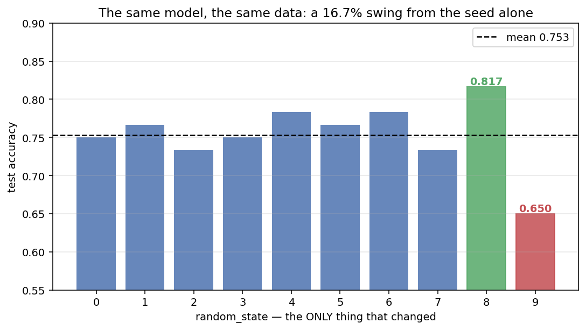
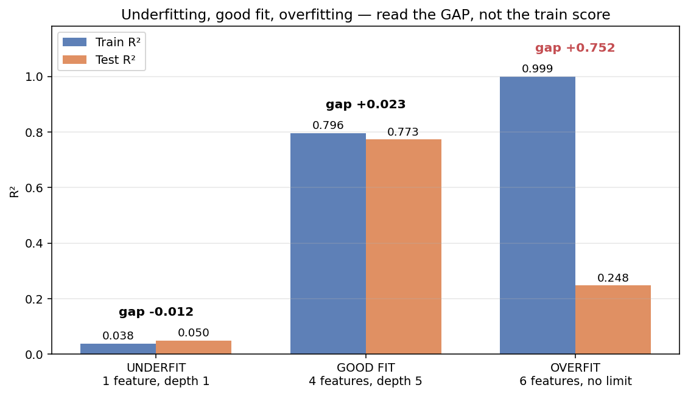
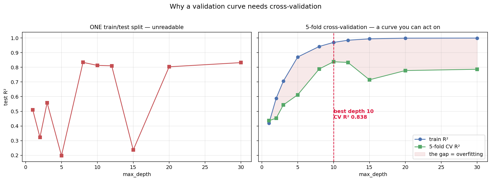
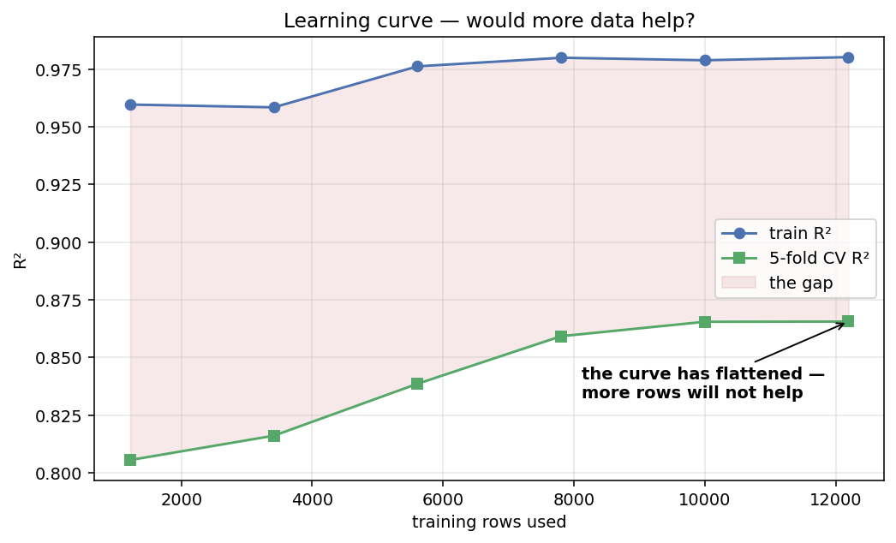
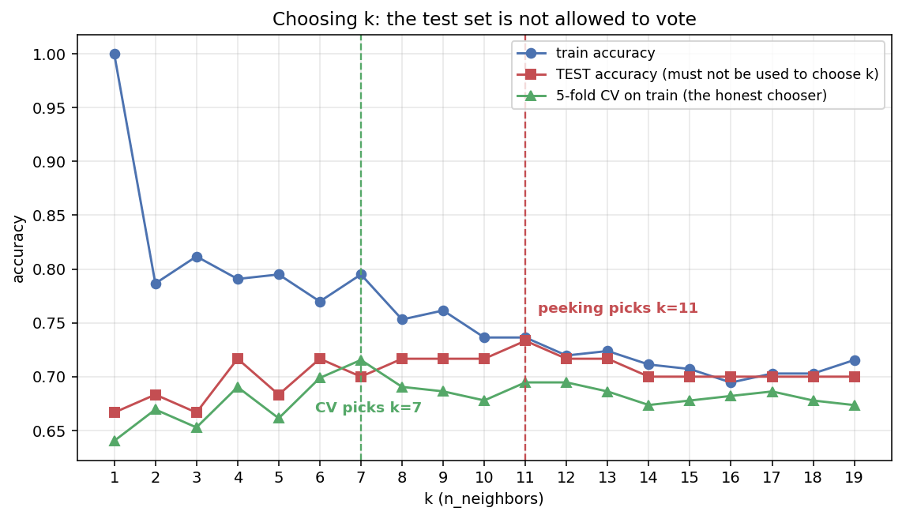
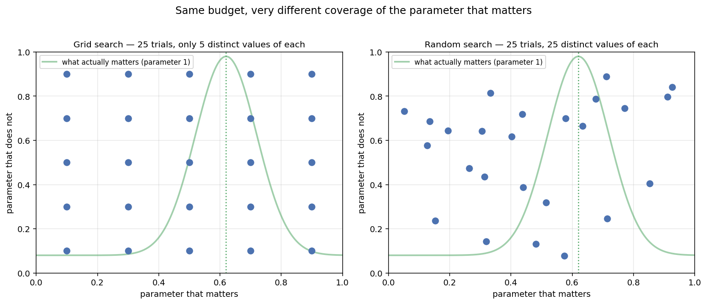

# Session 8 — Model Evaluation & Improvement

**Holdout · Cross-Validation · Bootstrapping · K-Fold · Leave-One-Out · Overfitting & Underfitting · Grid Search · Random Search · Bayesian Optimization**

| | |
|---|---|
| **Notebook** | [session-08-evaluation-tuning.ipynb](../notebooks/session-08-evaluation-tuning.ipynb) |
| **Previous** | [Session 7 — Unsupervised Learning: Clustering](session-07-unsupervised.md) |
| **Next** | [Session 9 — Deep Learning](session-09-deep-learning.md) |
| **Stuck?** | [Troubleshooting](../troubleshooting.md) |

> **In Sessions 5 and 5B you trained models and reported a number. This session asks the uncomfortable question: *was that number real?***
>
> **On the dataset used throughout this session, changing nothing but the random seed moved the accuracy from 0.650 to 0.817.** **Both numbers came from correct code. Only one of them would have been reported.**

---

## 🎯 Learning outcomes

By the end of this session you can:

1. Explain why a single train/test split is not a reliable estimate
2. Run holdout, k-fold, stratified k-fold, leave-one-out and bootstrap validation
3. **Say which validation strategy fits which situation**
4. Spot the two leaks — scaling before the split, and resampling before the split — and **fix both with a pipeline**
5. Recognise underfitting and overfitting from the **train–test gap**
6. Read a validation curve and a learning curve
7. **Fix** underfitting and overfitting, deliberately
8. Distinguish parameters from hyperparameters
9. Tune with manual, grid, random and Bayesian search — and **say what each costs**
10. **Never let the test set choose a hyperparameter**
11. Select between models with cross-validation

---

## How this session is organised

| Part | Question it answers |
|---|---|
| **A — [Is my number real?](#part-a--is-my-number-real)** | *How do I estimate performance honestly?* |
| **B — [Overfitting & underfitting](#part-b--overfitting--underfitting)** | *Is my model too simple, too complex, or right?* |
| **C — [Hyperparameter tuning](#part-c--hyperparameter-tuning)** | *How do I make it better, without cheating?* |

| # | Topic | | # | Topic |
|---|---|---|---|---|
| 1 | [One split is not an answer](#1-one-split-is-not-an-answer) | | 11 | [Validation curves](#11-validation-curves) |
| 2 | [Holdout validation](#2-holdout-validation) | | 12 | [Learning curves](#12-learning-curves) |
| 3 | [K-Fold cross-validation](#3-k-fold-cross-validation) | | 13 | [Fixing each problem](#13-fixing-each-problem) |
| 4 | [Stratified K-Fold](#4-stratified-k-fold) | | 14 | [Parameters vs hyperparameters](#14-parameters-vs-hyperparameters) |
| 5 | [Leave-One-Out](#5-leave-one-out-cross-validation) | | 15 | [Manual search](#15-manual-search-and-the-trap-in-it) |
| 6 | [Bootstrapping](#6-bootstrapping) | | 16 | [Grid search](#16-grid-search) |
| 7 | [The two leaks](#7-the-two-leaks-that-make-every-number-a-lie) | | 17 | [Random search](#17-random-search) |
| 8 | [Choosing a strategy](#8-choosing-a-validation-strategy) | | 18 | [Bayesian optimization](#18-bayesian-optimization) |
| 9 | [The three fits](#9-the-three-fits) | | 19 | [Tuning inside a pipeline](#19-tuning-inside-a-pipeline) |
| 10 | [Reading the gap](#10-reading-the-gap) | | 20 | [Model selection with CV](#20-model-selection-with-cross-validation) |

**Practices sit between the topics.** The [20 MCQs](#-session-8--20-mcqs) and [tasks](#-session-8--tasks) are at the end.

---

## The dataset used throughout Part A and Part C

**Heart failure clinical records: 299 patients, 13 measurements, and whether the patient died.**

**It arrives with the same two problems you fixed in [Session 6](session-06-augmentation-feature-engg-red.md#11-example-2--heart-failure): the yes/no columns are text, and three numeric columns have gaps. Fix them once, here, and the rest of the session can get on with the real subject.**

```python
import numpy as np
import pandas as pd

dataset_url = "https://raw.githubusercontent.com/tech4alltraining/aiml/refs/heads/main/datasets/classification/heart_failure_raw.csv"
heart = pd.read_csv(dataset_url)

# Yes/No text -> 1/0
for col in ["anaemia", "diabetes", "high_blood_pressure", "sex", "smoking", "DEATH_EVENT"]:
    heart[col] = heart[col].map({"Yes": 1, "No": 0})

# one text column with four categories -> dummy variables
heart = pd.get_dummies(heart, columns=["treatment_type"], drop_first=True)

# three numeric columns have gaps -> median fill
for col in ["age", "ejection_fraction", "serum_creatinine"]:
    heart[col] = heart[col].fillna(heart[col].median())

X = heart.drop(columns=["DEATH_EVENT"])
y = heart["DEATH_EVENT"]

print("X:", X.shape, " missing:", X.isnull().sum().sum())
print("class balance:", y.value_counts().to_dict())
```

**Output:**

```text
X: (299, 15)  missing: 0
class balance: {0: 203, 1: 96}
```

> **299 rows is small, and 203 vs 96 is imbalanced.** **Both facts will matter enormously in the next few pages** — small data makes estimates unstable, and imbalance makes some validation strategies unsafe.

---

# Part A — Is my number real?

# 1. One split is not an answer

**Here is the experiment. The same model, the same data, the same code. The only thing that changes is `random_state` — which decides *which rows land in the test set*.**

```python
from sklearn.model_selection import train_test_split
from sklearn.preprocessing import MinMaxScaler
from sklearn.pipeline import make_pipeline
from sklearn.svm import SVC

for seed in range(10):
    X_train, X_test, y_train, y_test = train_test_split(
        X, y, test_size=0.2, random_state=seed, stratify=y)
    model = make_pipeline(MinMaxScaler(), SVC()).fit(X_train, y_train)
    print(f"random_state={seed}   accuracy {model.score(X_test, y_test):.4f}")
```

**Output:**

```text
random_state=0   accuracy 0.7500
random_state=1   accuracy 0.7667
random_state=2   accuracy 0.7333
random_state=3   accuracy 0.7500
random_state=4   accuracy 0.7833
random_state=5   accuracy 0.7667
random_state=6   accuracy 0.7833
random_state=7   accuracy 0.7333
random_state=8   accuracy 0.8167
random_state=9   accuracy 0.6500
```



> **0.6500 to 0.8167 — a swing of 16.7 percentage points, from nothing but which 60 patients happened to land in the test set.**
>
> **Both are "the accuracy". Neither is wrong. And a report that quotes one of them is not lying — it is just not saying anything reliable.**

## Why this happens

**The test set here is 60 patients. One patient is 1.67 percentage points.** **Ten unusual patients landing in test instead of train moves the number by 17 points, and nothing warns you.**

| Test set size | One row is worth |
|---|---|
| 60 rows | **1.67 points** |
| 1,000 rows | 0.10 points |
| 100,000 rows | 0.001 points |

> **This is why small datasets need cross-validation and large ones can sometimes get away without it.** **299 rows is small.**

## What to do about it

> **Never report a single split's score as *the* accuracy on a small dataset.** **Report a mean and a spread from several splits** — which is exactly what cross-validation automates.

---

# 2. Holdout validation

**The method you already know: split once, train on one part, test on the other.**

```python
X_train, X_test, y_train, y_test = train_test_split(
    X, y, test_size=0.2, random_state=42, stratify=y)

model = make_pipeline(MinMaxScaler(), SVC()).fit(X_train, y_train)
print("holdout accuracy:", round(model.score(X_test, y_test), 4))
```

**Output:** `holdout accuracy: 0.7833`

| | |
|---|---|
| **Cost** | **One model. The cheapest option there is** |
| **Uses for training** | 80% of the data |
| **Uses for testing** | 20%, **once** |
| **Good for** | Large datasets, quick checks, the final unbiased test |
| **Bad for** | **Small datasets — as §1 just demonstrated** |

## ⚠️ `stratify=y` is not optional here

```python
a, b, c, d = train_test_split(X, y, test_size=0.2, random_state=9)
print("without stratify — test set class balance:", d.value_counts().to_dict())

a, b, c, d = train_test_split(X, y, test_size=0.2, random_state=9, stratify=y)
print("with stratify    — test set class balance:", d.value_counts().to_dict())
```

**Output:**

```text
without stratify — test set class balance: {0: 45, 1: 15}
with stratify    — test set class balance: {0: 41, 1: 19}
```

> **The full dataset is 32% positive. Without stratifying, this test set came out 25% positive** — a different problem from the one the model trained on.
>
> **`stratify=y` forces the test set to have the same class proportions as the full dataset.** **Without it, on a 203/96 split, a test set can drift badly** — and you end up measuring a different problem from the one you trained on.

---

# 3. K-Fold cross-validation

> **Instead of one split, make k of them — and let every row be in the test set exactly once.**

🧠 **Analogy: five examiners marking one script.** One examiner's mark could be harsh or generous. **Five marks, averaged, tell you far more — and the spread between them tells you how much to trust the average.**

## How it works

```text
5-fold cross-validation, 299 rows:

fold 1:  [TEST ][         TRAIN          ]   -> score 1
fold 2:  [ TRAIN ][TEST][     TRAIN      ]   -> score 2
fold 3:  [    TRAIN    ][TEST][  TRAIN   ]   -> score 3
fold 4:  [        TRAIN       ][TEST][TR ]   -> score 4
fold 5:  [           TRAIN         ][TEST]   -> score 5

Five models are trained. Every row is tested exactly once.
The answer is the MEAN of the five scores, and the SPREAD tells you the uncertainty.
```

```python
from sklearn.model_selection import KFold, cross_val_score

kf = KFold(n_splits=5, shuffle=True, random_state=42)
scores = cross_val_score(make_pipeline(MinMaxScaler(), SVC()), X, y, cv=kf)

print("each fold:", scores.round(4))
print(f"mean {scores.mean():.4f}  +/-  {scores.std():.4f}")
```

**Output:**

```text
each fold: [0.6833 0.6833 0.75   0.7833 0.7627]
mean 0.7325  +/-  0.0416
```

> **The single holdout said 0.7833 — which is the *best* of the five folds.** **The honest answer is 0.7325 ± 0.0416.**

## Reading the two numbers

| | What it tells you |
|---|---|
| **Mean** | Your best estimate of performance |
| **Standard deviation** | **How much to trust the mean** |

> **Always report both.** **"0.73 ± 0.04" is a statement. "0.78" is a claim you cannot support.**
>
> **And when comparing two models: if their means differ by less than the spread, you have not shown a difference.**

## ⚠️ `shuffle=True` matters

**Without shuffling, `KFold` takes the rows in file order.** **If the file is sorted — by date, by class, by hospital — each fold gets a systematically different slice**, and the scores become meaningless.

```python
# illustrative: a syntax reference, not runnable as written.
KFold(n_splits=5)                                    # takes rows in file order - risky
KFold(n_splits=5, shuffle=True, random_state=42)     # always prefer this
```

## How many folds?

| k | Trade-off |
|---|---|
| **3** | Fast; each model trains on only 67% of the data |
| **5** | **The usual default.** Good balance |
| **10** | More reliable, twice the cost |
| **n (LOOCV)** | Maximum training data, maximum cost — see §5 |

---

# 4. Stratified K-Fold

**Plain `KFold` splits at random. On imbalanced data, that is a problem.**

**Our target is 203 negatives to 96 positives — roughly 2:1. A random fold could easily end up 3:1 or 1.5:1, and each fold is then measuring a slightly different problem.**

```python
from sklearn.model_selection import StratifiedKFold

skf = StratifiedKFold(n_splits=5, shuffle=True, random_state=42)
strat_scores = cross_val_score(make_pipeline(MinMaxScaler(), SVC()), X, y, cv=skf)

print("plain KFold      :", scores.round(4), f"  mean {scores.mean():.4f}  std {scores.std():.4f}")
print("StratifiedKFold  :", strat_scores.round(4), f"  mean {strat_scores.mean():.4f}  std {strat_scores.std():.4f}")
```

**Output:**

```text
plain KFold      : [0.6833 0.6833 0.75   0.7833 0.7627]   mean 0.7325  std 0.0416
StratifiedKFold  : [0.7667 0.7333 0.7667 0.7667 0.7966]   mean 0.7660  std 0.0200
```

> **Stratifying more than halved the spread — 0.0416 down to 0.0200 — and raised the mean.**
>
> **Look at the folds themselves.** Plain KFold's worst fold is 0.6833 and its best is 0.7833: a 10-point range. Stratified runs from 0.7333 to 0.7966. **The extra variation in the first was not about the model at all — it was about how the classes happened to fall.**

> ✅ **Rule: for classification, always use `StratifiedKFold`.** **`cross_val_score` uses it automatically when you pass `cv=5` and the estimator is a classifier** — but write it explicitly so the reader can see the decision.

---

# 5. Leave-One-Out cross-validation

> **k-fold taken to its extreme: k = n. Every single row gets its own turn as the entire test set.**

**With 299 patients, that means training 299 models, each on 298 rows.**

```python
from sklearn.model_selection import LeaveOneOut

loo_scores = cross_val_score(make_pipeline(MinMaxScaler(), SVC()), X, y,
                             cv=LeaveOneOut(), n_jobs=-1)

print("models trained:", len(loo_scores))
print("LOOCV accuracy:", round(loo_scores.mean(), 4))
```

**Output:**

```text
models trained: 299
LOOCV accuracy: 0.7492
```

> **Each individual "score" is either 0 or 1** — one row is either classified correctly or not. **The mean over all 299 is the useful number.**

| | |
|---|---|
| ✅ **Maximum training data** | Every model sees 298 of 299 rows |
| ✅ **No randomness at all** | There is only one way to leave one out. **Run it twice, get the same answer** |
| ❌ **Cost** | **n models.** 299 here; 100,000 on a large dataset |
| ❌ **High variance estimate** | The 299 models are almost identical to each other, so their errors are correlated |

> **Use LOOCV when the dataset is genuinely tiny** — a few dozen rows, where holding out 20% would leave nothing to test on. **Otherwise 5- or 10-fold gives a comparable answer for a fraction of the cost.**

---

# 6. Bootstrapping

> **Sample rows *with replacement* to build a new training set of the same size, and test on whatever was left out.**

🧠 **Analogy: drawing names from a hat and putting each one back.** **Some names get drawn twice, some not at all.** The ones never drawn are your test set.

**On average, each bootstrap sample contains about 63.2% of the unique rows — so roughly 36.8% are left over.** **Those left-over rows are called *out-of-bag*, and they are free test data.**

```python
rng = np.random.default_rng(42)
n = len(X)
boot_scores = []

for _ in range(200):
    idx = rng.integers(0, n, n)                       # sample WITH replacement
    oob = np.setdiff1d(np.arange(n), np.unique(idx))  # rows never drawn
    model = make_pipeline(MinMaxScaler(), SVC()).fit(X.iloc[idx], y.iloc[idx])
    boot_scores.append(model.score(X.iloc[oob], y.iloc[oob]))

boot_scores = np.array(boot_scores)
print(f"mean accuracy   {boot_scores.mean():.4f}")
print(f"95% interval    [{np.percentile(boot_scores, 2.5):.4f}, "
      f"{np.percentile(boot_scores, 97.5):.4f}]")
```

**Output:**

```text
mean accuracy   0.7385
95% interval    [0.6567, 0.8131]
```

> **This is what bootstrapping gives you that k-fold does not: a *confidence interval*.**
>
> **"Accuracy is 0.74, and 95% of the time it lands between 0.66 and 0.81."** **That is a far more honest sentence than "accuracy is 0.78"** — and notice the interval is almost exactly the range we saw from the ten random seeds in §1.

| | |
|---|---|
| ✅ **Gives a confidence interval**, not just a point estimate | |
| ✅ Works on very small datasets | |
| ❌ Training rows are duplicated | Which slightly biases some models |
| ❌ Expensive | 200 models here |

> **You have already used bootstrapping without knowing it: a Random Forest bootstraps its rows for every tree.** **That is where the "bagging" in bagged trees comes from.**

---

# 7. The two leaks that make every number a lie

**Every number above used `make_pipeline(MinMaxScaler(), SVC())` rather than scaling first. That was deliberate.**

## Leak 1 — scaling before the split

```python
from sklearn.preprocessing import MinMaxScaler

# ❌ WRONG - the scaler sees every row, including the test rows
X_scaled_all = MinMaxScaler().fit_transform(X)
leaky = cross_val_score(SVC(), X_scaled_all, y, cv=skf)

# ✅ RIGHT - the scaler is fitted inside each fold, on that fold's training rows only
correct = cross_val_score(make_pipeline(MinMaxScaler(), SVC()), X, y, cv=skf)

print("leaky  :", round(leaky.mean(), 4))
print("correct:", round(correct.mean(), 4))
```

**Output:**

```text
leaky  : 0.7593
correct: 0.7660
```

> **The gap is small here — and notice it went the "wrong" way: the leaky version scored *lower*.**
>
> **That is the real danger.** **A leak does not reliably inflate your score, so you cannot detect one by looking for a suspiciously high number.** **`MinMaxScaler` uses the minimum and maximum of every column — so a single extreme test-set patient shifts the scaling of every training row.** The result is simply *not the number you think it is*.

## Leak 2 — resampling before the split

**This one is far more serious, and it is easy to write by accident.**

```python
# needs-install: pip install imbalanced-learn
from imblearn.over_sampling import SMOTE

# ❌ WRONG - SMOTE first, split second
X_res, y_res = SMOTE(random_state=42).fit_resample(X, y)
a, b, c, d = train_test_split(X_res, y_res, test_size=0.2, random_state=42)

original_rows = set(map(tuple, X.to_numpy()))
synthetic_in_test = sum(1 for row in b.to_numpy() if tuple(row) not in original_rows)

print("rows before SMOTE:", len(X), " after:", len(X_res))
print(f"test rows: {len(b)}, of which SYNTHETIC: {synthetic_in_test} "
      f"({synthetic_in_test / len(b):.0%})")
```

**Output:**

```text
rows before SMOTE: 299  after: 406
test rows: 82, of which SYNTHETIC: 19 (23%)
```

> **23% of the test set is invented data** — each synthetic row interpolated from real patients, most of whom are now sitting in the training set.
>
> **You are testing the model on rows built out of its own training data.** **Whatever number comes out is not an estimate of anything.**

**The fix — split first, then resample the training half only:**

```python
X_train, X_test, y_train, y_test = train_test_split(
    X, y, test_size=0.2, random_state=42, stratify=y)

X_bal, y_bal = SMOTE(random_state=42).fit_resample(X_train, y_train)   # TRAIN only

model = make_pipeline(MinMaxScaler(), SVC()).fit(X_bal, y_bal)
print("honest test accuracy:", round(model.score(X_test, y_test), 4))
```

**Output:** `honest test accuracy: 0.7833`

> **This is Session 6's rule, restated: augment the training set, never the test set.** **A trainer notebook that runs SMOTE on the full dataset before splitting is making exactly this mistake — and its reported accuracy cannot be compared with anything.**

## The one habit that prevents both

> **Put every step that *learns something from the data* inside a `Pipeline`, and let cross-validation drive the pipeline.**

```python
from sklearn.pipeline import Pipeline

pipe = Pipeline([
    ("scaler", MinMaxScaler()),      # learns min and max      -> must be inside
    ("model", SVC()),                # learns everything else  -> must be inside
])
scores = cross_val_score(pipe, X, y, cv=skf)
```

**Scaling, imputation, encoding, feature selection and PCA all learn from data.** **All of them belong inside the pipeline. Structure beats discipline.**

---

# 8. Choosing a validation strategy

| Strategy | Models trained | Gives you | Use it when |
|---|---|---|---|
| **Holdout** | **1** | One number | **Large data**, or the final untouched test |
| **K-Fold (k=5)** | 5 | Mean ± spread | **The default for everything else** |
| **Stratified K-Fold** | 5 | Mean ± spread | **Always, for classification** |
| **LOOCV** | **n** | A stable mean | **Very small data** (tens of rows) |
| **Bootstrap** | 100–1000 | **A confidence interval** | You need to state uncertainty |

## The three-way split, for when you tune

**As soon as you start choosing hyperparameters, two splits are not enough.**

```text
Full data
├── TRAIN      -> fit the model
├── VALIDATION -> choose hyperparameters        (cross-validation lives here)
└── TEST       -> touched ONCE, at the very end
```

> **The test set exists to answer one question, once: *how will this do on data it has never seen?*** **Every time you look at it and change something, it becomes a little more like a training set** — and its answer becomes a little less true.
>
> **In practice: `train_test_split` once to carve off the test set, then cross-validate inside the training half. That is the pattern Part C uses throughout.**

## ✏️ Practice — validation strategies

1. Run the holdout with `random_state` 0…9 and report the min, max and mean. **How large is the swing?**
2. Compare 3-fold, 5-fold and 10-fold cross-validation. **Report mean and standard deviation for each. Does more folds mean a better estimate?**
3. Run plain `KFold` and `StratifiedKFold` on this imbalanced data. **Which has the smaller spread, and why?**
4. Run LOOCV. **Time it, and compare with 5-fold.** Was the extra cost worth it?
5. Run 200 bootstraps and report a 95% confidence interval. **Write the one-sentence honest summary you would put in a report.**

<details><summary>Solutions</summary>

```python
import time
import numpy as np, pandas as pd
from sklearn.model_selection import (train_test_split, cross_val_score, KFold,
                                     StratifiedKFold, LeaveOneOut)
from sklearn.preprocessing import MinMaxScaler
from sklearn.pipeline import make_pipeline
from sklearn.svm import SVC

dataset_url = ("https://raw.githubusercontent.com/tech4alltraining/aiml/"
               "refs/heads/main/datasets/classification/heart_failure_raw.csv")
heart = pd.read_csv(dataset_url)
for col in ["anaemia", "diabetes", "high_blood_pressure", "sex", "smoking", "DEATH_EVENT"]:
    heart[col] = heart[col].map({"Yes": 1, "No": 0})
heart = pd.get_dummies(heart, columns=["treatment_type"], drop_first=True)
for col in ["age", "ejection_fraction", "serum_creatinine"]:
    heart[col] = heart[col].fillna(heart[col].median())
X = heart.drop(columns=["DEATH_EVENT"]); y = heart["DEATH_EVENT"]
pipe = lambda: make_pipeline(MinMaxScaler(), SVC())

acc = []                                                               # 1
for s in range(10):
    a, b, c, d = train_test_split(X, y, test_size=.2, random_state=s, stratify=y)
    acc.append(pipe().fit(a, c).score(b, d))
print(f"min {min(acc):.4f}  max {max(acc):.4f}  mean {np.mean(acc):.4f}"
      f"  swing {max(acc)-min(acc):.4f}")
# A swing of about 17 points from the seed alone.

for k in [3, 5, 10]:                                                   # 2
    s = cross_val_score(pipe(), X, y, cv=StratifiedKFold(k, shuffle=True,
                                                         random_state=42))
    print(f"{k:>2}-fold  mean {s.mean():.4f}  std {s.std():.4f}")
# More folds costs linearly and the mean barely moves. The std does NOT
# reliably shrink either - with 10 folds each test set is only 30 rows,
# so individual fold scores get NOISIER even as the mean stabilises.

a = cross_val_score(pipe(), X, y, cv=KFold(5, shuffle=True, random_state=42))  # 3
b = cross_val_score(pipe(), X, y, cv=StratifiedKFold(5, shuffle=True, random_state=42))
print(f"KFold      mean {a.mean():.4f}  std {a.std():.4f}")
print(f"Stratified mean {b.mean():.4f}  std {b.std():.4f}")
# Stratified has less than HALF the spread. Plain KFold lets the 203/96
# class balance drift between folds, so part of the variation it reports
# is about the split, not about the model.

t0 = time.time()                                                       # 4
loo = cross_val_score(pipe(), X, y, cv=LeaveOneOut(), n_jobs=-1)
t_loo = time.time() - t0
t0 = time.time()
five = cross_val_score(pipe(), X, y, cv=StratifiedKFold(5, shuffle=True,
                                                        random_state=42))
t_five = time.time() - t0
print(f"LOOCV  {loo.mean():.4f}  ({len(loo)} models, {t_loo:.1f}s)")
print(f"5-fold {five.mean():.4f}  (5 models, {t_five:.2f}s)")
# Roughly 60x the models for an answer within about 2 points. Not worth
# it here. It WOULD be worth it on 40 rows.

rng = np.random.default_rng(42); n = len(X); boot = []                 # 5
for _ in range(200):
    idx = rng.integers(0, n, n)
    oob = np.setdiff1d(np.arange(n), np.unique(idx))
    boot.append(pipe().fit(X.iloc[idx], y.iloc[idx]).score(X.iloc[oob], y.iloc[oob]))
boot = np.array(boot)
print(f"mean {boot.mean():.4f}  95% CI "
      f"[{np.percentile(boot, 2.5):.4f}, {np.percentile(boot, 97.5):.4f}]")
# HONEST SUMMARY: "The model classifies about 74% of patients correctly.
# Across 200 bootstrap resamples the accuracy fell between 66% and 81%,
# so on a dataset this small a single reported figure should not be
# trusted to better than about +/- 8 points."
```
</details>

---

# Part B — Overfitting & underfitting

**Part A was about measuring honestly. Part B is about what the measurement tells you to *do*.**

**The dataset changes here: car prices, 15,244 rows, predicting `selling_price` with a decision tree.** **A regression problem shows the effect far more starkly than a 299-row classification one.**

---

# 9. The three fits

🧠 **Analogy: a student preparing for an exam.**
>
> - **The student who skims one chapter** fails the practice questions *and* the exam. **Underfitting.**
> - **The student who memorises last year's paper word for word** gets 100% on last year's paper and fails the new one. **Overfitting.**
> - **The student who understands the subject** does well on both. **A good fit.**

**Here are all three, built deliberately.**

```python
import pandas as pd
from sklearn.model_selection import train_test_split
from sklearn.tree import DecisionTreeRegressor
from sklearn.metrics import r2_score

cars_url = "https://raw.githubusercontent.com/tech4alltraining/aiml/refs/heads/main/datasets/regression/cardekho_preprocessed.csv"
cars = pd.read_csv(cars_url)
y_cars = cars["selling_price"]

def fit_and_score(features, **tree_settings):
    X_sub = cars[features]
    X_train, X_test, y_train, y_test = train_test_split(
        X_sub, y_cars, test_size=0.2, random_state=42)
    model = DecisionTreeRegressor(random_state=42, **tree_settings).fit(X_train, y_train)
    train_r2 = r2_score(y_train, model.predict(X_train))
    test_r2 = r2_score(y_test, model.predict(X_test))
    return train_r2, test_r2
```

## Model 1 — underfitting

**One feature, and a tree allowed exactly one split.**

```python
train_r2, test_r2 = fit_and_score(["vehicle_age"], max_depth=1)
print(f"UNDERFIT   train R² {train_r2:.4f}   test R² {test_r2:.4f}   gap {train_r2-test_r2:+.4f}")
```

**Output:** `UNDERFIT   train R² 0.0381   test R² 0.0497   gap -0.0116`

> **The model explains 4% of the variation in price. It cannot even fit the data it was trained on.**
>
> **Notice the gap is essentially zero — and the test score is slightly *higher* than the train score.** **That is the signature of underfitting: the model is equally bad everywhere.**

## Model 2 — a good fit

**Four sensible features, and a tree limited to depth 5 with at least 10 cars per leaf.**

```python
train_r2, test_r2 = fit_and_score(
    ["vehicle_age", "km_driven", "engine", "max_power"],
    max_depth=5, min_samples_leaf=10)
print(f"GOOD FIT   train R² {train_r2:.4f}   test R² {test_r2:.4f}   gap {train_r2-test_r2:+.4f}")
```

**Output:** `GOOD FIT   train R² 0.7961   test R² 0.7726   gap +0.0235`

> **High on both, and a gap of 2 points.** **This is what you are aiming for.**

## Model 3 — overfitting

**Six features and a tree with no limits at all — it can keep splitting until every leaf holds one car.**

```python
train_r2, test_r2 = fit_and_score(
    ["vehicle_age", "km_driven", "mileage", "engine", "max_power", "seats"],
    max_depth=None, min_samples_leaf=1)
print(f"OVERFIT    train R² {train_r2:.4f}   test R² {test_r2:.4f}   gap {train_r2-test_r2:+.4f}")
```

**Output:** `OVERFIT    train R² 0.9993   test R² 0.2477   gap +0.7516`

> **99.93% on training data.** **A model that has essentially memorised the price of every car it was shown.**
>
> **And 24.77% on cars it has not seen — worse than the four-feature model with a depth limit, and using *more* information.**



---

# 10. Reading the gap

| | Train | Test | Gap | Diagnosis |
|---|---|---|---|---|
| **Underfit** | 0.0381 | 0.0497 | **−0.01** | **Both low. Model too simple** |
| **Good fit** | 0.7961 | 0.7726 | **+0.02** | **Both high, small gap** |
| **Overfit** | 0.9993 | 0.2477 | **+0.75** | **Train high, test low** |

> **The single most useful habit in this session: print the train score alongside the test score, every time.**
>
> **The test score alone cannot tell you what is wrong.** **0.2477 could be underfitting or overfitting** — and the fix for one is the exact opposite of the fix for the other. **The gap is what distinguishes them.**

## The diagnosis table

| What you see | Diagnosis | What to do |
|---|---|---|
| Train **low**, test **low** | **Underfitting** | **Add** complexity, features, or training time |
| Train **high**, test **high** | **Good fit** | Ship it |
| Train **high**, test **low** | **Overfitting** | **Remove** complexity; add data or regularisation |
| Train **low**, test **high** | Usually a bug — or a lucky test split | Check your split |

## ⚠️ "More features" is not the same as "better"

**Look at the overfitting model again. It used *six* features against the good model's *four*, and scored 0.25 against 0.77.**

> **The extra features were not the problem on their own — the unlimited depth was.** **But together they gave the tree enough freedom to describe noise, and it did.**
>
> **Capacity you do not need is capacity that will be spent memorising.**

---

# 11. Validation curves

> **A validation curve plots one hyperparameter against train and validation performance. It shows you exactly where the good fit lives.**

## First, why it must use cross-validation

**Here is the same curve drawn two ways: with one train/test split, and with 5-fold cross-validation.**

```python
from sklearn.model_selection import validation_curve, KFold
import numpy as np

FEATURES = ["vehicle_age", "km_driven", "mileage", "engine", "max_power", "seats"]
X_cars = cars[FEATURES]

depths = [1, 2, 3, 5, 8, 10, 12, 15, 20, 30]
train_scores, cv_scores = validation_curve(
    DecisionTreeRegressor(random_state=42), X_cars, y_cars,
    param_name="max_depth", param_range=depths,
    cv=KFold(5, shuffle=True, random_state=42), scoring="r2", n_jobs=-1)

for d, tr, cv in zip(depths, train_scores.mean(axis=1), cv_scores.mean(axis=1)):
    print(f"depth {d:>3}   train {tr:.4f}   CV {cv:.4f}   gap {tr-cv:+.4f}")
```

**Output:**

```text
depth   1   train 0.4190   CV 0.4361   gap -0.0170
depth   2   train 0.5885   CV 0.4528   gap +0.1357
depth   3   train 0.7055   CV 0.5433   gap +0.1622
depth   5   train 0.8701   CV 0.6124   gap +0.2577
depth   8   train 0.9420   CV 0.7886   gap +0.1534
depth  10   train 0.9696   CV 0.8377   gap +0.1319
depth  12   train 0.9845   CV 0.8332   gap +0.1512
depth  15   train 0.9940   CV 0.7149   gap +0.2791
depth  20   train 0.9986   CV 0.7777   gap +0.2209
depth  30   train 0.9992   CV 0.7866   gap +0.2126
```



> **Look at the left panel of that figure — the same sweep drawn from a single train/test split.** It goes 0.51, 0.32, 0.56, **0.20**, 0.83, 0.81, **0.24**, 0.80. **You cannot read anything from it.**
>
> **The right panel, from 5-fold CV, is a curve you can act on: it rises to a peak at depth 10 (CV R² 0.8377) and falls away after.**

## How to read a validation curve

```text
        train ────────────────────────────  keeps rising, always
                  ╱‾‾‾‾‾╲
        CV      ╱         ╲                 rises, peaks, then FALLS
              ╱             ╲
        ─────┴───────┴───────┴──────
         too simple  BEST   too complex
        (underfit)         (overfit)
```

| Region | Train | CV | Name |
|---|---|---|---|
| **Left** | Low | Low | **Underfitting** |
| **Peak** | High | **Highest** | **The setting you want** |
| **Right** | Very high | **Falling** | **Overfitting** |

> **The train curve never turns down** — more capacity always fits the training data better. **Only the validation curve turns, and where it turns is the answer.**

---

# 12. Learning curves

> **A validation curve asks "is my model the right complexity?". A learning curve asks a different question: *would more data help?***

**It plots performance against the number of training rows used.**

```python
from sklearn.ensemble import RandomForestRegressor
from sklearn.model_selection import learning_curve

sizes, train_scores, cv_scores = learning_curve(
    RandomForestRegressor(n_estimators=60, random_state=42, n_jobs=-1),
    X_cars, y_cars, train_sizes=np.linspace(0.1, 1.0, 6),
    cv=KFold(5, shuffle=True, random_state=42), scoring="r2",
    n_jobs=-1, shuffle=True, random_state=42)

for n, tr, cv in zip(sizes, train_scores.mean(axis=1), cv_scores.mean(axis=1)):
    print(f"rows {n:>6}   train {tr:.4f}   CV {cv:.4f}   gap {tr-cv:+.4f}")
```

**Output:**

```text
rows   1219   train 0.9596   CV 0.8056   gap +0.1541
rows   3414   train 0.9584   CV 0.8161   gap +0.1423
rows   5609   train 0.9762   CV 0.8386   gap +0.1376
rows   7804   train 0.9799   CV 0.8593   gap +0.1207
rows   9999   train 0.9788   CV 0.8655   gap +0.1133
rows  12195   train 0.9802   CV 0.8656   gap +0.1146
```



## How to read it

| Shape | Meaning | What to do |
|---|---|---|
| **CV still climbing at the right edge** | The model is starved of data | **Collect more rows** |
| **CV has flattened, gap small** | You have enough data and the right model | **Ship it** |
| **CV has flattened, gap still large** | **More data will not close this** | **Regularise, or simplify the model** |
| **Both curves low and flat** | Underfitting | **A more capable model** |

> **Here: the CV score climbed from 0.806 to 0.866 and then stopped — the last 2,000 rows bought 0.0001.** **Collecting more cars would be wasted effort.** The remaining 0.11 gap is not a data problem.
>
> ⚠️ **A forest was used here rather than a single tree for a reason.** **On this dataset a single deep tree's CV score bounces between 0.61 and 0.83 from one training size to the next** — the price is heavily skewed, so a few luxury cars in a fold dominate R². **A forest averages that away.** **If your learning curve is unreadable, the instability is itself the finding.**

---

# 13. Fixing each problem

## Fixing underfitting

| Fix | Example |
|---|---|
| **More capacity** | `max_depth` from 1 to 10; a forest instead of one tree |
| **More features** | The good-fit model used 4 features; the underfit one used 1 |
| **Better features** | **Session 6's feature engineering** |
| **Less regularisation** | Lower `alpha` in Ridge/Lasso; higher `C` in SVM |
| **Train longer** | For neural networks — Session 9 |

## Fixing overfitting

| Fix | Example |
|---|---|
| **Less capacity** | `max_depth=10` instead of `None`; `min_samples_leaf=10` instead of 1 |
| **More data** | **If, and only if, the learning curve says it would help** |
| **Regularisation** | Ridge/Lasso; `C` in SVM; `alpha` in a network |
| **Fewer features** | **Session 6's feature selection** |
| **Ensembling** | **A Random Forest averages many overfitted trees into one that is not** |
| **Early stopping** | Stop training when validation stops improving |

## The one that fixes the car model

```python
train_r2, test_r2 = fit_and_score(
    ["vehicle_age", "km_driven", "mileage", "engine", "max_power", "seats"],
    max_depth=10, min_samples_leaf=10)
print(f"REGULARISED   train R² {train_r2:.4f}   test R² {test_r2:.4f}   gap {train_r2-test_r2:+.4f}")
```

**Output:** `REGULARISED   train R² 0.8461   test R² 0.8200   gap +0.0261`

> **The same six features that scored 0.2477 unconstrained now score 0.8200, with a gap of under 3 points.** **Nothing was added — two limits were imposed.**
>
> **That is regularisation in one line: deliberately making the model less able to memorise.**

## ✏️ Practice — diagnosing the fit

1. Build all three car models and print train R², test R² and the gap for each. **Which number tells you which problem you have?**
2. Take the overfitting model and add `max_depth=10, min_samples_leaf=10`. **How much does the test score improve?**
3. Draw the validation curve for `max_depth` using **one split** and then using **5-fold CV**. **Which one can you actually read?**
4. Draw a learning curve for the regularised model. **Has it flattened? Would collecting more cars help?**
5. **Make the model underfit deliberately** in two different ways, and explain what each one removed.

<details><summary>Solutions</summary>

```python
import numpy as np, pandas as pd
import matplotlib; matplotlib.use("Agg")
import matplotlib.pyplot as plt
from sklearn.model_selection import (train_test_split, validation_curve,
                                     learning_curve, KFold)
from sklearn.tree import DecisionTreeRegressor
from sklearn.metrics import r2_score

cars_url = ("https://raw.githubusercontent.com/tech4alltraining/aiml/"
            "refs/heads/main/datasets/regression/cardekho_preprocessed.csv")
cars = pd.read_csv(cars_url)
y = cars["selling_price"]
FEATS = ["vehicle_age", "km_driven", "mileage", "engine", "max_power", "seats"]

def score(features, **kw):                                             # 1
    a, b, c, d = train_test_split(cars[features], y, test_size=.2, random_state=42)
    m = DecisionTreeRegressor(random_state=42, **kw).fit(a, c)
    return r2_score(c, m.predict(a)), r2_score(d, m.predict(b))

for name, args in [("underfit", (["vehicle_age"], dict(max_depth=1))),
                   ("good fit", (["vehicle_age", "km_driven", "engine", "max_power"],
                                 dict(max_depth=5, min_samples_leaf=10))),
                   ("overfit ", (FEATS, dict(max_depth=None, min_samples_leaf=1)))]:
    tr, te = score(args[0], **args[1])
    print(f"{name}  train {tr:.4f}  test {te:.4f}  gap {tr-te:+.4f}")
# The GAP is the diagnostic. Test alone cannot distinguish underfitting
# (0.05) from overfitting (0.25) - and the fixes are opposites.

tr, te = score(FEATS, max_depth=10, min_samples_leaf=10)               # 2
print(f"regularised  train {tr:.4f}  test {te:.4f}  gap {tr-te:+.4f}")
# From 0.2477 to 0.8200 - a 0.57 improvement from two limits, and
# the gap collapses from +0.75 to +0.03.

depths = [1, 2, 3, 5, 8, 10, 12, 15, 20, 30]                          # 3
a, b, c, d = train_test_split(cars[FEATS], y, test_size=.2, random_state=42)
single = [r2_score(d, DecisionTreeRegressor(max_depth=k, random_state=42)
                   .fit(a, c).predict(b)) for k in depths]
t_s, c_s = validation_curve(DecisionTreeRegressor(random_state=42), cars[FEATS], y,
    param_name="max_depth", param_range=depths,
    cv=KFold(5, shuffle=True, random_state=42), scoring="r2", n_jobs=-1)
print("one split:", np.round(single, 3))
print("5-fold CV:", np.round(c_s.mean(axis=1), 3))
# The single split jumps around unreadably. The CV curve rises to a clear
# peak at depth 10 and falls after it. Only the second is a curve.

s, ltr, lte = learning_curve(                                          # 4
    DecisionTreeRegressor(max_depth=10, min_samples_leaf=10, random_state=42),
    cars[FEATS], y, train_sizes=np.linspace(.2, 1.0, 5),
    cv=KFold(5, shuffle=True, random_state=42), scoring="r2", n_jobs=-1,
    shuffle=True, random_state=42)
for n, x1, x2 in zip(s, ltr.mean(1), lte.mean(1)):
    print(f"rows {n:>6}  train {x1:.4f}  cv {x2:.4f}")
# The CV score rises and then flattens. More cars would buy very little -
# the remaining gap is a model problem, not a data problem.

print(score(["seats"], max_depth=1))                                   # 5
print(score(FEATS, max_depth=1))
# TWO WAYS TO UNDERFIT:
#   (a) remove information - one weak feature instead of six
#   (b) remove capacity - depth 1 allows exactly one split, so the model
#       can only ever output two different prices
# Both give low train AND low test. That is the signature.
```
</details>

---

# Part C — Hyperparameter tuning

**Part B showed that `max_depth=10` beats `max_depth=None`. Part C is about how to *find* that 10 without cheating.**

**Back to the heart failure data — `X`, `y`, `X_train`, `X_test`, `y_train`, `y_test` from Part A.**

---

# 14. Parameters vs hyperparameters

**Two words that sound identical and mean opposite things.**

| | **Parameters** | **Hyperparameters** |
|---|---|---|
| Who sets them | **The model, during `fit()`** | **You, before `fit()`** |
| Learned from data? | **Yes** | **No** |
| Examples | Regression coefficients; the split points in a tree | `max_depth`, `n_neighbors`, `C`, `n_estimators` |
| Changed by | Training on different data | **You, deliberately** |

```python
# illustrative: a syntax reference, not runnable as written.
model = DecisionTreeRegressor(max_depth=10)   # <- HYPERparameter: your choice
model.fit(X_train, y_train)                   # <- parameters: learned here
model.tree_.threshold                         # <- the learned split points
```

> **Hyperparameter tuning means searching over the choices you make**, so the search has to happen *outside* training — which is why every method in this section wraps `fit()` in a loop.

## The ones you have already met

| Model | Hyperparameter | What it controls |
|---|---|---|
| **Decision tree** | `max_depth`, `min_samples_leaf` | **How much it can memorise** |
| **Random Forest** | `n_estimators`, `max_depth` | How many trees, how deep |
| **kNN** | `n_neighbors` | **How many neighbours vote** |
| **SVM** | `C`, `kernel`, `gamma` | How hard it tries to fit; the boundary's shape |
| **k-Means** | `n_clusters` | **How many groups** |

---

# 15. Manual search — and the trap in it

**The obvious approach: try every value and pick the best.**

```python
from sklearn.neighbors import KNeighborsClassifier
from sklearn.preprocessing import MinMaxScaler

scaler = MinMaxScaler().fit(X_train)
X_train_s, X_test_s = scaler.transform(X_train), scaler.transform(X_test)

for k in range(1, 20):
    knn = KNeighborsClassifier(n_neighbors=k).fit(X_train_s, y_train)
    print(f"k={k:>2}   train {knn.score(X_train_s, y_train):.4f}   "
          f"test {knn.score(X_test_s, y_test):.4f}")
```

**Output (abridged):**

```text
k= 1   train 1.0000   test 0.6667
k= 2   train 0.7866   test 0.6833
k= 4   train 0.7908   test 0.7167
k= 7   train 0.7950   test 0.7000
k=11   train 0.7364   test 0.7333     <- highest test score
k=15   train 0.7071   test 0.7000
k=19   train 0.7155   test 0.7000
```

**Two things to notice.**

**First, `k=1` gets a perfect training score.** **Of course it does — the nearest neighbour of a training point is itself.** **And its test score is the worst of all: 0.6667.** That is overfitting in its purest form.

**Second — and this is the trap — picking `k=11` because it scored highest *on the test set* is cheating.**

## ⚠️ The test set is not allowed to vote

```python
from sklearn.model_selection import GridSearchCV
from sklearn.pipeline import make_pipeline

grid = GridSearchCV(
    make_pipeline(MinMaxScaler(), KNeighborsClassifier()),
    {"kneighborsclassifier__n_neighbors": list(range(1, 20))},
    cv=5)
grid.fit(X_train, y_train)

print("k chosen by peeking at test :", 11, "-> reported accuracy 0.7333")
print("k chosen by CV on train only:", grid.best_params_, "-> CV score",
      round(grid.best_score_, 4))
print("that model's HONEST test accuracy:", round(grid.score(X_test, y_test), 4))
```

**Output:**

```text
k chosen by peeking at test : 11 -> reported accuracy 0.7333
k chosen by CV on train only: {'kneighborsclassifier__n_neighbors': 7} -> CV score 0.7155
that model's HONEST test accuracy: 0.7000
```



> **The manual search would have reported 0.7333. The honest answer is 0.7000.**
>
> **The 0.7333 is not a lie about the arithmetic — it is a lie about what the number *means*.** **It is the score of the k that happened to suit those particular 60 test patients.** **On the next 60 patients it will not repeat.**
>
> **Every time you look at the test set and change something, you spend a little of its ability to tell you the truth.** **You have 19 chances here, and the manual loop used all of them.**

## When manual search is still the right thing

> **For understanding, not for choosing.** **Sweeping k and plotting train against test is how you *see* overfitting** — the `k=1` result above teaches more than any grid search output. **Just do not let the plot pick your final model.**

---

# 16. Grid search

> **Define a set of values for each hyperparameter, and try every combination — each one scored by cross-validation on the training data only.**

```python
from sklearn.model_selection import GridSearchCV
from sklearn.svm import SVC

param_grid = {
    "svc__C": [1, 10, 100, 1000],
    "svc__kernel": ["linear", "rbf"],
    "svc__gamma": ["scale", "auto", 0.1, 0.2, 0.3, 0.5, 0.6],
}

pipe = make_pipeline(MinMaxScaler(), SVC(random_state=42))
search = GridSearchCV(pipe, param_grid, cv=5, scoring="accuracy", n_jobs=-1)
search.fit(X_train, y_train)

print("combinations tried:", len(search.cv_results_["params"]))
print("best parameters   :", search.best_params_)
print("best CV score     :", round(search.best_score_, 4))
print("test score        :", round(search.score(X_test, y_test), 4))
```

**Output:**

```text
combinations tried: 56
best parameters   : {'svc__C': 100, 'svc__gamma': 'scale', 'svc__kernel': 'linear'}
best CV score     : 0.8284
test score        : 0.8333
```

> **4 × 2 × 7 = 56 combinations, each cross-validated 5 times = 280 model fits.** **Roughly 3 seconds here.**
>
> **CV said 0.8284 and the untouched test set said 0.8333.** **When those two agree, your estimate is trustworthy** — the search did not overfit to the validation folds.

## What `GridSearchCV` gives you afterwards

| Attribute | What it is |
|---|---|
| `best_params_` | The winning combination |
| `best_score_` | **Its mean cross-validated score** |
| `best_estimator_` | **The model, already refitted on all the training data** |
| `cv_results_` | Every combination's score — **a DataFrame waiting to happen** |

```python
results = pd.DataFrame(search.cv_results_)
print(results[["param_svc__C", "param_svc__kernel", "mean_test_score"]]
      .sort_values("mean_test_score", ascending=False).head())
```

> **`search.predict(X_test)` uses `best_estimator_` automatically** — you do not need to refit anything by hand.

## ⚠️ The cost grows multiplicatively

| Parameters | Values each | Combinations | × 5-fold CV |
|---|---|---|---|
| 2 | 5 | 25 | **125 fits** |
| 3 | 5 | 125 | **625 fits** |
| 4 | 10 | 10,000 | **50,000 fits** |
| 6 | 10 | 1,000,000 | **5,000,000 fits** |

> **Grid search is exhaustive, which is its strength and its fatal weakness.** **Past three or four hyperparameters it becomes unusable**, and that is exactly what random search is for.

---

# 17. Random search

> **Instead of every combination, sample a fixed number of random ones.**

```python
from sklearn.model_selection import RandomizedSearchCV

random_search = RandomizedSearchCV(
    pipe, param_distributions=param_grid,
    n_iter=10, cv=5, random_state=42, n_jobs=-1)
random_search.fit(X_train, y_train)

print("combinations tried:", 10)
print("best parameters   :", random_search.best_params_)
print("best CV score     :", round(random_search.best_score_, 4))
print("test score        :", round(random_search.score(X_test, y_test), 4))
```

**Output:**

```text
combinations tried: 10
best parameters   : {'svc__kernel': 'linear', 'svc__gamma': 0.3, 'svc__C': 1000}
best CV score     : 0.8284
test score        : 0.8333
```

## The comparison

| | Combinations | Time | Best CV | Test |
|---|---|---|---|---|
| **Grid search** | **56** | 3.2 s | **0.8284** | **0.8333** |
| **Random search** | **10** | **0.4 s** | **0.8284** | **0.8333** |

> **Identical results for 18% of the work.**
>
> **And look at the parameters it chose: `gamma=0.3` where grid chose `gamma='scale'`.** **Different settings, same score — because with a linear kernel `gamma` is ignored entirely.** **Much of that 56-combination grid was spent on a parameter that did nothing.**

## Why random search usually wins



> **Read the figure.** **With 25 trials, grid search tests only 5 distinct values of each parameter. Random search tests 25 distinct values of each.**
>
> **In almost every real problem, one or two hyperparameters matter and the rest barely do.** **Grid search spends its budget uniformly. Random search, by accident, samples the important parameter far more finely** — and that is why it usually finds a better setting for the same cost.

## Random search over ranges, not lists

**Random search can sample from a *distribution*, which grid search cannot do at all.**

```python
# illustrative: a syntax reference, not runnable as written.
from scipy.stats import uniform, randint

param_dist = {
    "svc__C": uniform(0.1, 1000),        # any real number in the range
    "svc__gamma": uniform(0.001, 1),     # not just the 7 you thought of
}
RandomizedSearchCV(pipe, param_dist, n_iter=50, cv=5)
```

> **This is the real advantage.** **A grid can only ever return a value you typed in. A distribution can return `C = 37.4`.**

## Which to use

| Situation | Use |
|---|---|
| 1–2 hyperparameters, few values | **Grid search** — it is exhaustive and cheap |
| 3+ hyperparameters | **Random search** |
| Continuous parameters | **Random search** |
| A very expensive model | **Random search with a small `n_iter`, then a small grid around the winner** |

> **The standard professional recipe: random search to find the neighbourhood, then a narrow grid search inside it.**

---

# 18. Bayesian optimization

> **Grid and random search have no memory. Every trial is chosen without reference to what the previous trials found. Bayesian optimization uses the results so far to decide what to try next.**

🧠 **Analogy: searching a hillside for the highest point in fog.**
>
> - **Grid search** walks a fixed lattice, measuring everywhere, learning nothing as it goes.
> - **Random search** wanders and measures at random.
> - **Bayesian optimization** measures, notices the ground rising to the north, **and spends its remaining measurements to the north.**

## How it works, in three parts

| Part | What it is |
|---|---|
| **Objective function** | What you want to minimise — usually **1 − accuracy**, or the error |
| **Search space** | The range each hyperparameter may take |
| **Surrogate model** | **A cheap model of "which settings look promising"**, updated after every trial |

**The loop:** try a setting → record the score → update the belief about where good settings live → **pick the most promising untried setting** → repeat.

## What it buys you

| | |
|---|---|
| ✅ **Far fewer trials** for the same quality | Typically 20–50 where random search needs hundreds |
| ✅ **Handles expensive models** | Where each fit takes minutes, trial count is everything |
| ❌ **Extra library**, extra complexity | `hyperopt`, `optuna` or `scikit-optimize` |
| ❌ **Trials must be sequential** | **It cannot parallelise the way random search can** |
| ❌ **Overkill for small problems** | On the 56-combination grid above it would save nothing |

## What the code looks like

**Two libraries dominate. Neither is installed by default — these are reference snippets, not exercises.**

```python
# needs-install: pip install optuna
import optuna
from sklearn.model_selection import cross_val_score, StratifiedKFold

def objective(trial):
    C = trial.suggest_float("C", 0.01, 1000, log=True)
    kernel = trial.suggest_categorical("kernel", ["linear", "rbf"])
    gamma = trial.suggest_categorical("gamma", ["scale", "auto"])
    model = make_pipeline(MinMaxScaler(), SVC(C=C, kernel=kernel, gamma=gamma))
    score = cross_val_score(model, X_train, y_train,
                            cv=StratifiedKFold(5), scoring="accuracy").mean()
    return 1 - score                      # Optuna MINIMISES, so return the error

study = optuna.create_study(direction="minimize")
study.optimize(objective, n_trials=30)
print("best parameters:", study.best_params)
```

```python
# needs-install: pip install hyperopt
from hyperopt import hp, tpe, fmin, Trials, STATUS_OK

space = {
    "C": hp.choice("C", [1, 10, 100, 1000]),
    "kernel": hp.choice("kernel", ["linear", "rbf"]),
}

def objective(params):
    model = make_pipeline(MinMaxScaler(), SVC(**params))
    score = cross_val_score(model, X_train, y_train, cv=5).mean()
    return {"loss": 1 - score, "status": STATUS_OK}

best = fmin(fn=objective, space=space, algo=tpe.suggest,
            max_evals=30, trials=Trials())
```

## ⚠️ The mistake to avoid, whichever library you use

> **The objective function must score on cross-validated *training* data — never on the test set.**
>
> **An objective that returns `accuracy_score(y_test, model.predict(X_test))` will run happily, report an excellent number, and mean nothing.** **You have simply run 30 experiments on your test set and kept the best.** **This is §15's trap wearing a more sophisticated hat.**

## The four methods, compared

| Method | Trials needed | Uses past results? | Parallel? | Use when |
|---|---|---|---|---|
| **Manual** | Whatever you type | **You do** | — | **Learning what a parameter does** |
| **Grid** | All combinations | No | **Yes** | ≤ 3 parameters, small ranges |
| **Random** | Your budget | No | **Yes** | **The everyday default** |
| **Bayesian** | **Fewest** | **Yes** | Poorly | **Each fit is expensive** |

---

# 19. Tuning inside a pipeline

**Everything in §7 applies with double force during a search: a grid search fits hundreds of models, and a leak in the setup contaminates every one of them.**

```python
from sklearn.pipeline import Pipeline
from sklearn.decomposition import PCA
from sklearn.ensemble import RandomForestClassifier

pipeline = Pipeline([
    ("scaler", MinMaxScaler()),
    ("pca", PCA()),
    ("forest", RandomForestClassifier(random_state=42)),
])

param_grid = {
    "pca__n_components": [5, 8, 10],
    "forest__n_estimators": [100, 300],
    "forest__max_depth": [3, 5, 10, None],
}

search = RandomizedSearchCV(pipeline, param_grid, n_iter=10, cv=5,
                            random_state=42, n_jobs=-1)
search.fit(X_train, y_train)

print("best:", search.best_params_)
print("CV  :", round(search.best_score_, 4))
print("test:", round(search.score(X_test, y_test), 4))
```

**Output:**

```text
best: {'pca__n_components': 10, 'forest__n_estimators': 300, 'forest__max_depth': 5}
CV  : 0.8160
test: 0.7500
```

> **The scaler and the PCA are refitted inside every fold, on that fold's training rows only.** **Doing it by hand outside the search would leak test information into all 50 fits.**

> ⚠️ **And look at the result: CV 0.8160, test 0.7500 — both *worse* than the untuned Random Forest's 0.8455 in §20.**
>
> **Adding PCA hurt.** **This is exactly Session 6's finding: PCA rotates the axes, and trees split along axes.** **Tuning cannot rescue a pipeline whose structure is wrong** — and a tuning run that comes out below your baseline is telling you something about the pipeline, not about the search.

## The naming rule that trips everyone up

```text
Pipeline([("scaler", ...), ("pca", ...), ("forest", ...)])
                                          └──┬──┘
param_grid = {"forest__max_depth": [...]}    │
              └──┬──┘  └───┬────┘            │
            step name    parameter    must match EXACTLY
```

> ⚠️ **Two underscores, and the prefix must be the step's name.** **A pipeline whose step is called `random_forest` needs `random_forest__n_estimators`, not `rf__n_estimators`** — a mismatch raises `ValueError: Invalid parameter`. **This is the single most common error in this whole topic, and it is easy to make when copying a grid between projects.**
>
> **With `make_pipeline` the names are generated for you in lowercase** — `SVC()` becomes `svc`, hence `svc__C` in §16.

---

# 20. Model selection with cross-validation

**Tuning chooses settings. The same machinery chooses *models*.**

```python
from sklearn.ensemble import RandomForestClassifier
from sklearn.naive_bayes import GaussianNB
from sklearn.model_selection import StratifiedKFold

models = {
    "SVM": SVC(random_state=42),
    "KNN": KNeighborsClassifier(),
    "Random Forest": RandomForestClassifier(random_state=42),
    "Gaussian NB": GaussianNB(),
}

cv = StratifiedKFold(n_splits=5, shuffle=True, random_state=42)
for name, model in models.items():
    scores = cross_val_score(make_pipeline(MinMaxScaler(), model), X_train, y_train, cv=cv)
    print(f"{name:<15} {scores.mean():.4f}  +/- {scores.std():.4f}")
```

**Output:**

```text
SVM             0.7535  +/- 0.0506
KNN             0.7034  +/- 0.0565
Random Forest   0.8455  +/- 0.0498
Gaussian NB     0.7911  +/- 0.0703
```

> **Random Forest wins at 0.8455 — 9 points clear of SVM and 14 clear of KNN.**
>
> ⚠️ **But read the spreads before declaring a winner.** **Random Forest 0.8455 ± 0.0498 against Gaussian NB 0.7911 ± 0.0703: the intervals overlap.** **On 239 training rows that is a real result but not an overwhelming one** — and it is exactly why you report the spread.

## The correct order of operations

```text
1. Split off the test set                      -> and do not touch it again
2. Cross-validate several models on TRAIN      -> shortlist
3. Tune the shortlisted model's hyperparameters on TRAIN, with CV
4. Refit the winner on all of TRAIN            -> GridSearchCV does this for you
5. Evaluate ONCE on TEST                       -> this is the number you report
```

> **Step 5 happens once.** **If you look at the test score, dislike it, change something and look again, you have quietly turned your test set into a validation set** — and you no longer have an unbiased estimate of anything.

## ✏️ Practice — tuning

1. Sweep `n_neighbors` from 1 to 19 and print train and test accuracy. **Why is `k=1`'s training score exactly 1.0?**
2. Now choose k with `GridSearchCV` and 5-fold CV on the training data only. **Does it pick the same k as the test-score sweep? Which number would you report?**
3. Run `GridSearchCV` on the SVM grid. **Report the number of combinations, the best parameters and both the CV and the test score. Do CV and test agree?**
4. Run `RandomizedSearchCV` with `n_iter=10` on the same grid. **Compare score and time. Was anything lost?**
5. Build a `Pipeline` of scaler → PCA → Random Forest and tune it. **Deliberately misname one grid key and read the error message.**
6. Compare four models with cross-validation. **Report mean ± std for each and say whether the winner is a clear winner.**

<details><summary>Solutions</summary>

```python
import time
import numpy as np, pandas as pd
from sklearn.model_selection import (train_test_split, cross_val_score,
    GridSearchCV, RandomizedSearchCV, StratifiedKFold)
from sklearn.preprocessing import MinMaxScaler
from sklearn.pipeline import make_pipeline, Pipeline
from sklearn.decomposition import PCA
from sklearn.svm import SVC
from sklearn.neighbors import KNeighborsClassifier
from sklearn.ensemble import RandomForestClassifier
from sklearn.naive_bayes import GaussianNB

dataset_url = ("https://raw.githubusercontent.com/tech4alltraining/aiml/"
               "refs/heads/main/datasets/classification/heart_failure_raw.csv")
heart = pd.read_csv(dataset_url)
for col in ["anaemia", "diabetes", "high_blood_pressure", "sex", "smoking", "DEATH_EVENT"]:
    heart[col] = heart[col].map({"Yes": 1, "No": 0})
heart = pd.get_dummies(heart, columns=["treatment_type"], drop_first=True)
for col in ["age", "ejection_fraction", "serum_creatinine"]:
    heart[col] = heart[col].fillna(heart[col].median())
X = heart.drop(columns=["DEATH_EVENT"]); y = heart["DEATH_EVENT"]
X_train, X_test, y_train, y_test = train_test_split(
    X, y, test_size=.2, random_state=42, stratify=y)

sc = MinMaxScaler().fit(X_train)                                       # 1
Xtr, Xte = sc.transform(X_train), sc.transform(X_test)
for k in [1, 4, 7, 11, 19]:
    kn = KNeighborsClassifier(n_neighbors=k).fit(Xtr, y_train)
    print(f"k={k:>2}  train {kn.score(Xtr, y_train):.4f}  test {kn.score(Xte, y_test):.4f}")
# k=1 scores exactly 1.0 on train because the nearest neighbour of any
# training point IS that point. It has memorised the training set - and
# it has the WORST test score of all. Pure overfitting.

gs = GridSearchCV(make_pipeline(MinMaxScaler(), KNeighborsClassifier()),   # 2
                  {"kneighborsclassifier__n_neighbors": list(range(1, 20))}, cv=5)
gs.fit(X_train, y_train)
print("CV picks:", gs.best_params_, "CV score", round(gs.best_score_, 4))
print("its honest test score:", round(gs.score(X_test, y_test), 4))
# CV picks k=7, not the k=11 that maximised the TEST score. Report the
# CV-chosen model's test score (0.70), not the peeked 0.7333 - the higher
# number is the score of the k that suited these particular 60 patients.

grid = {"svc__C": [1, 10, 100, 1000], "svc__kernel": ["linear", "rbf"],   # 3
        "svc__gamma": ["scale", "auto", 0.1, 0.2, 0.3, 0.5, 0.6]}
pipe = make_pipeline(MinMaxScaler(), SVC(random_state=42))
t0 = time.time(); g = GridSearchCV(pipe, grid, cv=5, n_jobs=-1).fit(X_train, y_train)
tg = time.time() - t0
print(f"GRID  {len(g.cv_results_['params'])} combos  CV {g.best_score_:.4f}"
      f"  test {g.score(X_test, y_test):.4f}  {tg:.1f}s  {g.best_params_}")
# CV 0.8284 and test 0.8333 agree closely - the search did not overfit
# the validation folds, so the estimate is trustworthy.

t0 = time.time()                                                       # 4
r = RandomizedSearchCV(pipe, grid, n_iter=10, cv=5, random_state=42,
                       n_jobs=-1).fit(X_train, y_train)
tr = time.time() - t0
print(f"RAND  10 combos  CV {r.best_score_:.4f}  test "
      f"{r.score(X_test, y_test):.4f}  {tr:.1f}s  {r.best_params_}")
# Same CV and same test score for 18% of the combinations. Nothing lost.
# It even chose a different gamma - which is ignored under a linear
# kernel, so much of the 56-combination grid was wasted effort.

pipeline = Pipeline([("scaler", MinMaxScaler()), ("pca", PCA()),        # 5
                     ("forest", RandomForestClassifier(random_state=42))])
ok = {"pca__n_components": [5, 8, 10], "forest__n_estimators": [100, 300],
      "forest__max_depth": [3, 5, 10, None]}
s = RandomizedSearchCV(pipeline, ok, n_iter=10, cv=5, random_state=42,
                       n_jobs=-1).fit(X_train, y_train)
print("pipeline best:", s.best_params_, " CV", round(s.best_score_, 4),
      " test", round(s.score(X_test, y_test), 4))
# CV 0.816, test 0.75 - BELOW the plain forest's 0.8455. Adding PCA hurt,
# because trees split along axes and PCA rotates them (Session 6). Always
# compare a tuned pipeline against the untuned baseline.
try:
    RandomizedSearchCV(pipeline, {"rf__max_depth": [3]}, n_iter=1,
                       cv=5).fit(X_train, y_train)
except ValueError as e:
    print("MISNAMED KEY ->", str(e)[:110])
# The step is called "forest", so the key must be forest__max_depth.
# "rf__max_depth" raises "Invalid parameter". Two underscores, and the
# prefix must match the step name exactly.

cv = StratifiedKFold(5, shuffle=True, random_state=42)                  # 6
for name, m in [("SVM", SVC(random_state=42)), ("KNN", KNeighborsClassifier()),
                ("Random Forest", RandomForestClassifier(random_state=42)),
                ("Gaussian NB", GaussianNB())]:
    s2 = cross_val_score(make_pipeline(MinMaxScaler(), m), X_train, y_train, cv=cv)
    print(f"{name:<15} {s2.mean():.4f} +/- {s2.std():.4f}")
# Random Forest wins at 0.8455. But its +/- 0.0498 OVERLAPS Gaussian NB's
# 0.7911 +/- 0.0703, so on 239 training rows this is a real result rather
# than an overwhelming one. Report the spread, and say so.
```
</details>

---

# ❓ Session 8 — 20 MCQs

**Answer from memory first, then check.**

### Validation

**Q1.** The same SVM on the same 299 rows scored 0.6500 and 0.8167 depending only on `random_state`. This shows…
- (a) The code is buggy  (b) **A single split is an unreliable estimate on small data**  (c) SVM is a bad model  (d) The data is corrupt

**Q2.** `cross_val_score(model, X, y, cv=5)` trains…
- (a) One model  (b) **Five models, each tested on a different fifth of the data**  (c) Five models on the same data  (d) 25 models

**Q3.** You should report cross-validation results as…
- (a) The best fold  (b) **The mean and the standard deviation**  (c) The mean only  (d) The worst fold

**Q4.** On a 203/96 imbalanced target, `StratifiedKFold` beat plain `KFold` because…
- (a) It is faster  (b) **It keeps each fold's class balance the same as the whole dataset, so fold-to-fold variation reflects the model rather than the split**  (c) It uses more data  (d) It shuffles better

**Q5.** `KFold(n_splits=5)` without `shuffle=True` is risky because…
- (a) It is slower  (b) **It takes rows in file order, so a sorted file gives systematically different folds**  (c) It uses less data  (d) It cannot be reproduced

**Q6.** Leave-One-Out cross-validation on 299 rows trains…
- (a) 1 model  (b) 5 models  (c) **299 models**  (d) 598 models

**Q7.** The thing bootstrapping gives you that k-fold does not is…
- (a) Higher accuracy  (b) **A confidence interval**  (c) Faster training  (d) Stratification

**Q8.** Roughly what fraction of unique rows appears in one bootstrap sample?
- (a) 50%  (b) **63%**  (c) 80%  (d) 100%

**Q9.** `MinMaxScaler().fit_transform(X)` before cross-validation is wrong because…
- (a) MinMax is the wrong scaler  (b) **The scaler sees the test rows in every fold, so each fold's "test" data influenced the transform**  (c) It is slow  (d) It needs the target

**Q10.** Running SMOTE on the full dataset before `train_test_split` produced a test set that was…
- (a) Too small  (b) **23% synthetic — rows interpolated from patients now sitting in the training set**  (c) Unbalanced  (d) Correctly balanced

**Q11.** The habit that prevents both leaks is…
- (a) Setting `random_state`  (b) **Putting every step that learns from data inside a `Pipeline`**  (c) Using more folds  (d) Scaling twice

### Overfitting and underfitting

**Q12.** Train R² 0.9993, test R² 0.2477. This is…
- (a) Underfitting  (b) **Overfitting**  (c) A good fit  (d) A bug

**Q13.** Train R² 0.0381, test R² 0.0497. This is…
- (a) Overfitting  (b) **Underfitting**  (c) A good fit  (d) Data leakage

**Q14.** The test score alone cannot diagnose the problem because…
- (a) It is unreliable  (b) **A low test score is produced by both underfitting and overfitting, and the fixes are opposites — only the gap distinguishes them**  (c) It needs scaling  (d) It is always wrong

**Q15.** In a validation curve, the training score…
- (a) Peaks in the middle  (b) **Keeps rising as complexity increases — only the validation curve turns**  (c) Falls  (d) Stays flat

**Q16.** A learning curve whose validation score has flattened tells you…
- (a) Collect more data  (b) **More data will not help; change the model instead**  (c) The model is broken  (d) Reduce the folds

### Tuning

**Q17.** `max_depth` is a hyperparameter and a tree's split thresholds are parameters because…
- (a) One is an integer  (b) **You set `max_depth` before training; the thresholds are learned during `fit()`**  (c) There is no difference  (d) The thresholds are set by you

**Q18.** Sweeping k from 1 to 19 and keeping the k with the best **test** score is wrong because…
- (a) It is slow  (b) **The test set has then chosen a hyperparameter, so its score is no longer an unbiased estimate**  (c) k should be even  (d) 19 is too many

**Q19.** Random search matched grid search's score using 10 of 56 combinations. The general reason is…
- (a) Luck  (b) **Usually only one or two hyperparameters matter, and random sampling covers those far more finely for the same budget**  (c) Grid search is broken  (d) It used more folds

**Q20.** Bayesian optimization differs from grid and random search because…
- (a) It is always more accurate  (b) **It uses the results of previous trials to decide what to try next**  (c) It needs no objective function  (d) It parallelises better

<details><summary>Answers</summary>

**A1 — (b) A single split is unreliable on small data.** **The test set is 60 patients, so one patient is worth 1.67 points.** Both numbers came from correct code.

**A2 — (b) Five models.** Every row is in the test set exactly once, across the five.

**A3 — (b) The mean and the standard deviation.** **"0.73 ± 0.04" is a statement; "0.78" is a claim you cannot support.** And if two models' means differ by less than the spread, you have not shown a difference.

**A4 — (b) It keeps each fold's class balance.** **The spread more than halved, 0.0416 to 0.0200.** Part of what plain KFold reported as model variation was really split variation.

**A5 — (b) It takes rows in file order.** Sorted by date, by class or by source, and each fold is a different problem.

**A6 — (c) 299 models.** Each trains on 298 rows and is tested on the remaining one.

**A7 — (b) A confidence interval.** **"74%, and 95% of the time between 66% and 81%"** is a far more honest sentence than a single figure.

**A8 — (b) 63%** (1 − 1/e ≈ 63.2%). **The other ~37% are the out-of-bag rows — free test data.**

**A9 — (b) The scaler sees the test rows.** **MinMax uses each column's minimum and maximum, so one extreme test patient shifts the scaling of every training row.** Note it made the score *lower* here — a leak does not reliably inflate, which is why you cannot spot one by looking for a suspiciously good number.

**A10 — (b) 23% synthetic.** **You are testing the model on rows built out of its own training data.** Split first, resample the training half only.

**A11 — (b) A `Pipeline`.** **Scaling, imputation, encoding, feature selection and PCA all learn from data, so all of them belong inside it.** Structure beats discipline.

**A12 — (b) Overfitting.** It has memorised the training cars. **The gap of +0.75 is the tell.**

**A13 — (b) Underfitting.** **Both scores are low and the gap is essentially zero** — the model is equally bad everywhere.

**A14 — (b) Both produce a low test score.** **0.2477 was overfitting; 0.0497 was underfitting.** Adding capacity fixes one and worsens the other.

**A15 — (b) It keeps rising.** More capacity always fits training data better. **Where the *validation* curve turns is the answer.**

**A16 — (b) More data will not help.** Here the CV score climbed from 0.806 to 0.866 and stopped; the last 2,000 rows bought 0.0001.

**A17 — (b) You set it before training.** That is the entire distinction, and it is why tuning has to loop around `fit()` rather than happen inside it.

**A18 — (b) The test set has then chosen a hyperparameter.** **The manual sweep would have reported 0.7333; the honest CV-chosen answer was 0.7000.** The higher number is the score of the k that suited those particular 60 patients.

**A19 — (b) Only one or two hyperparameters usually matter.** **With a linear kernel, `gamma` is ignored entirely** — much of that 56-combination grid was spent on a parameter that did nothing.

**A20 — (b) It uses previous results.** Grid and random search have no memory; Bayesian optimization builds a model of where good settings live and spends its remaining trials there.
</details>

---

# 🎯 Session 8 — Tasks

## Validation

**Task 1 — The seed experiment.** On any dataset under 1,000 rows, run a holdout split with 20 different `random_state` values. **Plot the 20 accuracies and report the range.** Write the one sentence you would say to someone who quotes a single split's score.

**Task 2 — Fold count.** Compare 3-, 5-, 10-fold and LOOCV on the same model: mean, standard deviation and wall-clock time. **Produce a four-row table and recommend one.**

**Task 3 — Stratification matters.** On an imbalanced dataset, run plain `KFold` and `StratifiedKFold` and print each fold's class balance alongside its score. **Show the connection between the two.**

**Task 4 — Bootstrap a confidence interval.** Run 500 bootstrap resamples and report a 95% interval. **Write the sentence you would put in a report to a non-technical stakeholder.**

**Task 5 — Build the leak, then measure it.** Scale before splitting, record the score; scale inside a pipeline, record it again. **Then do the same with SMOTE.** Report both gaps and say which leak was more dangerous, and why.

**Task 6 — The three-way split.** Carve a dataset into train / validation / test. Tune on validation, evaluate once on test. **Then deliberately tune on test as well and show how much the reported score improves — that improvement is the size of the lie.**

## Overfitting and underfitting

**Task 7 — Build all three.** On a dataset of your choice, deliberately construct an underfitting, a good-fit and an overfitting model. **Report train, test and gap for each in one table.**

**Task 8 — The gap plot.** Plot train and test score against `max_depth` for a decision tree. **Mark the three regions on the image and label them.**

**Task 9 — Validation curve, done properly.** Draw the same curve from a single split and from 5-fold CV. **Put them side by side and write two sentences on why one is unusable.**

**Task 10 — Learning curve.** Draw one for your model. **Answer, in a sentence: would collecting more data help?** Justify from the shape.

**Task 11 — Regularise deliberately.** Take your overfitting model and fix it three different ways (limit capacity, reduce features, ensemble). **Report which worked best and by how much.**

**Task 12 — Two ways to underfit.** Make the same model underfit by removing information and by removing capacity. **Explain the difference.**

## Tuning

**Task 13 — Manual sweep.** Sweep one hyperparameter and plot train, test and cross-validated score together. **Mark the value each of the three would choose. Which is the honest one?**

**Task 14 — Grid search.** Tune a model with `GridSearchCV`. **Report combinations tried, total fits, best parameters, CV score and test score.** Do CV and test agree?

**Task 15 — Grid against random.** Run both on the same grid. **Report score and time for each and compute how much of the grid's budget random search needed.**

**Task 16 — Beyond the grid.** Use `RandomizedSearchCV` with `scipy.stats` distributions instead of lists. **Report a best value that no grid you would have typed could have found.**

**Task 17 — Pipeline tuning.** Tune a scaler → reducer → model pipeline. **Deliberately misname one grid key, read the error, and write down the naming rule in your own words.**

**Task 18 — Beat the baseline, or admit it.** Compare your tuned model against the untuned default. **If tuning did not help, say so and explain why** — that is a legitimate and common result.

**Task 19 — Model selection.** Cross-validate at least four models on the same data. **Report mean ± std, and state whether the winner is clearly ahead or within the noise.**

**Task 20 — The complete honest workflow.** On one dataset, run all five steps: split off the test set, shortlist models by CV, tune the winner, refit, and evaluate **once** on test. **Write up the result as you would for a stakeholder — including the uncertainty.**

---

## ✅ Session 8 checklist

- [ ] I never report a single split's score as *the* accuracy on small data
- [ ] I report cross-validation as **mean ± standard deviation**
- [ ] I use **`StratifiedKFold` for classification**, always
- [ ] I can explain LOOCV and bootstrapping, and when each is worth its cost
- [ ] **Every step that learns from data goes inside a `Pipeline`**
- [ ] I augment and resample **after** the split, never before
- [ ] I print the **train score next to the test score**, every time
- [ ] I can diagnose underfitting and overfitting from the gap
- [ ] I can read a validation curve and a learning curve
- [ ] I know the difference between a parameter and a hyperparameter
- [ ] **I never let the test set choose a hyperparameter**
- [ ] I know when to use grid, random and Bayesian search
- [ ] **I compare a tuned model against the untuned baseline** — and report honestly when tuning did not help

---

| | |
|---|---|
| **Previous** | [Session 7 — Unsupervised Learning: Clustering](session-07-unsupervised.md) |
| **Next** | [Session 9 — Deep Learning](session-09-deep-learning.md) |
| **Notebook** | [session-08-evaluation-tuning.ipynb](../notebooks/session-08-evaluation-tuning.ipynb) |
| **More practice** | [Exercises & assignments](../exercises-assignments.md) |
