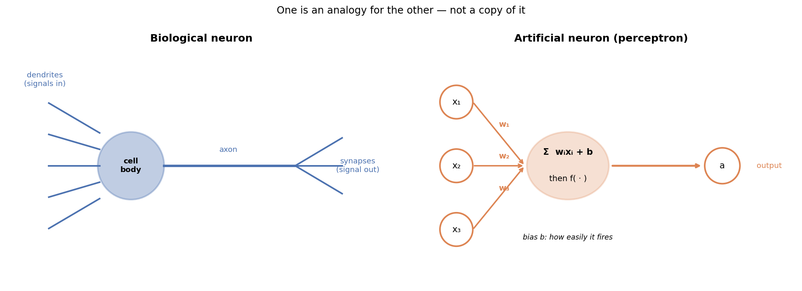
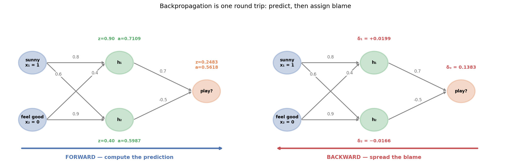
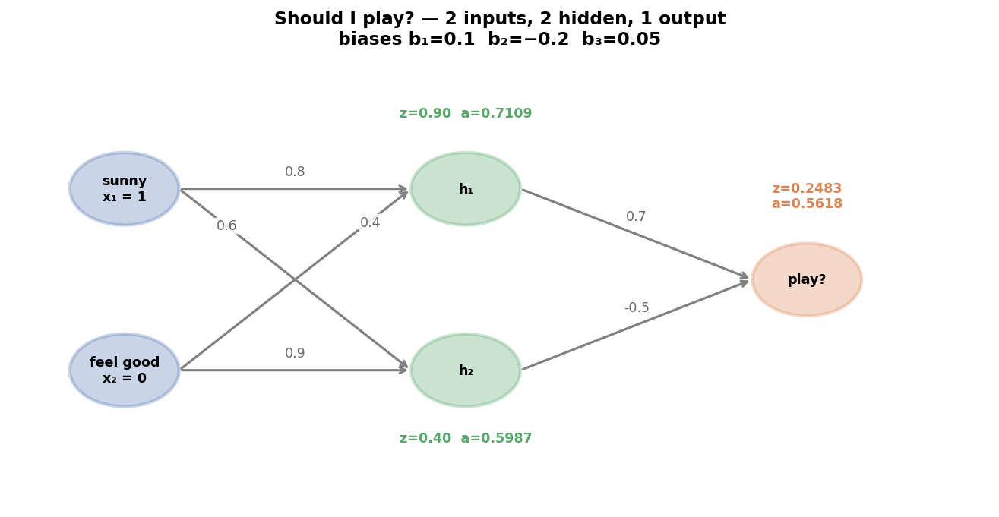
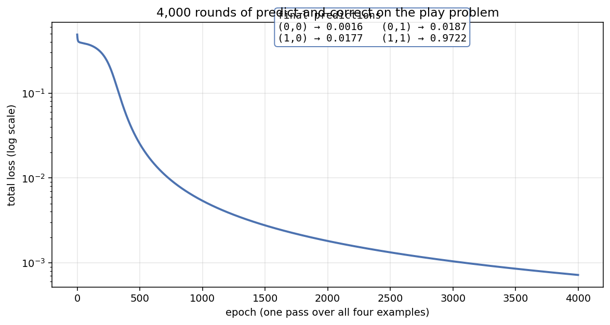
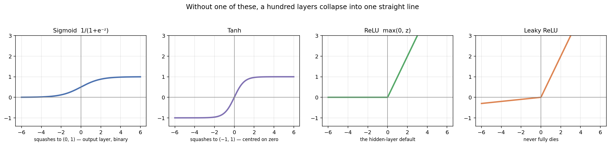
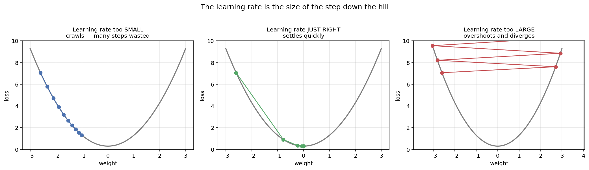
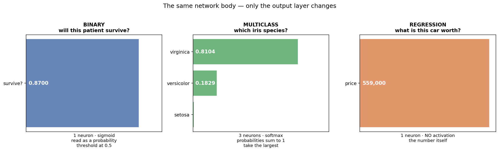

# Session 9 — Deep Learning

**Biological neurons · Perceptrons · How an ANN works · Backpropagation · Activation Functions · Loss Functions · Optimizers**

| | |
|---|---|
| **Notebook** | [session-09-deep-learning.ipynb](../notebooks/session-09-deep-learning.ipynb) |
| **Previous** | [Session 8 — Model Evaluation & Improvement](session-08-evaluation-tuning.md) |
| **Next** | [Session 10 — Generative AI & LLMs](session-10-genai-llms.md) |
| **Stuck?** | [Troubleshooting](../troubleshooting.md) |

> **This session is almost entirely concepts.** **There is exactly one piece of code, at the very end.**
>
> **Everything before it is arithmetic you can do on paper — and you should.** **A neural network is not magic; it is multiplication, addition, a squashing function, and a great deal of repetition.**

---

## 🎯 Learning outcomes

By the end of this session you can:

1. Describe a **biological neuron** and say which of its parts the artificial one borrows
2. **Map** each part of a biological neuron onto a perceptron — and name what the mapping leaves out
3. Compare ANNs and BNNs honestly
4. Explain **how a network turns inputs into an output**, layer by layer
5. Describe how a brain and a network each recognise an apple, a cat and a helmet
6. Explain **backpropagation** in words, with an analogy
7. **Compute a full forward and backward pass by hand**, including the weight updates
8. Choose an **activation function** and say why
9. Choose a **loss function** for binary, multiclass and regression problems
10. Explain what an **optimizer** does and how the learning rate changes it
11. Say exactly what the **output layer** looks like for each kind of prediction
12. Read and explain a small MLP built with scikit-learn

---

## How this session is organised

| Part | Question it answers |
|---|---|
| **A — [Where neural networks come from](#part-a--where-neural-networks-come-from)** | *Why does this design exist at all?* |
| **B — [How a network learns](#part-b--how-a-network-learns)** | *Where do the weights come from?* |
| **C — [How a network predicts](#part-c--how-a-network-predicts)** | *What comes out of the far end?* |

| # | Topic | | # | Topic |
|---|---|---|---|---|
| 1 | [The biological neuron](#1-the-biological-neuron) | | 8 | [Backpropagation by hand](#8-backpropagation-computed-by-hand) |
| 2 | [Biological → artificial](#2-from-biological-to-artificial--the-mapping) | | 9 | [Activation functions](#9-activation-functions) |
| 3 | [ANN vs BNN](#3-ann-vs-bnn) | | 10 | [Loss and cost functions](#10-loss-and-cost-functions) |
| 4 | [How an ANN works](#4-how-an-ann-works) | | 11 | [Optimization strategies](#11-optimization-strategies) |
| 5 | [Recognition in a brain](#5-recognition-in-a-brain) | | 12 | [Binary, multiclass, regression](#12-binary-multiclass-and-regression) |
| 6 | [Recognition in a network](#6-recognition-in-a-network) | | 13 | [The complete worked example](#13-the-complete-worked-example) |
| 7 | [Backpropagation, in words](#7-backpropagation-in-words) | | 14 | [A simple MLP on iris](#14-a-simple-mlp-on-iris) |

**The [practices](#-session-9--practice), [20 MCQs](#-session-9--20-mcqs) and [tasks](#-session-9--tasks) are all at the end.**

---

# Part A — Where neural networks come from

# 1. The biological neuron

**Your brain has roughly 86 billion of them. Each one does something remarkably simple.**

| Part | What it does |
|---|---|
| **Dendrites** | **Receive signals** from other neurons — thousands of them |
| **Cell body (soma)** | **Adds the incoming signals up** |
| **Threshold** | If the total is high enough, **the neuron fires** |
| **Axon** | Carries the outgoing signal away |
| **Synapses** | **Pass the signal to the next neurons — some connections are strong, some weak** |

🧠 **Analogy: a committee member who only speaks when convinced.** **They listen to many colleagues at once. Some colleagues they trust a great deal, others they mostly ignore.** **When the weighted total of what they have heard passes their personal threshold, they speak.** Otherwise they stay silent.

## The two ideas worth taking

> **1. A neuron on its own decides almost nothing.** **Intelligence is in the connections, not the cells.**
>
> **2. Learning changes the connections, not the neurons.** **When you learn something, your neurons do not change shape — the *strengths of the synapses between them* change.** A connection you use often gets stronger.

**That second sentence is the entire idea behind machine learning with neural networks.** **The whole of training is adjusting connection strengths.**

---

# 2. From biological to artificial — the mapping



**The artificial neuron — the *perceptron* — is a deliberate simplification of the biological one.**

| Biological neuron | **Artificial neuron** | What it becomes |
|---|---|---|
| **Dendrites** | **Inputs** `x₁, x₂, x₃ …` | The columns of your dataset |
| **Synapse strength** | **Weights** `w₁, w₂, w₃ …` | **The numbers the model learns** |
| **Cell body summing** | **`z = w₁x₁ + w₂x₂ + … + b`** | One multiply-and-add |
| **Firing threshold** | **Bias `b`** | How easily this neuron fires |
| **Fires or does not** | **Activation function `f(z)`** | Sigmoid, ReLU, tanh |
| **Signal down the axon** | **Output `a = f(z)`** | Passed to the next layer |
| **Learning by strengthening synapses** | **Backpropagation** | **Adjusting the weights** |

## In one line

```text
a = f( w₁x₁ + w₂x₂ + … + wₙxₙ + b )
```

> **That is the whole neuron.** **Multiply each input by its weight, add them up, add the bias, squash the result.** **Everything else in deep learning is this, repeated.**

## ⚠️ What the mapping leaves out

**The analogy is genuinely useful and genuinely loose. Be honest about the gap.**

| Real neurons | Artificial neurons |
|---|---|
| Fire in **timed spikes** | Output a single steady number |
| Chemistry, hormones, neurotransmitters | Arithmetic |
| **Grow new connections** | Fixed wiring; only the weight values change |
| Run on ~20 watts | A large model's training run uses megawatt-hours |

> **A perceptron is inspired by a neuron the way an aeroplane is inspired by a bird.** **The idea came from nature; the engineering did not.** **Nobody builds a wing that flaps.**

---

# 3. ANN vs BNN

**BNN = Biological Neural Network — a brain. ANN = Artificial Neural Network — the model.**

| | **BNN (brain)** | **ANN (model)** |
|---|---|---|
| **Units** | ~86 billion neurons | Thousands to billions of parameters |
| **Connections** | ~100 trillion synapses | Whatever the architecture defines |
| **Signals** | Electrical and **chemical** spikes | Floating-point numbers |
| **Speed per unit** | **Slow** (milliseconds) | **Fast** (nanoseconds) |
| **Processing** | **Massively parallel** | Parallel, but on far fewer cores |
| **Learning** | **From very few examples** | **Typically needs thousands** |
| **Power** | **~20 watts** | Kilowatts to megawatts |
| **Structure** | **Rewires itself** | Fixed until an engineer changes it |
| **Forgetting** | Gradual, selective | **Catastrophic — learning a new task can erase the old one** |
| **Fault tolerance** | **Very high** — neurons die daily and you continue | Corrupt the weights and it fails |
| **Generalisation** | Excellent; **transfers across domains** | Good inside its training distribution, brittle outside it |

## The honest summary

> **A child shown two photographs of a giraffe can recognise giraffes for life.** **A network typically needs thousands of images, and it will still fail on a giraffe standing in snow if it never saw one there.**
>
> **But the network can look at ten million images overnight, and never gets tired, bored, or inconsistent.**

**Neither is a better version of the other. They are good at different things, and the differences are the reason we build both.**

---

# 4. How an ANN works

**A single neuron draws a straight line. That is all it can do.** **To do anything interesting you need layers.**

```text
   INPUT LAYER          HIDDEN LAYER(S)         OUTPUT LAYER
   one neuron per       where the actual        one neuron for a number
   feature              work happens            or a yes/no; n for n classes

     x₁ ─┐              ┌── h₁ ──┐
         ├──────────────┤        ├──────────── output
     x₂ ─┘              └── h₂ ──┘
```

## The three layers, and what each is for

| Layer | Job |
|---|---|
| **Input** | **Holds the features. It does no computation** — one neuron per column |
| **Hidden** | **Builds combinations of the inputs.** More neurons = more combinations it can represent |
| **Output** | **Produces the answer** in the shape the problem needs — see [§12](#12-binary-multiclass-and-regression) |

## Forward propagation, in three sentences

> **1.** Each hidden neuron multiplies every input by its own weight, adds them up, adds its bias, and squashes the result.
>
> **2.** The output neuron does exactly the same thing, using the hidden neurons' outputs as *its* inputs.
>
> **3.** The number that comes out is the prediction.

**That is called the *forward pass*, and it is all a trained network ever does when you use it.**

## 🧠 Analogy: a hospital triage chain

> **The receptionist** records raw facts: temperature, blood pressure, age. *(input layer)*
>
> **The nurse** combines them into judgements nobody wrote down explicitly — "this person looks feverish", "this person looks in shock". *(hidden layer)*
>
> **The doctor** listens only to the nurse's judgements, not the raw numbers, and decides: admit or send home. *(output layer)*
>
> **Nobody ever defined "looks feverish".** **The nurse worked it out from experience** — which is exactly what a hidden layer does, and why its neurons have no names.

## Why hidden layers are necessary

**Some problems cannot be separated by any straight line.**

```text
XOR:   (0,0) -> 0      (0,1) -> 1
       (1,0) -> 1      (1,1) -> 0

Plot those four points. The 1s are on one diagonal, the 0s on the other.
No single straight line separates them. One neuron therefore CANNOT solve XOR.
Two hidden neurons can, because between them they bend the space.
```

> **This is the historical turning point.** **The perceptron was invented in 1958, and in 1969 it was shown it could not learn XOR.** Funding collapsed. **The fix — hidden layers trained by backpropagation — took until the 1980s to become practical.**

## ⚠️ A stack of layers with no activation function is still one line

**If each layer only multiplies and adds, then two layers in a row are:**

```text
(X · W₁ + b₁) · W₂ + b₂   =   X · (W₁ · W₂) + (b₁ · W₂ + b₂)   =   X · W' + b'
```

> **A hundred linear layers collapse algebraically into a single linear layer.** **The non-linearity in the activation function is the only thing that makes depth worth having** — see [§9](#9-activation-functions).

---

# 5. Recognition in a brain

**Before looking at how a network recognises an apple, look at how you do.**

## Apple vs orange

| Stage | What happens in your visual system |
|---|---|
| **Light hits the retina** | Raw brightness and colour — no meaning yet |
| **Early visual cortex (V1)** | **Edges, corners, orientation.** Neurons that fire only for a line at a particular angle |
| **Mid-level (V2, V4)** | **Curves, textures, colour patches.** "Round-ish", "shiny", "orange-coloured" |
| **High-level (IT cortex)** | **Whole objects.** Neurons that fire for *an apple*, whatever the angle or lighting |
| **Decision** | "Apple." |

> **The key fact: nobody taught you a rule.** **You were never told "apples are 7cm across with a stem".** **You saw apples, and the connections that fired when someone said "apple" got stronger.**

## Cat vs dog

**Harder, and instructive because it is harder.** **Both are furry quadrupeds with four legs, two ears and a tail.**

**Your brain does not use one feature — it combines dozens of weak ones:** ear shape, snout length, how the body moves, eye placement, the way the head sits on the neck.

> **No single one of those is decisive.** **A flat-faced dog breed can fool you for a moment.** **The judgement is a weighted vote across many features — which is exactly the shape of a neural network's computation.**

## Helmet vs no helmet

**A safety-camera problem: is this rider wearing a helmet?**

| Stage | Signal |
|---|---|
| **Early** | Edges around the head region |
| **Mid** | A smooth curved surface; a hard rim; a chin strap |
| **High** | **"There is a helmet-shaped object on that head"** |
| **Decision** | Helmet / no helmet |

> **Notice how much context your brain uses that a rule never would.** **A hat is round and on a head too.** **You separate them on hardness, gloss, the visor and the strap — none of which anybody listed for you.**

---

# 6. Recognition in a network

**A convolutional network trained on these problems builds a strikingly similar hierarchy — not because anyone designed it that way, but because it is what the data forces.**

| Layer depth | What the network's neurons respond to | Brain equivalent |
|---|---|---|
| **Layer 1** | **Edges and colour blobs** | V1 |
| **Layer 2** | Corners, curves, simple textures | V2 |
| **Layer 3–4** | **Object parts** — a wheel, an ear, a rim | V4 |
| **Final layers** | **Whole objects** | IT cortex |
| **Output** | A probability per class | The decision |

> **This is one of the genuinely remarkable results in the field.** **Nobody told the network to detect edges first.** **It was shown pictures and told whether it was right, and edge detectors are what emerged.**

## The three problems, side by side

| Problem | What the network learns to use | Where it goes wrong |
|---|---|---|
| **Apple vs orange** | **Colour and surface texture.** Easy — the classes barely overlap | **A green apple** if it only ever saw red ones |
| **Cat vs dog** | Dozens of weak shape cues combined | **Unusual breeds**; a cat in an odd pose |
| **Helmet vs no helmet** | Rim, gloss, strap, curvature | **A cap or a turban**; poor light; a helmet carried rather than worn |

## ⚠️ It learns what correlates, not what matters

> **If every helmet photograph in your training data was taken on a construction site and every bare head in an office, the network may learn "construction site → helmet".** **It will score beautifully on your test set and fail on the first office visitor wearing a helmet.**
>
> **This is [Session 8](session-08-evaluation-tuning.md#4-why-the-smallest-model-won)'s leaky `time` column in visual form.** **A network cannot tell the difference between the reason and a reliable coincidence. Only you can.**

---

# Part B — How a network learns

# 7. Backpropagation, in words

**A freshly built network has random weights. Its first prediction is worthless.** **Backpropagation is how it stops being worthless.**

## The loop

```text
1. FORWARD    push the inputs through and get a prediction
2. LOSS       measure how wrong it was — one number
3. BACKWARD   work out, for every weight, whether increasing it
              would make the loss better or worse, and by how much
4. UPDATE     nudge every weight a little in the improving direction
5. REPEAT     thousands of times
```

> **That is the entire algorithm.** **Everything else — activation functions, optimizers, architectures — is detail hung on this frame.**

## 🧠 Analogy: a restaurant kitchen after a bad review

> **The dish went out and the customer said it was too salty.** *(the loss)*
>
> **The head chef does not throw the kitchen away.** She works backwards: **the sauce station added the most salt, so most of the blame goes there. The garnish added a little, so a little blame goes there. The person who washed the vegetables gets none.**
>
> **Each station is then told to adjust *in proportion to its share of the blame*.** **Nobody changes their whole method — everyone changes a little.**
>
> **One dish is not enough to learn from. A thousand dishes, each with feedback, is.**

**That is backpropagation:** **the error at the output is divided up backwards through the network, in proportion to how much each weight contributed to it.**

## 🧠 A second analogy: walking downhill in fog

> **You are on a hillside in thick fog and want to reach the bottom. You cannot see the valley.**
>
> **But you can feel the slope under your feet.** **Take a step in the steepest downhill direction, then feel again, then step again.**
>
> **The slope is the gradient. The step size is the learning rate. The valley is the minimum loss.**
>
> **You may end up in a small dip rather than the true valley floor — a local minimum. In practice, for large networks, this matters far less than people expect.**

## Why it is called *back*propagation

**The output layer's error is easy: you know the prediction and you know the answer.**

**A hidden neuron's error is not obvious — nobody told you what `h₁` *should* have output.**

> **Backpropagation solves this by the chain rule:** **a hidden neuron's share of the blame is the output's blame, multiplied by the weight connecting them, multiplied by how sensitive that neuron was.**
>
> **The blame flows backwards along the same wires the signal came forwards along.**



## The three words you need

| Term | Meaning |
|---|---|
| **Gradient** | **The slope: how much the loss changes if this weight changes a little** |
| **Learning rate** | **How big a step to take.** Usually 0.001 to 0.1 |
| **Epoch** | **One complete pass through the training data** |

---

# 8. Backpropagation, computed by hand

> **This is the section to do with a calculator. Everything here is arithmetic.**

**The network: 2 inputs → 2 hidden → 1 output, sigmoid everywhere.**



## The setup

| | Value |
|---|---|
| **Inputs** | `x₁ = 1` (sunny), `x₂ = 0` (not feeling good) |
| **Target** | `y = 0` — do not play |
| **Input → hidden weights** | `w₁ = 0.8` (x₁→h₁), `w₂ = 0.6` (x₁→h₂), `w₃ = 0.4` (x₂→h₁), `w₄ = 0.9` (x₂→h₂) |
| **Hidden biases** | `b₁ = 0.1`, `b₂ = −0.2` |
| **Hidden → output weights** | `w₅ = 0.7` (h₁→o), `w₆ = −0.5` (h₂→o) |
| **Output bias** | `b₃ = 0.05` |
| **Learning rate** | `η = 0.5` |
| **Activation** | sigmoid, `σ(z) = 1 / (1 + e⁻ᶻ)` |
| **Loss** | `L = ½(a − y)²` |

> **Why ½ squared error and not cross-entropy?** **Because its derivative is simply `(a − y)`, which keeps the arithmetic readable.** **A real binary classifier uses binary cross-entropy — and [§10](#10-loss-and-cost-functions) shows that only this first derivative changes. Every other step below is identical.**

---

## Step 1 — Forward pass

### Hidden neuron 1

```text
z₁ = w₁·x₁ + w₃·x₂ + b₁
   = 0.8(1) + 0.4(0) + 0.1
   = 0.9

a₁ = σ(0.9) = 1 / (1 + e⁻⁰·⁹) = 1 / (1 + 0.4066) = 0.7109
```

### Hidden neuron 2

```text
z₂ = w₂·x₁ + w₄·x₂ + b₂
   = 0.6(1) + 0.9(0) − 0.2
   = 0.4

a₂ = σ(0.4) = 1 / (1 + e⁻⁰·⁴) = 1 / (1 + 0.6703) = 0.5987
```

### Output neuron

```text
z₀ = w₅·a₁ + w₆·a₂ + b₃
   = 0.7(0.7109) + (−0.5)(0.5987) + 0.05
   = 0.4976 − 0.2994 + 0.05
   = 0.2483

a₀ = σ(0.2483) = 0.5618
```

### The loss

```text
L = ½ (a₀ − y)²  =  ½ (0.5618 − 0)²  =  ½ (0.3156)  =  0.1578
```

> **The network says 0.5618 — "probably play". The answer is 0.** **It is wrong, and now it has a number saying how wrong.**

---

## Step 2 — Backward pass, output layer

**Two derivatives, multiplied together.**

```text
∂L/∂a₀ = a₀ − y        = 0.5618 − 0    = 0.5618
∂a₀/∂z₀ = a₀(1 − a₀)   = 0.5618 × 0.4382 = 0.2462

δ₀ = ∂L/∂z₀ = 0.5618 × 0.2462 = 0.13830
```

**`δ₀` is the output neuron's share of the blame. Now hand it to each incoming weight, in proportion to what that weight carried.**

```text
∂L/∂w₅ = δ₀ × a₁ = 0.13830 × 0.7109 = 0.09832
∂L/∂w₆ = δ₀ × a₂ = 0.13830 × 0.5987 = 0.08280
∂L/∂b₃ = δ₀ × 1  =                    0.13830
```

> **Read that pattern, because it is the whole of backpropagation:**
>
> **the gradient for a weight = the blame at the neuron it feeds × the value that flowed along it.**
>
> **A weight carrying a large signal gets a large share of the blame. A bias always carries 1, so its gradient is the blame itself.**

---

## Step 3 — Backward pass, hidden layer

**Nobody told us what `h₁` should have output. The chain rule supplies it.**

```text
δ₁ = δ₀ × w₅ × a₁(1 − a₁)
   = 0.13830 × 0.7 × (0.7109 × 0.2891)
   = 0.13830 × 0.7 × 0.20552
   = +0.019894

δ₂ = δ₀ × w₆ × a₂(1 − a₂)
   = 0.13830 × (−0.5) × (0.5987 × 0.4013)
   = 0.13830 × (−0.5) × 0.24026
   = −0.016614
```

**Three factors, and each one means something:**

| Factor | What it says |
|---|---|
| `δ₀` | **How wrong the output was** |
| `w₅` | **How much this neuron influenced that output** |
| `a(1 − a)` | **How sensitive this neuron was** — the slope of its sigmoid |

> ⚠️ **Notice `δ₂` is negative while `δ₁` is positive.** **`h₂` is connected by a negative weight (−0.5), so it should move the opposite way.** **The sign carries the direction; the size carries the responsibility.**

**Now the input-layer gradients:**

```text
∂L/∂w₁ = δ₁ × x₁ = 0.019894 × 1 = +0.019894
∂L/∂w₂ = δ₂ × x₁ = −0.016614 × 1 = −0.016614
∂L/∂w₃ = δ₁ × x₂ = 0.019894 × 0 =  0
∂L/∂w₄ = δ₂ × x₂ = −0.016614 × 0 =  0
∂L/∂b₁ = δ₁ =                      +0.019894
∂L/∂b₂ = δ₂ =                      −0.016614
```

> ⚠️ **`w₃` and `w₄` have gradient exactly zero, because `x₂ = 0`.**
>
> **An input that was zero taught the network nothing about its own weights on this example.** **You cannot learn how much "feeling good" matters from an example where you did not feel good.**
>
> **This is a real effect, not a quirk of the numbers** — and it is one reason data with many zeros trains slowly.

---

## Step 4 — Update every weight

```text
new weight = old weight − learning rate × gradient
```

| Weight | Old | Gradient | New |
|---|---|---|---|
| `w₁` (x₁→h₁) | 0.8 | +0.019894 | **0.790053** |
| `w₂` (x₁→h₂) | 0.6 | −0.016614 | **0.608307** |
| `w₃` (x₂→h₁) | 0.4 | **0** | **0.4 — unchanged** |
| `w₄` (x₂→h₂) | 0.9 | **0** | **0.9 — unchanged** |
| `w₅` (h₁→o) | 0.7 | +0.098323 | **0.650839** |
| `w₆` (h₂→o) | −0.5 | +0.082797 | **−0.541399** |
| `b₁` | 0.1 | +0.019894 | **0.090053** |
| `b₂` | −0.2 | −0.016614 | **−0.191693** |
| `b₃` | 0.05 | +0.138298 | **−0.019149** |

> **The minus sign is the whole point.** **The gradient points uphill — the direction that makes the loss worse — so you step the other way.** That is why it is called *gradient descent*.

## Step 5 — Did it help?

**Run the forward pass again with the new weights:**

| | Before | **After one update** |
|---|---|---|
| Prediction | 0.5618 | **0.5286** |
| Loss | 0.1578 | **0.1397** |

> **Target is 0, and the prediction moved from 0.5618 towards it. The loss fell by 11%.**
>
> **One example, one step, one small improvement.** **Now do that a few thousand times.**

## After 4,000 rounds on all four cases

**Give the same tiny network all four combinations of (sunny, feeling good), with the rule *play only if both are true*.**



| sunny | feel good | target | **network's output** |
|---|---|---|---|
| 0 | 0 | 0 | **0.0016** |
| 0 | 1 | 0 | **0.0187** |
| 1 | 0 | 0 | **0.0177** |
| 1 | 1 | 1 | **0.9722** |

> **Nine numbers — six weights and three biases — learned the rule from nothing but examples and corrections.**
>
> **Notice it never reaches exactly 0 and 1.** **A sigmoid cannot: it approaches them but never arrives.** **The loss curve flattens rather than hitting zero, and that is the expected shape, not a failure.**

---

# 9. Activation functions

**The squashing step. Without it, [§4](#4-how-an-ann-works) showed that any stack of layers collapses into a single straight line.**

🧠 **Analogy: a dimmer switch versus a light switch.** **A plain sum is a dimmer — smoothly proportional, and endlessly linear.** **An activation function adds a decision: below a point, almost nothing; above it, a strong response.** **That threshold behaviour is what lets layers build on each other.**



## The four you need

| Function | Formula | Range | Use it |
|---|---|---|---|
| **Sigmoid** | `1 / (1 + e⁻ᶻ)` | **(0, 1)** | **Output layer, binary classification** |
| **Tanh** | `(eᶻ − e⁻ᶻ)/(eᶻ + e⁻ᶻ)` | **(−1, 1)** | Hidden layers, older networks |
| **ReLU** | **`max(0, z)`** | **[0, ∞)** | **Hidden layers — the modern default** |
| **Softmax** | `eᶻⁱ / Σeᶻʲ` | (0, 1), **sums to 1** | **Output layer, multiclass** |

**What they actually do to a few numbers:**

| input z | −2.0 | −0.5 | 0.0 | 0.5 | 2.0 |
|---|---|---|---|---|---|
| **sigmoid** | 0.1192 | 0.3775 | **0.5** | 0.6225 | 0.8808 |
| **tanh** | −0.9640 | −0.4621 | **0.0** | 0.4621 | 0.9640 |
| **ReLU** | **0** | **0** | 0 | 0.5 | 2.0 |
| **Leaky ReLU** | −0.02 | −0.005 | 0 | 0.5 | 2.0 |

## Why ReLU won

**It looks almost too simple — "if negative, output zero" — and it beat the elegant sigmoid comprehensively.**

| Reason | Explanation |
|---|---|
| **No vanishing gradient** | **Sigmoid's slope `a(1−a)` peaks at 0.25 and approaches 0 at both ends.** Multiply ten of those together through ten layers and the gradient is ~0.0000001. **The early layers stop learning.** ReLU's slope is exactly 1 wherever it is active |
| **Cheap** | A comparison against zero. No exponentials |
| **Sparse** | About half the neurons output zero, which acts like free regularisation |

> **Look back at the hand computation: `a₁(1 − a₁) = 0.2055`.** **That factor appears once per layer.** **Two layers means 0.2055 × 0.2055 ≈ 0.042 — the signal is already down to 4%.** **That is the vanishing gradient problem, visible in the arithmetic you just did.**

### ⚠️ And ReLU's own problem

> **A neuron whose input is always negative outputs 0 forever, and its gradient is 0 forever, so it can never recover. It is a *dead neuron*.**
>
> **Leaky ReLU** — `max(0.01z, z)` — **exists precisely to keep a small slope on the negative side so the neuron can come back.**

## Choosing one

| Where | Use |
|---|---|
| **Hidden layers** | **ReLU.** Start here every time |
| Hidden layers, if neurons are dying | **Leaky ReLU** |
| **Output, binary classification** | **Sigmoid** |
| **Output, multiclass** | **Softmax** |
| **Output, regression** | **None at all** |

---

# 10. Loss and cost functions

**The loss function is the single number that says how wrong the network is. It is what backpropagation minimises — so it defines what the network is actually trying to do.**

🧠 **Analogy: the marking scheme decides how students study.** **Mark only on spelling and you get beautifully spelled nonsense.** **The loss function is your marking scheme, and the network will optimise exactly what it says — not what you meant.**

| Term | Meaning |
|---|---|
| **Loss** | The error on **one example** |
| **Cost** | **The average loss over the whole batch or dataset** |

## The three you need

| Problem | Loss function | Formula |
|---|---|---|
| **Regression** | **Mean Squared Error (MSE)** | `mean((y − ŷ)²)` |
| **Binary classification** | **Binary cross-entropy** | `−[y·log(ŷ) + (1−y)·log(1−ŷ)]` |
| **Multiclass classification** | **Categorical cross-entropy** | `−Σ yᵢ·log(ŷᵢ)` |

## Why cross-entropy, and not squared error, for classification

**Take the hand-computed example: the network predicted 0.5618 and the answer was 0.**

| Loss | Value |
|---|---|
| ½ squared error | **0.1578** |
| Binary cross-entropy | **0.8250** |

**Now imagine a worse prediction — the network says 0.99 and the answer is 0:**

| Loss | Value |
|---|---|
| ½ squared error | 0.4900 — **3.1× worse** |
| Binary cross-entropy | 4.6052 — **5.6× worse** |

> **Cross-entropy punishes *confident* mistakes far more harshly.** **Being 99% sure and wrong should hurt much more than being 56% sure and wrong — and squared error barely notices the difference.**
>
> **There is a second reason, visible in the arithmetic you did.** **With squared error the output gradient carries an `a(1−a)` factor, which is near zero when the network is confidently wrong — so it learns *slowest* exactly when it is most wrong.** **Cross-entropy cancels that factor. The gradient becomes simply `(a − y)`.**

## Choosing one

| If your output layer is… | Use |
|---|---|
| **1 neuron, no activation** | **MSE** (or MAE if you have outliers) |
| **1 neuron, sigmoid** | **Binary cross-entropy** |
| **n neurons, softmax** | **Categorical cross-entropy** |

> ⚠️ **The output activation and the loss function are a matched pair.** **Sigmoid with MSE will train — badly. Softmax with MSE will train — badly.** Getting this pairing wrong is one of the most common beginner errors, and it produces a model that works just well enough to hide the mistake.

---

# 11. Optimization strategies

**Backpropagation computes the gradients. The *optimizer* decides what to do with them.**

## Gradient descent, and the learning rate

```text
new weight = old weight − learning rate × gradient
```

**Everything hangs on that learning rate.**



| Learning rate | What happens |
|---|---|
| **Too small** | **It works, very slowly.** Thousands of wasted epochs |
| **About right** | Settles into the valley in a reasonable number of steps |
| **Too large** | **It overshoots the valley, bounces to the other side, and diverges.** The loss goes *up* |

> **A loss that rises instead of falling is almost always a learning rate that is too high.** **That is the first thing to check.**

## How much data per step?

| Variant | Updates weights after | Trade-off |
|---|---|---|
| **Batch gradient descent** | **The whole dataset** | Smooth, accurate, **slow, and impossible on large data** |
| **Stochastic (SGD)** | **Every single example** | Fast and noisy; **the noise can help escape shallow dips** |
| **Mini-batch** | **A batch of 32–256** | **What everyone actually uses** — most of the smoothness, most of the speed |

## The optimizers you will meet

| Optimizer | The idea | 🧠 Analogy |
|---|---|---|
| **SGD** | Step straight downhill | **Walking downhill, one careful step at a time** |
| **SGD + Momentum** | Keep some of the previous step's direction | **A ball rolling downhill** — it builds speed and rolls through small bumps |
| **RMSProp** | Give each weight its own step size, based on its recent gradients | **A different-sized step for each leg**, depending on the terrain each one is on |
| **Adam** | **Momentum + RMSProp together** | **A rolling ball that also adjusts each leg** — and it is the default for a reason |

> **Use Adam unless you have a reason not to.** **It converges fast, needs little tuning, and its default learning rate of 0.001 is a sensible starting point for most problems.**

## Epochs, batches and iterations — three words people confuse

```text
Dataset: 1,000 examples,  batch size 100,  training for 5 epochs

1 batch      = 100 examples          -> ONE weight update
1 epoch      = 10 batches            -> 10 weight updates
5 epochs     = 50 batches            -> 50 weight updates total
```

| Term | Definition |
|---|---|
| **Epoch** | **One complete pass through all the training data** |
| **Batch** | How many examples are used for **one** weight update |
| **Iteration** | **One weight update** |

## ⚠️ And Session 8 still applies

> **More epochs is not better.** **A network trained long enough will memorise its training set exactly** — [Session 8](session-08-evaluation-tuning.md#3-reading-the-gap)'s overfitting, in a new costume.
>
> **Watch the validation loss, not the training loss.** **When the training loss keeps falling and the validation loss starts rising, stop.** That is what *early stopping* means.

---

# Part C — How a network predicts

# 12. Binary, multiclass and regression

**The body of a network is the same for all three problems. Only the output layer and the loss change.**



| | **Binary** | **Multiclass** | **Regression** |
|---|---|---|---|
| Question | *Will this patient survive?* | *Which iris species?* | *What is this car worth?* |
| **Output neurons** | **1** | **one per class** | **1** |
| **Output activation** | **Sigmoid** | **Softmax** | **None** |
| **What comes out** | A probability, 0 to 1 | Probabilities that **sum to 1** | **The number itself** |
| **Loss** | Binary cross-entropy | Categorical cross-entropy | MSE |
| Reading it | **Above 0.5 → yes** | **Take the largest** | Use it as-is |

---

## Binary — one number, read as a probability

**The network outputs `0.87`.**

```text
0.87  ->  "87% confident this is class 1"
          threshold at 0.5  ->  predict class 1
```

> **The threshold is yours to choose, and 0.5 is only a default.** **[Session 5B](session-05b-classification.md) argued this: if a miss is expensive — a missed cancer, a missed fraud — lower the threshold to 0.3 and accept more false alarms.**
>
> **The network gives you a probability. Turning it into a decision is a business choice, not a mathematical one.**

---

## Multiclass — one neuron per class, softmax across them

**Three iris species means three output neurons. Suppose their raw scores are:**

```text
raw scores (z):    setosa  2.0      versicolor  1.0      virginica  0.1
```

**Softmax turns them into probabilities:**

```text
e² = 7.389     e¹ = 2.718     e⁰·¹ = 1.105        total = 11.212

setosa      7.389 / 11.212 = 0.659
versicolor  2.718 / 11.212 = 0.242
virginica   1.105 / 11.212 = 0.099
                             ─────
                             1.000
```

> **Two things softmax does that a bare score cannot.**
>
> **1. The outputs sum to exactly 1**, so they can be read as probabilities.
> **2. Exponentiating exaggerates the winner.** The raw scores were 2.0 and 1.0 — a factor of 2. The probabilities are 0.659 and 0.242 — a factor of 2.7. **Softmax is deliberately opinionated.**

**A real example from [§14](#14-a-simple-mlp-on-iris)'s trained network, on one test flower:**

```text
setosa 0.0067    versicolor 0.1829    virginica 0.8104   ->  predict virginica
```

> ⚠️ **Read the second number.** **0.18 for versicolor means the network is not certain.** **Compare with another flower where setosa scored 0.9992 — that one it is sure about.** **The probabilities are information, and taking only `argmax` throws it away.**

---

## Regression — one neuron, and no activation at all

**The output is the prediction. No squashing.**

```text
output neuron:  z = 559000   ->   predicted price ₹559,000
```

> ⚠️ **This is the mistake to avoid: putting a sigmoid on a regression output.** **A sigmoid can only ever produce a number between 0 and 1**, so your car price predictions will all be between ₹0 and ₹1. The model will train, the loss will fall, and every prediction will be wrong in the same absurd way.
>
> **No activation means the neuron can output any real number, which is what a price needs.**

## The summary you should memorise

| Problem | Output neurons | Activation | Loss |
|---|---|---|---|
| **Binary classification** | 1 | **sigmoid** | **binary cross-entropy** |
| **Multiclass classification** | n | **softmax** | **categorical cross-entropy** |
| **Regression** | 1 | **none** | **MSE** |

---

# 13. The complete worked example

**Everything in Parts A and B, on one problem, end to end.**

## The problem

> **Should I go out and play?** **Two things matter: is it sunny, and am I feeling good?** **The rule is: play only when both are true.**

**Nobody gives the network the rule. It gets four examples and corrections.**

| sunny (x₁) | feel good (x₂) | play (y) |
|---|---|---|
| 0 | 0 | 0 |
| 0 | 1 | 0 |
| 1 | 0 | 0 |
| 1 | 1 | **1** |

## The architecture, and why

| Layer | Neurons | Why |
|---|---|---|
| **Input** | **2** | One per feature — sunny, feel good |
| **Hidden** | **2** | **One neuron cannot do this on its own** — see below |
| **Output** | **1**, sigmoid | Binary: play or not |

**Total learnable numbers: 6 weights + 3 biases = 9.**

## ⚠️ Why the hidden layer is needed even here

**"Play only if both" is the AND rule, and AND *is* separable by a single straight line — so one neuron could learn it.**

**But change the rule to "play if exactly one of them is true" — XOR — and no straight line works:**

```text
   feel good
      1 |   ●(0,1)=1        ○(1,1)=0
        |
      0 |   ○(0,0)=0        ●(1,0)=1
        +──────────────────────────── sunny
            0                1

   The 1s are on one diagonal, the 0s on the other.
   Draw any straight line. You cannot separate them.
```

> **Two hidden neurons can, because each one draws its own line and the output neuron combines them.** **That is what "hidden layers bend the space" means, concretely.**
>
> **The two-hidden-neuron design is used here because it handles both rules** — and because a network you would actually build has hidden layers.

## Forward pass — one example, by hand

**Take `x₁ = 1, x₂ = 0` (sunny, but not feeling good). The answer should be 0.**

**[§8](#8-backpropagation-computed-by-hand) works this through in full. In summary:**

| Step | Computation | Result |
|---|---|---|
| Hidden 1 | `0.8(1) + 0.4(0) + 0.1` then σ | `z₁ = 0.9`, **`a₁ = 0.7109`** |
| Hidden 2 | `0.6(1) + 0.9(0) − 0.2` then σ | `z₂ = 0.4`, **`a₂ = 0.5987`** |
| Output | `0.7(0.7109) − 0.5(0.5987) + 0.05` then σ | `z₀ = 0.2483`, **`a₀ = 0.5618`** |
| Decision | 0.5618 > 0.5 | **"play"** |
| Truth | | **wrong** |

## Backward pass and update

| | Value |
|---|---|
| Loss | 0.1578 |
| Output blame `δ₀` | 0.13830 |
| Hidden blames | `δ₁ = +0.0199`, `δ₂ = −0.0166` |
| Weights changed | **7 of 9** — `w₃` and `w₄` have zero gradient because `x₂ = 0` |
| New prediction | **0.5286** (was 0.5618) |
| New loss | **0.1397** (was 0.1578) |

## After training

| sunny | feel good | target | **output** | decision |
|---|---|---|---|---|
| 0 | 0 | 0 | 0.0016 | don't play ✅ |
| 0 | 1 | 0 | 0.0187 | don't play ✅ |
| 1 | 0 | 0 | 0.0177 | don't play ✅ |
| 1 | 1 | 1 | **0.9722** | **play** ✅ |

> **Nine numbers learned a rule nobody wrote down.**
>
> **And that is the honest scale of it: nine numbers for a toy problem. A large language model has hundreds of billions — doing exactly this, at exactly this level of arithmetic, an enormous number of times.**

---

# 14. A simple MLP on iris

**The one piece of code in this session. Everything above, done by scikit-learn.**

**MLP = Multi-Layer Perceptron — the plain, fully connected network of Parts A and B.**

```python
from sklearn.datasets import load_iris
from sklearn.model_selection import train_test_split
from sklearn.preprocessing import StandardScaler
from sklearn.pipeline import make_pipeline
from sklearn.neural_network import MLPClassifier
from sklearn.metrics import accuracy_score, confusion_matrix, classification_report

iris = load_iris()
X, y = iris.data, iris.target                 # 150 flowers, 4 measurements, 3 species

X_train, X_test, y_train, y_test = train_test_split(
    X, y, test_size=0.2, random_state=42, stratify=y)

model = make_pipeline(
    StandardScaler(),
    MLPClassifier(hidden_layer_sizes=(8,),    # ONE hidden layer of 8 neurons
                  activation="relu",          # hidden-layer activation
                  solver="adam",              # the optimizer
                  max_iter=2000,
                  random_state=42))

model.fit(X_train, y_train)
y_pred = model.predict(X_test)

print("Test accuracy:", round(accuracy_score(y_test, y_pred), 4))
print(confusion_matrix(y_test, y_pred))
print(classification_report(y_test, y_pred, target_names=iris.target_names))
```

**Output:**

```text
Test accuracy: 0.9333

[[10  0  0]
 [ 0  9  1]
 [ 0  1  9]]

              precision    recall  f1-score   support
      setosa       1.00      1.00      1.00        10
  versicolor       0.90      0.90      0.90        10
   virginica       0.90      0.90      0.90        10
    accuracy                           0.93        30
```

## Every argument, explained

| Argument | What it means, in this session's language |
|---|---|
| `hidden_layer_sizes=(8,)` | **One hidden layer with 8 neurons.** `(16, 8)` would be two layers |
| `activation="relu"` | **[§9](#9-activation-functions)'s default** for hidden layers |
| `solver="adam"` | **[§11](#11-optimization-strategies)'s optimizer.** Momentum + per-weight step sizes |
| `max_iter=2000` | The maximum number of **epochs** |
| `random_state=42` | **The initial weights are random** — fix the seed or you get a different network each run |
| `StandardScaler()` first | Inside the pipeline, so it refits on every fold — **[Session 8](session-08-evaluation-tuning.md#17-the-two-leaks-that-make-every-number-a-lie)'s rule** |

## What scikit-learn worked out on its own

```python
mlp = model.named_steps["mlpclassifier"]
print("layer shapes    :", [c.shape for c in mlp.coefs_])
print("total parameters:", sum(c.size for c in mlp.coefs_) + sum(b.size for b in mlp.intercepts_))
print("epochs run      :", mlp.n_iter_)
print("final loss      :", round(mlp.loss_, 6))
print("output activation:", mlp.out_activation_)
```

**Output:**

```text
layer shapes    : [(4, 8), (8, 3)]
total parameters: 67
epochs run      : 1271
final loss      : 0.088921
output activation: softmax
```

**Read that output against [§12](#12-binary-multiclass-and-regression):**

| What it says | Why |
|---|---|
| `(4, 8)` | **4 inputs → 8 hidden neurons.** The 4 came from the data |
| `(8, 3)` | **8 hidden → 3 outputs.** The 3 came from the three species |
| `softmax` | **Chosen automatically, because there are 3 classes** |
| **67 parameters** | (4×8 + 8) + (8×3 + 3) = 40 + 27. **Compare with the 9 in §13** |
| **1,271 epochs** | It stopped early — the loss stopped improving before the 2,000 limit |

## Reading the probabilities

```python
import numpy as np
probs = model.predict_proba(X_test[:3])
print(np.round(probs, 4))
```

**Output:**

```text
[[0.9992 0.0008 0.    ]
 [0.0067 0.1829 0.8104]
 [0.0746 0.9023 0.0231]]
```

> **Three rows, three probabilities each, each row summing to 1 — softmax at work.**
>
> **Flower 1: the network is certain (0.9992).** **Flower 2: it says virginica at 0.81, but gives versicolor 0.18 — it is hedging, and versicolor and virginica are the two species that genuinely overlap.**
>
> **`predict()` throws that away and returns one label.** **`predict_proba()` tells you how much to trust it.**

## ⚠️ Two honest notes

**How many hidden neurons?** **Measured with 5-fold cross-validation on this data:**

| Hidden layer | CV accuracy |
|---|---|
| `(2,)` | **0.9000** |
| `(4,)` | 0.9533 |
| `(8,)` | 0.9533 |
| `(16,)` | 0.9533 |
| `(8, 8)` | 0.9600 |

> **Two neurons is too few. Four is enough. Eight, sixteen and two layers buy nothing.** **Capacity beyond what the problem needs is not free — it is [Session 8](session-08-evaluation-tuning.md#5-use-case-2--car-prices)'s overfitting risk with no upside.**

**Does scaling help?** **On this dataset, measured: scaled 0.9533, unscaled 0.9733 in cross-validation.**

> **Unscaled scored slightly *higher* — because all four iris columns are centimetres with similar ranges, so there was nothing for scaling to fix.**
>
> **Keep the scaler anyway.** **It converged in 1,271 epochs scaled against 1,690 unscaled, and on any dataset mixing rupees with years it would not be optional.** **The rule is right; this dataset just does not need it.**

## ⚠️ And the biggest note of all

> **A network is not the right first tool for a 150-row table.** **[Session 5B](session-05b-classification.md)'s Random Forest and SVM reach the same accuracy on iris, train in a fraction of the time, and can tell you which features they used.**
>
> **Neural networks earn their place on images, audio, and text — data where the useful features are not columns anyone could write down.** **On a spreadsheet, start with a tree.**

---

# ✏️ Session 9 — Practice

**Most of these are pen-and-paper. That is the point.**

## The neuron and the network

1. **Draw a biological neuron** and label its five parts. **Next to each, write the artificial-neuron equivalent.**
2. A neuron has inputs `x₁ = 2, x₂ = −1, x₃ = 3`, weights `w₁ = 0.5, w₂ = 1.0, w₃ = −0.5`, bias `b = 0.2`. **Compute `z`, then `σ(z)` and `ReLU(z)`.**
3. **Name three things a brain does that an ANN cannot**, and two things an ANN does better.
4. **Explain to a non-technical friend, in four sentences, what a hidden layer is for.** Use an analogy of your own.
5. Plot the four XOR points on paper. **Try to separate them with one straight line.** Write one sentence on why you cannot.

## Forward and backward

6. **Redo the forward pass in [§8](#8-backpropagation-computed-by-hand) with `x₁ = 1, x₂ = 1`.** What does the network predict?
7. For that new input, **compute `δ₀`, `δ₁` and `δ₂`** if the target is 1.
8. **This time `x₂ = 1`, so `w₃` and `w₄` have non-zero gradients.** Compute them, and explain in one sentence why they were zero in §8.
9. **Repeat the update step with a learning rate of 0.1 instead of 0.5.** How much does the prediction move? What does that tell you?
10. **Write out the three factors in `δ₁ = δ₀ × w₅ × a₁(1 − a₁)` and say what each one means** in plain words.

## Activations, losses, optimizers

11. **Compute sigmoid, tanh, ReLU and Leaky ReLU** for `z = −3, 0, 3`. Put them in a table.
12. **A network has 10 sigmoid layers.** If each contributes a gradient factor of about 0.2, what reaches layer 1? **Name the problem.**
13. A model predicts 0.95 and the answer is 0. **Compute both the ½ squared error and the binary cross-entropy.** Which punishes it harder, and why is that the behaviour you want?
14. **For each of these, name the output activation and the loss:** predicting house prices; predicting spam or not; predicting which of five products a customer buys.
15. **Your training loss goes UP every epoch.** List three things you would check, in order.

## Prediction

16. Softmax receives raw scores `[1.0, 3.0, 0.5]`. **Compute the three probabilities by hand and check they sum to 1.**
17. A binary classifier outputs 0.42. **What does it predict at a threshold of 0.5? At 0.35?** Give a real situation where you would use 0.35.
18. **Someone puts a sigmoid on a regression output layer.** Predict what their car-price predictions will look like, and explain why.

## The code

19. Run the iris MLP. **Change `hidden_layer_sizes` to `(2,)` and then `(50, 50)`.** Report both accuracies and say what you learn.
20. **Print `predict_proba` for five test flowers.** Find the one the network is least sure about, and check whether it got it right.

<details><summary>Answers to the numerical ones</summary>

**2.** `z = 0.5(2) + 1.0(−1) + (−0.5)(3) + 0.2 = 1 − 1 − 1.5 + 0.2 = −1.3`.
**`σ(−1.3) = 0.2142`. `ReLU(−1.3) = 0`.** **Note how differently the two behave on the same negative input — ReLU switches the neuron off entirely.**

**6.** `z₁ = 0.8 + 0.4 + 0.1 = 1.3`, `a₁ = σ(1.3) = 0.7858`.
`z₂ = 0.6 + 0.9 − 0.2 = 1.3`, `a₂ = σ(1.3) = 0.7858`.
`z₀ = 0.7(0.7858) − 0.5(0.7858) + 0.05 = 0.5501 − 0.3929 + 0.05 = 0.2072`, **`a₀ = σ(0.2072) = 0.5516`.**

**7.** With target 1: `∂L/∂a₀ = 0.5516 − 1 = −0.4484`. `a₀(1−a₀) = 0.5516 × 0.4484 = 0.2473`.
**`δ₀ = −0.4484 × 0.2473 = −0.11090`** — negative, because the prediction is *below* the target now.
`a₁(1−a₁) = 0.7858 × 0.2142 = 0.16832`, so **`δ₁ = −0.11090 × 0.7 × 0.16832 = −0.013065`**
and **`δ₂ = −0.11090 × (−0.5) × 0.16832 = +0.009332`**.

**8.** `∂L/∂w₃ = δ₁ × x₂ = −0.013065`, `∂L/∂w₄ = δ₂ × x₂ = +0.009332`. **They were zero in §8 because `x₂` was 0, and every input-weight gradient is multiplied by its input.** **An input of zero carries no information about its own weight.**

**11.**

| z | sigmoid | tanh | ReLU | Leaky ReLU |
|---|---|---|---|---|
| −3 | 0.0474 | −0.9951 | **0** | −0.03 |
| 0 | 0.5 | 0 | 0 | 0 |
| 3 | 0.9526 | 0.9951 | **3** | 3 |

**12.** `0.2¹⁰ = 0.0000001024`. **The vanishing gradient problem** — the first layer receives essentially no learning signal. **This is why ReLU replaced sigmoid in hidden layers.**

**13.** ½ squared error `= 0.5(0.95)² = 0.4513`. BCE `= −ln(1 − 0.95) = 2.9957`. **Cross-entropy punishes it about 6.6× harder.** **You want that: being 95% confident and wrong is a much worse failure than being 55% confident and wrong, and squared error barely distinguishes them.**

**14.** House prices → **no activation, MSE**. Spam → **sigmoid, binary cross-entropy**. Five products → **softmax with 5 neurons, categorical cross-entropy**.

**15.** **(1) Learning rate too high** — by far the most common cause. **(2) Wrong loss/activation pairing** — e.g. MSE on a softmax output. **(3) Unscaled input features** producing enormous initial gradients.

**16.** `e¹ = 2.7183, e³ = 20.0855, e⁰·⁵ = 1.6487`, total `= 24.4525`.
**`[0.1112, 0.8214, 0.0674]`, summing to 1.0000.** **Note the raw scores went 1 → 3, a factor of 3, but the probabilities went 0.111 → 0.821, a factor of 7.4. Softmax exaggerates the winner.**

**17.** At 0.5 it predicts **negative** (0.42 < 0.5). At 0.35 it predicts **positive**. **Use 0.35 when a miss is far more expensive than a false alarm** — cancer screening, fraud detection, equipment failure.

**18.** **Every prediction will be between 0 and 1**, so every car will be valued at under one rupee. **A sigmoid cannot output anything outside (0, 1).** The loss will still fall and the model will still "train" — which is what makes this error so easy to miss.
</details>

---

# ❓ Session 9 — 20 MCQs

**Answer from memory first, then check.**

### Neurons and networks

**Q1.** In the mapping from biological to artificial neurons, synapse strength becomes…
- (a) The activation function  (b) **The weights**  (c) The bias  (d) The input

**Q2.** The bias `b` in `z = Σwᵢxᵢ + b` corresponds biologically to…
- (a) The dendrites  (b) **The firing threshold — how easily the neuron fires**  (c) The axon  (d) The synapse

**Q3.** What actually changes when a neural network learns?
- (a) The number of neurons  (b) **The weights and biases**  (c) The activation functions  (d) The number of layers

**Q4.** The most honest statement about ANN vs BNN is…
- (a) ANNs are simplified brains  (b) **They are good at different things — a child learns a giraffe from two photos; a network needs thousands but can process ten million overnight**  (c) BNNs are obsolete  (d) They are equivalent

**Q5.** A stack of ten layers with no activation functions is mathematically equivalent to…
- (a) Ten layers  (b) **One single linear layer**  (c) A decision tree  (d) Nothing — it fails

**Q6.** The historical reason perceptron research stalled in the 1970s was…
- (a) Slow computers  (b) **A single perceptron cannot solve XOR, and hidden-layer training was not yet practical**  (c) No data  (d) No funding for AI generally

**Q7.** When a convolutional network is trained on images, its first layer typically learns to detect…
- (a) Whole objects  (b) **Edges and colour blobs**  (c) Class labels  (d) Nothing useful

**Q8.** If every helmet photo in training came from a construction site, the network may learn…
- (a) Nothing  (b) **"Construction site → helmet", which will score well on your test set and fail on the first office visitor wearing one**  (c) To detect helmets perfectly  (d) To ignore backgrounds

### Backpropagation

**Q9.** In backpropagation, the gradient for a weight equals…
- (a) The loss  (b) **The blame at the neuron it feeds, times the value that flowed along it**  (c) The learning rate  (d) The weight itself

**Q10.** In the worked example, `w₃` and `w₄` had gradient exactly zero because…
- (a) They were unimportant  (b) **`x₂ = 0`, and every input-weight gradient is multiplied by its input**  (c) The learning rate was too small  (d) A bug

**Q11.** `δ₂` came out negative while `δ₁` was positive because…
- (a) A rounding error  (b) **`h₂` connects through a negative weight (−0.5), so it should move the opposite way**  (c) `h₂` is unimportant  (d) The target was 0

**Q12.** The three factors in `δ₁ = δ₀ × w₅ × a₁(1 − a₁)` mean, in order…
- (a) Input, weight, output  (b) **How wrong the output was; how much this neuron influenced it; how sensitive this neuron was**  (c) Loss, gradient, learning rate  (d) Nothing in particular

**Q13.** `new weight = old weight − learning rate × gradient`. The minus sign is there because…
- (a) Convention  (b) **The gradient points uphill — the direction that makes the loss worse — so you step the other way**  (c) Weights must shrink  (d) To prevent overflow

### Activations, losses, optimizers

**Q14.** ReLU replaced sigmoid in hidden layers mainly because…
- (a) It is more accurate  (b) **Sigmoid's slope peaks at 0.25, so gradients vanish through deep stacks; ReLU's slope is 1 wherever it is active**  (c) It is newer  (d) It handles negatives better

**Q15.** A "dead neuron" is one that…
- (a) Has weight zero  (b) **Always receives negative input, so ReLU outputs 0 and its gradient is 0 forever**  (c) Was removed  (d) Has a high loss

**Q16.** For a prediction of 0.99 when the answer is 0, cross-entropy scores 4.61 and half-squared-error 0.49. This shows cross-entropy…
- (a) Is badly scaled  (b) **Punishes confident mistakes far more harshly, which is the behaviour you want**  (c) Is wrong  (d) Is only for regression

**Q17.** A sigmoid output paired with MSE loss…
- (a) Cannot run  (b) **Runs, but learns slowest exactly when it is most confidently wrong, because of the `a(1−a)` factor**  (c) Is the standard pairing  (d) Is faster

**Q18.** Your training loss rises every epoch. The first thing to check is…
- (a) The dataset size  (b) **The learning rate — it is almost certainly too high**  (c) The number of layers  (d) The random seed

### Prediction

**Q19.** For a 5-class classification problem, the output layer should be…
- (a) 1 neuron, sigmoid  (b) **5 neurons, softmax**  (c) 5 neurons, sigmoid  (d) 1 neuron, no activation

**Q20.** Putting a sigmoid on a regression output layer means…
- (a) Better accuracy  (b) **Every prediction is squashed into (0, 1) — car prices under one rupee — and the model still trains, which is what makes the error easy to miss**  (c) It will crash  (d) Nothing changes

<details><summary>Answers</summary>

**A1 — (b) The weights.** **Learning in a brain strengthens synapses; learning in a network changes weights.** That is the core of the analogy.

**A2 — (b) The firing threshold.** A large positive bias makes the neuron fire easily; a large negative one makes it reluctant.

**A3 — (b) The weights and biases.** **The architecture is fixed until an engineer changes it** — the network cannot grow itself a new neuron.

**A4 — (b) They are good at different things.** **Neither is a lesser version of the other**, and the differences are the reason we build both.

**A5 — (b) One single linear layer.** `(XW₁+b₁)W₂+b₂ = X(W₁W₂)+(b₁W₂+b₂)`. **The non-linearity is the only thing that makes depth worth having.**

**A6 — (b) XOR.** **The perceptron was invented in 1958 and shown unable to learn XOR in 1969.** The fix took until the 1980s.

**A7 — (b) Edges and colour blobs.** **Nobody told it to.** It was shown pictures and told whether it was right, and edge detectors emerged — the same hierarchy the visual cortex uses.

**A8 — (b) "Construction site → helmet".** **A network cannot distinguish the reason from a reliable coincidence.** This is [Session 8](session-08-evaluation-tuning.md#4-why-the-smallest-model-won)'s leaky column in visual form.

**A9 — (b) Blame × the value that flowed along it.** **That single pattern is the whole of backpropagation.** A bias always carries 1, so its gradient is the blame itself.

**A10 — (b) `x₂ = 0`.** **You cannot learn how much "feeling good" matters from an example where you did not feel good.** This is a real effect and one reason sparse data trains slowly.

**A11 — (b) A negative connecting weight.** **The sign carries the direction; the size carries the responsibility.**

**A12 — (b).** How wrong the output was; how much this neuron influenced it; how sensitive it was. **All three have to be large for a weight to change much.**

**A13 — (b) The gradient points uphill.** Hence *gradient descent*.

**A14 — (b) Vanishing gradients.** **Look at the worked example: `a₁(1−a₁) = 0.2055`.** Ten layers of that is 0.0000001.

**A15 — (b) Always-negative input.** **Leaky ReLU exists precisely to keep a small slope on the negative side so the neuron can recover.**

**A16 — (b) It punishes confident mistakes harder.** **Being 99% sure and wrong should hurt much more than being 56% sure and wrong.**

**A17 — (b) It learns slowest when most confidently wrong.** **Cross-entropy cancels the `a(1−a)` factor, leaving a gradient of simply `(a − y)`.** The output activation and the loss are a matched pair.

**A18 — (b) The learning rate.** **A rising loss is the classic signature of overshooting.**

**A19 — (b) 5 neurons, softmax.** **One neuron per class, and the probabilities sum to 1.**

**A20 — (b) Everything squashed into (0, 1).** **The loss falls, the model appears to train, and every prediction is absurd in the same way.** No activation on a regression output.
</details>

---

# 🎯 Session 9 — Tasks

## Concepts

**Task 1 — The mapping, in your own words.** Produce a two-column table: biological part → artificial equivalent. **Then add a third column: *what the analogy gets wrong*.**

**Task 2 — Explain it to someone else.** Write a one-page explanation of a neural network for a non-technical reader. **Use at least two analogies of your own** — not the ones in this session.

**Task 3 — The XOR argument.** Plot XOR's four points. **Prove on paper that no single line separates them**, then draw the two lines two hidden neurons could use.

**Task 4 — Recognition hierarchies.** For a recognition problem you care about, write out what a brain and a network would each use at four levels — edges, parts, objects, decision. **Then list three ways the network could learn the wrong thing.**

## Arithmetic

**Task 5 — A full forward pass.** Invent a 3-input, 2-hidden, 1-output network with your own weights. **Compute the output by hand for two different inputs.**

**Task 6 — A full backward pass.** For one of those inputs, pick a target and **compute every gradient and every updated weight.** Show the arithmetic.

**Task 7 — Verify yourself.** Implement your network in NumPy and check that your hand-computed gradients match. **A finite-difference check — nudge one weight by 1e-6 and see how the loss changes — is the standard way.**

**Task 8 — The learning-rate experiment.** Repeat one update with learning rates 0.01, 0.5 and 5.0. **Report the new prediction for each and describe what each rate did.**

**Task 9 — Vanishing gradients, measured.** Compute `a(1−a)` for `a = 0.1, 0.5, 0.9`. **Raise the largest of those to the 10th power.** Write two sentences on what this means for a 10-layer sigmoid network.

## Design decisions

**Task 10 — Six problems, six output layers.** For six prediction problems of your own, specify **output neurons, output activation and loss** for each. Justify one of them in a paragraph.

**Task 11 — The mismatched pair.** Deliberately pair a softmax output with MSE loss on a small problem. **Report what happens** — does it fail loudly, or quietly?

**Task 12 — Loss comparison.** Plot half-squared-error and binary cross-entropy against a prediction from 0.01 to 0.99, for a true answer of 0. **Put them on one chart and describe the difference.**

**Task 13 — Optimizer comparison.** Train the same small network with `solver="sgd"` and `solver="adam"`. **Report epochs to converge and final loss for each.**

## The code

**Task 14 — Reproduce it.** Run the iris MLP and report accuracy, confusion matrix and classification report. **Which two species does it confuse, and why is that unsurprising?**

**Task 15 — Size the hidden layer.** Cross-validate `(2,)`, `(4,)`, `(8,)`, `(32,)` and `(16, 16)`. **Plot accuracy against parameter count and state where the gains stop.**

**Task 16 — Probabilities, not labels.** Print `predict_proba` for the whole test set. **Rank the flowers by the network's confidence and check whether the errors are among the least confident.**

**Task 17 — Break it deliberately.** Set `max_iter=5`. **Report what happens and what warning you get.** Explain it in terms of §11.

**Task 18 — Scaling, tested.** Cross-validate with and without `StandardScaler`, reporting accuracy **and epochs to converge**. **Then repeat on a dataset with mixed units** — heart failure from Session 8 will do — and compare the two conclusions.

**Task 19 — Network against forest.** On the same iris split, compare the MLP with a Random Forest: accuracy, training time and interpretability. **Recommend one, with reasons.**

**Task 20 — Where a network actually wins.** Find a dataset where a neural network clearly beats a tree-based model. **Report both scores and explain, in terms of what the data looks like, why the network won.** *(If you cannot find one on tabular data, that result is itself the answer — say so.)*

---

## ✅ Session 9 checklist

- [ ] I can map every part of a biological neuron onto a perceptron — **and say what the analogy leaves out**
- [ ] I can explain why **hidden layers** are necessary, using XOR
- [ ] I know that a stack of layers with no activation is **one straight line**
- [ ] I can compute a **forward pass** by hand
- [ ] I can compute a **backward pass** by hand, including the weight updates
- [ ] I understand why an input of 0 gives its weight a gradient of 0
- [ ] I can name four activation functions and **say where each belongs**
- [ ] I know why **ReLU replaced sigmoid** in hidden layers
- [ ] I know the **output activation and loss for binary, multiclass and regression** — and that they are a matched pair
- [ ] I know that **a rising loss usually means the learning rate is too high**
- [ ] I read `predict_proba`, not just `predict`
- [ ] **I would reach for a tree before a network on a spreadsheet**

---

| | |
|---|---|
| **Previous** | [Session 8 — Model Evaluation & Improvement](session-08-evaluation-tuning.md) |
| **Next** | [Session 10 — Generative AI & LLMs](session-10-genai-llms.md) |
| **Notebook** | [session-09-deep-learning.ipynb](../notebooks/session-09-deep-learning.ipynb) |
| **More practice** | [Exercises & assignments](../exercises-assignments.md) |
